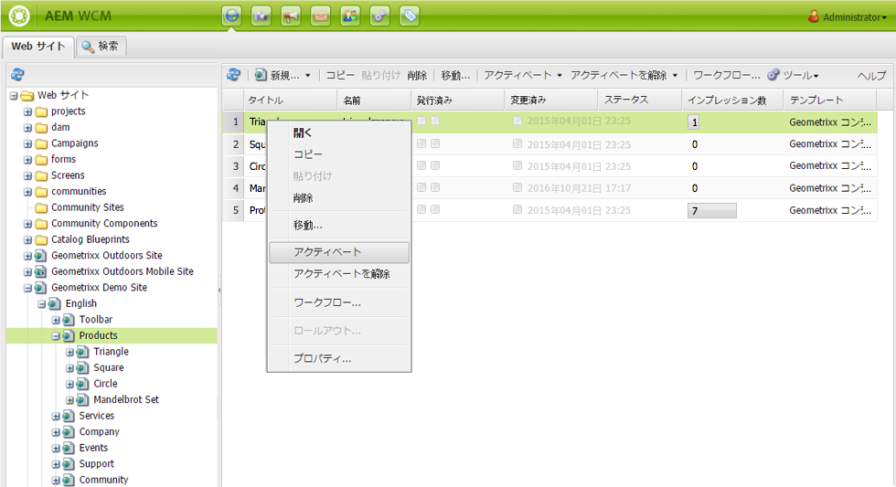
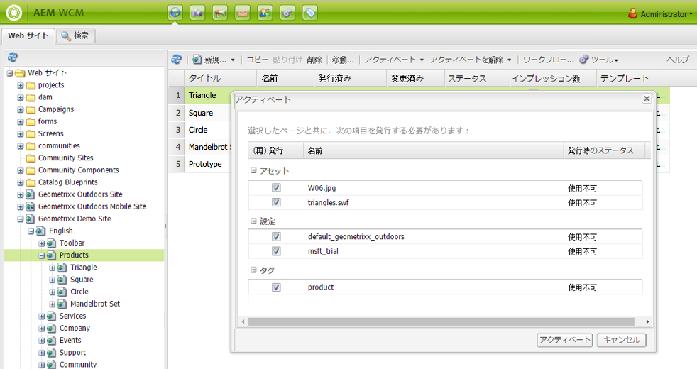
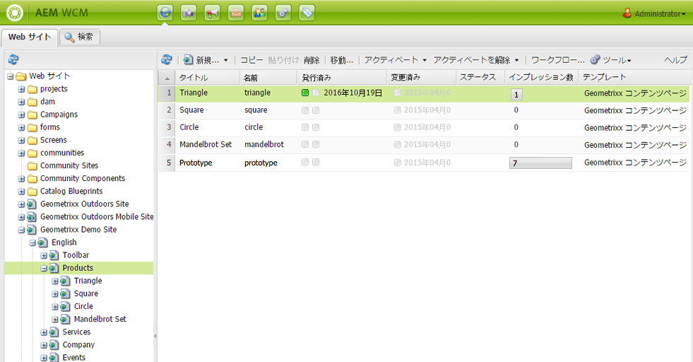
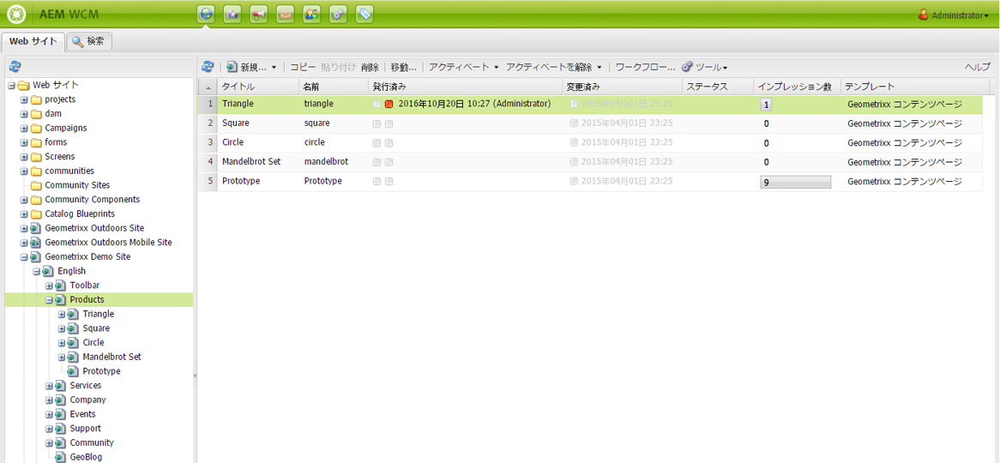
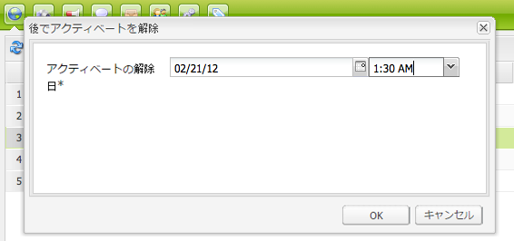
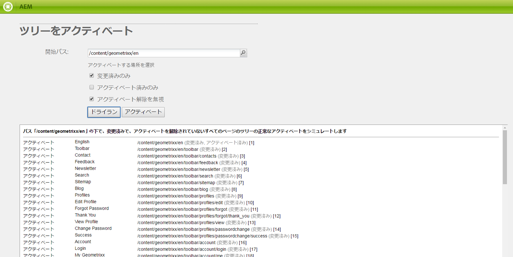

# ページの公開 {#publishing-pages}

>[!CAUTION]
>
>AEM 6.4 の拡張サポートは終了し、このドキュメントは更新されなくなりました。 詳細は、 [技術サポート期間](https://helpx.adobe.com/jp/support/programs/eol-matrix.html). サポートされているバージョンを見つける [ここ](https://experienceleague.adobe.com/docs/?lang=ja).

オーサー環境でコンテンツを作成およびレビューした後は、公開 web サイト（パブリッシュ環境）でコンテンツを利用できるようにすることが目標となります。

これは、ページの公開と呼ばれます。 パブリッシュ環境からページを削除する場合は、ページの非公開と呼ばれます。ページの公開と非公開を行う場合、ページを削除するまで、オーサー環境では引き続き変更を加えることができます。

また、ページの公開/非公開は、即座におこなうことも、後で事前定義済みの日時におこなうこともできます。

>[!NOTE]
>
>公開に関連する特定の用語が混同される場合があります。
>
>* **公開／非公開**
   >  環境でコンテンツを公開する（または非公開にする）アクションに対して主に使用される用語です。
>
>* **アクティブ化／非アクティブ化**
   >  公開／非公開と同義です。
>
>* **レプリケート／レプリケーション**
   >  公開やユーザーコメントのリバースレプリケーションの際などに行われる、環境間でのデータ（ページコンテンツ、ファイル、コード、ユーザーコメントなど）の移動を表す技術用語です。
>

>[!NOTE]
>
>特定のページを公開するために必要な特権がない場合。
>
>* ワークフローがトリガーされ、適切なユーザーに公開リクエストが通知されます。
>* このことを通知するメッセージが（短期間）表示されます。
>

## ページの公開  {#publishing-a-page}

ページをアクティベートするには、次の 2 つの方法があります。

* [web サイトコンソールから](#activating-a-page-from-the-websites-console)
* [ページ自体のサイドキックから](#activating-a-page-from-sidekick)

>[!NOTE]
>
>また、ツールコンソールの「[ツリーをアクティベート](#howtoactivateacompletesectiontreeofyourwebsite)」を使用して、複数ページのサブツリーをアクティベートすることもできます。

### Web サイトコンソールからのページのアクティベート {#activating-a-page-from-the-websites-console}

Web サイトコンソールでページをアクティベートできます。 ページを開き、そのコンテンツを変更した後、Web サイトコンソールに戻ります。

1. Web サイトコンソールで、アクティベートするページを選択します。
1. 選択 **有効化**&#x200B;を選択します。

   ページおよびそのすべてのサブページのコンテンツをアクティベートするには、[**ツール**&#x200B;コンソールを使用します](/help/sites-classic-ui-authoring/classic-page-author-publish-pages.md#howtoactivateacompletesectiontreeofyourwebsite)。

   

   >[!NOTE]
   >
   >必要に応じて、AEMは、ページにリンクされているアセットのアクティベートまたは再アクティベートを要求します。 チェックボックスをオンまたはオフにして、これらのアセットをアクティブにすることができます。

1. 必要に応じて、AEMは、ページにリンクされているアセットのアクティベートまたは再アクティベートを要求します。 チェックボックスをオンまたはオフにして、これらのアセットをアクティブにすることができます。

   

1. AEM WCM は選択したコンテンツをアクティベートします。 公開されたページが [Web サイトコンソール](/help/sites-classic-ui-authoring/author-env-basic-handling.md#page-information-on-the-websites-console) （緑でマーク）コンテンツをアクティベートしたユーザーや日時に関する情報が表示されます。

   

### サイドキックからのページのアクティベート {#activating-a-page-from-sidekick}

ページを編集用に開いている場合は、ページをアクティベートすることもできます。

ページを開き、その内容を変更した後、次の操作を実行します。

1. を選択します。 **ページ** 」タブをクリックします。
1. 「**ページをアクティベート**」をクリックします。

   ウィンドウの右上に、ページがアクティベートされたことを確認するメッセージが表示されます。

## ページの非公開 {#unpublishing-a-page}

パブリッシュ環境からページを削除するには、コンテンツをアクティベート解除します。

ページを非アクティブ化するには：

1. Web サイトコンソールで、非アクティブ化するページを選択します。
1. 選択 **無効化**&#x200B;を選択します。 削除の確認を求められます。

   

1. [Web サイトコンソール](/help/sites-classic-ui-authoring/author-env-basic-handling.md#page-information-on-the-websites-console)を更新すると、コンテンツが赤でマークされ、公開されていないことが示されます。

   

## 後でアクティブ化/非アクティブ化 {#activate-deactivate-later}

### 後でアクティベート {#activate-later}

後でアクティベートするようにスケジュールを設定するには：

1. Web サイトコンソールで、**アクティベート**&#x200B;メニューの「**後でアクティベート**」を選択します。
1. 開いたダイアログで、アクティベートする日付と時刻を指定して、「**OK**」をクリックします。これにより、指定した時刻にアクティベートされるページのバージョンが作成されます。

   

後でアクティベートすると、指定した時間にこのページのバージョンをアクティベートするワークフローが開始されます。 逆に、後でアクティベートを解除すると、特定の時間にこのバージョンのページをアクティベート解除するワークフローが開始されます。

このアクティベーション/アクティベーション解除をキャンセルする場合は、 [ワークフローコンソール](/help/sites-administering/workflows-administering.md#main-pars-title-3-yjqslz-refd) をクリックして、対応するワークフローを終了します。

### 後でアクティベートを解除 {#deactivate-later}

後でアクティベートを解除するようにスケジュールを設定するには：

1. Web サイトコンソールで、**アクティベートの解除**&#x200B;メニューの「**後でアクティベートを解除**」を選択します。

1. 開いたダイアログで、アクティベートを解除する日付と時刻を指定して、「**OK**」をクリックします。

   

「**後でアクティベートを解除**」によって、指定した時間に、このページのバージョンをアクティベート解除するワークフローが開始されます。

この非アクティブ化をキャンセルする場合は、 [ワークフローコンソール](/help/sites-administering/workflows-administering.md#main-pars-title-3-yjqslz-refd) をクリックして、対応するワークフローを終了します。

## 予定されているアクティベーション/アクティベーション解除（オン/オフタイム） {#scheduled-activation-deactivation-on-off-time}

ページを公開または非公開にする時間のスケジュールを設定することができます。これを行うには、**ページプロパティ**&#x200B;で「**オンタイム**」と「[オフタイム](/help/sites-classic-ui-authoring/classic-page-author-edit-page-properties.md)」を定義します。

### ページ公開ステータスの判別 - クラシック UI {#determining-page-publication-status-classic-ui}

ステータスは [Web サイトコンソール](/help/sites-classic-ui-authoring/author-env-basic-handling.md#page-information-on-the-websites-console). 色は、パブリッシュステータスを示します。

## Web サイトのセクション全体（ツリー）のアクティベート {#activating-a-complete-section-tree-of-your-website}

次の **Web サイト** タブでは、個々のページをアクティベートできます。 多数のコンテンツページを入力または更新した場合（すべて同じルートページの下に存在）、ツリー全体を 1 回の操作で簡単にアクティベートできます。 また、ドライランを実行してアクティベートをエミュレートし、アクティベートするページをハイライトすることもできます。

1. **ようこそ**&#x200B;ページから&#x200B;**ツール**&#x200B;コンソールを選択して開き、「**レプリケーション**」をダブルクリックして、レプリケーションコンソール（`http://localhost:4502/etc/replication.html`）を開きます。

   

1. **レプリケーション**&#x200B;コンソールで、「**ツリーをアクティベート**」をクリックします。

   次のウィンドウ（`http://localhost:4502/etc/replication/treeactivation.html`）が表示されます。

   

1. **開始パス**&#x200B;を入力して、アクティベート（公開）するセクションのルートのパスを指定します。このページ以下のすべてのページが、アクティベートの対象と見なされます（ドライランが選択されている場合は、エミュレーションの実行対象になります）。
1. 必要に応じて、選択基準をアクティブにします。

   * **変更済みのみ**:変更されたページのみをアクティブにします。
   * **有効化済みのみ**:（既に）アクティベートされたページのみをアクティベートします。 再アクティブ化の形で動作します。
   * **非アクティブを無視**:アクティベートを解除されたすべてのページを無視します。

1. 実行するアクションを選択します。

   1. どのページがアクティベートされるかを&#x200B;*確認*&#x200B;する場合は、「**ドライラン**」を選択します。これはあくまでもエミュレーションとして実行され、ページが実際にアクティベートされることはありません。
   1. ページをアクティベートする場合は、「**アクティベート**」を選択します。
