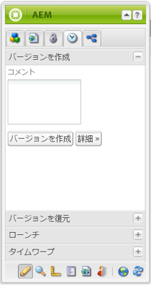
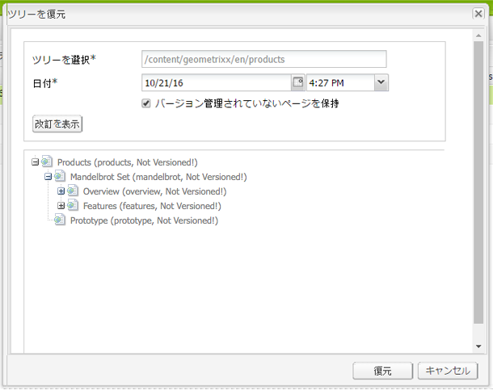
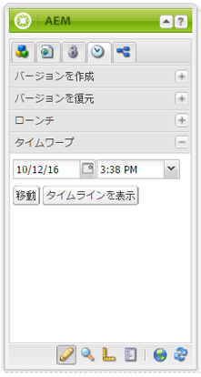
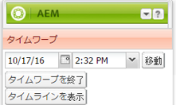

# ページバージョンの処理 {#working-with-page-versions}

>[!CAUTION]
>
>AEM 6.4 の拡張サポートは終了し、このドキュメントは更新されなくなりました。 詳細は、 [技術サポート期間](https://helpx.adobe.com/jp/support/programs/eol-matrix.html). サポートされているバージョンを見つける [ここ](https://experienceleague.adobe.com/docs/?lang=ja).

バージョン管理では、特定の時点でのページの「スナップショット」が作成されます。バージョン管理を使用して、次の操作を実行できます。

* ページのバージョンを作成します。
* ページに対して行った変更を取り消すには、例えば、ページを以前のバージョンに戻します。
* ページの現在のバージョンと以前のバージョンを比較し、強調表示されたテキストと画像の違いを比較します。

## 新しいバージョンの作成 {#creating-a-new-version}

新しいバージョンのページを作成するには：

1. ブラウザーで、新しいバージョンを作成するページを開きます。
1. サイドキックで、 **バージョン管理** タブ、 **バージョンを作成** サブタブ

   

1. 「**コメント**」を入力します（オプション）。
1. バージョンにラベルを設定するには（オプション）、「**詳細 >>**」ボタンをクリックし、「**ラベル**」を設定して、バージョンに名前を付けます。ラベルが設定されていない場合は、バージョンの名前は、自動的に増加する番号になります。
1. 「**バージョンを作成**」をクリックします。グレーのメッセージがページに表示されます。例：

   バージョン 1.2 の作成対象：シャツ。

>[!NOTE]
>
>ページがアクティベートされると、バージョンが自動的に作成されます。

## サイドキックからページのバージョンを復元する {#restoring-a-page-version-from-sidekick}

ページを以前のバージョンに戻すには：

1. 以前のバージョンを復元するページを開きます。
1. サイドキックで、 **バージョン管理** タブ、 **バージョンを復元** サブタブを使用します。

   

1. 復元するバージョンを選択して、「**復元**」を選択します。

## コンソールからのページバージョンの復元 {#restoring-a-page-version-from-the-console}

このメソッドは、ページのバージョンを復元するために使用できます。 また、以前に削除したページを復元する場合にも使用できます。

1. 内 **Web サイト** コンソールで、復元するページに移動して選択します。
1. 上部のメニューから、を選択します。 **ツール**&#x200B;を、 **復元**:

   

1. 「**バージョンを復元…」を選択しています。**現在のフォルダ内のドキュメントのバージョンを一覧表示します。 ページが削除されている場合でも、その最後のバージョンが一覧に表示されます。

   

1. 復元するバージョンを選択し、 **復元**. AEMは、選択したバージョン（またはツリー）を復元します。

### コンソールからのツリーの復元 {#restoring-a-tree-from-the-console}

このメソッドは、ページのバージョンを復元するために使用できます。 また、以前に削除したページを復元する場合にも使用できます。

1. 内 **Web サイト** コンソールで、復元するフォルダーに移動して選択します。
1. 上部のメニューから、を選択します。 **ツール**&#x200B;を、 **復元**.
1. 「**ツリーを復元**」を選択するとダイアログが開き、復元するツリーを選択できます。

   

1. クリック **復元**. AEMは、選択したツリーを復元します。

## 以前のバージョンとの比較 {#comparing-with-a-previous-version}

ページの現在のバージョンを以前のバージョンと比較するには：

1. ブラウザーで、以前のバージョンと比較するページを開きます。
1. サイドキックで、「**バージョン管理**」タブを選択してから、「**バージョンを復元**」サブタブを選択します。

   

1. 比較するバージョンを選択して、「**差分**」ボタンをクリックします。
1. 現在のバージョンと選択したバージョンの相違点が以下のように表示されます。

   * 削除されたテキストは赤く、打ち消されます。
   * 追加されたテキストは緑色でハイライト表示されます。
   * 追加または削除された画像は緑色の枠で囲まれます。

   

1. サイドキックで、 **バージョンを復元** サブタブで **&lt;&lt;back span=&quot;&quot; id=&quot;3&quot; translate=&quot;no&quot; /> ボタンをクリックして現在のバージョンを表示します。**

## タイムワープ {#timewarp}

タイムワープは、過去の特定の時間にページが&#x200B;***公開された***&#x200B;状態をシミュレートするために設計された機能です。

この目的は、選択した時点で公開済みの Web サイトを追跡できるようにすることです。 パブリッシュ環境の状態は、ページのアクティベーションを使用して決定されます。

次の手順を実行します。

* 選択した時刻にアクティブだったページのバージョンを検索します。
* つまり、タイムワープで選択した時点より前に作成またはアクティベートされたバージョンが表示されます&#x200B;*。*
* 削除されたページに移動する場合も、そのページの古いバージョンがリポジトリ内で引き続き使用できる限り、このページがレンダリングされます。
* 公開されたバージョンが見つからない場合、オーサー環境の現在のページの状態に戻ります ( これは、参照できなくなったというエラー (404) ページが表示されないようにするためです )。

>[!NOTE]
>
>バージョンがリポジトリから削除された場合、タイムワープで正しい表示をおこなうことができません。 また、Web サイトをレンダリングする要素（コード、CSS、画像など）が変更された場合、これらの項目はリポジトリ内でバージョン管理されないので、ビューは元のものとは異なります。

### タイムワープカレンダーの使用 {#using-the-timewarp-calendar}

タイムワープは、サイドキックから使用できます。

カレンダーバージョンは、表示する日が特定の場合に使用されます。

1. を開きます。 **バージョン管理** タブを押し、 **タイムワープ** （サイドキックの下部付近）。 次のダイアログが表示されます。

   

1. 日付と時間のセレクターを使用して、目的の日時を指定し、「 **移動**.

   タイムワープでは、選択した日付の前または日付に、公開された状態のページが表示されます。

   >[!NOTE]
   >
   >タイムワープは、以前にページを公開した場合にのみ完全に機能します。 まだ公開されていない場合は、オーサー環境の現在のページがタイムワープに表示されます。

   >[!NOTE]
   >
   >リポジトリから削除されたページに移動する場合、そのページの古いバージョンがリポジトリで引き続き使用可能な場合は適切にレンダリングされます。

   >[!NOTE]
   >
   >ページの古いバージョンは編集できません。 古いバージョンは表示のみ可能です。古いバージョンを復元する場合は、[復元](/help/sites-classic-ui-authoring/classic-page-author-work-with-versions.md#restoring-a-page-version-from-sidekick)を使用して手動で行う必要があります。

1. ページの表示が完了したら、次のオプションをクリックします。

   * 終了して現在のオーサーページに戻る場合は、「**タイムワープを終了**」をクリックします。
   * タイムラインを表示する場合は、「[タイムラインを表示](#using-the-timewarp-timeline)」をクリックします。

   

### タイムワープタイムラインの使用 {#using-the-timewarp-timeline}

タイムラインバージョンは、ページ上の公開アクティビティの概要を表示する場合に使用します。

ドキュメントのタイムラインを表示する場合：

1. タイムラインを表示するには、次のいずれかを実行します。

   1. を開きます。 **バージョン管理** タブを押し、 **タイムワープ** （サイドキックの下部付近）。
   1. [Timewarp カレンダーの使用](#using-the-timewarp-calendar)後に表示されるサイドキックダイアログを使用します。

1. 「**タイムラインを表示**」をクリックすると、ドキュメントのタイムラインが次のように表示されます。

   

1. タイムラインを選択して動かし（クリックしながらドラッグ）、ドキュメントのタイムライン内を移動します。

   * 線はすべて公開済みのバージョンを示します。

      ページがアクティベートされると、新しい線が表示されます。ドキュメントが編集されるたびに、新しい色が表示されます。

      以下の例では、赤い線は最初の緑のバージョンの期間中にページが編集されたことを示し、黄色の線は赤のバージョン中のいずれかの時間にページが編集されたことを示す、というようになります。
   

1. 次のオプションをクリックします。

   1. **移動** 選択した時点での公開済みページのコンテンツを表示します。
   1. そのコンテンツを表示しているときに「**タイムワープを終了**」を使用すると、終了して現在の作成者ページに戻ります。

### タイムワープの制限事項

タイムワープでは、選択した時点のページを再現するために最大限の努力をします。ただし、AEM でのコンテンツの継続的なオーサリングは複雑な作業なので、これが常に可能とは限りません。タイムワープを使用する際は、以下の制限事項に留意してください。

* **タイムワープは、公開されたページに基づいて機能する** - タイムワープは対象のページが既に公開されている場合にのみ完全に機能します。まだ公開されていない場合は、オーサー環境の現在のページが表示されます。
* **タイムワープではページのバージョンを使用する** - リポジトリーから削除されたページに移動する場合、このページの古いバージョンがリポジトリー内でまだ有効であれば正しくレンダリングされます。
* **削除されたバージョンがタイムワープに影響を及ぼす** - バージョンがリポジトリーから削除された場合、タイムワープで正しい表示を行うことができません。
* **タイムワープは読み取り専用** - ページの古いバージョンを編集することはできません。古いバージョンは表示のみ可能です。古いバージョンを復元する場合は、復元を使用して手動で行う必要があります。
* **タイムワープはページのコンテンツにのみ基づく** - Web サイトのレンダリングに使用する要素（コード、CSS、アセット／画像など）を変更した場合、これらのアイテムはリポジトリー内でバージョン化されないので、元の表示と異なる表示になります。

>[!CAUTION]
>
>タイムワープは、作成者によるコンテンツの把握と作成を支援するツールとして設計されています。監査ログや法的な目的のためのものではありません。
