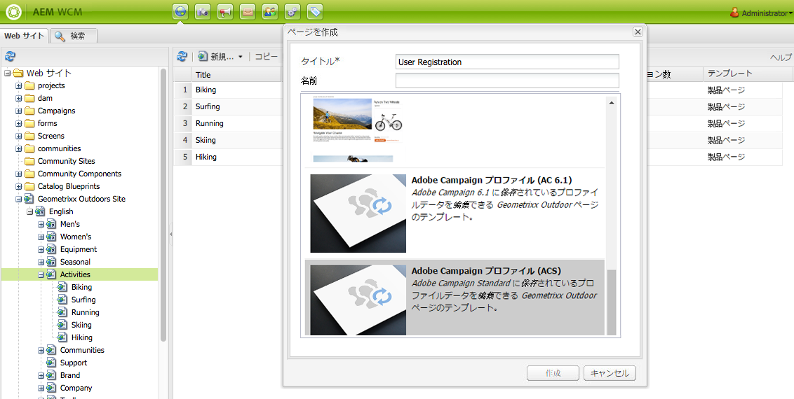
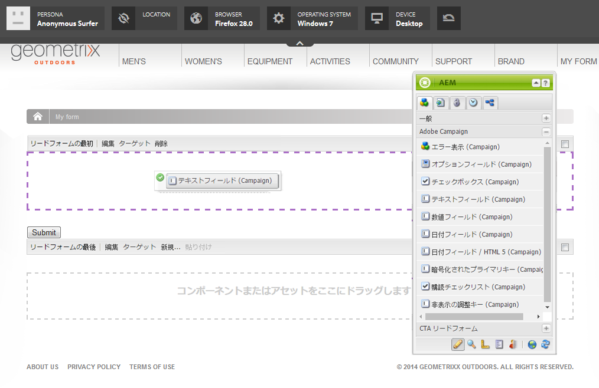

# AEM での Adobe Campaign フォームの作成{#creating-adobe-campaign-forms-in-aem}

AEM では、Web サイト上で Adobe Campaign と連携するフォームを作成できます。特定のフィールドをフォームに挿入して、Adobe Campaign データベースにマップできます。

新しい連絡先の購読、購読解除、ユーザープロファイルデータを管理しつつ、そのデータを Adobe Campaign データベースに統合できます。

Adobe Campaign フォームを AEM で使用するには、このドキュメントで説明する以下のステップを実行する必要があります。

1. テンプレートを使用可能にします。
1. フォームを作成します。
1. フォームコンテンツを編集します。

デフォルトでは、Adobe Campaign 固有の次の 3 種類のフォームを使用できます。

* プロファイルを保存
* サービスを購読
* サービスの購読を解除

これらのフォームは、Adobe Campaign プロファイルの暗号化されたプライマリキー（EPK）を受け入れる URL パラメーターを定義します。フォームはこの URL パラメーターに基づいて、関連付けられている Adobe Campaign プロファイルのデータを更新します。

一般的な使用事例では、これらのフォームを別々に作成しますが、ニュースレターのコンテンツ内にフォームページへのパーソナライズされたリンクを組み込み、受信者がそのリンクを開いて自分のプロファイルデータを調整（購読解除、購読またはプロファイル更新）できるようにします。

フォームは、ユーザーに基づいて自動的に更新されます。詳しくは、[フォームコンテンツの編集](#editing-form-content)を参照してください。

## テンプレートを使用可能にする {#making-a-template-available}

Adobe Campaign 固有のフォームを作成するには、まず、様々なテンプレートを AEM アプリケーションで使用可能にする必要があります。

これをおこなうには、 [テンプレートドキュメント](/help/sites-developing/page-templates-static.md#templateavailability).

まず、オーサーインスタンスおよびパブリッシュインスタンスと Adobe Campaign の間の接続が有効なことを確認します。[Adobe Campaign Standard との統合](/help/sites-administering/campaignstandard.md)または [Adobe Campaign 6.1 との統合](/help/sites-administering/campaignonpremise.md)を参照してください。

>[!NOTE]
>
>Adobe Campaign 6.1.x または Adobe Campaign Standard を使用する場合は、ページの **jcr:content** ノードの **acMapping** プロパティがそれぞれ **mapRecipient** または **profile** に設定されていることを確認してください。

### フォームの作成 {#creating-a-form}

1. サイト管理者として開始します。
1. ツリー構造をたどって、選択した Web サイト内のフォームを作成したい場所に移動します。
1. 選択 **新規** > **新しいページ…**.
1. 次のいずれかを選択 **Adobe Campaignプロファイル (AC 6.1)** または **Adobe Campaignプロファイル (ACS)** テンプレートを作成し、ページのプロパティを入力します。

   >[!NOTE]
   >
   >テンプレートが使用できない場合は、 [テンプレートを使用可能にする](/help/sites-classic-ui-authoring/classic-personalization-ac.md#activatingatemplate) 」セクションに入力します。

1. クリック **作成** フォームを作成します。

   

   これで[フォームのコンテンツを編集および設定](#editing-form-content)できます。

## フォームコンテンツの編集 {#editing-form-content}

Adobe Campaign 専用のフォームには、固有のコンポーネントがあります。これらのコンポーネントでは、フォームの各フィールドを Adobe Campaign データベースのフィールドにリンクすることができます。

>[!NOTE]
>
>目的のテンプレートが使用できない場合は、 [テンプレートを使用可能にする](/help/sites-classic-ui-authoring/classic-personalization-ac.md#activatingatemplate).

このセクションでは、Adobe Campaign へのリンクのみを取り上げます。Adobe Experience Managerでのフォームの使用方法の概要について詳しくは、 [編集モードコンポーネント](/help/sites-classic-ui-authoring/classic-page-author-edit-mode.md).

1. 編集するフォームに移動します。
1. ツールボックスで、 **ページ** > **ページプロパティ…** 次に、 **Cloud Services** 」タブをクリックします。
1. 「 」をクリックしてAdobe Campaignサービスを追加する **サービスを追加**&#x200B;を選択し、サービスのドロップダウンリストで、Adobe Campaignインスタンスに対応する設定を選択します。 この設定は、インスタンスとの間の接続を設定すると実行されます。詳しくは、 [AEMとAdobe Campaignの接続](/help/sites-administering/campaignonpremise.md#connecting-aem-to-adobe-campaign).

   >[!NOTE]
   >
   >必要に応じて、南京錠アイコンをクリックして設定をロック解除し、Adobe Campaign サービスを追加します。

1. フォームの一般的なパラメーターにアクセスするには、 **編集** ボタンがフォームの最初に見つかりました。 この **フォーム** 「 」タブを使用すると、フォームの検証後にユーザーがリダイレクトされる「ありがとうございます」ページを選択できます。

   この **詳細** フォームを使用すると、フォームのタイプを選択できます。 この **投稿オプション** 「 」フィールドでは、次の 3 種類のAdobe Campaignフォームから選択できます。

   * **Adobe Campaign：プロファイルを保存**：Adobe Campaign で受信者を作成または更新できます（デフォルト値）。
   * **Adobe Campaign：サービスを購読**：Adobe Campaign で受信者の購読を管理できます。
   * **Adobe Campaign：サービスの購読を解除**：Adobe Campaign で受信者の購読をキャンセルできます。

   この **アクションの設定** 「 」フィールドでは、受信者プロファイルがまだ存在しない場合に、Adobe Campaignデータベースに受信者プロファイルを作成するかどうかを指定できます。 これをおこなうには、 **ユーザーを作成（存在しない場合）** オプション。

1. 選択したコンポーネントをツールボックスからフォームにドラッグ＆ドロップして追加します。使用可能な Adobe Campaign 固有コンポーネントについては、[Adobe Campaign フォームコンポーネント](/help/sites-classic-ui-authoring/classic-personalization-ac-components.md)を参照してください。

   

1. 追加したフィールドをダブルクリックして設定します。この **Adobe Campaign** 「 」タブを使用すると、フィールドをAdobe Campaignの受信者テーブルのフィールドにリンクできます。 さらに、このフィールドを、Adobe Campaign データベース内の既存の受信者を認識するための調整キーの一部にするかどうかを指定できます。

   >[!CAUTION]
   >
   >この **エレメント名** は、フォームフィールドごとに異なる必要があります。 必要に応じて変更してください。
   >
   >各フォームには、 **暗号化されたプライマリキー** コンポーネントを使用して、Adobe Campaignデータベースの受信者を正しく管理することができます。

1. 「 」を選択してページをアクティブにします **ページ** > **ページをアクティベート** ツールボックス内 ページがサイト上でアクティベートされます。AEM のパブリッシュインスタンスに移動すると、ページを見ることができます。フォームが検証されると、Adobe Campaign データベースのデータが更新されます。

## フォームのテスト {#testing-a-form}

フォームを作成してフォームのコンテンツを編集したら、そのフォームが想定どおりに機能することを手動でテストできます。

>[!NOTE]
>
>次が必要です： **暗号化されたプライマリキー** 各フォームのコンポーネント 「コンポーネント」で、「 Adobe Campaign 」を選択すると、それらのコンポーネントのみが表示されます。
>
>この手順では暗号化されたプライマリキー（EPK）の番号を手動で入力しますが、実際には、ニュースレター内にこのページへの（購読解除、購読またはプロファイル更新をおこなうための）リンクが表示されます。EPK はユーザーに基づいて自動的に更新されます。
>
>そのリンクを作成するには、変数を使用します。 **メインリソース識別子**(Adobe Campaign Standard) または **暗号化された識別子** (Adobe Campaign 6.1)( 例： **テキストおよびパーソナライゼーション (Campaign)** コンポーネント ) で、Adobe Campaignの epk にリンクします。

そのためには、Adobe Campaign プロファイルの EPK を手動で取得して、URL に付加する必要があります。

1. Adobe Campaign プロファイルの暗号化されたプライマリキー（EPK）を取得するには：

   * Adobe Campaign Standard — に移動します。 **プロファイルとオーディエンス** > **プロファイル**：既存のプロファイルのリストを表示します。 テーブルに **メインリソース識別子** 列の「 」フィールド (「 **リストを設定**) をクリックします。 目的のプロファイルのメインリソース識別子をコピーします。
   * Adobe Campaign 6.11 で、 **プロファイルとターゲット** >  **受信者**：既存のプロファイルのリストを表示します。 テーブルに **暗号化された識別子** 列のフィールド ( エントリを右クリックし、「 **リストを設定…**) をクリックします。 目的のプロファイルの暗号化された識別子をコピーします。

1. AEMで、パブリッシュインスタンス上のフォームページを開き、URL パラメーターとして手順 1 の EPK を追加します。フォームのオーサリング時に、EPK コンポーネントで以前に定義したのと同じ名前を使用します ( 例： `?epk=...`)
1. これで、フォームを使用して、リンクされている Adobe Campaign プロファイルに関連付けられたデータと購読を変更できるようになりました。一部のフィールドを変更してフォームを送信したら、Adobe Campaign で適切なデータが更新されていることを確認できます。

フォームが検証されると、Adobe Campaign データベースのデータが更新されます。
