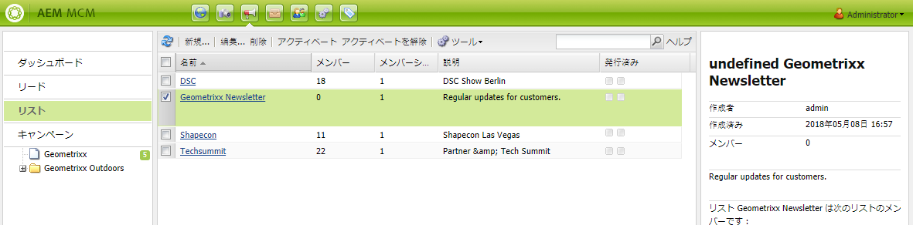
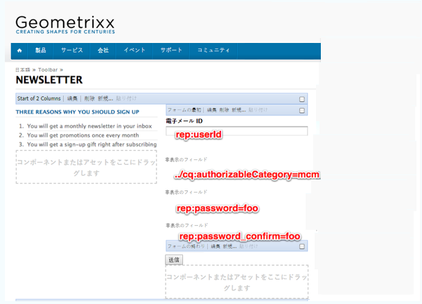
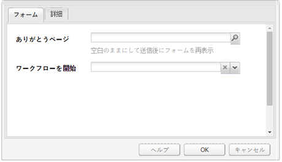
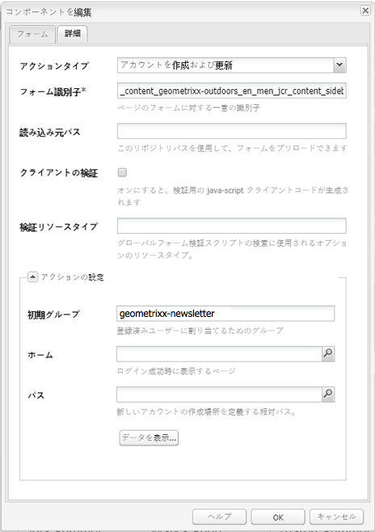
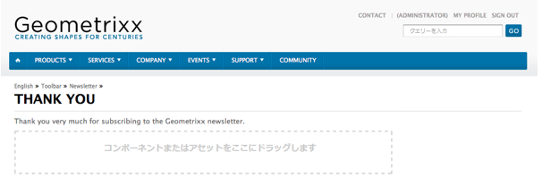
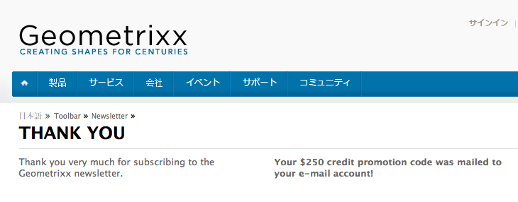

# 効果的なニュースレターのランディングページの作成 {#creating-an-effective-newsletter-landing-page}

効果的なニュースレターのランディングページは、ニュースレター（または他の電子メールマーケティングキャンペーン）にできるだけ多くの人を登録するのに役立ちます。 ニュースレターのサインアップから収集した情報を使用して、リードを取得できます。

効果的なニュースレターランディングページを作成するには、次の手順を実行する必要があります。

1. ニュースレターのリストを作成して、ユーザーがニュースレターを購読できるようにします。
1. サインアップフォームを作成します。 これをおこなう場合は、ニュースレターに新規登録した人をリードのリストに自動的に追加するワークフローステップを追加します。
1. ユーザーの新規登録に感謝し、場合によってはプロモーションを提供する確認ページを作成します。
1. ティーザーを追加します。

>[!NOTE]
>
>アドビでは、この機能（リードおよびリストの管理）をさらに強化する予定はありません。\
>[Adobe Campaign と AEM 統合](/help/sites-administering/campaign.md)を活用することをお勧めします。

## ニュースレター用のリストの作成 {#creating-a-list-for-the-newsletter}

リストを作成します。例： **Geometrixxニュースレター**(MCM) ユーザーが購読する必要のあるニュースレター用 ) リストの作成については、[リストの作成](/help/sites-classic-ui-authoring/classic-personalization-campaigns.md#creatingnewlists)を参照してください。

リストの例は次のとおりです。

## 新規登録フォームの作成 {#create-a-sign-up-form}

ユーザーがタグを購読できるニュースレター登録フォームを作成します。 サンプルGeometrixxWeb サイトでは、フォームを作成できるGeometrixxツールバーにニュースレターページが用意されています。

独自のニュースレターフォームを作成するには、 [Formsドキュメント](/help/sites-authoring/default-components.md#form). ニュースレターは、タグライブラリのタグを使用します。 タグを追加するには、 [タグ管理](/help/sites-authoring/tags.md#tagadministration).

次の例の非表示フィールドには、必要最小限の情報（メール）が示されます。また、後でフィールドを追加することもできますが、その場合は変換速度に影響があります。

次の例は、http://localhost:4502/cf#/content/geometrixx/en/toolbar/newsletter.htmlに作成されたフォームです。

1. フォームを作成します。

   

1. フォームコンポーネントの「**編集**」をクリックして、ありがとうページに移動するようにフォームを設定します（「[ありがとうページの作成](#creating-a-thank-you-page)」を参照してください）。

   

1. フォームアクション（フォームを送信したときに実行されるアクション）を設定し、作成済みのリストに登録ユーザーを割り当てるためのグループを設定します（例：geometrixx-newsletter）。

   

## 「ありがとうございます」ページの作成 {#creating-a-thank-you-page}

ユーザーが **今すぐ購読**「ありがとうございます」ページを自動的に開きたい場合。 「ありがとうございます」ページを「Geometrixxニュースレター」ページに作成します。 ニュースレターフォームを作成したら、フォームコンポーネントを編集し、「ありがとうございます」ページへのパスを追加します。

リクエストを送信すると、ユーザーは **ありがとうございます** 電子メールを受信するページ。 この「ありがとうございます」ページは、/content/geometrixx/en/toolbar/newsletter/thank_you に作成されました。

## ティーザーの追加 {#adding-teasers}

特定のユーザーを対象とする[ティーザー](/help/sites-classic-ui-authoring/classic-personalization-campaigns.md#teasers)を追加します。例えば、「ありがとうございます」ページと「ニュースレターのサインアップ」ページにティーザーを追加できます。

ティーザーを追加して効果的なニュースレターのランディングページを作成するには：

1. サインアップギフト用のティーザー段落を作成します。 選択 **最初** を戦略として追加し、どのような贈り物を受け取るかを知らせるテキストを含めます。

   

1. 「ありがとうございます」ページのティーザー段落を作成します。 選択 **最初** を戦略として追加し、ギフトが進行中であることを示すテキストを含めます。

   

1. 2 つのティーザーを使用してキャンペーンを作成します。1 つはビジネスタグ付けで、もう 1 つはタグ付けされていません。

## 購読者へのコンテンツのプッシュ {#pushing-content-to-subscribers}

変更をページにプッシュするには、MCM のニュースレター機能を使用します。 その後、更新されたコンテンツを購読者にプッシュします。

詳しくは、 [ニュースレターの送信](/help/sites-classic-ui-authoring/classic-personalization-campaigns.md#newsletters).
