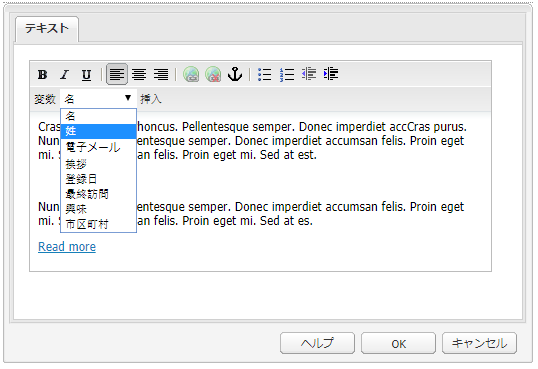
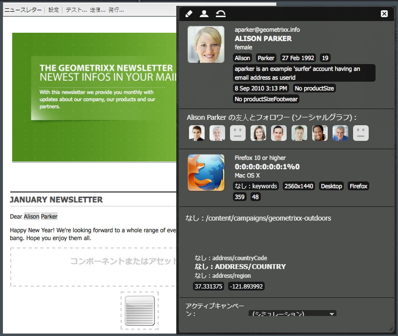
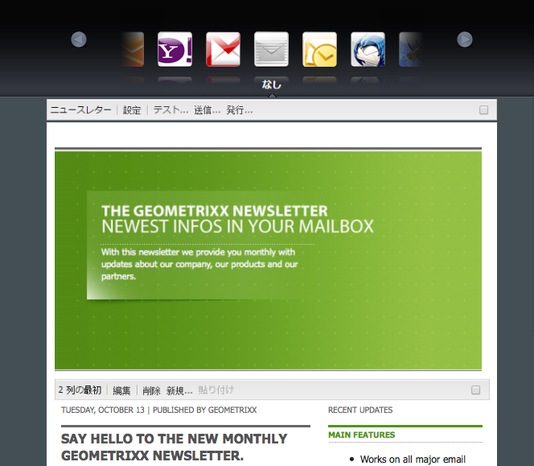
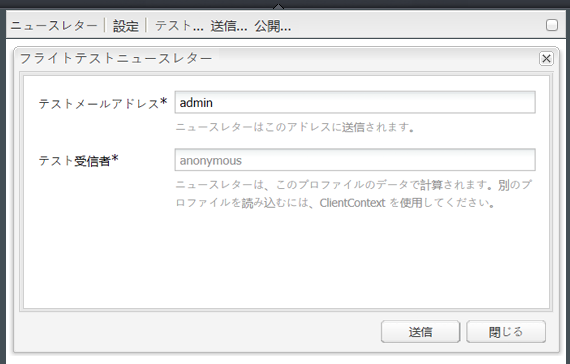

# 電子メールマーケティング {#e-mail-marketing}

>[!NOTE]
>
>Adobeは、AEM SMTP サービスから送信されるオープン/バウンス済みの E メールをさらに強化する予定はありません。\
>[Adobe Campaign や、Adobe Campaign と AEM の統合環境を活用](/help/sites-administering/campaign.md)することをお勧めします。

電子メールマーケティング（ニュースレターなど）は、どのようなマーケティングキャンペーンにおいても、コンテンツをリードにプッシュするときに重要な部分を占めます。AEM では、既存の AEM コンテンツからニュースレターを作成できるだけでなく、ニュースレターに固有の新しいコンテンツを追加できます。

作成した後は、即時または（ワークフローを使用して）スケジュールした時間に、特定のユーザーグループへとニュースレターを送信できます。さらに、ユーザーは自分が選択した形式でニュースレターの購読を申し込むことができます。

また、管理者は AEM を使用して、トピックの保守、ニュースレターのアーカイブ、ニュースレターの統計情報の表示などのニュースレター機能を管理できます。

>[!NOTE]
>
>Geometrixx でのニュースレターテンプレートでは、電子メールエディターが自動的に開かれます。電子メール（招待など）を送信するその他のテンプレートで電子メールエディターを使用できます。**mcm/components/newsletter/page** からページが継承されるたびに、電子メールエディターが表示されます。

このドキュメントでは、AEM でのニュースレターの作成の基本について説明します。電子メールマーケティングの使用方法について詳しくは、以下のドキュメントを参照してください。

* [効果的なニュースレターのランディングページの作成 ](/help/sites-classic-ui-authoring/classic-personalization-campaigns-email-landingpage.md)
* [購読の管理 ](/help/sites-classic-ui-authoring/classic-personalization-campaigns-email-subscriptions.md)
* [メールサービスプロバイダーへのメールの公開](/help/sites-classic-ui-authoring/classic-personalization-campaigns-email-newsletters.md)
* [バウンスメールの追跡](/help/sites-classic-ui-authoring/classic-personalization-campaigns-email-tracking-bounces.md)

>[!NOTE]
>
>電子メールプロバイダーを変更した場合は、ニュースレターが先にパブリッシュインスタンスに公開されていないか、パブリッシュインスタンスが使用できない状態で、フライトテストを実行するか、ニュースレターを送信すると、これらの操作が失敗します。ニュースレターが確実に公開されていることと、パブリッシュインスタンスが稼動していることを確認してください。

## ニュースレターのエクスペリエンスの作成 {#creating-a-newsletter-experience}

>[!NOTE]
>
>電子メール通知は、OSGi 設定を使用して設定する必要があります。[電子メール通知の設定](/help/sites-administering/notification.md)を参照してください。

1. 新しいキャンペーンを左側のペインで選択するか、右側のペインでダブルクリックします。

1. 次のアイコンを使用して、リスト表示を選択します。

   

1. 「**新規...**」をクリックします。

   「**タイトル**」、「**名前**」および作成するエクスペリエンスのタイプ（この例では、ニュースレター）を指定できます。

   

1. 「**作成**」をクリックします。

1. すぐに新しいダイアログが開きます。ここで、ニュースレターのプロパティを入力できます。

   「**デフォルトの受信者リスト**」は、ニュースレターのタッチポイントを構成するので、必須のフィールドです（リストについて詳しくは、[リストの使用](/help/sites-classic-ui-authoring/classic-personalization-campaigns.md#workingwithlists)を参照してください）。

   

   * **送信元の名前**

      ニュースレターの送信者として表示させる名前です。

   * **From Address**

      ニュースレターの送信者として表示させるメールアドレス。

   * **件名**

      ニュースレターの件名です。

   * **Reply To**

      送信されたニュースレターへの返信先として使用される電子メールアドレスです。

   * **説明**

      ニュースレターの説明。

   * **オンタイム**

      ニュースレターを送信する日時。

   * **デフォルトの受信者リスト**

      ニュースレターを受け取るデフォルトのリストです。
   これらの設定は、後から&#x200B;**プロパティ...** ダイアログで更新できます。

1. 「**OK**」をクリックして保存します。

## ニュースレターへのコンテンツの追加 {#adding-content-to-newsletters}

他の AEM コンポーネントと同様に、動的なコンテンツなどのコンテンツをニュースレターに追加できます。Geometrixx でのニュースレターテンプレートには、ニュースレターでコンテンツの追加および変更に使用できるコンポーネントがあります。

1. MCM で「**キャンペーン**」タブをクリックし、コンテンツの追加または編集を行うニュースレターをダブルクリックします。ニュースレターが開きます。

1. コンポーネントが表示されていない場合、デザインビューを開き、必要なコンポーネント（ニュースレターコンポーネントなど）を有効にしてから編集を始めます。
1. 必要に応じて、新しいテキストや画像または他のコンポーネントを入力します。Geometrixx の例では、テキスト、画像、見出し、2 コラムの 4 つのコンポーネントを使用できます。ニュースレターのコンポーネント数は、設定する方法に応じて変わる可能性があります。

   >[!NOTE]
   >
   >変数を使用してニュースレターをパーソナライズします。Geometrixx のニュースレターでは、変数はテキストコンポーネントで使用できます。変数の値は、ユーザープロファイルの情報から継承されます。

   

1. 変数を挿入するには、リストの変数を選択し、「**挿入**」をクリックします。変数は「プロファイル」から設定されます。

## ニュースレターのパーソナライゼーション {#personalizing-newsletters}

ニュースレターをパーソナライズするには、Geometrixx のニュースレターのテキストコンポーネントに事前定義済みの変数を挿入します。変数の値は、ユーザープロファイルの情報から継承されます。

また、ニュースレターを個人設定する方法をシミュレートするには、Client Context を使用し、プロファイルをロードします。

ニュースレターを個人設定し、外観をシミュレートするには：

1. MCM で、設定をカスタマイズするニュースレターを開きます。

1. 個人設定するテキストコンポーネントを開きます。

1. 変数を表示する場所にカーソルを移動し、ドロップダウンリストから変数を選択して「**挿入**」をクリックします。必要な変数についてこの操作を実行し、「**OK**」をクリックします。

   

1. 送信されたときに変数がどのように表示されるかをシミュレートするには、Ctrl + Alt + c キーを押して ClientContext を開き、「**ロード**」を選択します。リストからプロファイルをロードするユーザーを選択し、「**OK**」をクリックします。

   ロードしたプロファイルの情報によって変数が設定されます。

   

## 様々なメールクライアントでのニュースレターのテスト {#testing-newsletters-in-different-e-mail-clients}

>[!NOTE]
>
>ニュースレターを送信する前に、`http://localhost:4502/system/console/configMgr` で Day CQ Link Externalizer の OSGi 設定を確認してください。
>
>デフォルトでは、このパラメーターの値は `localhost:4502` です。稼動しているインスタンスのポートが変更されている場合は操作を完了できません。

共通の電子メールクライアントを切り替えて、リードに対してニュースレターがどのように表示されるかを確認します。デフォルトでは、ニュースレターは電子メールクライアントが選択されていない状態で開きます。

現在、次の電子メールクライアントでニュースレターを表示できます。

* Yahoo メール
* Gmail
* Hotmail
* Thunderbird
* Microsoft Outlook 2007
* Apple Mail

クライアントを切り替えるには、対応するアイコンをクリックして、その電子メールクライアントのニュースレターを表示します。

1. MCM で、設定をカスタマイズするニュースレターを開きます。

1. 上部のバーにある電子メールクライアントをクリックし、そのクライアントでニュースレターがどのように表示されるかを確認します。

   

1. 確認するその他のメールクライアントについて、この手順を繰り返します。

   

## ニュースレター設定のカスタマイズ {#customizing-newsletter-settings}

ニュースレターを送信できるのは権限のあるユーザーのみですが、次の点をカスタマイズする必要があります。

* 件名の行。ユーザーが電子メールを開くようにし、ニュースレターが最終的にスパムとマークされないようにします。
* 送信者アドレス（noreply@geometrixx.com）。指定したアドレスからユーザーが電子メールを受信できるようにします。

ニュースレター設定をカスタマイズするには：

1. MCM で、設定をカスタマイズするニュースレターを開きます。

   

1. ニュースレターの上部にある「**設定**」をクリックします。

   

   1. 「**送信元**」電子メールアドレスを入力します。
   1. 必要に応じて電子メールの「**件名**」を変更します。
   1. ドロップダウンリストから「**デフォルトの受信者リスト**」を選択します。
   1. 「**OK**」をクリックします。

   ニュースレターのテストまたは送信をおこなうと、受信者は、指定された電子メールアドレスと件名が使用された電子メールを受信します。

## ニュースレターのフライトテスト {#flight-testing-newsletters}

フライトテストは必須ではありませんが、ニュースレターを送信する前に、適切な外観であることを確認するためにテストすることができます。

フライトテストを使用すると、次の作業を実行できます。

* [対象とするすべてのクライアント](#testing-newsletters-in-different-e-mail-clients)のニュースレターを確認します。
* メールサーバーが正しく設定されていることを検証します。
* 電子メールがスパムとしてフラグが付けられているかどうかを判断します（受信者のリストに自分を含めるようにします）。

>[!NOTE]
>
>電子メールプロバイダーを変更した場合は、ニュースレターが先にパブリッシュインスタンスに公開されていないか、パブリッシュインスタンスが使用できない状態で、フライトテストを実行するか、ニュースレターを送信すると、これらの操作が失敗します。ニュースレターが確実に公開されていることと、パブリッシュインスタンスが稼動していることを確認してください。

ニュースレターのフライトテストを実行するには：

1. MCM で、テストおよび送信するニュースレターを開きます。

1. 送信前にテストするために、ニュースレターの上部にある「**テスト**」をクリックします。

   

1. ニュースレターを送信するテストメールアドレスを入力し、「**送信**」をクリックします。プロファイルを変更する場合、ClientContext に別のプロファイルをロードします。そのためには、Ctrl + Alt + c キーを押し、「ロード」を選択してプロファイルをロードします。

## ニュースレターの送信 {#sending-newsletters}

ニュースレターまたはリストからニュースレターを送信できます。両方の手順について説明します。

>[!NOTE]
>
>ニュースレターを送信する前に、`http://localhost:4502/system/console/configMgr` で Day CQ Link Externalizer の OSGi 設定を確認してください。
>
>デフォルトでは、このパラメーターの値は `localhost:4502` です。稼動しているインスタンスのポートが変更されている場合は操作を完了できません。

>[!NOTE]
>
>電子メールプロバイダーを変更した場合は、ニュースレターが先にパブリッシュインスタンスに公開されていないか、パブリッシュインスタンスが使用できない状態で、フライトテストを実行するか、ニュースレターを送信すると、これらの操作が失敗します。ニュースレターが確実に公開されていることと、パブリッシュインスタンスが稼動していることを確認してください。

### キャンペーンからのニュースレターの送信 {#sending-newsletters-from-a-campaign}

キャンペーン内からニュースレターを送信するには：

1. MCM で、送信するニュースレターを開きます。

   >[!NOTE]
   >
   >送信する前に、ニュースレターの件名と発信元のメールアドレスが、[設定のカスタマイズ](#customizing-newsletter-settings)を使用してカスタマイズされていることを確認します。
   >
   >送信する前に、ニュースレターの[フライトテスト](#flight-testing-newsletters)を行うことをお勧めします。

1. ニュースレターの上部にある「**送信**」をクリックします。ニュースレターの送信ウィザードが開きます。

1. 受信者のリストで、ニュースレターを受信するリストを選択し、「**次へ**」をクリックします。

   

1. 設定の完了を確認します。「**送信**」をクリックして実際にニュースレターを送信します。

   

   >[!NOTE]
   >
   >ニュースレターが受信されたことを確認できるように、自分も受信者の 1 人にします。

### リストからのニュースレターの送信 {#sending-newsletters-from-a-list}

リストからニュースレターを送信するには：

1. MCM で左側ウィンドウの「**リスト**」を展開します。

   >[!NOTE]
   >
   >送信する前に、ニュースレターの件名と発信元のメールアドレスが、[設定のカスタマイズ](#customizing-newsletter-settings)を使用してカスタマイズされていることを確認します。リストから送信する場合、ニュースレターはテストできません。ニュースレターから送信する場合は、[フライトテスト](#flight-testing-newsletters)を実行できます。

1. ニュースレターの送信先であるリードリストの横にあるチェックボックスをオンにします。

1. **ツール**&#x200B;メニューの「**ニュースレターを送信**」を選択します。**ニュースレターを送信**&#x200B;ウィンドウが開きます。

   

1. 「**ニュースレター**」フィールドで、送信するニュースレターを選択し、「**次へ**」をクリックします。

   

1. 設定の完了を確認します。「**送信**」をクリックして、指定したリードのリストに選択したニュースレターを送信します。

   

   ニュースレターは選択した受信者に送信されます。

## ニュースレターの購読 {#subscribing-to-a-newsletter}

ここでは、ニュースレターを購読する方法について説明します。

### ニュースレターの購読 {#subscribing-to-a-newsletter-1}

ニュースレターを購読するには（例として Geometrixx Web サイトを使用）：

1. 「**Web サイト**」をクリックし、Geometrixx **ツールバー**&#x200B;に移動して、このツールバーを開きます。

   

1. Geometrixx Newsletter の&#x200B;**サインアップ**&#x200B;用のフィールドに電子メールアドレスを入力し、「**サインアップ**」をクリックします。これで、ニュースレターを購読できるようになりました。
