# キャンペーンの設定 {#setting-up-your-campaign}

新しいキャンペーンの設定には、次の（一般的な）手順が含まれます。

1. [ブランドの作成](#creating-a-new-brand) キャンペーンを保持する
1. 必要に応じて、 [新しいブランドのプロパティを定義します。](#defining-the-properties-for-your-new-brand).
1. [キャンペーンの作成](#creating-a-new-campaign) 経験を保持する例えば、ティーザーページやニュースレターなどです。
1. 必要に応じて、 [新しいキャンペーンのプロパティを定義します](#defining-the-properties-for-your-new-campaign).

作成するエクスペリエンスのタイプに応じて、次の操作が必要になります。 [エクスペリエンスを作成](#creating-a-new-experience). エクスペリエンスの詳細と、その作成に続くアクションは、作成するエクスペリエンスのタイプに応じて異なります。

* ティーザーを作成する場合：

   1. [ティーザーエクスペリエンスの作成](/help/sites-classic-ui-authoring/classic-personalization-campaigns.md#creatingateaserexperience).
   1. [ティーザーにコンテンツを追加する](/help/sites-classic-ui-authoring/classic-personalization-campaigns.md#addingcontenttoyourteaser).
   1. [ティーザー用のタッチポイントの作成](/help/sites-classic-ui-authoring/classic-personalization-campaigns.md#creatingatouchpointforyourteaser) （コンテンツページにティーザーを追加します）。

* ニュースレターを作成する場合：

   1. [ニュースレターエクスペリエンスの作成](/help/sites-classic-ui-authoring/classic-personalization-campaigns.md#creatinganewsletterexperience).
   1. [ニュースレターにコンテンツを追加します。](/help/sites-classic-ui-authoring/classic-personalization-campaigns.md#addingcontenttonewsletters)
   1. [ニュースレターを個人用に設定します。](/help/sites-classic-ui-authoring/classic-personalization-campaigns.md#personalizingnewsletters)
   1. [魅力的なニュースレターのランディングページの作成](/help/sites-classic-ui-authoring/classic-personalization-campaigns.md#settingupanewsletterlandingpage).
   1. [ニュースレターを送信](/help/sites-classic-ui-authoring/classic-personalization-campaigns.md#sendingnewsletters) 購読者またはリードに追加します。

* Adobe Target（旧称 Test&amp;Target）オファーを作成する場合：

   1. [Adobe Targetオファーエクスペリエンスの作成](/help/sites-classic-ui-authoring/classic-personalization-campaigns.md#creatingatesttargetofferexperience).
   1. [Adobe Target と統合します。](/help/sites-classic-ui-authoring/classic-personalization-campaigns.md#integratewithadobetesttarget)

>[!NOTE]
>
>詳しくは、 [セグメント化](/help/sites-administering/campaign-segmentation.md) を参照してください。

## 新しいブランドの作成 {#creating-a-new-brand}

新しいブランドを作成するには：

1. を開きます。 **MCM** を選択し、 **キャンペーン** をクリックします。

1. 選択 **新規…** をクリックします。 **タイトル** および **名前** 新しいブランドに使用するテンプレート：

   

1. 「**作成**」をクリックします。新しいブランドが MCM に（デフォルトのアイコン付きで）表示されます。

### 新しいブランドのプロパティの定義 {#defining-the-properties-for-your-new-brand}

1. 送信者 **キャンペーン** 左側のウィンドウで、右側のウィンドウで新しいブランドのアイコンを選択し、 **プロパティ…**

   次の項目を入力できます。 **タイトル**, **説明** アイコンとして使用する画像。

   

1. 「**OK**」をクリックして保存します。

## 新しいキャンペーンの作成 {#creating-a-new-campaign}

新しいキャンペーンを作成するには：

1. 送信者 **キャンペーン**、左側のパネルで新しいブランドを選択するか、右側のパネルでアイコンをダブルクリックします。

   概要が表示されます（新しいブランドの場合は空）。

1. クリック **新規…** をクリックし、 **タイトル**, **名前** 新しいキャンペーンに使用するテンプレートと

   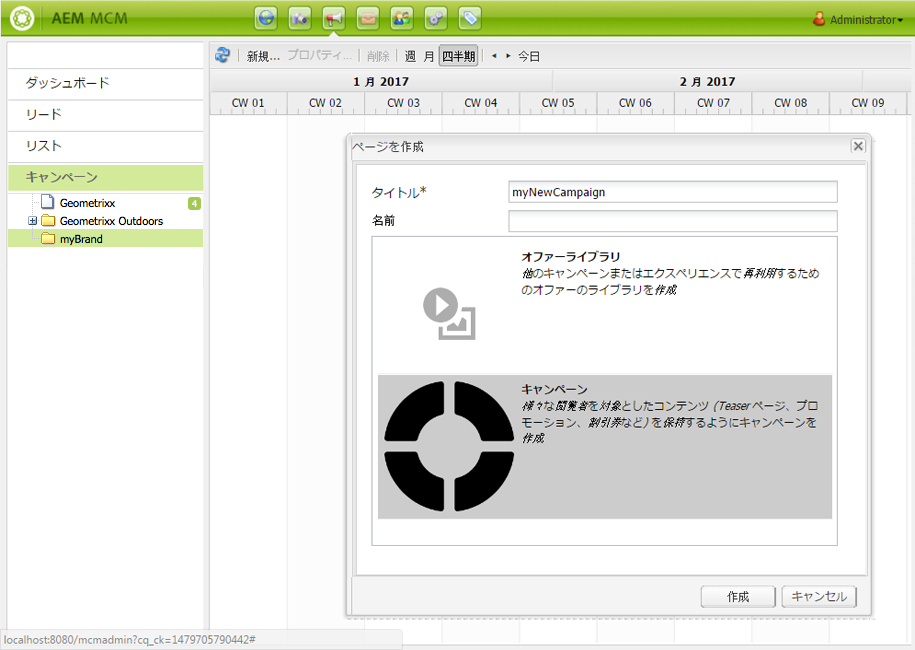

1. 「**作成**」をクリックします。新しいキャンペーンが MCM に表示されます。

### 新しいキャンペーンのプロパティの定義 {#defining-the-properties-for-your-new-campaign}

動作を制御するキャンペーンプロパティを設定します。

* **優先度：** 他のキャンペーンと比較した場合の、このキャンペーンの優先順位。 複数のキャンペーンが同時に実施されている場合は、最も優先度が高いキャンペーンが訪問者エクスペリエンスを制御します。
* **オン/オフタイム：** これらのプロパティは、キャンペーンが訪問者エクスペリエンスを制御する期間を制御します。 オンタイムプロパティは、キャンペーンがエクスペリエンスの制御を開始する時間を制御します。 オフタイムプロパティは、キャンペーンがエクスペリエンスの制御を停止するタイミングを制御します。
* **画像：** AEMでキャンペーンを表す画像。
* **Cloud Services:** キャンペーンを統合するCloud Serviceの設定。 ( [Adobe Marketing Cloudとの統合](/help/sites-administering/marketing-cloud.md).)

* **Adobe Target:** Adobe Targetと統合するキャンペーンを設定するプロパティです。 ( [Adobe Targetとの統合](/help/sites-administering/target.md).)

1. 送信者 **キャンペーン**、ブランドを選択します。 右側のウィンドウでキャンペーンを選択し、「**プロパティ**」をクリックします。

   **タイトル**、**説明**、**Cloud Services**（使用する場合）など、様々なプロパティを入力できます。

   

1. 「**OK**」をクリックして保存します。

## 新しいエクスペリエンスの作成 {#creating-a-new-experience}

新しいエクスペリエンスを作成する手順は、エクスペリエンスのタイプによって異なります。

* [ティーザーの作成](/help/sites-classic-ui-authoring/classic-personalization-campaigns.md#creatingateaser)
* [ニュースレターの作成](/help/sites-classic-ui-authoring/classic-personalization-campaigns.md#creatinganewsletter)
* [Adobe Target オファーの作成](/help/sites-classic-ui-authoring/classic-personalization-campaigns.md#creatingatesttargetoffer)

>[!NOTE]
>
>以前のリリースと同様に、エクスペリエンスをページとして **Web サイト** コンソール（および以前のリリースで作成されたそのようなページも、引き続き完全にサポートされます）。
>
>エクスペリエンスの作成に MCM を使用することをお勧めします。

## 新しいエクスペリエンスの設定 {#configuring-your-new-experience}

エクスペリエンスの基本スケルトンを作成したので、エクスペリエンスのタイプに応じて、次の操作を続行する必要があります。

* [ティーザー](/help/sites-classic-ui-authoring/classic-personalization-campaigns.md#teasers)：

   * [ティーザーページを訪問者セグメントに接続します。](/help/sites-classic-ui-authoring/classic-personalization-campaigns.md#applyingasegmenttoyourteaser)
   * [ティーザー用のタッチポイントの作成](/help/sites-classic-ui-authoring/classic-personalization-campaigns.md#creatingatouchpointforyourteaser) （コンテンツページにティーザーを追加します）。

* [ニュースレター](/help/sites-classic-ui-authoring/classic-personalization-campaigns.md#newsletters):

   * [ニュースレターにコンテンツを追加します。](/help/sites-classic-ui-authoring/classic-personalization-campaigns.md#addingcontenttonewsletters)
   * [ニュースレターを個人用に設定します。](/help/sites-classic-ui-authoring/classic-personalization-campaigns.md#personalizingnewsletters)
   * [ニュースレターを送信](/help/sites-classic-ui-authoring/classic-personalization-campaigns.md#sendingnewsletters) 購読者またはリードに追加します。
   * [魅力的なニュースレターのランディングページの作成](/help/sites-classic-ui-authoring/classic-personalization-campaigns.md#settingupanewsletterlandingpage).

* [Adobe Targetオファー](/help/sites-classic-ui-authoring/classic-personalization-campaigns.md#testtargetoffers):

   * [Adobe Target との統合](/help/sites-administering/target.md)

### 新しいタッチポイントの追加 {#adding-a-new-touchpoint}

既存のエクスペリエンスがある場合、MCM のカレンダービューから直接タッチポイントを追加できます。

1. キャンペーンのカレンダー表示を選択します。

1. クリック **タッチポイントを追加…** をクリックしてダイアログを開きます。 追加するエクスペリエンスを指定します。

   

1. 「**OK**」をクリックして保存します。

## リードの使用 {#working-with-leads}

>[!NOTE]
>
>この機能（リードの管理）がさらに強化される予定はありません。\
>[Adobe Campaign や AEM との統合を利用](/help/sites-administering/campaign.md)することをお勧めします。

AEM MCM では、リードを手動で入力するか、メーリングリストなど、コンマ区切りのリストを読み込むことで、リードを整理および追加できます。 リードを生成するその他の方法は、ニュースレターのサインアップまたはコミュニティのサインアップです ( 設定に応じて、リードを入力するワークフローをトリガーできます )。

リードは通常、分類されてリストに入れられ、後でリスト全体に対してアクションを実行できるようにします（例えば、特定のリストにカスタムメールを送信するなど）。

ダッシュボードで、「 **リード** を左側のウィンドウ枠からクリックします。 また、 **リスト** ウィンドウ

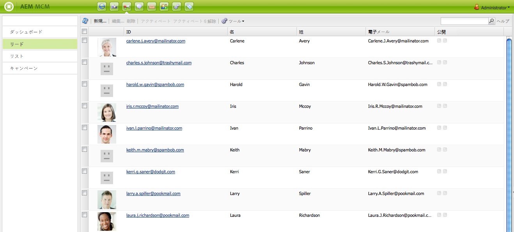

>[!NOTE]
>
>ユーザーのアバターを追加または変更するには、クリックストリームクラウド (Ctrl+Alt+c) を開き、プロファイルを読み込んで、 **編集**.

### 新規リードの作成 {#creating-new-leads}

新しいリードを作成したら、必ず[それらのリードをアクティベート](#activating-or-deactivating-leads)します。これにより、パブリッシュインスタンスにおけるリードの行動を追跡し、リードのエクスペリエンスを個別化できるようになります。

新しいリードを手動で作成するには：

1. AEMで、MCM に移動します。 ダッシュボードで、 **リード**.
1. 「**新規**」をクリックします。この **新規作成** ウィンドウが開きます。

   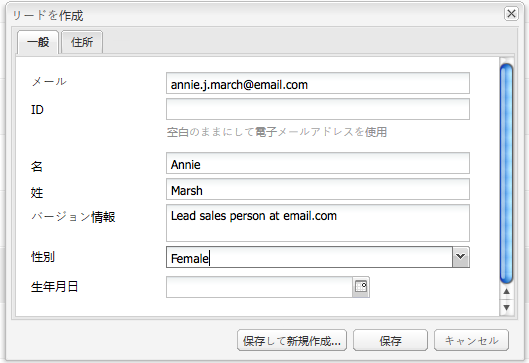

1. 必要に応じて、フィールドに情報を入力します。 次をクリック： **住所** タブをクリックします。

   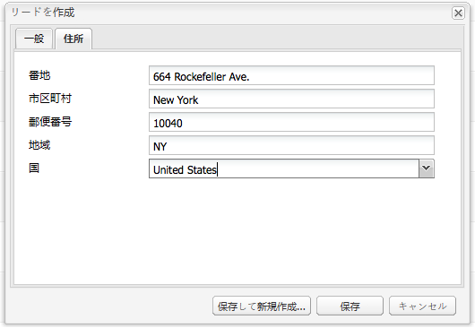

1. 必要に応じて住所情報を入力します。 クリック **保存** リードを保存します。 リードを追加する必要がある場合は、「**保存して新規**」をクリックします。

   新しいリードが「リード」ペインに表示されます。 エントリをクリックすると、入力したすべての情報が右側のウィンドウに表示されます。 リードを作成した後、リストに追加できます。

   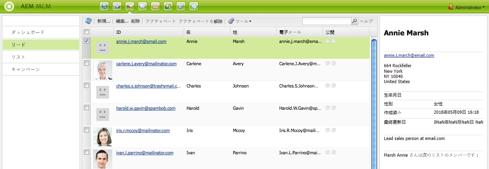

### リードの有効化または無効化 {#activating-or-deactivating-leads}

リードをアクティブ化すると、パブリッシュインスタンス上でのリードのアクティビティを追跡し、リードのエクスペリエンスをパーソナライズできます。 これ以降、アクティビティを追跡する必要がない場合は、非アクティブ化できます。

リードをアクティブまたは非アクティブにするには：

1. AEM で、MCM に移動し、「**リード**」をクリックします。

1. アクティベートまたはアクティベート解除するリードを選択し、「**アクティベート**」または「**アクティベートの解除**」をクリックします。

   

   AEM ページの場合と同様、「**公開済み**」列に公開ステータスが示されます。

   

### 新規リードのインポート {#importing-new-leads}

新規リードをインポートする際に、既存のリストに自動的に追加したり、新規リストを作成してこれらのリードを含めたりできます。

リードをコンマ区切りリストからインポートするには：

1. AEM で、MCM に移動し、「**リード**」をクリックします。

   >[!NOTE]
   >
   >または、次のいずれかの操作を行って、リードを読み込むこともできます。
   >
   >* ダッシュボードで、 **リードのインポート** 内 **リスト** パネル
   >* クリック **リスト** そして **ツール** メニュー、選択 **リードのインポート**.

1. **ツール**&#x200B;メニューの「**リードを読み込む」を選択します。**
1. 「サンプルデータ」の説明に従って、情報を入力します。 次のフィールドを読み込むことができます。email,familyName,givenName,gender,aboutMe,city,country,phoneNumber,postalCode,region,streetAddress

   >[!NOTE]
   >
   >CSV リストの最初の行は、事前定義済みのラベルで、次の例のとおりに記述する必要があります。
   >
   >`email,givenName,familyName` - 例えば `givenname` と記述すると、システムでは認識されません。

   

1. 「**次へ**」をクリックします。リードのプレビューが表示されるので、入力した情報が正しいかどうかを確認します。

   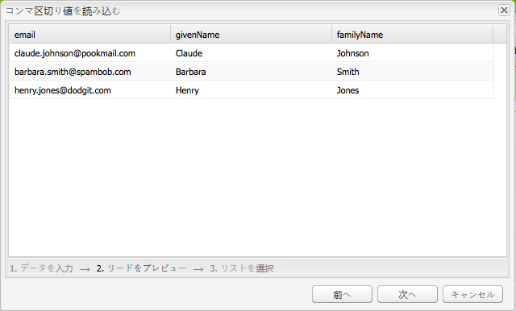

1. 「**次へ**」をクリックします。リードを所属させるリストを選択します。 リストに含めない場合は、「 」フィールドの情報を削除します。 デフォルトでは、AEMは日時を含むリスト名を作成します。 「**読み込み**」をクリックします。

   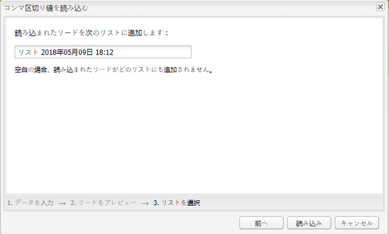

   新しいリードが「リード」ペインに表示されます。 エントリをクリックすると、入力したすべての情報が右側のウィンドウに表示されます。 リードを作成した後、リストに追加できます。

### リストへのリードの追加 {#adding-leads-to-lists}

既存のリストにリードを追加するには：

1. MCM で、 **リード** をクリックして、使用可能なすべてのリードを表示します。

1. リードの横にあるチェックボックスをオンにして、リストに追加するリードを選択します。 必要な数のリードを追加できます。

   

1. **ツール**&#x200B;メニューの「**リストに追加** 「**リストに追加**」ウィンドウが開きます。

   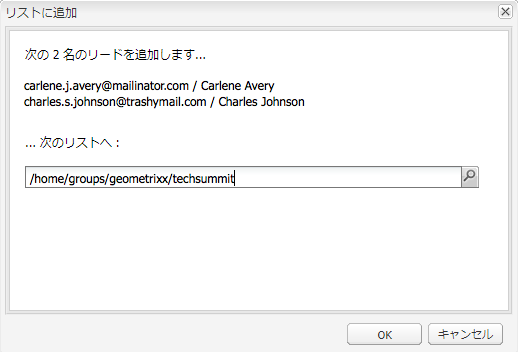

1. リードを追加するリストを選択し、 **OK**. リードが適切なリストに追加されます。

### リード情報の表示 {#viewing-lead-information}

リード情報を表示するには、MCM でリードの横にあるチェックボックスをクリックすると、右側のウィンドウが開き、リストの所属情報を含むすべてのリードの情報が表示されます。

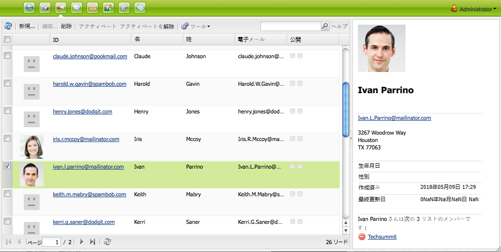

### 既存のリードの変更 {#modifying-existing-leads}

既存のリード情報を変更する手順は、次のとおりです。

1. MCM で、 **リード**. リードのリストから、編集するリードの横にあるチェックボックスを選択します。 すべてのリード情報が右側のウィンドウに表示されます。

   

   >[!NOTE]
   >
   >一度に編集できるリードは 1 つだけです。 同じリストに含まれるリードを変更する必要がある場合は、代わりにリストを変更できます。

1. クリック **編集**. この **リードの編集** ウィンドウが開きます。

   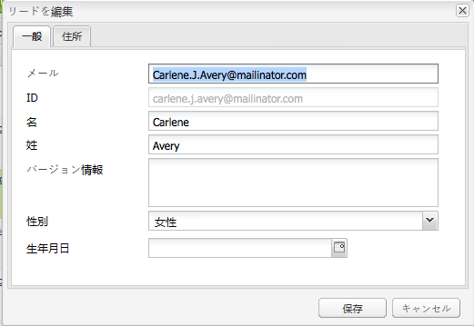

1. 必要に応じて編集を行い、「 」をクリックします。 **保存** 変更を保存します。

   >[!NOTE]
   >
   >リードのアバターを変更するには、ユーザープロファイルに移動します。 Ctrl + Alt + c キーを押し、 **読み込み**&#x200B;をクリックし、プロファイルを選択します。

### 既存のリードを削除中 {#deleting-existing-leads}

MCM 内の既存のリードを削除するには、リードの横にあるチェックボックスを選択し、 **削除**. リードがリードリストおよび関連するすべてのリストから削除されます。

>[!NOTE]
>
>削除する前に、既存のリードの削除を確認するメッセージが表示されます。削除した後は、取得できません。

## リストの操作 {#working-with-lists}

>[!NOTE]
>
>この機能（リストの管理）がさらに強化される予定はありません。\
>[Adobe Campaign の利用や AEM との統合環境の利用](/help/sites-administering/campaign.md)をお勧めします。

リストを使用して、リードをグループに整理できます。 リストを使用すると、マーケティングキャンペーンのターゲットを特定の人々のグループに設定できます。例えば、ターゲットを絞ったニュースレターをリストに送信できます。 リストは、MCM で、ダッシュボードで、または **リスト**. リストの名前とメンバー数が表示されます。

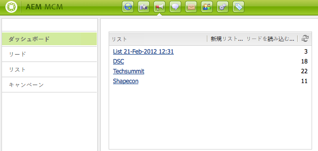

「**リスト**」をクリックすると、リストが他のリストのメンバーであるかどうか、およびリストの説明が表示されます。

### 新しいリストの作成 {#creating-new-lists}

新しいリスト（グループ）を作成するには：

1. MCM ダッシュボードで、 **新しいリスト…** または **リスト**&#x200B;をクリックし、 **新規** ...「リストを作成」ウィンドウが開きます。

   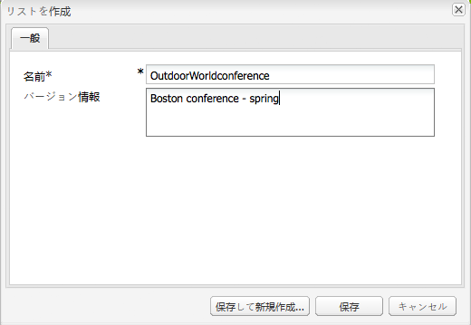

1. 名前（必須）を入力し、必要に応じて説明を入力して、「 」をクリックします。 **保存**. リストが **リスト** ウィンドウ

   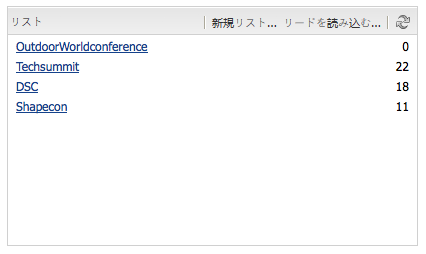

### 既存のリストの変更 {#modifying-existing-lists}

既存のリストを変更するには：

1. MCM で、 **リスト**.

1. リストで、編集するリストの横にあるチェックボックスを選択し、 **編集**. この **リストを編集** ウィンドウが開きます。

   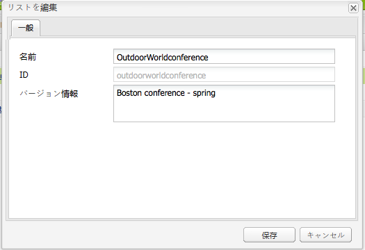

   >[!NOTE]
   >
   >一度に編集できるリストは 1 つだけです。

1. 必要に応じて編集を行い、「 **保存** 変更を保存します。

### 既存のリストの削除 {#deleting-existing-lists}

既存のリストを削除するには、MCM で、リストの横にあるチェックボックスを選択し、 **削除**. リストが削除されます。 リストに所属していたリードは削除されず、リストに所属していたリードのみが削除されます。

>[!NOTE]
>
>削除する前に、既存のリストの削除を確認するメッセージが表示されます。削除した後は、取得できません。

### リストの結合 {#merging-lists}

既存のリストを別のリストと結合できます。 この操作を行うと、マージするリストが他のリストのメンバーになります。 まだ個別のエンティティとして存在し、削除しないでください。

2 つの異なる場所に同じ会議が存在し、それらをすべての会議の出席者リストに統合する場合は、リストをマージできます。

既存のリストを結合するには：

1. MCM で、 **リスト**.

1. 別のリストの横のチェックボックスをオンにして、別のリストを結合するリストを選択します。

1. 内 **ツール** メニュー、選択 **リストを結合**.

   >[!NOTE]
   >
   >一度に結合できるリストは 1 つだけです。

1. 内 **リストを結合** ウィンドウで、結合するリストを選択し、 **OK**.

   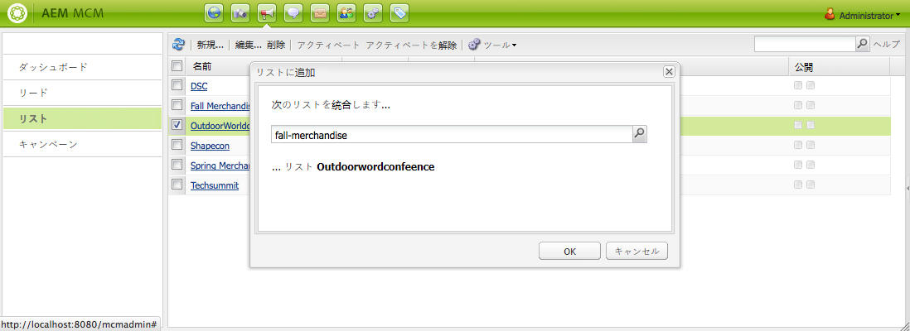

   マージしたリストは、1 つのメンバーだけ増やす必要があります。 リストが結合されたことを確認するには、結合したリストを選択し、 **ツール** メニュー、選択 **リードを表示**.

1. 必要なリストがすべて結合されるまで、手順を繰り返します。

   

>[!NOTE]
>
>メンバーシップからのマージ済みリストの削除は、リストからリードを削除する場合と同じです。 を開きます。 **リスト** タブで、マージされたリストを含むリストを選択し、リストの横にある赤い円をクリックしてメンバーシップを削除します。

### リスト内のリードの表示 {#viewing-leads-in-lists}

メンバーを参照または検索することで、いつでも特定のリストに属するリードを表示できます。

リストに属するリードを表示するには：

1. MCM で、 **リスト**.

1. メンバーを表示するリストの横にあるチェックボックスをオンにします。

1. 内 **ツール** メニュー、選択 **リードを表示**. AEMは、そのリストのメンバーであるリードを表示します。 リスト内を参照したり、メンバーを検索したりできます。

   >[!NOTE]
   >
   >さらに、リードを選択し、 **メンバーシップを削除**.

   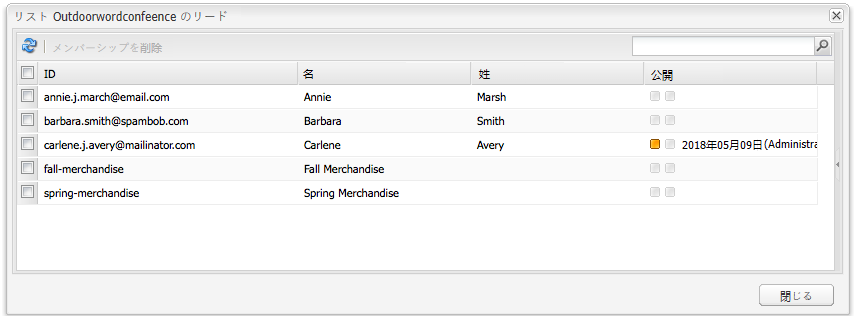

1. 「**閉じる**」をクリックして MCM に戻ります。
