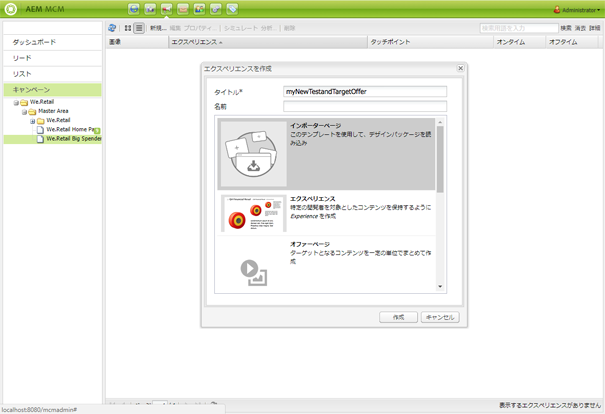

# Target オファー{#target-offers}

## Test&amp;Target オファーのエクスペリエンスの作成 {#creating-a-test-target-offer-experience}

1. 新しいキャンペーンを左側のペインで選択するか、右側のペインでダブルクリックします。
1. 次のアイコンを使用して、リスト表示を選択します。

   

1. 「**新規...**」をクリックします。
1. 次の項目を指定できます。 **タイトル**, **名前** 作成するエクスペリエンスのタイプ。この場合、Test&amp;Target オファーです。

   

1. 「**作成**」をクリックします。

   >[!NOTE]
   >
   >Test&amp;Target のエクスペリエンスは、この時点で MCM のリストに表示されていません。「キャンペーン」の下の **Web サイト**&#x200B;コンソールからアクセスできます。

## Adobe Target との統合 {#integrating-with-adobe-target}

詳しくは、 [Adobeとの統合](/help/sites-administering/target.md) [ターゲット](/help/sites-administering/target.md) 詳細はこちら。
