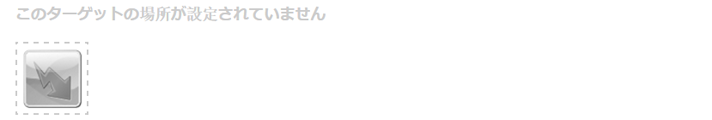

# ティーザーと戦略 {#teasers-and-strategies}

>[!CAUTION]
>
>AEM 6.4 の拡張サポートは終了し、このドキュメントは更新されなくなりました。 詳細は、 [技術サポート期間](https://helpx.adobe.com/jp/support/programs/eol-matrix.html). サポートされているバージョンを見つける [ここ](https://experienceleague.adobe.com/docs/?lang=ja).

キャンペーンでは、多くの場合、訪問者の興味に焦点を当てたコンテンツを通じて、訪問者の特定のセグメントを誘導するメカニズムとしてティーザーを使用します。 特定のキャンペーンに対して 1 つ以上のティーザーが定義されています。

>[!NOTE]
>
>ティーザーコンポーネントは、AEM 6.2 で非推奨（廃止予定）となりました。

* **ブランドページ**&#x200B;は、web サイトの「キャンペーン」セクションに格納されます。各ブランドには個々のキャンペーンが含まれます。

* **キャンペーンページ**&#x200B;は、web サイトの「キャンペーン」セクションに格納されます。各キャンペーンには個々のページがあり、このページの下にティーザー定義が保持されます。 コンテナ（概要）ページには、個々のティーザーページに関する特定の情報と統計情報も含まれています。

AEM内のティーザーは、次の複数の部分で構成されます。

* **ティーザーページ**&#x200B;は各キャンペーンページに格納され、各キャンペーンにのみ使用できるティーザー段落の定義を保持します。これらの定義は、ティーザーの段落を表示する際に使用されます。コンテンツのバリエーションを含む。バリエーションとブースト係数の選択に使用されるセグメント。
* この **ティーザーコンポーネント** は初期設定の状態で使用でき、コンテンツページに特定のティーザー段落のインスタンスを作成できます。 サイドキックからティーザーコンポーネントをドラッグし、ティーザー定義を指定して独自のティーザー段落を作成できます。 **注意：** ティーザーコンポーネントは、AEM 6.2 で非推奨（廃止予定）となりました。

* **ティーザーの段落** は、コンテンツページ内のティーザーの実際のインスタンスです。 これらは、訪問者の興味に焦点を当てたコンテンツを通じて、訪問者のセグメントを惹きつけます。
* 特定の訪問者セグメントに焦点を当てたキャンペーンコンテンツを保持するページ。 通常、ティーザー段落を使用すると、訪問者はこのようなページに移動します。

## 戦略 {#strategies}

ティーザー段落をページに追加するときに、「**方法**」を定義する必要があります。

これは、割り当てられたセグメントがすべて正常に解決されるので、複数のティーザーを選択できる場合に使用します。 この **方法** 次に、表示されるティーザーの選択に使用する追加の条件を指定します。

* **Clickstream のスコア**&#x200B;は、訪問者の ClientContext 内に保持されるタグおよび関連するタグヒットに基づきます（訪問者が各タグを含むページをクリックした頻度を示します）。 ティーザーページに定義されている複数のタグのヒット率が比較されます。
* **ランダム**：「ランダム」に選択されます。ページ用に生成されたランダム係数を使用します。これは [Client Context](/help/sites-administering/client-context.md) で確認できます。

* **最初**：解決されたセグメントのリストの最初の項目を使用します。この順序は、キャンペーンコンテナページ内のティーザーの順序を指します。

セグメントの[ブースト計数](/help/sites-administering/campaign-segmentation.md#boost-factor)も選択に影響します。これは、セグメントの定義に追加される重み付け係数で、選択される相対的な確率を増減させます。

様々な選択条件のプロセスと相互関係を、例で示すのが最適です（ティーザーが必要なオーディエンスに到達するようにするためにも使用できる方法）。

次のセグメントが既に作成され、それぞれのブースト係数が割り当てられている場合：

| セグメント | ブースト係数 |
|---|---|
| S1 | 0 |
| S2 | 0 |
| S3 | 10 |
| S4 | 30 |
| S5 | 0 |
| S6 | 100 |

以下のティーザー定義を使用します。

<table> 
 <tbody> 
  <tr> 
   <td>Campaign</td> 
   <td>ティーザー</td> 
   <td>割り当てられたセグメント</td> 
   <td>割り当てるタグ </td> 
  </tr> 
  <tr> 
   <td>C1</td> 
   <td>T1</td> 
   <td>S1、S2</td> 
   <td>ビジネス、マーケティング</td> 
  </tr> 
  <tr> 
   <td>C1</td> 
   <td>T2 </td> 
   <td>S1</td> 
   <td>  </td> 
  </tr> 
  <tr> 
   <td>C1 </td> 
   <td>T3</td> 
   <td>S3、S4</td> 
   <td>  </td> 
  </tr> 
  <tr> 
   <td>C1 </td> 
   <td>T4</td> 
   <td>S2、S5</td> 
   <td>  </td> 
  </tr> 
  <tr> 
   <td>C1 </td> 
   <td>T5</td> 
   <td>S1、S2、S6</td> 
   <td>マーケター</td> 
  </tr> 
  <tr> 
   <td>C1 </td> 
   <td>T6</td> 
   <td>S6</td> 
   <td>ビジネス  </td> 
  </tr> 
 </tbody> 
</table>

次に、これを以下の場合に訪問者に適用します。

* **S1**、**S2** および **S6** は適切に解決されます

* タグ **マーケティング** が 3 件のヒットを持つ
* タグ **ビジネス** 6 件のヒットがある

結果は次のようになります。

* 一致成功 — ティーザーに割り当てられたセグメントのどれかが、現在の訪問者に対して正常に解決されますか。
* ブースト係数 — 適用可能なすべてのセグメントの最高ブースト係数
* clickstream のスコア — 適用可能なすべてのタグヒットの累積合計

を次のように計算してから、適切な方法を適用します。

<table> 
 <tbody> 
  <tr> 
   <td>Campaign</td> 
   <td>ティーザー</td> 
   <td>割り当てられたセグメント</td> 
   <td>タグ </td> 
   <td>一致したか</td> 
   <td>結果のブースト係数</td> 
   <td>結果のクリックストリームスコア </td> 
  </tr> 
  <tr> 
   <td>C1</td> 
   <td>T1</td> 
   <td>S1、S2</td> 
   <td>ビジネス、マーケティング</td> 
   <td>はい</td> 
   <td>0</td> 
   <td>9</td> 
  </tr> 
  <tr> 
   <td>C1</td> 
   <td>T2 </td> 
   <td>S1</td> 
   <td>  </td> 
   <td>はい</td> 
   <td>0</td> 
   <td>  </td> 
  </tr> 
  <tr> 
   <td>C1 </td> 
   <td>T3</td> 
   <td>S3、S4</td> 
   <td>  </td> 
   <td>いいえ</td> 
   <td>  </td> 
   <td>  </td> 
  </tr> 
  <tr> 
   <td>C1 </td> 
   <td>T4</td> 
   <td>S2、S5</td> 
   <td>  </td> 
   <td>はい  </td> 
   <td>0  </td> 
   <td>  </td> 
  </tr> 
  <tr> 
   <td>C1 </td> 
   <td>T5</td> 
   <td>S1、S2、S6</td> 
   <td>マーケター</td> 
   <td>はい</td> 
   <td>100</td> 
   <td>3</td> 
  </tr> 
  <tr> 
   <td>C1 </td> 
   <td>T6</td> 
   <td>S6</td> 
   <td>ビジネス</td> 
   <td>はい</td> 
   <td>100</td> 
   <td>6 </td> 
  </tr> 
 </tbody> 
</table>

これらの値は、訪問者に表示されるティーザーを、 **方法** ティーザー段落に適用されます。

<table> 
 <tbody> 
  <tr> 
   <td>方法</td> 
   <td>結果のティーザー</td> 
   <td>コメント</td> 
  </tr> 
  <tr> 
   <td>最初</td> 
   <td>T5</td> 
   <td>T5 と T6 のみが検討対象となります。これらのセグメントがすべて解決され、かつ、そのブースト係数が最大となるからです<i>。</i>返されるリストは、T5、T6 の順です。したがって、T5 が選択され、表示されます。</td> 
  </tr> 
  <tr> 
   <td>ランダム</td> 
   <td>T5 または T6</td> 
   <td>両方のティーザーには、すべてが解決され、同じブースト係数を持つセグメントがあります。 そのため、2 本のティーザーは同等の割合で示される。</td> 
  </tr> 
  <tr> 
   <td>Clickstream のスコア</td> 
   <td>T6</td> 
   <td>
T1、T4、T5、T6 のセグメントはすべて訪問者に解決されます。 T5 と T6 のブースト係数が高いと、T1 と T4 は除外されます。 最後に、T6 の Clickstream スコアが高いほど、この値が選択されます。
 </td> 
  </tr> 
 </tbody> 
</table>

>[!NOTE]
>
>上記の解像度テクニックの後で複数のティーザーを選択可能にした場合、内部選択（ランダム）により、1 つのティーザーが表示用に選択されます。
>
>例えば、戦略が Clickstream スコアで、T5 が T6 と同じ Clickstream スコア（3 ではなく 6）の場合、内部選択（ランダム）を使用してこの 2 つの中から 1 つを選択します。

ティーザーページ/段落を使用して、特定の訪問者セグメントを、その訪問者の興味に焦点を当てたコンテンツに誘導します。 訪問者が選択できる様々なオプションを表示したり、特定の訪問者セグメントに基づくティーザー段落を 1 つだけ表示したりできます。例えば、表示されるティーザー段落は、訪問者の年齢によって異なる場合があります。

通常、ティーザーページは、次のティーザーページに置き換えられるまで、特定の期間持続する一時的なアクションです。

ブランドとキャンペーンを作成した後、ティーザーエクスペリエンスを作成し、設定できます。

## ティーザー用のタッチポイントの作成 {#creating-a-touchpoint-for-your-teaser}

>[!NOTE]
>
>ティーザーコンポーネントは、AEM 6.2 で非推奨（廃止予定）となりました。

1. キャンペーンページに導くティーザー段落を配置するコンテンツページに移動します。
1. を追加します。 **ティーザー** コンポーネント ( **パーソナライズ** 必要な位置に配置されます。 最初に作成されたときには、キャンペーンパスがまだ設定されていないことが示されます。

   

1. ティーザーコンポーネントを編集し、次の要素を追加します。

   * **キャンペーンパス**
個々のティーザーページが保存されるキャンペーンページへのパス。セグメントによって表示されるティーザーが決まります。
   * **[方法](/help/sites-classic-ui-authoring/classic-personalization-campaigns.md#strategies)**
適切に解決されたセグメントが複数ある場合の選択方法。
   

1. 「**OK**」をクリックして保存します。ティーザーに設定したセグメントと、現在ログインしているユーザーのプロファイルに応じて、適切なコンテンツが表示されます。

   

1. ティーザー段落にマウスを移動すると、疑問符アイコン（コンポーネントの右下隅）が表示されます。 ここをクリックして、適用されたセグメントと、現在解決されているかどうかを表示します。

   

## ティーザーの概要 {#teaser-overview}

MCM のキャンペーンビューに加えて、キャンペーンページには、MCM に接続されているティーザーに関する情報も表示されます。

1. 次の **Web サイト** コンソール、「キャンペーン」ページを開きます。例：

   `http://localhost:4502/content/campaigns/geometrixx-outdoors/storefront/summer.html`

   このページには、ティーザーの定義と閲覧の統計についての概要が表示されます。

   
