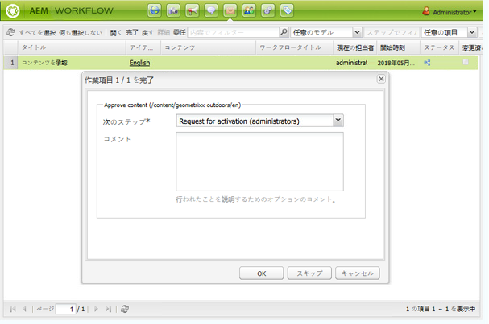

# ワークフローへの参加 {#participating-in-workflows}

>[!CAUTION]
>
>AEM 6.4 の拡張サポートは終了し、このドキュメントは更新されなくなりました。 詳細は、 [技術サポート期間](https://helpx.adobe.com/jp/support/programs/eol-matrix.html). サポートされているバージョンを見つける [ここ](https://experienceleague.adobe.com/docs/?lang=ja).

ワークフローには通常、ページまたはアセットでユーザーがアクティビティを実行する必要があるステップが含まれています。ワークフローは、アクティビティを実行するユーザーまたはグループを選択し、作業項目をそのユーザーまたはグループに割り当てます。

## 作業項目の処理 {#processing-your-work-items}

作業項目を処理するには、次の操作を実行します。

* **完了**

   項目を完了して、ワークフローが次のステップに進むようにすることができます。

* **委任**

   ステップが割り当てられているが、何らかの理由でアクションを実行できない場合は、そのステップを別のユーザーまたはグループに委任できます。

   委任できるユーザーは、作業項目を割り当てられたユーザーによって異なります。

   * 作業項目がグループに割り当てられた場合、グループメンバーを使用できます。
   * 作業項目がグループに割り当てられ、ユーザーに委任された場合、グループメンバーおよびグループに委任できます。
   * 作業項目が 1 人のユーザーに割り当てられた場合、作業項目を委任することはできません。

* **戻す**

   1 つまたは複数のステップを繰り返す必要がある場合は、前のステップに戻すことができます。 これにより、ワークフロー内で前に発生した再処理のステップを選択できます。 ワークフローは指定したステップに戻り、そこから進みます。

## ワークフローへの参加  {#participating-in-a-workflow}

### 割り当てられたワークフローアクションの通知 {#notifications-of-assigned-workflow-actions}

作業項目（**コンテンツを承認**&#x200B;など）が割り当てられると、様々なアラートや通知が表示されます。

* この **ステータス** Web サイトコンソールの列は、ページがワークフロー内にあるときを示します。

   

* ユーザーまたはユーザーが属するグループがワークフローの一部として作業項目に割り当てられていると、その作業項目が AEM ワークフローインボックスに表示されます。

   

### 参加者ステップの完了 {#completing-a-participant-step}

指定したアクションを実行すると、作業項目を完了できるので、ワークフローを続行できます。 次の手順を実行して、作業項目を完了します。

1. ワークフローステップを選択し、 **完了** ボタンをクリックします。
1. 表示されたダイアログで、 **次のステップ**;つまり、次に実行するステップです。 ドロップダウンリストに、適切な宛先がすべて表示されます。 A **コメント** また、を入力することもできます。

   

   表示されるステップの数は、ワークフローモデルのデザインによって異なります。

1. 「**OK**」をクリックして、アクションを確定します。

### 参加者ステップの委任 {#delegating-a-participant-step}

作業項目を委任するには、次の手順を実行します。

1. 次をクリック： **委任** ボタンをクリックします。
1. ダイアログで、ドロップダウンリストを使用して **ユーザー** 作業項目をに委任する場合。 また、 **コメント**.

   

1. 「**OK**」をクリックして、アクションを確定します。

### 参加者ステップでの前のステップの実行 {#performing-step-back-on-a-participant-step}

次の手順を使用して、戻します。

1. 上部のナビゲーションバーにある「前のステップ」ボタンをクリックします。
1. 表示されたダイアログで、「前のステップ」を選択します。つまり、ワークフロー内で以前に発生するステップである場合でも、次に実行するステップです。 ドロップダウンリストに、適切な宛先がすべて表示されます。

   

1. 「OK」をクリックして、アクションを確定します。
