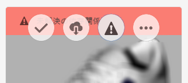

# ファイルの依存関係の解決{#resolving-file-dependencies}

テクスチャマップファイルなど、プライマリ 3D モデルファイルの依存関係は、可能な場合には自動的に解決されます。この機能は、アセットフォルダー付近で、3D ファイル内にあるものと同じ名前を持つファイルを AEM が検索すると実行されます。プレビューの作成処理段階で1つ以上の依存関係を解決できない場合、アセットのカードの[!UICONTROL カードの表示]に次の赤いバナーメッセージが表示されます。

**ファイルの依存関係を解決するには**:

1. **[!UICONTROL カード表示]**&#x200B;で、カードの&#x200B;**[!UICONTROL 未解決の依存関係]**&#x200B;バナーメッセージの上にポインターを置き、感嘆符アイコンをタップします。

   

1. メタデータのプロパティページで、「**[!UICONTROL 依存関係]**」タブをタップします。

   AEM が自動解決できなかったファイルが、「元のパス」列の下に赤色で一覧表示されます。

1. 次の操作を 1 つ以上おこないます。

   * **[!UICONTROL 依存関係を参照して選択する]**（この選択肢は、依存性ファイルを既にアップロード済みであることを前提としています）。

      1. 赤いパスの左にある&#x200B;**[!UICONTROL ファイルの参照]**&#x200B;アイコンをタップします。
      1. **[!UICONTROL コンテンツを選択]**&#x200B;ページで、見つからないファイルに移動し、そのファイルのカードをタップして選択します。
      1. **[!UICONTROL コンテンツを選択]**&#x200B;ページの左上隅にある「**[!UICONTROL 閉じる]**」（Xアイコン）をタップして、**[!UICONTROL 表示のプロパティ]**&#x200B;ページに戻ります。
   * **[!UICONTROL 依存関係をアップロードする]**（この選択肢は、見つからなかったファイルをまだアップロードしていないことを前提としています）。

      1. 見つからなかったパスとファイル名を書き留めます。
      1. プロパティページの右上隅にある「**[!UICONTROL 閉じる]**」をタップします。

   ファイルがアップロードされたら、**[!UICONTROL 表示のプロパティ/依存関係]**&#x200B;ページに戻ります。 新たにアップロードされたアセットが、参照されているファイルとして正しく一覧表示されるようになります。

   * **[!UICONTROL 依存関係を無視する]**。

      存在しない依存関係が不要になった場合は、**[!UICONTROL 参照アセット]**&#x200B;列の下の、見つからないファイルの左にあるテキストフィールドに「`n/a`」と入力し、AEM 3Dがファイルを無視するようにします。

1. **[!UICONTROL 表示のプロパティ]**&#x200B;ページの右上隅近くにある「**[!UICONTROL 保存]**」をタップします。
1. 「**[!UICONTROL 閉じる]**」をタップして&#x200B;**[!UICONTROL カード表示]**&#x200B;に戻ります。

   アセットは、新しく解決された依存関係で自動的に再処理されます。

