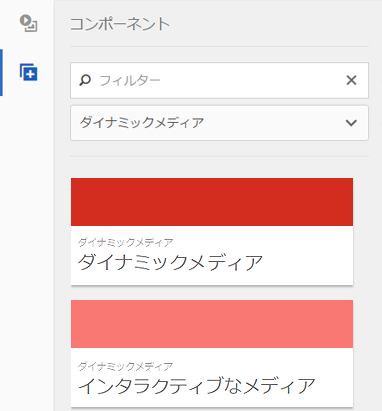
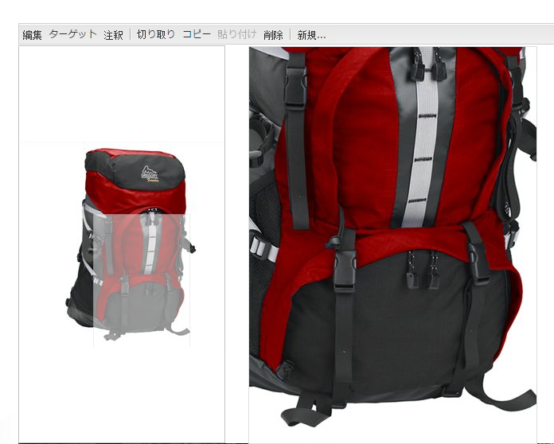
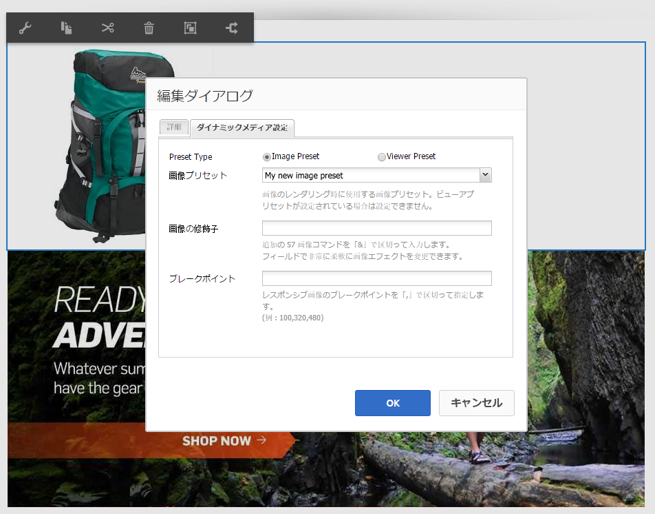
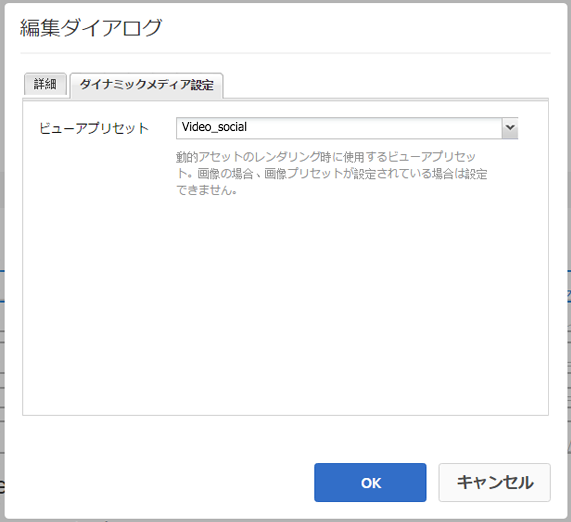

# ページへの Dynamic Media アセットの追加{#adding-dynamic-media-assets-to-pages}

Web サイトで使用するアセットにDynamic Media機能を追加するには、 **[!UICONTROL Dynamic Media]** または **[!UICONTROL インタラクティブメディア]** コンポーネントを直接ページ上に配置できます。 これを行うには、次のように入力します。 [!UICONTROL デザイン] モードに切り替えて、dynamic media コンポーネントを有効にします。 次に、これらのコンポーネントをページに追加し、そのコンポーネントにアセットを追加できます。ダイナミックメディアコンポーネントおよびインタラクティブメディアコンポーネントはスマートであり、追加しているアセットが画像であるかビデオであるかを自動的に把握します。それに従って、使用可能なオプションが変わります。

AEMを WCM として使用している場合は、Dynamic Media アセットを直接ページに追加します。

>[!NOTE]
>
>画像マップは追加設定なしでカルーセルバナーで使用できます。

## ページへの Dynamic Media コンポーネントの追加 {#adding-a-dynamic-media-component-to-a-page}

の追加 [!UICONTROL Dynamic Media] または [!UICONTROL インタラクティブメディア] ページへのコンポーネントの追加は、任意のページへのコンポーネントの追加と同じです。 この [!UICONTROL Dynamic Media] および [!UICONTROL インタラクティブメディア] コンポーネントについては、以降の節で詳しく説明します。

ページにダイナミックメディアコンポーネント／ビューアを追加するには：

1. AEM で、Dynamic Media コンポーネントを追加するページを開きます。
1. 使用できるDynamic Mediaコンポーネントがない場合は、 [!UICONTROL サイドキック] 入る **[!UICONTROL デザイン]** モード、クリック **[!UICONTROL 編集]** parsys と選択します。 **[!UICONTROL Dynamic Media]** を使用して、Dynamic Mediaコンポーネントを使用可能にします。

   >[!NOTE]
   >
   >詳しくは、[デザインモードでのコンポーネントの設定](/help/sites-authoring/default-components-designmode.md)を参照してください。

1. 戻る **[!UICONTROL 編集]** モードを変更するには、 [!UICONTROL サイドキック].
1. 次をドラッグ： **[!UICONTROL Dynamic Media]** または **[!UICONTROL インタラクティブメディア]** コンポーネント **[!UICONTROL その他]** を、目的の場所のページ上にサイドキックでグループ化します。
1. 「**[!UICONTROL 編集]**」をクリックしてコンポーネントを開きます。
1. コンポーネントの編集を必要に応じておこない、「**[!UICONTROL OK]**」をクリックして変更内容を保存します。

## Dynamic Media コンポーネント {#dynamic-media-components}

[!UICONTROL Dynamic Media] および [!UICONTROL インタラクティブメディア] は [!UICONTROL サイドキック] under **[!UICONTROL Dynamic Media]**. **[!UICONTROL インタラクティブメディア]**&#x200B;コンポーネントは、すべてのインタラクティブアセット（インタラクティブビデオ、インタラクティブ画像、カルーセルセットなど）に使用します。その他すべてのダイナミックメディアコンポーネントでは、**[!UICONTROL ダイナミックメディア]**&#x200B;コンポーネントを使用します。

>[!NOTE]
>
>これらのコンポーネントはデフォルトでは使用できません。使用する前にデザインモードで選択しておく必要があります。[デザインモードで使用可能になった後](/help/sites-authoring/default-components-designmode.md)を使用すると、他のAEMコンポーネントと同様に、コンポーネントをページに追加できます。

### Dynamic Media コンポーネント {#dynamic-media-component}

Dynamic Mediaコンポーネントはスマートです。追加するアセットが画像かビデオかに応じて、様々なオプションを使用できます。 このコンポーネントは画像プリセット、画像ベースのビューア（画像セット、スピンセット、混在メディアセットなど）およびビデオをサポートします。また、ビューアはレスポンシブです。 つまり、画面のサイズは画面のサイズに基づいて自動的に変更されます。 すべてのビューアはHTML5 ベースのビューアです。

>[!NOTE]
>
>次に [!UICONTROL Dynamic Media] コンポーネント、および **[!UICONTROL Dynamic Media Settings]** が空白の場合、またはアセットを正しく追加できない場合は、次の点を確認してください。
>
>* [Dynamic Media を有効にしている](/help/assets/config-dynamic.md)こと。Dynamic Media はデフォルトで無効になっています。
>* 画像が PTIFF（Pyramid TIFF）ファイルであること。Dynamic Media を有効にする前に読み込まれた画像には、PTIFF（Pyramid TIFF）ファイルはありません。

>

#### 画像を操作する場合 {#when-working-with-images}

この [!UICONTROL Dynamic Media] コンポーネントを使用すると、画像セット、スピンセット、混在メディアセットなどの動的画像を追加できます。スピンセット内の画像をズームイン、ズームアウトおよび必要に応じて回転させたり、別の種類のセットから画像を選択したりできます。

また、ビューアプリセット、画像プリセットまたは画像形式をコンポーネント内で直接設定することもできます。画像をレスポンシブにするために、ブレークポイントの設定かレスポンシブ画像プリセットの適用のいずれかを実行できます。

次のDynamic Media設定を編集するには、 **[!UICONTROL 編集]** コンポーネント内で、 **[!UICONTROL Dynamic Media Settings]** タブをクリックします。

>[!NOTE]
>
>デフォルトでは、Dynamic Media 画像コンポーネントはアダプティブです。画像コンポーネントを固定サイズにする場合は、 **[!UICONTROL 詳細]** タブの **[!UICONTROL 幅]** および **[!UICONTROL 高さ]** プロパティ。

**[!UICONTROL ビューアプリセット]**  — ドロップダウンメニューから既存のビューアプリセットを選択します。 探しているビューアプリセットが表示されない場合は、表示できるように設定する必要があります。詳しくは、[ビューアプリセットの管理](/help/assets/managing-viewer-presets.md)を参照してください。画像プリセットを使用している場合は、ビューアプリセットを選択できません。逆の場合も同様です。

これは、画像セット、スピンセットまたは混在メディアセットを表示している場合に使用できる唯一のオプションです。表示されるビューアプリセットもスマートで、関連するビューアプリセットのみが表示されます。

**[!UICONTROL 画像プリセット]**  — ドロップダウンメニューから既存の画像プリセットを選択します。 探している画像プリセットが表示されない場合は、表示できるように設定する必要があります。[画像プリセットの管理](/help/assets/managing-image-presets.md)を参照してください。画像プリセットを使用している場合は、ビューアプリセットを選択できません。逆の場合も同様です。

このオプションは、画像セット、スピンセットまたは混在メディアセットを表示している場合には使用できません。

**[!UICONTROL 画像の修飾子]**  — 追加の画像コマンドを指定することで、画像の効果を変更できます。 詳しくは、 [画像プリセットの管理](/help/assets/managing-viewer-presets.md) そして [コマンドリファレンス](https://experienceleague.adobe.com/docs/dynamic-media-developer-resources/image-serving-api/image-serving-api/http-protocol-reference/command-reference/c-command-reference.html).

このオプションは、画像セット、スピンセットまたは混在メディアセットを表示している場合には使用できません。

**[!UICONTROL ブレークポイント]**  — レスポンシブサイトでこのアセットを使用する場合は、ページのブレークポイントを追加する必要があります。 画像のブレークポイントをコンマ（,）で区切って指定する必要があります。このオプションを使用できるのは、画像プリセットで高さまたは幅が定義されていないときです。

このオプションは、画像セット、スピンセットまたは混在メディアセットを表示している場合には使用できません。

次の項目を編集できます [!UICONTROL 詳細設定] クリックして **[!UICONTROL 編集]** コンポーネント内にある

**[!UICONTROL タイトル]**  — 画像のタイトルを変更します。

**[!UICONTROL 代替テキスト]**  — グラフィックの表示をオフにしているユーザー向けのタイトルを画像に追加します。

このオプションは、画像セット、スピンセットまたは混在メディアセットを表示している場合には使用できません。

**[!UICONTROL URL、で開く]**  — からアセットを設定して、リンクを開くことができます。 を **[!UICONTROL URL]** および **[!UICONTROL 次で開く：]** をクリックして、同じウィンドウで開くか、新しいウィンドウで開くかを指定します。

このオプションは、画像セット、スピンセットまたは混在メディアセットを表示している場合には使用できません。

**[!UICONTROL 幅と高さ]**  — 画像を固定サイズで表示する場合は、値をピクセル単位で入力します。 これらの値を空にすると、アダプティブなアセットになります。

#### ビデオを操作する場合 {#when-working-with-video}

以下を使用： [!UICONTROL Dynamic Media] ダイナミックビデオを web ページに追加するコンポーネントです。コンポーネントの編集時に、ページ上でビデオを再生するための事前定義済みのビデオビューアプリセットを使用するように選択できます。

次の項目を編集できます [!UICONTROL Dynamic Media Settings] クリックして **[!UICONTROL 編集]** コンポーネント内にある

>[!NOTE]
>
>デフォルトでは、Dynamic Media ビデオコンポーネントはアダプティブです。ビデオコンポーネントを固定サイズにする場合は、そのコンポーネントで、「**[!UICONTROL 詳細]**」タブの「**[!UICONTROL 幅]**」と「**[!UICONTROL 高さ]**」を使用してサイズを設定します。

**[!UICONTROL ビューアプリセット]**  — ドロップダウンメニューから既存のビデオビューアプリセットを選択します。 探しているビューアプリセットが表示されない場合は、表示できるように設定する必要があります。詳しくは、[ビューアプリセットの管理](/help/assets/managing-viewer-presets.md)を参照してください。

次の項目を編集できます [!UICONTROL 詳細] クリックによる設定 **[!UICONTROL 編集]** コンポーネント内にある

**[!UICONTROL タイトル]**  — ビデオのタイトルを変更します。

**[!UICONTROL 幅と高さ]**  — ビデオを固定サイズで表示する場合は、値をピクセル単位で入力します。 これらの値を空にすると、アダプティブな画像になります。

#### セキュアビデオの配信方法 {#how-to-delivery-secure-video}

AEM 6.2 で [FP-13480](https://experience.adobe.com/#/downloads/content/software-distribution/en/aem.html?package=/content/software-distribution/en/details.html/content/dam/aem/public/adobe/packages/cq620/featurepack/cq-6.2.0-featurepack-13480) をインストールする場合、ビデオをセキュア SSL 接続（HTTPS）と非セキュア接続（HTTP）のどちらで配信するかを制御できます。デフォルトでは、ビデオ配信プロトコルは、埋め込み Web ページのプロトコルから自動的に継承されます。Web ページが HTTPS で読み込まれる場合、ビデオも HTTPS で配信されます。逆の場合も同様です。Web ページが HTTP で読み込まれる場合、ビデオも HTTP で配信されます。ほとんどの場合、このデフォルトの動作で問題ないため、特に設定を変更する必要はありません。ただし、ビデオをセキュアに配信するために、`VideoPlayer.ssl=on` を URL パスの最後に付加するか、または埋め込みコードスニペットにある他のビューアの設定パラメーターのリストに付加して、このデフォルトの動作をオーバーライドすることができます。

ビデオのセキュア配信、および URL パスの `VideoPlayer.ssl` 設定属性の使用について詳しくは、『ビューアリファレンスガイド』の「[ビデオのセキュア配信](https://experienceleague.adobe.com/docs/dynamic-media-developer-resources/library/viewers-aem-assets-dmc/video/c-html5-video-viewer-20-securevideodelivery.html)」を参照してください。ビデオビューアの他に、混在メディアビューアおよびインタラクティブビデオビューアでセキュアなビデオ配信を使用できます。

### インタラクティブメディアコンポーネント {#interactive-media-component}

インタラクティブメディアコンポーネントは、インタラクティビティ（ホットスポットまたは画像マップ）を含むアセット用です。インタラクティブ画像、インタラクティブビデオまたはカルーセルバナーがある場合は、**[!UICONTROL インタラクティブメディア]**&#x200B;コンポーネントを使用します。

この [!UICONTROL インタラクティブメディア] コンポーネントはスマートです。追加している画像が画像かビデオかに応じて、様々なオプションを使用できます。 また、ビューアはレスポンシブです。 つまり、画面のサイズは画面のサイズに基づいて自動的に変更されます。 すべてのビューアはHTML5 ベースのビューアです。

コンポーネントの「**[!UICONTROL 編集]**」をクリックして、次の&#x200B;**[!UICONTROL 一般]**&#x200B;設定を編集できます。

**[!UICONTROL ビューアプリセット]**  — ドロップダウンメニューから既存のビューアプリセットを選択します。 探しているビューアプリセットが表示されない場合は、表示できるように設定する必要があります。ビューアプリセットを使用するには、あらかじめ公開する必要があります。詳しくは、ビューアプリセットの管理を参照してください。

**[!UICONTROL タイトル]**  — ビデオのタイトルを変更します。

**[!UICONTROL 幅と高さ]**  — ビデオを固定サイズで表示する場合は、値をピクセル単位で入力します。 これらの値を空にすると、アダプティブな画像になります。

コンポーネントの「**[!UICONTROL 編集]**」をクリックして、次の&#x200B;**[!UICONTROL 買い物かごに追加]**&#x200B;設定を編集できます。

**[!UICONTROL 製品アセットを表示]**  — デフォルトでは、この値が選択されています。 製品アセットには、コマースモジュールで定義された製品の画像が表示されます。製品アセットを表示しない場合はチェックマークをオフにします。

**[!UICONTROL 製品価格を表示]**  — デフォルトでは、この値が選択されています。 製品価格には、コマースモジュールで定義されたアイテムの価格が表示されます。製品価格を表示しない場合はチェックマークをオフにします。

**[!UICONTROL 製品フォームを表示]**  — デフォルトでは、この値は選択されていません。 製品フォームには、サイズや色など製品のバリエーションが含まれます。製品のバリエーションを表示しない場合はチェックマークをオフにします。
