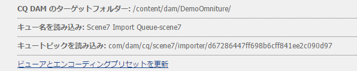

# ビデオ{#video}

>[!CAUTION]
>
>AEM 6.4 の拡張サポートは終了し、このドキュメントは更新されなくなりました。 詳細は、 [技術サポート期間](https://helpx.adobe.com/jp/support/programs/eol-matrix.html). サポートされているバージョンを見つける [ここ](https://experienceleague.adobe.com/docs/?lang=ja).

 Assets では、ビデオアセットを統合管理できます。ビデオを直接アセットにアップロードして、Dynamic Media Classic に対する自動エンコーディングを行ったり、アセットから直接 Dynamic Media Classic ビデオにアクセスしてページオーサリングを行ったりできます。

Dynamic Media Classic のビデオの統合により、最適化されたビデオの範囲を全画面に拡大します（デバイスと帯域幅の自動検出）。

* Dynamic Media Classic(Scene7) ビデオコンポーネントは、デスクトップ、タブレット、モバイルで適切な形式と品質のビデオを再生するために、デバイスと帯域幅の検出を自動的に実行します。
* Assets - 単一のビデオアセットだけでなく、アダプティブビデオセットを含めることもできます。アダプティブビデオセットは、複数の画面でビデオをシームレスに再生するのに必要なすべてのビデオレンディションのコンテナです。 アダプティブビデオセットでは、同じビデオを、400 kbps、800 kbps、1000 kbps などの様々なビットレートと形式でエンコードしたバージョンにグループ分けします。デスクトップ、iOS、Android、Blackberry および Windows モバイルデバイスを含む複数の画面にアダプティブビデオをストリーミングする場合、S7 ビデオコンポーネントと共にアダプティブビデオセットを使用します。 詳しくは、 [Scene7のアダプティブビデオセットに関するドキュメントを参照してください](https://experienceleague.adobe.com/docs/?lang=jadynamic-media-classic/using/setup/application-setup.html#video-presets-for-encoding-video-files).

## FFMPEG と Dynamic Media Classic について {#about-ffmpeg-and-scene}

デフォルトのビデオエンコーディングプロセスは、FFMPEG ベースでビデオプロファイルと統合することを基にしています。そのため、標準の DAM アセットの更新ワークフローには、ffmpeg ベースの次の 2 つのステップが含まれています。

* FFMPEG のサムネイル
* FFMPEG エンコーディング

Dynamic Media Classic統合を有効にして設定しても、標準の DAM アセットの更新取り込みワークフローからこれら 2 つのワークフローステップが自動的に削除または非アクティブ化されることはありません。 AEMで既に FFMPEG ベースのビデオエンコーディングを使用している場合は、FFMPEG がオーサリング環境にインストールされている可能性が高くなります。 この場合、Assets を使用して取り込まれた新しいビデオは 2 回エンコードされます。FFMPEG エンコーダーから、Dynamic Media Classic統合から 1 回。

AEMで FFMPEG ベースのビデオエンコーディングが設定され、FFMPEG がインストールされている場合、DAM アセットの更新ワークフローから 2 つの FFMPEG ワークフローを削除することをお勧めします。

### サポートされる形式 {#supported-formats}

Dynamic Media Classic ビデオコンポーネントでは次の形式がサポートされます。

* F4V H.264
* MP4 H.264

### ビデオのアップロード場所の決定 {#deciding-where-to-upload-your-video}

ビデオアセットをアップロードする場所は、以下によって決まります。

* ビデオアセットのワークフローが必要か？
* ビデオアセットのバージョン管理が必要か？

これらの質問のいずれかまたは両方に対する回答が「はい」の場合は、ビデオを Adobe DAM に直接アップロードします。両方の質問に対する回答が「いいえ」の場合は、ビデオを Dynamic Media Classic に直接アップロードします。次の節では、各シナリオのワークフローについて説明します。

#### ビデオを直接 Adobe Assets にアップロードする場合 {#if-you-are-uploading-your-video-directly-to-adobe-assets}

アセットのワークフローまたはバージョン管理が必要な場合は、まず Adobe Assets にアップロードします。推奨されるワークフローは次のとおりです。

1. Adobe Assets にビデオアセットをアップロードして、Dynamic Media Classic に自動的にエンコードして公開します。
1. AEMで、WCM のビデオアセット ( **[!UICONTROL 映画]** 」タブをクリックします。
1. Dynamic Media Classic ビデオまたは基盤ビデオコンポーネントを使用して作成します。

#### ビデオを Dynamic Media Classic にアップロードする場合 {#if-you-are-uploading-your-video-to-scene}

アセットのワークフローやバージョン管理が不要な場合、Dynamic Media Classic にアセットをアップロードします。推奨されるワークフローは次のとおりです。

1. Dynamic Media Classicでは、 [Dynamic Media Classicへの FTP アップロードおよびエンコーディングのスケジュール設定（システムが自動化）](https://experienceleague.adobe.com/docs/dynamic-media-classic/using/upload-publish/uploading-files.html?lang=ja#uploading-your-files).
1. AEMで、WCM のビデオアセット ( **[!UICONTROL Dynamic Media Classic]** 」タブをクリックします。
1. Dynamic Media Classic ビデオコンポーネントを使用して作成します。

### Dynamic Media Classicとの統合の設定ビデオ {#configuring-integration-with-scene-video}

**ユニバーサルプリセットを設定するには：**:

1. In **[!UICONTROL Cloud Services]**&#x200B;を選択し、 **[!UICONTROL Dynamic Media Classic]** 設定およびクリック **[!UICONTROL 編集]**.
1. 「**[!UICONTROL ビデオ]**」タブを選択します。

   >[!NOTE]
   >
   >クラウド設定がページにない場合は、「**[!UICONTROL ビデオ]**」タブが表示されません。詳しくは、 [WCM でのDynamic Media Classicの有効化](#enablingscene7forwcm).

1. アダプティブビデオエンコーディングプロファイル、組み込みの単一のビデオエンコーディングプロファイルまたはカスタムビデオエンコーディングプロファイルを選択します。

   >[!NOTE]
   >
   >ビデオプリセットについて詳しくは、[Dynamic Media Classic のドキュメント](https://experienceleague.adobe.com/docs/dynamic-media-classic/using/setup/application-setup.html?lang=ja#video-presets-for-encoding-video-files)を参照してください。
   >
   >ユニバーサルプリセットを設定する際に両方のアダプティブビデオセットを選択するか、「**[!UICONTROL アダプティブビデオエンコーディング]**」オプションを選択することをお勧めします。

1. 選択したエンコーディングプロファイルは、CQ DAM のターゲットフォルダーにアップロードされたすべてのビデオに自動的に適用されます。このフォルダーは、Dynamic Media Classic クラウド設定用に指定したものです。必要に応じて、別のターゲットフォルダーに別のエンコーディングプロファイルを適用することで、複数の Dynamic Media Classic クラウド設定を指定できます。

### ビューアとエンコーディングプリセットの更新 {#updating-viewer-and-encoding-presets}

AEMでプリセットが更新されたので、ビデオのビューアとエンコーディングプリセットを更新する必要がある場合は、クラウド設定のDynamic Media Classic設定に移動して、「 **ビューアとエンコーディングプリセットを更新します**.

### マスタービデオのアップロード {#uploading-your-master-video}

AdobeDAM からDynamic Media Classicにマスタービデオをアップロードするには：

1. Dynamic Media Classic のエンコーディングプロファイルでクラウド設定を指定した CQ DAM のターゲットフォルダーに移動します。
1. クリック **[!UICONTROL アップロード]** マスタービデオをアップロードするには： [!UICONTROL DAM アセットの更新]ワークフローが完了し、「**[!UICONTROL Dynamic Media Classic に公開]**」にチェックマークが付くと、ビデオのアップロードとエンコーディングが完了します。

   >[!NOTE]
   >
   >ビデオのサムネールの生成にはある程度の時間がかかることがあります。

   DAM マスタービデオをビデオコンポーネントにドラッグすると、ビデオコンポーネントにアクセスできます *すべて* Dynamic Media Classicがエンコードした配信用のプロキシレンディションの数を格納します。

### 基盤ビデオコンポーネントとDynamic Media Classicビデオコンポーネントの比較 {#foundation-video-component-versus-scene-video-component}

AEMを使用する場合、Sites で使用できるビデオコンポーネントと、Dynamic Media Classic(Scene7) ビデオコンポーネントの両方にアクセスできます。 これらのコンポーネントに互換性はありません。

Dynamic Media Classic ビデオコンポーネントは、Dynamic Media Classic ビデオでのみ使用できます。基盤コンポーネントは、AEM （ffmpeg を使用）およびDynamic Media Classicビデオから保存されたビデオに対して機能します。

次の表は、どのコンポーネントをどのようなシナリオで使用するべきかを示しています。

>[!NOTE]
>
>デフォルトでは、 Dynamic Media Classic ビデオコンポーネントはユニバーサルビデオプロファイルを使用します。ただし、AEMで使用するHTML5 ベースのビデオプレーヤーを入手することはできます。 Dynamic Media Classicで、標準のHTML5 ビデオプレーヤーの埋め込みコードをコピーし、AEMページに配置します。

## AEMビデオコンポーネント {#aem-video-component}

Dynamic Media Classicビデオの閲覧にDynamic Media Classicビデオコンポーネントの使用をお勧めしますが、ここでは、 [!UICONTROL 基盤ビデオコンポーネント] AEMでは、完全性を保つために使用されます。

### AEMビデオとDynamic Media Classicビデオの比較 {#aem-video-and-scene-video-comparison}

次の表に、AEM Foundation ビデオコンポーネントとScene7ビデオコンポーネントの間でサポートされる機能の大まかな比較を示します。

|  | AEM Foundation ビデオ | Dynamic Media Classic ビデオ |
|---|---|---|
| アプローチ | HTML5 の第 1 のアプローチ。Flash は非 HTML5 のフォールバックにのみ使用されます。 | ほとんどのデスクトップでの Flash。HTML5 はモバイルとタブレットで使用されます。 |
| 配信 | プログレッシブ | アダプティブストリーミング |
| トラッキング | はい | はい |
| 拡張機能 | はい | はい (Dynamic Media Classic Viewer SDK を使用 ) |
| モバイルビデオ | はい | はい |

### 設定 {#setting-up}

#### ビデオプロファイルの作成 {#creating-video-profiles}

様々なビデオエンコーディングは、Dynamic Media Classicクラウド設定で選択したDynamic Media Classicのエンコーディングプリセットに従って作成されます。 基盤ビデオコンポーネントでビデオコンポーネントを使用するには、選択したDynamic Media Classicのエンコーディングプリセットごとにビデオプロファイルを作成する必要があります。 これにより、ビデオコンポーネントは、それに応じて DAM レンディションを選択できます。

>[!NOTE]
>
>新しいビデオプロファイルおよびビデオプロファイルに対する変更をアクティベートして公開する必要があります。

1. AEMで、に移動します。 **[!UICONTROL ツール]**&#x200B;を選択し、「 **[!UICONTROL 設定コンソール]**. 設定コンソールで、に移動します。 **[!UICONTROL ツール]** > **[!UICONTROL Assets]** > **[!UICONTROL ビデオプロファイル]** をクリックします。
1. 新しいDynamic Media Classicビデオプロファイルを作成します。 内 **[!UICONTROL 新規…]** メニュー、選択 **[!UICONTROL ページを作成]** 次に、「 Dynamic Media Classicビデオプロファイル」テンプレートを選択します。 新しいビデオプロファイルページに名前を付け、「 **[!UICONTROL 作成]**.

   

1. 新しいビデオプロファイルを編集します。最初にクラウド設定を選択します。次に、クラウド設定で選択したのと同じエンコーディングプリセットを選択します。

   

   | プロパティ | 説明 |
   |---|---|
   | Dynamic Media Classic(Scene7) クラウド設定 | エンコーディングプリセットで使用するクラウド設定です。 |
   | Dynamic Media Classic(Scene7) エンコーディングプリセット | このビデオプロファイルをマッピングするエンコーディングプリセットです。 |
   | HTML5 ビデオタイプ | このプロパティを使用すると、HTML5 ビデオソース要素の type プロパティの値を設定できます。 この情報は、Dynamic Media Classic のエンコーディングプリセットでは提供されませんが、HTML5 ビデオ要素を使用してビデオを適切にレンダリングするために必要です。共通の形式用のリストが提供されますが、他の形式用に上書きできます。 |

   ビデオコンポーネントで使用する、クラウド設定で選択したすべてのエンコーディングプリセットについて、この手順を繰り返します。

#### デザインの設定 {#configuring-design}

基盤ビデオコンポーネントは、ビデオソースリストを作成するために使用するビデオプロファイルについて把握している必要があります。 ビデオコンポーネントデザインダイアログを開き、新しいビデオプロファイルを使用するようにコンポーネントデザインを設定する必要があります。

>[!NOTE]
>
>基盤ビデオコンポーネントをモバイルページで使用する場合、モバイルページのデザインでこれらの手順を繰り返す必要が生じる場合があります。

>[!NOTE]
>
>デザインを変更するには、デザインのアクティベーションをおこなって、公開時に変更を有効にする必要があります。

1. 基盤ビデオコンポーネントのデザインダイアログを開き、「**[!UICONTROL プロファイル]**」タブに変更します。その後、標準のプロファイルを削除し、Dynamic Media Classic ビデオの新しいプロファイルを追加します。デザインダイアログのプロファイルリストの順序で、レンダリング時のビデオソース要素の順序も定義します。
1. HTML5 をサポートしていないブラウザーの場合、ビデオコンポーネントを使用すると、Flash フォールバックを設定できます。 ビデオコンポーネントのデザインダイアログボックスを開き、「**[!UICONTROL Flash]**」タブに変更します。Flash Player 設定を指定して、Flash Player のフォールバックプロファイルを割り当てます。

#### チェックリスト {#checklist}

1. Dynamic Media Classic(Scene7) クラウド設定を作成します。 ビデオエンコーディングプリセットが設定され、インポーターが実行中であることを確認します。
1. クラウド設定で選択した各ビデオエンコーディングのプリセットに対して、Dynamic Media Classic ビデオプロファイルを作成します。
1. ビデオプロファイルをアクティベートする必要があります。
1. 目的のページで基盤ビデオコンポーネントのデザインを設定します。
1. デザインの変更が完了したら、デザインをアクティベートします。
