# ページへのDynamic Mediaクラシック機能の追加{#adding-scene-features-to-your-page}

[AdobeDynamic Media](https://help.adobe.com/en_US/scene7/using/WS26AB0D9A-F51C-464e-88C8-580A5A82F810.html) クラシックは、リッチメディアアセットを管理、強化、公開、およびWeb、モバイル、電子メール、インターネットに接続されたディスプレイや印刷に配信するためのホストソリューションです。

Dynamic Mediaクラシックで公開したAEMアセットは、様々なビューアで表示できます。

* ズーム
* フライアウト
* ビデオ
* 画像テンプレート
* 画像

デジタルアセットはAEMからDynamic Mediaクラシックに直接公開でき、また、Dynamic MediaクラシックからAEMに公開できます。

この節では、デジタルアセットをAEMからDynamic Mediaクラシックに公開する方法と、その逆の方法について説明します。 また、ビューアについても詳しく説明します。Dynamic Mediaクラシック用のAEMの設定については、「[Dynamic MediaクラシックとAEM](/help/sites-administering/scene7.md)の統合」を参照してください。

[画像マップの追加](/help/assets/image-maps.md)も参照してください。

AEM でのビデオコンポーネントの使用について詳しくは、以下を参照してください。

* [ビデオ](/help/sites-classic-ui-authoring/manage-assets-classic-s7-video.md)

>[!NOTE]
>
>Dynamic Mediaクラシックアセットが正しく表示されない場合は、ダイナミックメディアが[無効](/help/assets/config-dynamic.md#disabling-dynamic-media)であることを確認してから、ページを更新します。

## 手動でのアセットからDynamic Mediaクラシックへの公開{#manually-publishing-to-scene-from-assets}

デジタルアセットは、クラシックUIのアセットコンソールからでも、アセットから直接でも、Dynamic Mediaクラシックに公開できます。

>[!NOTE]
>
>AEMは、非同期でDynamic Mediaクラシックに公開します。 「**[!UICONTROL 公開]**」をクリックした後で、アセットがDynamic Mediaクラシックに公開されるまでに数秒かかる場合があります。

### アセットコンソールからの公開 {#publishing-from-the-assets-console}

アセットがDynamic Mediaクラシックターゲットフォルダー内にある場合に、アセットコンソールからDynamic Mediaクラシックに公開するには：

1. AEMクラシックUIで、「**[!UICONTROL デジタルアセット]**」をクリックしてデジタルアセットマネージャーにアクセスします。

1. Dynamic Mediaクラシックに公開するターゲットフォルダ内からアセット（またはアセット）またはフォルダを選択し、右クリックして「**[!UICONTROL Dynamic Mediaクラシックに公開]**」を選択します。 または、**[!UICONTROL ツール]**&#x200B;メニューから「**[!UICONTROL Dynamic Mediaクラシックに公開]**」を選択します。

   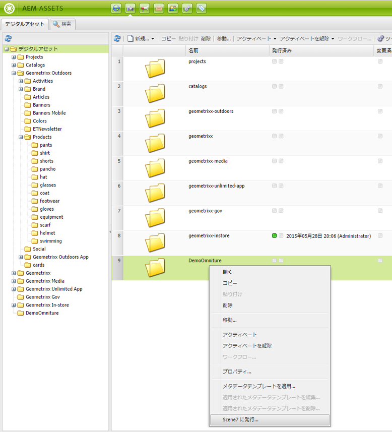

1. Dynamic Mediaクラシックに移動し、アセットが使用可能であることを確認します。

   >[!NOTE]
   >
   >アセットがDynamic Mediaクラシック同期フォルダーにない場合、両方のメニューの&#x200B;**[!UICONTROL Dynamic Mediaクラシックに公開]**&#x200B;は表示されますが、無効になります。

### アセットからの公開 {#publishing-from-an-asset}

アセットが同期されたDynamic Mediaクラシックフォルダ内にある限り、手動でアセットを公開できます。

>[!NOTE]
>
>アセットがDynamic Mediaクラシック同期フォルダー内にない場合、**[!UICONTROL Dynamic Mediaクラシックに発行]**&#x200B;へのリンクは使用できません。

**デジタルアセットからDynamic Mediaクラシックに直接公開するには**:

1. AEM で、「**[!UICONTROL デジタルアセット]**」をクリックして、Digital Asset Manager にアクセスします。

1. アセットをダブルクリックして開きます。

1. アセットの詳細ウィンドウで、「**[!UICONTROL Dynamic Mediaクラシックに公開]**」を選択します。

   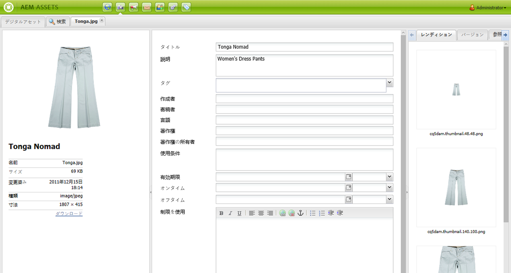

1. リンクが&#x200B;**[!UICONTROL 発行中…に変わります。]**&#x200B;を開始してから&#x200B;**[!UICONTROL 公開済み]**。 Dynamic Mediaクラシックに移動し、アセットが使用可能であることを確認します。

   >[!NOTE]
   >
   >アセットがDynamic Mediaクラシックに正しく公開されない場合、リンクは&#x200B;**[!UICONTROL 公開失敗]**&#x200B;に変更されます。 アセットが既にDynamic Mediaクラシックに公開されている場合、リンクには「**[!UICONTROL Dynamic Mediaクラシックに再公開]**」と表示されます。 再公開を使用すると、AEM内のアセットに変更を加えて再公開できます。

### CQターゲットフォルダーの外部からのアセットの公開{#publishing-assets-from-outside-the-cq-target-folder}

Adobeでは、Dynamic Mediaクラシックターゲットフォルダ内のアセットからのみ、Dynamic Mediaクラシックにアセットを公開することをお勧めします。 ただし、ターゲットフォルダー外のフォルダーからアセットをアップロードする必要がある場合は、Dynamic Mediaクラシックの&#x200B;*アドホック*&#x200B;フォルダーにアップロードしてアップロードできます。

これを行うには、アセットを表示するページのクラウド設定を指定します。 次に、ページにDynamic Mediaクラシックコンポーネントを追加し、そのコンポーネントにアセットをドラッグ&amp;ドロップします。 そのページのページプロパティが設定されると、**[!UICONTROL 「Dynamic Mediaクラシックに公開」]**&#x200B;リンクが表示され、選択したトリガーがDynamic Mediaクラシックにアップロードするときに表示されます。

>[!NOTE]
>
>アドホックフォルダー内のアセットは、Dynamic Mediaクラシックコンテンツブラウザーには表示されません。

**CQターゲットフォルダーの外部にあるアセットを発行するには**:

1. クラシックUIのAEMで、「**[!UICONTROL Webサイト]**」をクリックし、まだDynamic Mediaクラシックに公開されていないデジタルアセットを追加するWebページに移動します。 （通常のページ継承ルールが適用されます）。

1. サイドキックで、**[!UICONTROL ページ]**&#x200B;アイコンをクリックし、**[!UICONTROL ページプロパティ]**&#x200B;をクリックします。

1. **[!UICONTROL Cloud Services] > [!UICONTROL 追加サービス] > [!UICONTROL Dynamic Mediaクラシック(Scene7)]**&#x200B;をクリックします。
1. 「AdobeDynamic Mediaクラシック」ドロップダウンリストで、目的の設定を選択し、「**[!UICONTROL OK]**」をクリックします。

   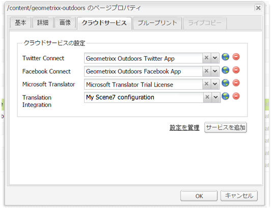

1. Webページで、ページ上の目的の場所にDynamic Mediaクラシック(Scene7)コンポーネントを追加します。
1. コンテンツファインダーから、デジタルアセットをコンポーネントにドラッグします。 **[!UICONTROL Dynamic Mediaクラシックのパブリケーション状態の確認]**&#x200B;へのリンクが表示されます。

   >[!NOTE]
   >
   >デジタルアセットがCQターゲットフォルダーにある場合、**[!UICONTROL Dynamic Mediaクラシックパブリケーションのステータスを確認]**&#x200B;へのリンクは表示されません。 アセットは、コンポーネント内に配置されるだけです。

   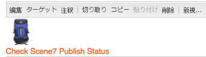

1. [**[!UICONTROL Dynamic Mediaクラシックパブリケーションの状態]**&#x200B;の確認]をクリックします。 アセットが公開されていない場合は、AEMはアセットをDynamic Mediaクラシックに公開します。 アップロードされたアセットは、アドホックフォルダーに配置されます。デフォルトでは、アドホックフォルダーは`name_of_the_company/CQ5_adhoc`にあります。 [必要に応じて、この場所を設定](#configuringtheadhocfolder)できます。

   >[!NOTE]
   >
   >アセットがDynamic Mediaクラシック同期フォルダーになく、現在のページに関連付けられたDynamic Mediaクラシッククラウド設定がない場合、アップロードは失敗します。

## Dynamic Mediaクラシック(Scene7)コンポーネント{#scene-components}

AEMでは、次のDynamic Mediaクラシックコンポーネントを使用できます。

* ズーム
* フライアウト（ズーム）
* 画像テンプレート
* 画像
* ビデオ

>[!NOTE]
>
>これらのコンポーネントはデフォルトでは使用できないので、を使用する前に&#x200B;**[!UICONTROL デザイン]**&#x200B;モードで選択する必要があります。

これらのコンポーネントを&#x200B;**[!UICONTROL デザイン]**&#x200B;モードで使用できるようになったら、他のAEMコンポーネントと同様に、ページに追加できます。 まだDynamic Mediaクラシックに公開されていないアセットは、同期フォルダー内、ページ上、またはDynamic Mediaクラシッククラウド設定で公開される場合、Dynamic Mediaクラシックに公開されます。

### Flashビューアの提供終了の通知{#flash-viewers-end-of-life-notice}

2017年1月31日、AdobeDynamic MediaクラシックはFlashビューアプラットフォームのサポートを正式に終了しました。

この重要な変更について詳しくは、[Flashビューアの提供終了FAQ](https://docs.adobe.com/content/docs/jp/aem/6-1/administer/integration/marketing-cloud/scene7/flash-eol.html)を参照してください。

### ページ{#adding-a-scene-component-to-a-page}へのDynamic Mediaクラシックコンポーネントの追加

Dynamic Mediaクラシックコンポーネントをページに追加するのは、コンポーネントをページに追加するのと同じです。 Dynamic Mediaクラシックコンポーネントについては、以下の節で詳しく説明します。

**クラシックUIのページにDynamic Mediaクラシックコンポーネント/ビューアを追加するには**:

1. AEMで、Dynamic Mediaクラシックコンポーネントを追加するページを開きます。

1. 使用可能なDynamic Mediaクラシックコンポーネントがない場合は、サイドキックのルーラーをクリックして&#x200B;**[!UICONTROL デザイン]**&#x200B;モードに入り、**[!UICONTROL 編集]**&#x200B;パーシスをクリックし、すべての&#x200B;**[!UICONTROL Dynamic Mediaクラシック]**&#x200B;コンポーネントを選択して使用できます。

1. サイドキックの鉛筆をクリックして、**[!UICONTROL 編集]**&#x200B;モードに戻ります。

1. サイドキックの&#x200B;**[!UICONTROL Dynamic Mediaクラシック]**&#x200B;グループから、目的の場所のページにコンポーネントをドラッグします。

1. 「**[!UICONTROL 編集]**」をクリックしてコンポーネントを開きます。

1. コンポーネントの編集を必要に応じておこない、「**[!UICONTROL OK]**」をクリックして変更内容を保存します。

### レスポンシブ Web サイトへのインタラクティブな表示エクスペリエンスの追加  {#adding-interactive-viewing-experiences-to-a-responsive-website}

アセットのレスポンシブデザインとは、アセットが表示される場所に適応することを意味します。レスポンシブデザインでは、同じアセットが複数のデバイスに効果的に表示されます。

**インタラクティブな表示エクスペリエンスをレスポンシブサイトのクラシックUIに追加するには**:

1. AEMにログインし、[AdobeDynamic MediaクラシックCloud Services](/help/sites-administering/scene7.md#configuring-scene-integration)を設定済みで、Dynamic Mediaクラシックコンポーネントが使用可能であることを確認します。

   >[!NOTE]
   >
   >Dynamic MediaクラシックWCMコンポーネントが使用できない場合は、**[!UICONTROL デザイン]モードを使用して有効にしてください。

1. WebサイトでDynamic Mediaクラシックコンポーネントを有効にしている場合、**[!UICONTROL 画像]**&#x200B;ビューアをページにドラッグします。
1. コンポーネントを編集し、「**[!UICONTROL Dynamic Mediaクラシック設定]**」タブでブレークポイントを調整します。

   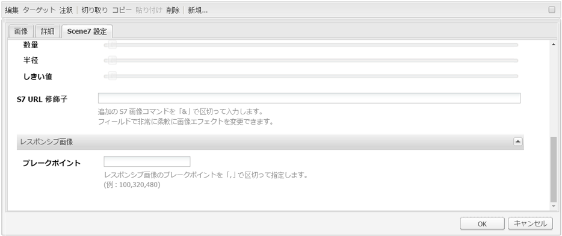

1. ビューアがレスポンシブにサイズ変更され、すべてのインタラクションがデスクトップ、タブレットおよびモバイル用に最適化されていることを確認します。

### すべてのDynamic Mediaクラシックコンポーネントに共通の設定{#settings-common-to-all-scene-components}

設定オプションは異なりますが、以下はすべてのDynamic Mediaクラシックコンポーネントに共通です。

* **[!UICONTROL ファイル参照]**- 参照するファイルを探します。ファイル参照にはアセットのURLが表示されます。このURLは、URLコマンドとパラメータを含む完全なDynamic MediaクラシックURLとは限りません。 このフィールドには、Dynamic MediaクラシックURLのコマンドとパラメータを追加できません。 それらは、コンポーネントの対応する機能を使用して追加する必要があります。
* **[!UICONTROL 幅]** - 幅を設定できます。
* **[!UICONTROL 高さ]** - 高さを設定できます。

これらの設定オプションは、例えば&#x200B;**[!UICONTROL ズーム]**&#x200B;コンポーネントを開いた場合など、Dynamic Mediaクラシックコンポーネントを重複クリックして設定します。

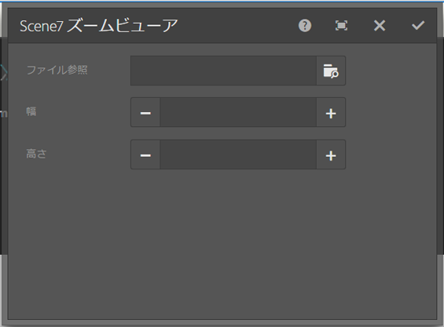

### ズーム {#zoom}

HTML5 ズームコンポーネントでは、+ ボタンをクリックすると画像のサイズが拡大されます。

アセットの下部にはズームツールが用意されています。拡大するには「**[!UICONTROL +]** 」、縮小するには「**[!UICONTROL -]**」をクリックします。**[!UICONTROL x]**&#x200B;またはズームリセット矢印をクリックすると、画像が読み込み元のサイズに戻ります。 全画面表示にするには、斜め矢印をクリックします。コンポーネントを設定するには、「**[!UICONTROL 編集]**」をクリックします。このコンポーネントを使用すると、すべてのDynamic Mediaクラシックコンポーネント](#settings-common-to-all-scene-components)に共通の[設定を構成できます。

### Flyout {#flyout}

HTML5 フライアウトコンポーネントでは、アセットが分割画面として表示されます。左側には、アセットが指定されたサイズで表示され、右側には、ズーム部分が表示されます。コンポーネントを設定するには、「**[!UICONTROL 編集]**」をクリックします。このコンポーネントを使用すると、すべてのDynamic Mediaクラシックコンポーネント](/help/sites-administering/scene7.md#settingscommontoalldynamicmediaclassiccomponents)に共通の[設定を構成できます。

>[!NOTE]
>
>フライアウトコンポーネントでカスタムサイズを使用する場合は、そのカスタムサイズが使用され、コンポーネントのレスポンシブ設定は無効になります。
>
>フライアウトコンポーネントで、[!UICONTROL デザイン]表示で設定されたデフォルトサイズを使用する場合は、デフォルトサイズが使用され、コンポーネントが伸張され、コンポーネントのレスポンシブな設定に合わせてページレイアウトサイズが調整されます。ただし、コンポーネントのレスポンシブセットアップには制限があることに注意してください。レスポンシブ設定でフライアウトコンポーネントを使用する場合は、フルページでの拡大縮小で使用しないでください。そうしないと、フライアウトがページの右の境界線を越える場合があります。

### 画像 {#image}

Dynamic Mediaクラシック画像コンポーネントを使用すると、Dynamic Mediaクラシック修飾子、画像またはビューアプリセット、シャープなどの画像にDynamic Mediaクラシック機能を追加できます。 Dynamic Mediaクラシックの画像コンポーネントは、特別なDynamic Mediaクラシック機能を持つAEMの他の画像コンポーネントと似ています。 この例では、画像にDynamic MediaクラシックURL修飾子`&op_invert=1`が適用されています。

**[!UICONTROL タイトル、代替テキスト]** - 「  詳細」タブで、画像にタイトルを追加し、グラフィックをオフにしているユーザー用の代替テキストを追加します。

**[!UICONTROL URL、開く場所]**  — リンクを開くアセットを設定できます。**[!UICONTROL URL]**&#x200B;と&#x200B;**[!UICONTROL Open in]**&#x200B;を設定して、同じウィンドウで開くか、新しいウィンドウで開くかを指定します。

**[!UICONTROL ビューアプリセット]**  — ドロップダウンメニューから既存のビューアプリセットを選択します。探しているビューアプリセットが表示されない場合は、表示できるように設定する必要があります。詳しくは、[ビューアプリセットの管理](/help/assets/managing-viewer-presets.md)を参照してください。画像プリセットを使用している場合は、ビューアプリセットを選択できません。逆の場合も同様です。

**[!UICONTROL Dynamic Mediaクラシック設定]** -Scene7パブリッシングシステムからアクティブな画像プリセットを取得する際に使用するDynamic Mediaクラシック設定を選択します。

**[!UICONTROL 画像プリセット]**  — ドロップダウンメニューから既存の画像プリセットを選択します。探している画像プリセットが表示されない場合は、表示できるように設定する必要があります。[画像プリセットの管理](/help/assets/managing-image-presets.md)を参照してください。画像プリセットを使用している場合は、ビューアプリセットを選択できません。逆の場合も同様です。

**[!UICONTROL 出力形式]**  — 画像の出力形式（jpegなど）を選択します。選択する出力形式によっては、追加の設定オプションが表示される場合があります。[画像プリセットの管理](/help/assets/managing-image-presets.md)を参照してください。

**[!UICONTROL シャープ]**  — 画像にシャープを適用する方法を選択します。シャープの適用について詳しくは、「[*AdobeDynamic Mediaクラシック画質とシャープのベストプラクティス*](/help/assets/assets/sharpening_images.pdf)」を参照してください。

**[!UICONTROL URL修飾子]**  — 追加のDynamic Mediaクラシック画像コマンドを指定して、画像効果を変更できます。これらについては、[画像プリセットの管理](/help/assets/managing-image-presets.md)および[コマンドリファレンス](https://docs.adobe.com/content/help/ja-JP/dynamic-media-developer-resources/image-serving-api/image-serving-api/http-protocol-reference/command-reference/c-command-reference.html)で説明します。

**[!UICONTROL ブレークポイント]** - Webサイトがレスポンシブである場合は、ブレークポイントを調整します。ブレークポイントはコンマ`,`で区切る必要があります。

### 画像テンプレート {#image-template}

[Dynamic Mediaクラシック画像](https://help.adobe.com/en_US/scene7/using/WS60B68844-9054-4099-BF69-3DC998A04D3C.html) テンプレートは、Dynamic Mediaクラシックに読み込まれたレイヤーPhotoshopコンテンツです。コンテンツとプロパティは可変性を考慮してパラメータ化されていました。**[!UICONTROL 画像テンプレート]**&#x200B;コンポーネントを使用すると、画像を読み込んで、テキストを AEM で動的に変更できます。また、ClientContext の値を使用するように&#x200B;**[!UICONTROL 画像テンプレート]**&#x200B;コンポーネントを設定できます。これにより、各ユーザーが個別に画像を活用できます。

コンポーネントを設定するには、「**[!UICONTROL 編集]**」をクリックします。[設定は、すべてのDynamic Mediaクラシックコンポーネント](/help/sites-administering/scene7.md#settingscommontoalldynamicmediaclassicscomponents)に共通の設定と、この節で説明する他の設定を構成できます。

**[!UICONTROL ファイル参照、幅、高さ]**  — すべてのDynamic Mediaクラシックコンポーネントに共通の設定を参照してください。

>[!NOTE]
>
>Dynamic MediaクラシックURLのコマンドとパラメーターをファイル参照URLに直接追加することはできません。 これらは、**[!UICONTROL パラメーター]**&#x200B;パネルのコンポーネントの UI でのみ定義できます。

**[!UICONTROL タイトル、代替]** テキスト [!UICONTROL 「] Dynamic Mediaクラシック画像テンプレート」タブで、画像にタイトルを追加し、グラフィックをオフにしているユーザー用の代替テキストを追加します。

**[!UICONTROL URL、開くアセ]** ットを設定して、リンクを開くことができます。「**[!UICONTROL URL]**」と「**[!UICONTROL 次のウィンドウで開く]**」で、同じウィンドウで開くか新しいウィンドウで開くかを指定します。

**[!UICONTROL パラメータ]** パネル画像を読み込むと、パラメータに画像の情報が事前に入力されます。動的に変更できるコンテンツがない場合、このウィンドウは空になります。

#### テキストの動的な変更 {#changing-text-dynamically}

テキストを動的に変更するには、新しいテキストをフィールドに入力して、「**[!UICONTROL OK]**」をクリックします。この例では、「**[!UICONTROL 価格]**」が $50 で、送料が 99 セントです。

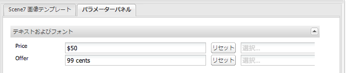

画像内のテキストが変更されます。フィールドの横にある「**[!UICONTROL リセット]**」をクリックすると、テキストを元の値に戻すことができます。

#### ClientContext の値を反映したテキストの変更 {#changing-text-to-reflect-the-value-of-a-client-context-value}

フィールドをクライアントコンテキスト値にリンクするには、「**[!UICONTROL 選択]**」をクリックしてクライアントコンテキストメニューを開き、クライアントコンテキストを選択して「**[!UICONTROL OK]**」をクリックします。この例では、名前が、プロファイル内の形式設定された名前と名前をリンクすることに基づいて変更されます。

現在ログインしているユーザーの名前がテキストに反映されます。フィールドの横にある「**[!UICONTROL リセット]**」をクリックすると、テキストを元の値に戻すことができます。

#### Dynamic Mediaクラシック画像テンプレートをリンクにする{#making-the-scene-image-template-a-link}

**Dynamic Mediaクラシック画像テンプレートをリンクにするには**:

1. Dynamic Mediaクラシック画像テンプレートコンポーネントを含むページで、「**[!UICONTROL 編集]**」をクリックします。
1. 「**[!UICONTROL URL]**」フィールドに、ユーザーが画像をクリックしたときに表示される URL を入力します。「**[!UICONTROL 次のウィンドウで開く]**」フィールドで、ターゲットを新しいウィンドウと同じウィンドウのどちらで開くかを選択します。

   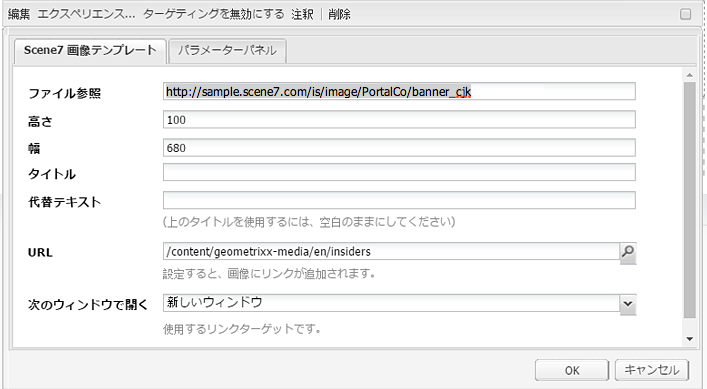

1. 「**[!UICONTROL OK]**」をクリックします。

### ビデオコンポーネント {#video-component}

Dynamic Mediaクラシック&#x200B;**[!UICONTROL ビデオ]**&#x200B;コンポーネント(サイドキックのDynamic Mediaクラシックセクションから利用可能)は、デバイスと帯域幅検出を使用して、各画面に適切なビデオを提供します。 このコンポーネントは HTML5 ビデオプレーヤー（チャネルを超えて使用可能な単一のビューア）です。

このコンポーネントはアダプティブビデオセット（単一の MP4 ビデオまたは単一の F4V ビデオ）で使用できます。

Dynamic Mediaクラシック統合でのビデオの動作について詳しくは、[ビデオ](/help/sites-classic-ui-authoring/manage-assets-classic-s7-video.md)を参照してください。 また、[**Dynamic Mediaクラシックビデオ**&#x200B;コンポーネントが基盤&#x200B;**ビデオ**&#x200B;コンポーネント](/help/sites-classic-ui-authoring/manage-assets-classic-s7-video.md)と比較される方法を参照してください。

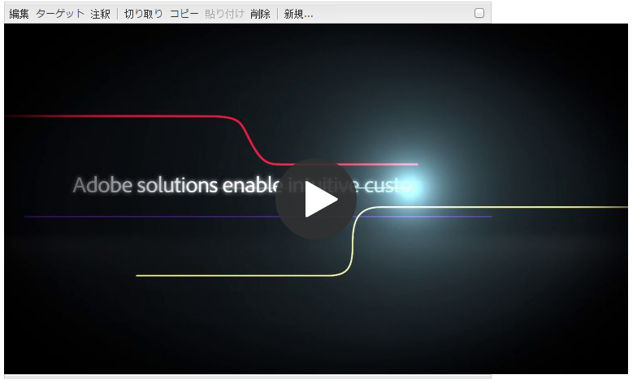

### ビデオコンポーネントに関する既知の制限事項 {#known-limitations-for-the-video-component}

マスタービデオがアップロードされると、Adobe DAM および WCM が表示されます。次に示すプロキシアセットは表示されません。

* Dynamic Mediaクラシックエンコードレンディション
* Dynamic Mediaクラシックアダプティブビデオセット

Dynamic Mediaクラシックビデオコンポーネントでアダプティブビデオセットを使用する場合は、ビデオのサイズに合わせてコンポーネントのサイズを変更する必要があります。

## Dynamic Mediaクラシックコンテンツブラウザ{#scene-content-browser}

Dynamic Mediaクラシックコンテンツブラウザを使用すると、Dynamic MediaクラシックのコンテンツをAEMで直接表示できます。 コンテンツブラウザーにアクセスするには、コンテンツファインダーで、タッチ操作向けユーザーインターフェイスの&#x200B;**[!UICONTROL Dynamic Mediaクラシック]**&#x200B;またはクラシックユーザーインターフェイスの&#x200B;**[!UICONTROL S7]**&#x200B;アイコンを選択します。 どちらの UI を使用しても機能は同じです。

設定が複数ある場合、AEM では既定で[デフォルト設定](/help/sites-administering/scene7.md#configuring-a-default-configuration)が表示されます。ドロップダウンメニューのDynamic Mediaクラシックコンテンツブラウザで、異なる設定を直接選択できます。

>[!NOTE]
>
>* アドホックフォルダーにあるアセットは、Dynamic Mediaクラシックコンテンツブラウザーには表示されません。
>* [セキュアプレビューを有効にする](/help/sites-administering/scene7.md#configuring-the-state-published-unpublished-of-assets-pushed-to-scene)と、Dynamic Mediaクラシックの公開アセットと非公開アセットの両方が、Dynamic Mediaクラシックのコンテンツブラウザーに表示されます。
>* コンテンツブラウザーで&#x200B;**[!UICONTROL Dynamic Mediaクラシック]**&#x200B;または&#x200B;**[!UICONTROL S7]**&#x200B;アイコンがオプションとして表示されない場合は、AEM](/help/sites-administering/scene7.md)で動作するように[Dynamic Mediaクラシックを設定する必要があります。

   >
   >
* ビデオの場合、Dynamic Mediaクラシックコンテンツブラウザは次の機能をサポートします。
   >
   >
* アダプティブビデオセット：複数の画面でシームレスに再生するために必要なすべてのビデオレンディションのコンテナ
>* 単一の MP4 ビデオ
>* 単一の F4V ビデオ

### クラシック UI でのコンテンツの参照 {#browsing-content-in-the-classic-ui}

「**[!UICONTROL S7]**」タブをクリックして、Dynamic Mediaクラシックのコンテンツを参照します。

アクセスしている設定は、設定を選択して変更できます。 フォルダーは、選択した設定に応じて変わります。

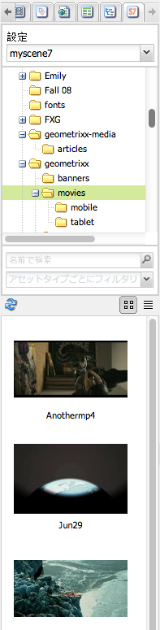

アセット用のコンテンツファインダーと同様に、アセットを検索して、結果にフィルターを適用できます。ただし、アセットファインダーとは異なり、「**[!UICONTROL S7]**」タブでキーワードを入力すると、そのキーワードが&#x200B;*含まれる*&#x200B;ファイル名ではなく、入力した文字列&#x200B;*で始まる*&#x200B;ファイル名が検索されます。

デフォルトでは、アセットはファイル名で表示されます。結果をアセットタイプでフィルタリングすることもできます。

>[!NOTE]
>
>ビデオの場合、WCMのDynamic Mediaクラシックコンテンツブラウザーは、次の機能をサポートしています。
>
>* アダプティブビデオセット：複数の画面でシームレスに再生するために必要なすべてのビデオレンディションのコンテナ
>* 単一の MP4 ビデオ
>* 単一の F4V ビデオ

>

### コンテンツブラウザー{#searching-for-scene-assets-with-the-content-browser}でのDynamic Mediaクラシックアセットの検索

Dynamic Mediaクラシックアセットの検索は、AEMアセットの検索と似ていますが、検索を行うと、実際にはAEMに直接読み込むのではなく、Dynamic Mediaクラシックシステムでアセットのリモート表示が表示されます。

クラシック UI またはタッチ操作向け UI を使用して、アセットを表示および検索できます。インターフェイスによって検索方法は多少異なります。

どちらの UI で検索する場合でも、次の基準でフィルターを適用できます（ここでは、タッチ操作向け UI を示しています）。

**[!UICONTROL キーワードの入力]**  — アセットを名前で検索できます。検索時には、入力したキーワードで始まるファイル名が検索されます。例えば、「swimming」という単語を入力すると、入力した順序どおりの文字列で始まるアセットファイルの名前が検索されます。アセットを検索するには、語句を入力した後に Enter キーを押してください。

**[!UICONTROL Folder/path]**  — 表示されるフォルダーの名前は、選択した設定に基づいています。下位にドリルダウンするには、フォルダーアイコンをクリックしてサブフォルダーを選択し、チェックマークをクリックして選択します。

キーワードを入力してフォルダーを選択すると、AEM ではそのフォルダーがとすべてのサブフォルダーが検索されます。ただし、検索時にキーワードを入力しない場合は、フォルダーを選択してもそのフォルダー内のアセットしか表示されず、サブフォルダーは含まれません。

デフォルトでは、AEM は、選択したフォルダーとすべてのサブフォルダーを検索します。

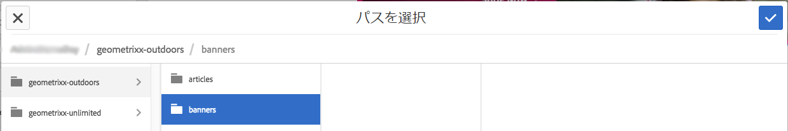

**[!UICONTROL AssetSelect]** Classicのタイプ：Dynamic Mediaクラシックコンテンツを参照します。このオプションは、既にDynamic Mediaクラシックを設定済みの場合にのみ使用できます。

**** 設定 [!UICONTROL Cloud Servicesで複数のDynamic Mediaクラシック設定が定義されている場合は]、ここで選択できます。そのため、選択した設定に基づいてフォルダーが変わります。

**[!UICONTROL アセット]** タイプDynamic Mediaクラシックブラウザでは、結果をフィルタして次のいずれかを含めることができます。画像、テンプレート、ビデオおよびアダプティブビデオセットを参照してください。アセットタイプを選択しない場合、AEM ではデフォルトですべてのアセットタイプが検索されます。

>[!NOTE]
>
>* ビデオを検索するときは、単一のレンディションが検索されています。結果は、元のレンディション（&amp;ast;.mp4のみ）とエンコードされたレンディションを返します。
>* アダプティブビデオセットを検索する場合、フォルダとすべてのサブフォルダが検索されますが、検索にキーワードを追加した場合のみ検索されます。 キーワードを追加しない場合、AEM はサブフォルダーを検索しません。

>

**[!UICONTROL 発行]** ステータス発行ステータスに基づいて、アセットをフィルタリングできます。  公開済みまたは [!UICONTROL 未公開]。「[!UICONTROL 公開ステータス]」を選択しない場合、AEMでは、デフォルトですべての公開ステータスが検索されます。

