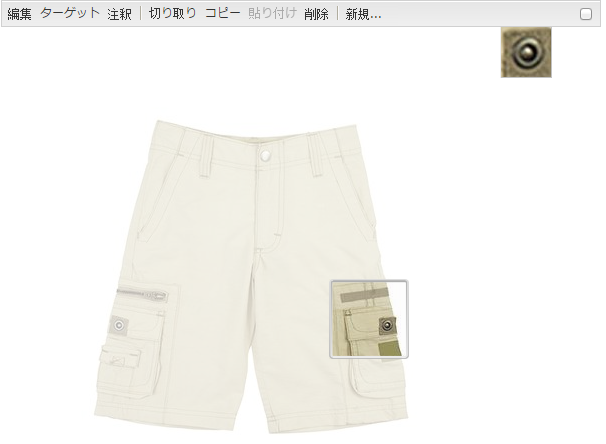

# ダイナミックMedia Classic機能のページへの追加{#adding-scene-features-to-your-page}

[Adobeダイナミックメディアクラシック](https://help.adobe.com/en_US/scene7/using/WS26AB0D9A-F51C-464e-88C8-580A5A82F810.html) は、リッチメディアアセットを管理、強化、公開、およびWeb、モバイル、電子メール、インターネットに接続されたディスプレイや印刷に配信するためのホストソリューションです。

Dynamic Media Classicで公開したAEMアセットは、様々なビューアに表示できます。

* ズーム
* フライアウト
* ビデオ
* 画像テンプレート
* 画像

デジタルアセットはAEMからDynamic Media Classicに直接公開でき、デジタルアセットはDynamic Media ClassicからAEMに公開できます。

この節では、デジタルアセットをAEMからDynamic Media Classicに公開する方法と、その逆の方法について説明します。 また、ビューアについても詳しく説明します。Dynamic Media Classic用のAEMの設定について詳しくは、『Dynamic Media ClassicとAEMの [統合』を参照してください](/help/sites-administering/scene7.md)。

[画像マップの追加](/help/assets/image-maps.md)も参照してください。

AEM でのビデオコンポーネントの使用について詳しくは、以下を参照してください。

* [ビデオ](/help/sites-classic-ui-authoring/manage-assets-classic-s7-video.md)

>[!NOTE]
>
>If Dynamic Media Classic assets do not display properly, make sure that Dynamic media is [disabled](/help/assets/config-dynamic.md#disabling-dynamic-media) and then refresh the page.

## アセットからDynamic Media Classicへの手動公開 {#manually-publishing-to-scene-from-assets}

デジタルアセットは、クラシックUIのアセットコンソールから、またはアセットから直接、Dynamic Media Classicに公開できます。

>[!NOTE]
>
>AEMは、Dynamic Media Classicに非同期で公開します。 After you click **[!UICONTROL Publish]**, it may take several seconds for your asset to publish to Dynamic Media Classic.

### アセットコンソールからの公開 {#publishing-from-the-assets-console}

アセットがダイナミックメディアクラシックターゲットフォルダー内にある場合に、アセットコンソールからダイナミックメディアクラシックに公開するには：

1. In the AEM classic UI, click **[!UICONTROL Digital Assets]** to access the digital asset manager.

1. Select the asset (or assets) or folder from within the target folder you want to publish to Dynamic Media Classic and right-click and select **[!UICONTROL Publish to Dynamic Media Classic]**. Alternatively, you can select **[!UICONTROL Publish to Dynamic Media Classic]** from the **[!UICONTROL Tools]** menu.

   

1. Dynamic Media Classicに移動し、アセットが使用可能であることを確認します。

   >[!NOTE]
   >
   >If the assets are not in a Dynamic Media Classic synchronized folder, **[!UICONTROL Publish to Dynamic Media Classic]** in both menus is visible but disabled.

### アセットからの公開 {#publishing-from-an-asset}

アセットが同期されたDynamic Media Classicフォルダー内にある限り、手動でアセットを公開できます。

>[!NOTE]
>
>アセットがDynamic Media Classicの同期フォルダーにない場合、「Dynamic Media Classicに **[!UICONTROL 公開]** 」へのリンクは使用できません。

**デジタルアセットからDynamic Media Classicに直接公開するには**:

1. AEM で、「**[!UICONTROL デジタルアセット]**」をクリックして、Digital Asset Manager にアクセスします。

1. アセットをダブルクリックして開きます。

1. アセットの詳細ペインで、「Dynamic Media Classicに **[!UICONTROL 公開]**」を選択します。

   

1. リンクが「 **[!UICONTROL 投稿中…」に変わり]** 、「 **[!UICONTROL 投稿済み]**」に変わります。 Dynamic Media Classicに移動し、アセットが使用可能であることを確認します。

   >[!NOTE]
   >
   >If the asset does not publish properly to Dynamic Media Classic, the link changes to **[!UICONTROL Publishing Failed]**. アセットが既にDynamic Media Classicに公開されている場合、リンクは「Dynamic Media Classicに **[!UICONTROL 再公開]**」と読み取られます。 再公開を使用すると、AEM内のアセットに変更を加えて再公開できます。

### Publishing assets from outside the CQ target folder {#publishing-assets-from-outside-the-cq-target-folder}

Adobeでは、Dynamic Media Classicターゲットー内のアセットからのみ、アセットをDynamic Media Classicに公開することをお勧めします。 However, if you need to upload assets from a folder outside of the target folder, you can still do that by uploading them to an *ad-hoc* folder on Dynamic Media Classic.

これを行うには、アセットを表示するページのクラウド設定を指定します。 次に、Dynamic Media Classicコンポーネントをページに追加し、コンポーネントにアセットをドラッグ&amp;ドロップします。 After the page properties are set for that page, a **[!UICONTROL Publish to Dynamic Media Classic]** link appears that when selected triggers uploading to Dynamic Media Classic.

>[!NOTE]
>
>アドホックフォルダーにあるアセットは、Dynamic Media Classicコンテンツブラウザーには表示されません。

**CQターゲットフォルダーの外部にあるアセットを発行するには**:

1. In AEM in the classic UI, click **[!UICONTROL Websites]** and navigate to the web page that you want to add a digital asset to that is not yet published to Dynamic Media Classic. （通常のページ継承ルールが適用されます）。

1. In the sidekick, click the **[!UICONTROL Page]** icon, then click **[!UICONTROL Page Properties]**.

1. **[!UICONTROL Cloud Services]/[!UICONTROL サービス]/[!UICONTROL Dynamic Media Classic(Scene7)をクリックします]**。
1. 「Adobeダイナミックメディアクラシック」ドロップダウンリストで、必要な設定を選択し、「 **[!UICONTROL OK]**」をクリックします。

   

1. Webページ上で、ページ上の目的の場所にダイナミックメディアクラシック(Scene7)コンポーネントを追加します。
1. コンテンツファインダーから、デジタルアセットをコンポーネントにドラッグします。 [ダイナミックメディアクラシックのパブリケーション状態の **[!UICONTROL 確認]**]へのリンクが表示されます。

   >[!NOTE]
   >
   >デジタルアセットがCQターゲットフォルダーにある場合、「ダイナミックメディアクラシックパブリケーションステータスを **[!UICONTROL 確認]** 」へのリンクは表示されません。 アセットは、コンポーネント内に配置されるだけです。

   

1. 「ダイナミックMedia Classicパブリケーションの状態を **[!UICONTROL 確認]**」をクリックします。 アセットが公開されていない場合は、AEMはアセットをDynamic Media Classicに公開します。 アップロードされたアセットは、アドホックフォルダーに配置されます。By default, the ad-hoc folder is located in the `name_of_the_company/CQ5_adhoc`. [必要に応じて、この場所を設定](#configuringtheadhocfolder)できます。

   >[!NOTE]
   >
   >アセットがDynamic Media Classicの同期フォルダー内になく、現在のページに関連付けられたDynamic Media Classicクラウド設定がない場合、アップロードは失敗します。

## Dynamic Media Classic(Scene7)コンポーネント {#scene-components}

AEMでは、次のDynamic Media Classicコンポーネントを使用できます。

* ズーム
* フライアウト（ズーム）
* 画像テンプレート
* 画像
* ビデオ

>[!NOTE]
>
>These components are not available by default and need to be selected in **[!UICONTROL Design]** mode before using.

After they are made available in **[!UICONTROL Design]** mode, you can add the components to your page like any other AEM component. まだDynamic Media Classicに公開されていないアセットは、同期フォルダー内、ページ上、またはDynamic Media Classicクラウド設定と共に公開される場合、Dynamic Media Classicに公開されます。

### Flash viewers end-of-life notice {#flash-viewers-end-of-life-notice}

2017年1月31日、AdobeダイナミックメディアクラシックはFlashビューアプラットフォームのサポートを正式に終了しました。

For more information about this important change, see [Flash viewer end-of-life FAQs](https://docs.adobe.com/content/docs/jp/aem/6-1/administer/integration/marketing-cloud/scene7/flash-eol.html).

### Adding a Dynamic Media Classic component to a page {#adding-a-scene-component-to-a-page}

Dynamic Media Classicコンポーネントをページに追加する操作は、コンポーネントをページに追加する操作と同じです。 Dynamic Media Classicコンポーネントについては、以下の各節で詳しく説明します。

**Dynamic Media Classicコンポーネント/ビューアをクラシックUIのページに追加するには**:

1. AEMで、Dynamic Media Classicコンポーネントを追加するページを開きます。

1. If no Dynamic Media Classic components are available, click the ruler in the sidekick to enter **[!UICONTROL Design]** mode, click **[!UICONTROL Edit]** parsys, and select all the **[!UICONTROL Dynamic Media Classic]** components to make them available.

1. Return to **[!UICONTROL Edit]** mode by clicking the pencil in the sidekick.

1. Drag a component from the **[!UICONTROL Dynamic Media Classic]** group in the sidekick onto the page in the desired location.

1. 「**[!UICONTROL 編集]**」をクリックしてコンポーネントを開きます。

1. コンポーネントの編集を必要に応じておこない、「**[!UICONTROL OK]**」をクリックして変更内容を保存します。

### レスポンシブ Web サイトへのインタラクティブな表示エクスペリエンスの追加 {#adding-interactive-viewing-experiences-to-a-responsive-website}

アセットのレスポンシブデザインとは、アセットが表示される場所に適応することを意味します。レスポンシブデザインでは、同じアセットが複数のデバイスに効果的に表示されます。

**インタラクティブな表示エクスペリエンスをレスポンシブサイトのクラシックUIに追加するには**:

1. Log in to AEM, and ensure that you have [configured Adobe Dynamic Media Classic Cloud Services](/help/sites-administering/scene7.md#configuring-scene-integration) and that Dynamic Media Classic components are available.

   >[!NOTE]
   >
   >Dynamic Media Classic WCMコンポーネントが使用できない場合は、**[!UICONTROL Design] モードを使用して有効にする必要があります。

1. In a website with the Dynamic Media Classic components enabled, drag an **[!UICONTROL Image]** viewer to the page.
1. Edit the component and adjust the breakpoints in the **[!UICONTROL Dynamic Media Classic Settings]** tab.

   

1. ビューアがレスポンシブにサイズ変更され、すべてのインタラクションがデスクトップ、タブレットおよびモバイル用に最適化されていることを確認します。

### すべてのDynamic Media Classicコンポーネントに共通の設定 {#settings-common-to-all-scene-components}

設定オプションは異なりますが、以下はすべてのDynamic Media Classicコンポーネントに共通です。

* **[!UICONTROL ファイル参照]**- 参照するファイルを探します。ファイル参照にはアセットのURLが表示されます。このURLは、URLコマンドとパラメーターを含む完全なDynamic Media Classic URLとは限りません。 このフィールドには、Dynamic Media Classic URLのコマンドおよびパラメーターを追加できません。 それらは、コンポーネントの対応する機能を使用して追加する必要があります。
* **[!UICONTROL 幅]** - 幅を設定できます。
* **[!UICONTROL 高さ]** - 高さを設定できます。

You set these configuration options by double-clicking a Dynamic Media Classic component, for example, when you open a **[!UICONTROL Zoom]** component:

### ズーム {#zoom}

HTML5 ズームコンポーネントでは、+ ボタンをクリックすると画像のサイズが拡大されます。

アセットの下部にはズームツールが用意されています。拡大するには「**[!UICONTROL +]** 」、縮小するには「**[!UICONTROL -]**」をクリックします。Clicking **[!UICONTROL x]** or the reset zoom arrow brings the image back to the original size it was imported as. 全画面表示にするには、斜め矢印をクリックします。コンポーネントを設定するには、「**[!UICONTROL 編集]**」をクリックします。With this component, you can configure [settings common to all Dynamic Media Classic components](#settings-common-to-all-scene-components).

### Flyout {#flyout}

HTML5 フライアウトコンポーネントでは、アセットが分割画面として表示されます。左側には、アセットが指定されたサイズで表示され、右側には、ズーム部分が表示されます。コンポーネントを設定するには、「**[!UICONTROL 編集]**」をクリックします。With this component, you can configure [settings common to all Dynamic Media Classic components](/help/sites-administering/scene7.md#settingscommontoalldynamicmediaclassiccomponents).

>[!NOTE]
>
>フライアウトコンポーネントでカスタムサイズを使用する場合は、そのカスタムサイズが使用され、コンポーネントのレスポンシブ設定は無効になります。
>
>If your Flyout component uses the default size, as set in the [!UICONTROL Design] view, then the default size is used and the component stretches to accomodate the page layout size with responsive setup of the component enabled. Be aware, however, that there is a limitation on responsive setup of the component. When the you use the Flyout component with responsive setup, you should not use it with full page stretch. Otherwise, the Flyout may extend beyond the page&#39;s right border.

### 画像 {#image}

ダイナミックメディアクラシック画像コンポーネントを使用すると、ダイナミックメディアクラシック修飾子、画像またはビューアプリセット、シャープなどのダイナミックメディアクラシック機能を画像に追加できます。 ダイナミックメディアクラシック画像コンポーネントは、AEMの特別なダイナミックメディアクラシック機能を持つ他の画像コンポーネントと似ています。 この例では、画像にダイナミックメディアクラシックURL修飾子が `&op_invert=1` 適用されています。

**[!UICONTROL タイトル、代替テキスト]** - 「  詳細」タブで、画像にタイトルを追加し、グラフィックをオフにしているユーザーの代替テキストを追加します。

**[!UICONTROL URL、開く場所]** — アセットを設定して、リンクを開くことができます。 Set the **[!UICONTROL URL]** and **[!UICONTROL Open in]** to indicate whether you want it to open in the same window or a new window.

**[!UICONTROL ビューアプリセット]** — ドロップダウンメニューから既存のビューアプリセットを選択します。 探しているビューアプリセットが表示されない場合は、表示できるように設定する必要があります。詳しくは、[ビューアプリセットの管理](/help/assets/managing-viewer-presets.md)を参照してください。画像プリセットを使用している場合は、ビューアプリセットを選択できません。逆の場合も同様です。

**[!UICONTROL ダイナミックメディアクラシック設定]** -Scene7パブリッシングシステムからアクティブな画像プリセットを取得する際に使用するダイナミックメディアクラシック設定を選択します。

**[!UICONTROL 画像プリセット]** — ドロップダウンメニューから既存の画像プリセットを選択します。 探している画像プリセットが表示されない場合は、表示できるように設定する必要があります。[画像プリセットの管理](/help/assets/managing-image-presets.md)を参照してください。画像プリセットを使用している場合は、ビューアプリセットを選択できません。逆の場合も同様です。

**[!UICONTROL 出力形式]** — 画像の出力形式（jpegなど）を選択します。 選択する出力形式によっては、追加の設定オプションが表示される場合があります。[画像プリセットの管理](/help/assets/managing-image-presets.md)を参照してください。

**[!UICONTROL シャープ]** — 画像にシャープを適用する方法を選択します。 シャープの適用について詳しくは、 [*Adobeダイナミックメディアクラシックの画質とシャープのベストプラクティス*](/help/assets/assets/s7_sharpening_images.pdf)。

**[!UICONTROL URL修飾子]** - Dynamic Media Classicの画像コマンドを追加入力して、画像効果を変更できます。 These are described in [Managing Image Presets](/help/assets/managing-image-presets.md) and the [Command reference](https://docs.adobe.com/content/help/ja-JP/dynamic-media-developer-resources/image-serving-api/image-serving-api/http-protocol-reference/command-reference/c-command-reference.translate.html).

**[!UICONTROL ブレークポイント]** - Webサイトがレスポンシブである場合は、ブレークポイントを調整する必要があります。 Breakpoints must be separated by commas `,`.

### 画像テンプレート {#image-template}

[Dynamic Media Classicの画像テンプレート](https://help.adobe.com/en_US/scene7/using/WS60B68844-9054-4099-BF69-3DC998A04D3C.html) は、Dynamic Media Classicに読み込まれたレイヤー化されたPhotoshopコンテンツです。コンテンツとプロパティは可変性を考慮してパラメータ化されていました。 **[!UICONTROL 画像テンプレート]**&#x200B;コンポーネントを使用すると、画像を読み込んで、テキストを AEM で動的に変更できます。また、ClientContext の値を使用するように&#x200B;**[!UICONTROL 画像テンプレート]**&#x200B;コンポーネントを設定できます。これにより、各ユーザーが個別に画像を活用できます。

コンポーネントを設定するには、「**[!UICONTROL 編集]**」をクリックします。You can configure [settings common to all Dynamic Media Classic components](/help/sites-administering/scene7.md#settingscommontoalldynamicmediaclassicscomponents) as well as other settings described in this section.

**[!UICONTROL ファイル参照、幅、高さ]** — すべてのDynamic Media Classicコンポーネントに共通の設定を参照してください。

>[!NOTE]
>
>Dynamic Media ClassicのURLコマンドとパラメーターは、ファイル参照URLに直接追加できません。 これらは、**[!UICONTROL パラメーター]**&#x200B;パネルのコンポーネントの UI でのみ定義できます。

**[!UICONTROL タイトル、代替テキスト]** 「 [!UICONTROL Dynamic Media Classic画像テンプレート] 」タブで、画像にタイトルを追加し、グラフィックをオフにしているユーザー用の代替テキストを追加します。

**[!UICONTROL URL、開く場所]** ：アセットの開く場所を設定し、リンクを開くことができます。 「**[!UICONTROL URL]**」と「**[!UICONTROL 次のウィンドウで開く]**」で、同じウィンドウで開くか新しいウィンドウで開くかを指定します。

**[!UICONTROL パラメータパネル]** ：画像を読み込むときに、パラメータに画像の情報が事前に入力されます。 動的に変更できるコンテンツがない場合、このウィンドウは空になります。

#### テキストの動的な変更 {#changing-text-dynamically}

テキストを動的に変更するには、新しいテキストをフィールドに入力して、「**[!UICONTROL OK]**」をクリックします。この例では、「**[!UICONTROL 価格]**」が $50 で、送料が 99 セントです。

画像内のテキストが変更されます。フィールドの横にある「**[!UICONTROL リセット]**」をクリックすると、テキストを元の値に戻すことができます。

#### ClientContext の値を反映したテキストの変更 {#changing-text-to-reflect-the-value-of-a-client-context-value}

To link a field to a client context value, click **[!UICONTROL Select]** to open the client-context menu, select the client context, and click **[!UICONTROL OK]**. In this example, the name changes based on linking the Name with the formatted name in the profile.

現在ログインしているユーザーの名前がテキストに反映されます。フィールドの横にある「**[!UICONTROL リセット]**」をクリックすると、テキストを元の値に戻すことができます。

#### ダイナミックメディアクラシック画像テンプレートをリンクにする {#making-the-scene-image-template-a-link}

**ダイナミックメディアクラシック画像テンプレートをリンクにするには**:

1. On the page with the Dynamic Media Classic image template component, click **[!UICONTROL Edit]**.
1. 「**[!UICONTROL URL]**」フィールドに、ユーザーが画像をクリックしたときに表示される URL を入力します。「**[!UICONTROL 次のウィンドウで開く]**」フィールドで、ターゲットを新しいウィンドウと同じウィンドウのどちらで開くかを選択します。

   

1. 「**[!UICONTROL OK]**」をクリックします。

### ビデオコンポーネント {#video-component}

The Dynamic Media Classic **[!UICONTROL Video]** component (available from the Dynamic Media Classic section of the sidekick) uses device and bandwidth detection to serve the right video to each screen. このコンポーネントは HTML5 ビデオプレーヤー（チャネルを超えて使用可能な単一のビューア）です。

このコンポーネントはアダプティブビデオセット（単一の MP4 ビデオまたは単一の F4V ビデオ）で使用できます。

See [Video](/help/sites-classic-ui-authoring/manage-assets-classic-s7-video.md) for more information on how videos work with Dynamic Media Classic integration. In addition, see how [the **Dynamic Media Classic video** component compares to the foundation **video** component](/help/sites-classic-ui-authoring/manage-assets-classic-s7-video.md).

### ビデオコンポーネントに関する既知の制限事項 {#known-limitations-for-the-video-component}

マスタービデオがアップロードされると、Adobe DAM および WCM が表示されます。次に示すプロキシアセットは表示されません。

* Dynamic Media Classicのエンコードされたレンディション
* ダイナミックMedia Classicアダプティブビデオセット

Dynamic Media Classicビデオコンポーネントでアダプティブビデオセットを使用する場合、ビデオのサイズに合わせてコンポーネントのサイズを変更する必要があります。

## Dynamic Media Classicコンテンツブラウザー {#scene-content-browser}

Dynamic Media Classicコンテンツブラウザーを使用すると、Dynamic Media ClassicのコンテンツをAEMで直接表示できます。 To access the content browser, in the Content Finder, select **[!UICONTROL Dynamic Media Classic]** in the touch-optimized user interface or the **[!UICONTROL S7]** icon in the classic user interface. どちらの UI を使用しても機能は同じです。

設定が複数ある場合、AEM では既定で[デフォルト設定](/help/sites-administering/scene7.md#configuring-a-default-configuration)が表示されます。ドロップダウンメニューのDynamic Media Classicコンテンツブラウザーで、異なる設定を直接選択できます。

>[!NOTE]
>
>* アドホックフォルダーにあるアセットは、Dynamic Media Classicコンテンツブラウザーには表示されません。
>* セ [キュアプレビューを有効にすると](/help/sites-administering/scene7.md#configuring-the-state-published-unpublished-of-assets-pushed-to-scene)、Dynamic Media Classicの公開済みアセットと未公開アセットの両方が、Dynamic Media Classicコンテンツブラウザーに表示されます。
>* If you do not see **[!UICONTROL Dynamic Media Classic]** or the **[!UICONTROL S7]** icon as an option in the content browser, you need to [configure Dynamic Media Classic to work with AEM](/help/sites-administering/scene7.md).

   >
   >
* ビデオの場合、Dynamic Media Classicコンテンツブラウザーは次の機能をサポートします。
   >
   >
* アダプティブビデオセット：複数の画面でシームレスに再生するために必要なすべてのビデオレンディションのコンテナ
>* 単一の MP4 ビデオ
>* 単一の F4V ビデオ

### クラシック UI でのコンテンツの参照 {#browsing-content-in-the-classic-ui}

Dynamic Media Classicで「 **[!UICONTROL S7]** 」タブをクリックして、コンテンツを参照します。

アクセスしている設定は、設定を選択して変更できます。 フォルダーは、選択した設定に応じて変わります。

アセット用のコンテンツファインダーと同様に、アセットを検索して、結果にフィルターを適用できます。ただし、アセットファインダーとは異なり、「**[!UICONTROL S7]**」タブでキーワードを入力すると、そのキーワードが&#x200B;*含まれる*&#x200B;ファイル名ではなく、入力した文字列&#x200B;*で始まる*&#x200B;ファイル名が検索されます。

デフォルトでは、アセットはファイル名で表示されます。結果をアセットタイプでフィルタリングすることもできます。

>[!NOTE]
>
>ビデオの場合、WCMのダイナミックメディアクラシックコンテンツブラウザーは、次の機能をサポートします。
>
>* アダプティブビデオセット：複数の画面でシームレスに再生するために必要なすべてのビデオレンディションのコンテナ
>* 単一の MP4 ビデオ
>* 単一の F4V ビデオ

>

### コンテンツブラウザーを使用したダイナミックメディアクラシックアセットの検索 {#searching-for-scene-assets-with-the-content-browser}

ダイナミックメディアクラシックアセットの検索は、AEMアセットの検索と似ていますが、検索時に、実際にはアセットをAEMに直接読み込むのではなく、リモート表示のアセットが表示される点が異なります。

クラシック UI またはタッチ操作向け UI を使用して、アセットを表示および検索できます。インターフェイスによって検索方法は多少異なります。

どちらの UI で検索する場合でも、次の基準でフィルターを適用できます（ここでは、タッチ操作向け UI を示しています）。

**[!UICONTROL キーワードの入力]** — アセットを名前で検索できます。 検索時には、入力したキーワードで始まるファイル名が検索されます。例えば、「swimming」という単語を入力すると、入力した順序どおりの文字列で始まるアセットファイルの名前が検索されます。アセットを検索するには、語句を入力した後に Enter キーを押してください。

**[!UICONTROL Folder/path]** — 表示されるフォルダーの名前は、選択した設定に基づいています。 下位にドリルダウンするには、フォルダーアイコンをクリックしてサブフォルダーを選択し、チェックマークをクリックして選択します。

キーワードを入力してフォルダーを選択すると、AEM ではそのフォルダーがとすべてのサブフォルダーが検索されます。ただし、検索時にキーワードを入力しない場合は、フォルダーを選択してもそのフォルダー内のアセットしか表示されず、サブフォルダーは含まれません。

デフォルトでは、AEM は、選択したフォルダーとすべてのサブフォルダーを検索します。

**[!UICONTROL アセットのタイプ]** 「ダイナミックメディアクラシック」を選択して、ダイナミックメディアクラシックコンテンツを参照します。 このオプションは、既にDynamic Media Classicを設定済みの場合にのみ使用できます。

**[!UICONTROL 設定]** : [!UICONTROL Cloud Servicesで複数のDynamic Media Classic設定が定義されている場合は]、ここで選択できます。 そのため、選択した設定に基づいてフォルダーが変わります。

**[!UICONTROL アセットタイプ]** ：ダイナミックメディアクラシックブラウザでは、結果をフィルタリングして次のいずれかを含めることができます。画像、テンプレート、ビデオおよびアダプティブビデオセットを参照してください。 アセットタイプを選択しない場合、AEM ではデフォルトですべてのアセットタイプが検索されます。

>[!NOTE]
>
>* ビデオを検索するときは、単一のレンディションが検索されています。結果は、元のレンディション（&amp;ast;.mp4のみ）とエンコードされたレンディションを返します。
>* アダプティブビデオセットを検索する場合、フォルダとすべてのサブフォルダが検索されますが、検索にキーワードを追加した場合のみ検索されます。 キーワードを追加しない場合、AEM はサブフォルダーを検索しません。

>

**[!UICONTROL 公開ステータス]** ：公開ステータスに基づいてアセットをフィルタリングできます。 [!UICONTROL 公開済み] / [!UICONTROL 未公開]。 If you do not select any [!UICONTROL Publish status], AEM by default searches all publish statuses.

