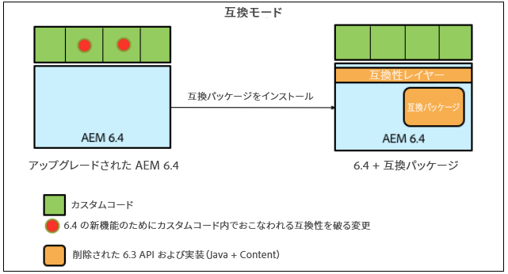
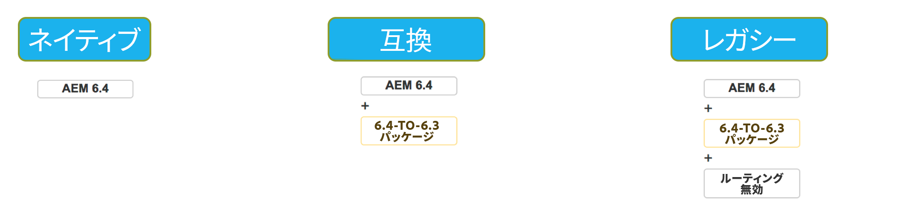

# AEM 6.4 における後方互換性{#backward-compatibility-in-aem}

>[!CAUTION]
>
>AEM 6.4 の拡張サポートは終了し、このドキュメントは更新されなくなりました。 詳細は、 [技術サポート期間](https://helpx.adobe.com/jp/support/programs/eol-matrix.html). サポートされているバージョンを見つける [ここ](https://experienceleague.adobe.com/docs/?lang=ja).

## 概要 {#overview}

>[!NOTE]
>
>互換性パッケージの範囲に属さないコンテンツおよび設定の変更のリストについては、 [AEM 6.4 におけるリポジトリの再構築](/help/sites-deploying/repository-restructuring.md).

AEM 6.4 では、すべての機能が後方互換性を念頭に置いて開発されています。

ほとんどの場合、AEM 6.3 を実行しているお客様は、アップグレードの際にコードやカスタマイズの修正をおこなう必要はありません。AEM 6.1 および 6.2 のお客様の場合、6.3 へのアップグレード時に直面する以上の重大な変更はありません。

機能の後方互換性を維持できない例外については、6.3 用の互換性パッケージをインストールすることで、バンドルとコンテンツの後方互換性を実現できます（ダウンロード先の詳細は、以下の設定方法を参照してください）。 この互換性パッケージは、AEM 6.3 に準拠しているアプリケーションの互換性を復元します。

互換性パッケージを使用すると、AEMを互換モードで実行し、新しいAEM機能に対するカスタム開発を延期できます。

>[!NOTE]
>
>互換性パッケージは、AEM 6.4 との互換性を維持するために必要な開発を遅らせるための一時的なソリューションに過ぎません。アップグレード後すぐに開発を通じて互換性の問題に対処できない場合にのみ、最後のオプションとして推奨されます。 6.4 ベースのカスタム開発を続行し、6.4 の全機能を利用できるようになったら、ネイティブモードに切り替えて、互換性パッケージをアンインストールすることを強くお勧めします。

互換性パッケージには次の 2 つのモードがあります。 **ルーティング有効** および **ルーティング無効**.

これにより、AEM 6.4 を次の 3 つのモードで実行できます。

**ネイティブモード：**

ネイティブモードは、AEM 6.4 のすべての新機能を使用し、すべての新機能でカスタマイズ機能を動作させるために開発を行う準備が整っているお客様向けです。

つまり、アップグレード後すぐにアプリケーションで調整を行う必要が生じる場合があります。

**互換性モード：ルーティングが有効な互換性パッケージがインストールされました**

互換性モードは、後方互換性を維持できないインターフェイスのカスタマイズを持つお客様向けです。 これにより、AEMを互換性モードで実行し、一部のカスタムコードと互換性のない新しいAEM機能に対して必要なカスタム開発を遅らせることができます。

**レガシーモード：ルーティングが無効な互換性パッケージがインストールされました**

レガシーモードは、互換性パッケージから移動された、AEMのレガシーまたは廃止されたコードに基づくカスタムインターフェイスを持つお客様向けです。

## 設定方法 {#how-to-set-up}

AEM 6.3 互換性パッケージは、パッケージマネージャーを使用してパッケージとしてインストールできます。 次をダウンロード： [ソフトウェア配布からのAEM 6.3 互換性パッケージ](https://experience.adobe.com/#/downloads/content/software-distribution/en/aem.html?package=/content/software-distribution/en/details.html/content/dam/aem/public/adobe/packages/cq640/compatpack/aem-compat-cq64-to-cq63) サイト。

互換パッケージがインストールされると、次に示すように、OSGI 設定のスイッチを使用して、ルーティングを有効または無効にできます。

互換パッケージがインストールされて設定されると、各機能は選択された互換モードに基づいて使用されるようになります。
