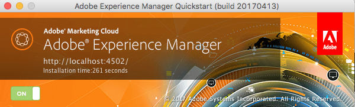

# コマンドラインによる起動と停止{#command-line-start-and-stop}

>[!CAUTION]
>
>AEM 6.4 の拡張サポートは終了し、このドキュメントは更新されなくなりました。 詳細は、 [技術サポート期間](https://helpx.adobe.com/jp/support/programs/eol-matrix.html). サポートされているバージョンを見つける [ここ](https://experienceleague.adobe.com/docs/?lang=ja).

## コマンドラインからのAdobe Experience Managerの起動 {#starting-adobe-experience-manager-from-the-command-line}

`start` スクリプトは、*&lt;cq-installation>/bin* ディレクトリの下で使用できます。Unix 版と Windows 版の両方が用意されています。スクリプトは、*&lt;cq-installation>* ディレクトリにインストールされているインスタンスを開始します。

これら 2 つのバージョンは、AEM インスタンスの開始や調整に使用できる、以下の環境変数をサポートしています。

<table> 
 <tbody> 
  <tr> 
   <td><strong>環境変数 </strong></td> 
   <td><strong>説明 </strong></td> 
  </tr> 
  <tr> 
   <td>CQ_PORT</td> 
   <td>停止スクリプトとステータススクリプトに使用する TCP ポート<br /> </td> 
  </tr> 
  <tr> 
   <td>CQ_HOST</td> 
   <td>ホスト名<br /> </td> 
  </tr> 
  <tr> 
   <td>CQ_INTERFACE</td> 
   <td>このサーバーがリッスンするインターフェイス<br /> </td> 
  </tr> 
  <tr> 
   <td>CQ_RUNMODE</td> 
   <td>実行モードをコンマで区切って指定します。<br /> </td> 
  </tr> 
  <tr> 
   <td>CQ_JARFILE</td> 
   <td>jarfile の名前<br /> </td> 
  </tr> 
  <tr> 
   <td>CQ_USE_JAAS</td> 
   <td>JAAS の使用（true の場合）<br /> </td> 
  </tr> 
  <tr> 
   <td>CQ_JAAS_CONFIG</td> 
   <td>JAAS 設定のパス<br /> </td> 
  </tr> 
  <tr> 
   <td>CQ_JVM_OPTS</td> 
   <td>デフォルトの JVM オプション<br /> </td> 
  </tr> 
 </tbody> 
</table>

>[!CAUTION]
>
>一部の実行モード（オーサーとパブリッシュの中でも）は、AEMを起動する前に設定する必要があり、その後変更することはできません。 実稼動環境で使用するAEMインスタンスを設定する前に、 [実行モードに関するドキュメント](/help/sites-deploying/configure-runmodes.md) 」を参照してください。

### Windows プラットフォームの start.bat スクリプトの例 {#windows-platform-start-bat-script-example}

```shell
SET CQ_PORT=1234 & ./start.bat
```

### UNIX プラットフォーム開始スクリプトの例 {#unix-platform-start-script-example}

```shell
CQ_PORT=1234 ./start
```

>[!NOTE]
>
>start スクリプトは、*&lt;cq-installation>/app* フォルダーの下にインストールされている AEM Quickstart を起動します。

## Adobe Experience Managerの停止 {#stopping-adobe-experience-manager}

AEMを停止するには、次のいずれかの操作を行います。

* 使用しているプラットフォームに応じて、次の操作をおこないます。

   * スクリプトまたはコマンドラインから AEM を起動した場合は、**Ctrl+C**&#x200B;キーを押してサーバーをシャットダウンします。
   * UNIX で start スクリプトを使用した場合は、stop スクリプトを使用してAEMを停止する必要があります。

* jar ファイルをダブルクリックしてAEMを起動した場合は、 **オン** ボタン ( ボタンが **オフ**) をクリックして、サーバーをシャットダウンします。

   

## コマンドラインからの Adobe Experience Manager の停止 {#stopping-adobe-experience-manager-from-the-command-line}

`stop` スクリプトは、*&lt;cq-installation>/bin* ディレクトリの下で使用できます。Unix 版と Windows 版の両方が用意されています。スクリプトは、*&lt;cq-installation>* ディレクトリにインストールされている実行中のインスタンスを停止します。

### UNIX プラットフォームの停止スクリプトの例 {#unix-platform-stop-script-example}

```shell
./stop
```

### Windows プラットフォームの stop.bat スクリプトの例 {#windows-platform-stop-bat-script-example}

```shell
./stop.bat
```

リポジトリを（場所を変更せずに）事前設定する場合は、次の操作のみが必要です。

* `repository.xml` を目的の場所に抽出する

* 必要に応じて `repository.xml` を更新する

* `bootstrap.properties` を作成し `repository.config` を定義する

これも、実際のインストールを開始する前におこないます。
