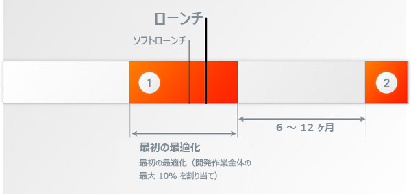
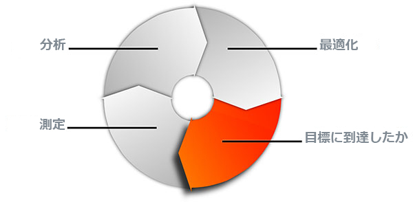
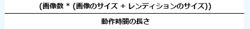
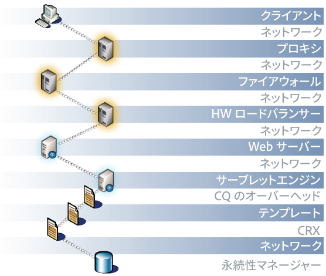
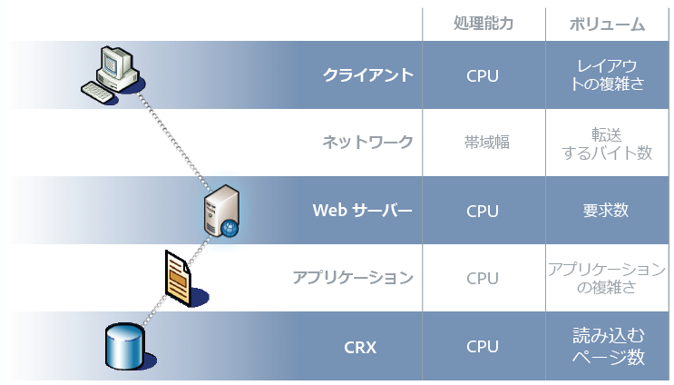
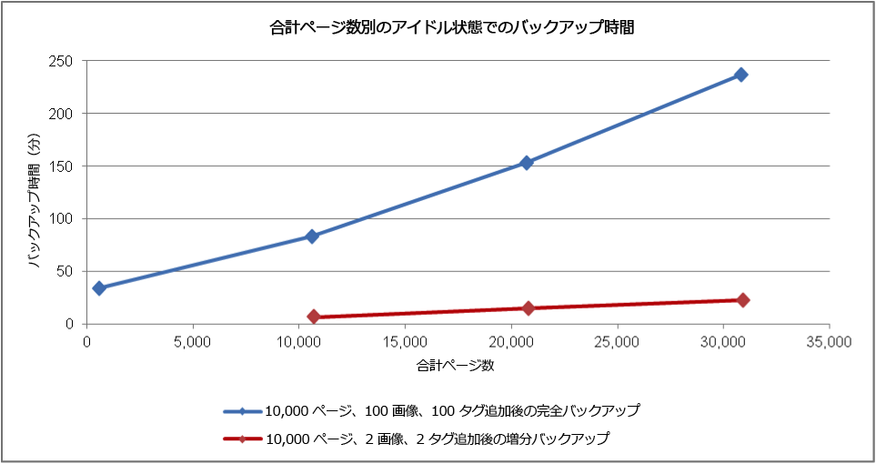
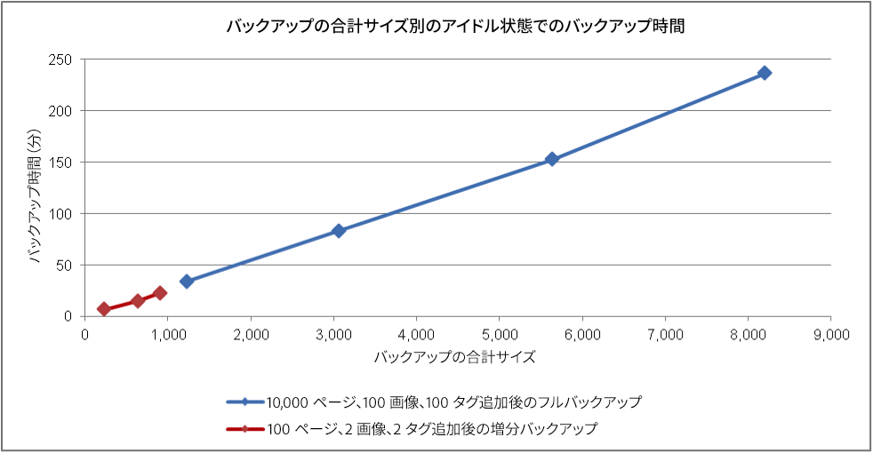
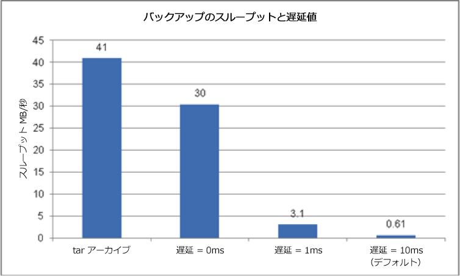

# パフォーマンスの最適化 {#performance-optimization}

>[!NOTE]
>
>パフォーマンスに関する一般的なガイドラインについては、 [パフォーマンスガイドライン](/help/sites-deploying/performance-guidelines.md) ページ。
>
>パフォーマンスの問題のトラブルシューティングと修正について詳しくは、 [パフォーマンスツリー](/help/sites-deploying/performance-tree.md).
>
>さらに、[パフォーマンスチューニングのヒント](https://helpx.adobe.com/experience-manager/kb/performance-tuning-tips.html)に関するナレッジベースの記事を参照することもできます。

主な問題は、Web サイトが訪問者のリクエストに応えるのに要する時間です。 この値はリクエストごとに異なりますが、平均ターゲット値を定義できます。 この値が達成可能で維持可能であることが判明したら、Web サイトのパフォーマンスを監視し、潜在的な問題の発生を示すために使用できます。

対象となるオーディエンスの様々な特性を反映し、オーサー環境とパブリッシュ環境で、対象となる応答時間が異なります。

## オーサー環境 {#author-environment}

この環境は、作成者がコンテンツの入力や更新をおこなう際に使用します。 コンテンツページとそれらのページの個々の要素を更新する際に、パフォーマンスを集中的に消費するリクエストの数が多いユーザーが少数いる場合は、この処理に注意する必要があります。

## パブリッシュ環境 {#publish-environment}

この環境には、ユーザー向けに提供するコンテンツが置かれます。したがって要求数は非常に多く、速度が非常に重要となります。ただし、それらの要求の性質はさほど動的な内容ではないので、コンテンツのキャッシュや負荷分散などの付加的なパフォーマンス強化メカニズムを適用できます。

>[!NOTE]
>
>* パフォーマンス最適化のための設定が完了したら、[Tough Day](/help/sites-developing/tough-day.md) の手順に従って、高負荷の環境をテストしてください。
>* [パフォーマンスチューニングのヒント](https://helpx.adobe.com/experience-manager/kb/performance-tuning-tips.html)も参照してください。


## パフォーマンスの最適化方法 {#performance-optimization-methodology}

AEM プロジェクトのパフォーマンスを最適化する方法は、5 つの非常に単純なルールに要約されます。それらのルールを守れば、パフォーマンスの問題が発生するのを最初から防ぐことができます。

1. [最適化の計画](#planning-for-optimization)
1. [実際の状況に近いシミュレーション](#simulate-reality)
1. [適切な目標設定](#establish-solid-goals)
1. [妥当性の維持](#stay-relevant)
1. [アジャイルな反復サイクル](#agile-iteration-cycles)

各ルールの内容は一般的な web プロジェクトすべてに当てはまる部分が多く、プロジェクトマネージャーやシステム管理者にとっては、プロジェクトの稼動開始時にパフォーマンスの問題に悩まされないようにするために有効です。

### 最適化の計画 {#planning-for-optimization}



プロジェクトの作業の約 10%は、パフォーマンス最適化フェーズで計画する必要があります。 もちろん、実際のパフォーマンス最適化要件は、プロジェクトの複雑さのレベルと開発チームの経験に応じて異なります。 プロジェクトで割り当てられた時間の一部が（最終的に）必要とされない場合がありますが、推奨地域では常にパフォーマンスの最適化を計画することをお勧めします。

プロジェクトの稼動開始当初は、可能な限り、少ないユーザーを対象として緩やかに運用を開始するのが望ましいと考えられます。そうすれば、全面的なサービス公開による過大なプレッシャーにさらされることなく、本番の経験を蓄積して最適化をいっそう進めることができるからです。

「ライブ」になった後は、パフォーマンスの最適化は終了しません。 これは、システムで「実際」の負荷が発生した時点です。 起動後に追加の調整を計画することが重要です。

システムの負荷が変わり、システムのパフォーマンスプロファイルが時間の経過と共に変化するので、パフォーマンスの「調整」または「ヘルスチェック」は 6 ～ 12 ヶ月間隔でスケジュールする必要があります。

### 実際の状況に近いシミュレーション {#simulate-reality}


Web サイトの運用を開始した後で、パフォーマンスの問題が発生することが判明した場合、理由は 1 つしかありません。それは、負荷とパフォーマンスのテストで実際の状況に十分近いシミュレーションができていなかったということです。

実際の状況に近いシミュレーションを行うのは難しいことであり、「実際」の追求にどこまで手間をかけるかは、プロジェクトの性質に応じて無理のない範囲で判断する必要があります。「実際」とは、「実際のコード」や「実際のトラフィック」に限りません。「実際のコンテンツ」、特にコンテンツのサイズや構造が実際的であることも重要です。リポジトリのサイズや構造が変われば、テンプレートの挙動はまったく違ってくる可能性があるということを常に意識してください。

### 適切な目標設定 {#establish-solid-goals}


適切なパフォーマンス目標を設定することの重要性を軽視してはいけません。何らかのパフォーマンス目標に基づく活動を一旦開始すると、たとえその目標に確かな根拠がないとしても、後で軌道修正することは非常に困難です。

優れた、確実なパフォーマンス目標を確立することは、実際に最も難しい領域の 1 つです。 多くの場合、同等の Web サイト（新しい Web サイトの前に使用した Web サイトなど）から実際のログとベンチマークを収集するのが最適です。

### 妥当性の維持 {#stay-relevant}


ボトルネックは一度に 1 つずつ最適化することが重要です。 1 つの最適化の影響を検証せずに並行して作業を行おうとすると、実際に役立った最適化測定の追跡が失われます。

### アジャイルな反復サイクル {#agile-iteration-cycles}



パフォーマンスのチューニングは、目標を達成するまで測定、分析、最適化および検証のサイクルを続ける反復的なプロセスです。この性質を考えると、サイクルを 1 周するごとに後で大がかりなテストプロセスを実施するよりも、最適化フェーズ内でアジャイルな検証プロセスを実施するほうがよいと考えられます。

これは、主に、最適化を実装する開発者が、最適化が既に目標に達しているかどうかをすばやく判断する方法を持つ必要があることを意味します。 目標を達成すると最適化が終了するので、これは重要な情報です。

## 基本的なパフォーマンスのガイドライン {#basic-performance-guidelines}

大まかな目安として、キャッシュされていない HTML 要求の応答時間は 100 ms 未満に抑えます。より具体的には次のようなガイドラインに従うとよいでしょう。

* ページへの要求の 70%は、100 ミリ秒未満で応答する必要があります。
* ページ要求件数の 25 ％に対して 100 ～ 300 ms の範囲で応答する。
* ページ要求件数の 4 ％に対して 300 ～ 500 ms の範囲で応答する。
* ページ要求件数の 1 ％に対して 500 ～ 1000 ms の範囲で応答する。
* どのページも 1 秒よりも遅く応答しません。

上記の数値は、次の条件を前提としています。

* パブリッシュ環境で測定（オーサー環境に関連するオーバーヘッドがない）
* サーバー上で測定される（ネットワークオーバーヘッドを考慮しない）
* キャッシュなし（ AEM Output キャッシュや Dispatcher キャッシュを考慮しない）
* 多数の依存ファイル（HTML、JS、PDF など）を伴う複雑な要求のみ
* 他のシステム負荷なし

パフォーマンスの問題に頻繁に影響する問題はいくつかあります。 主に次の点に焦点を当てます。

* Dispatcher キャッシュの非効率性
* 通常の表示テンプレート内で使用されるクエリ

JVM および OS レベルの調整は、通常、パフォーマンスが大幅に向上するわけではないので、最適化サイクルの最後に実行する必要があります。

コンテンツリポジトリの構造は、パフォーマンスにも影響を与える可能性があります。 最高のパフォーマンスを得るには、コンテンツリポジトリ内の個々のノードにアタッチされている子ノードの数を原則として 1,000 個を超えないようにする必要があります。

通常のパフォーマンス最適化の練習での最高の友達は次のとおりです。

* の `request.log`
* コンポーネントベースのタイミング
* 最後の、少なくとも java プロファイラー。

### デジタルアセットの読み込みと編集時のパフォーマンス {#performance-when-loading-and-editing-digital-assets}

デジタルアセットの読み込みと編集に大量のデータが関与するので、パフォーマンスが問題になる場合があります。

パフォーマンスには次の 2 つの影響があります。

* CPU - 複数のコアがあると、トランスコーディングの際に処理がスムーズに行われます。
* ハードディスク：パラレル RAID ディスクで同じ結果を実現

パフォーマンスを向上させるには、次の点を考慮してください。

* 1 日にアップロードするアセットの数。次の式を基に概算できます。


* 編集が行われる時間枠（通常は営業日の長さ。海外との業務がある場合はより多くの時間が必要）。
* アップロードする画像の MB 単位の平均サイズ（および 1 つの画像につき生成されるレンディションのサイズ）。
* 平均データレートは次の式で算出されます。



* すべての編集の 80%は 20%の時間でおこなわれるので、ピーク時には、平均データレートの 4 倍になります。 これがあなたのパフォーマンス目標です。

## パフォーマンスの監視 {#performance-monitoring}

パフォーマンス（またはその欠如）は、ユーザーが最初に気付くものの 1 つです。ユーザーインターフェイスを持つ任意のアプリケーションと同様に、パフォーマンスが重要です。 AEM インストールのパフォーマンスを最適化するには、インスタンスの様々な属性とインスタンスの動作を監視する必要があります。

パフォーマンスの監視を実行する方法について詳しくは、[パフォーマンスの監視](/help/sites-deploying/monitoring-and-maintaining.md#monitoring-performance)を参照してください。

パフォーマンスの問題を引き起こす問題は、その影響が見やすい場合でも、追跡が難しい場合が多くあります。

基本的な出発点は、システムが正常に動作している場合に、システムに関する十分な知識です。 環境が適切に動作しているときに「見える」と「動作する」を知らない限り、パフォーマンスが低下したときに問題を特定するのは難しい場合があります。 つまり、システムがスムーズに動作している場合は、時間を割いてシステムの調査を行い、パフォーマンス情報の収集が継続的なタスクであることを確認する必要があります。 これにより、パフォーマンスが低下した場合の比較の基礎が得られます。

次の図は、AEM コンテンツの要求のパスおよびパフォーマンスに影響を及ぼす可能性のある様々な要素を示しています。



パフォーマンスは、ボリュームと処理能力のバランスでもあります。

**音量** システムが処理および配信する出力の量。

**処理能力** ボリュームを配信するシステムの能力。

これを web チェーン全体の様々な場所で示すことができます。



パフォーマンスに影響を与える原因となる機能領域がいくつかあります。

* キャッシュ
* アプリケーション（プロジェクト）コード
* 検索機能

### 業績に関する基本ルール {#basic-rules-regarding-performance}

パフォーマンスを最適化する際は、次の特定のルールに留意してください。

* パフォーマンスのチューニングを各プロジェクトでおこなう&#x200B;*。*
* 開発サイクルの早い段階で最適化しないでください。
* パフォーマンスは最も弱いリンクと同じくらい良い。
* 容量とボリュームを常に考えてください。
* 最初に重要な事項を最適化します。
* 必ず現実的な目標を設定してから最適化を実施する&#x200B;*。*

>[!NOTE]
>
>パフォーマンスの測定に使用するメカニズムは、多くの場合、測定しようとしているものに正確に影響することに注意してください。 あなたは常に、これらの相違を考慮し、その影響をできる限り排除しておくべきです。特定のブラウザープラグインは、可能な限りアクティベートを解除する必要があります。

## パフォーマンスの設定 {#configuring-for-performance}

パフォーマンスを最適化するために AEM（および基盤となるリポジトリ）の特定の要素を設定できます。設定可能な要素と推奨事項を次に示します。変更を行う前に、記載されている機能を使用するかどうか、またはどのように使用するかを確認しておく必要があります。

>[!NOTE]
>
>詳しくは、[ナレッジベースの記事](https://helpx.adobe.com/experience-manager/kb/performance-tuning-tips.html)を参照してください。

### 検索インデックスの作成 {#search-indexing}

AEM 6.0 以降、Adobe Experience Managerは Oak ベースのリポジトリアーキテクチャを使用します。

更新されたインデックス作成情報は、次の場所で確認できます。

* [クエリとインデックスに関するベストプラクティス](/help/sites-deploying/best-practices-for-queries-and-indexing.md)
* [クエリとインデックス作成](/help/sites-deploying/queries-and-indexing.md)

### ワークフローの同時処理 {#concurrent-workflow-processing}

パフォーマンスを向上させるために、同時に実行するワークフロープロセスの数を制限します。 デフォルトでは、ワークフローエンジンは、Java VM で使用可能なプロセッサと同数のワークフローを並行して処理します。 ワークフローのステップで大量の処理リソース（RAM または CPU）が必要な場合は、それらのワークフローの一部を並行して実行する際に、使用可能なサーバーリソースに大きな負担をかけることになります。

例えば、画像（または一般的な DAM アセット）がアップロードされると、ワークフローは画像を DAM に自動的に読み込みます。 多くの場合、画像は高解像度で、処理に数百 MB のヒープを簡単に消費できます。 これらのイメージを並行して処理すると、メモリサブシステムとガベージコレクタに高い負荷がかかります。

ワークフローエンジンでは、Apache Sling のジョブキューを使用して、作業項目の処理の対応およびスケジュール設定を行います。デフォルトでは、ワークフロージョブの処理用に、Apache Sling Job Queue Configuration サービスファクトリから次のジョブキューサービスが作成されています。

* Granite Workflow Queue：ワークフローのほとんどのステップ（DAM アセットを処理するステップなど）では、Granite Granite Workflow Queue サービスを使用します。
* Granite Workflow External Process Job Queue：このサービスは、通常は外部システムへのアクセスや結果のポーリングに使用される、特殊な外部ワークフローのステップに使用します。例えば、InDesign のメディア抽出プロセスステップは外部プロセスとして実装されます。ワークフローエンジンでは、ポーリングの処理に外部キューを使用します。（[com.day.cq.workflow.exec.WorkflowExternalProcess](https://helpx.adobe.com/jp/experience-manager/6-4/sites/developing/using/reference-materials/javadoc/com/day/cq/workflow/exec/WorkflowExternalProcess.html) を参照してください）。

これらのサービスを設定して、同時に実行するワークフロープロセスの最大数を制限します。

**注意：** これらのジョブキューの設定は、特定のワークフローモデルのジョブキューを作成していない限り、すべてのワークフローに影響を与えます ( [特定のワークフローモデルのキューの設定](/help/sites-deploying/configuring-performance.md#configure-the-queue-for-a-specific-workflow) を参照 )。

#### リポジトリでの設定 {#configuration-in-the-repo}

[sling:OsgiConfig ノードを使用](/help/sites-deploying/configuring-osgi.md#adding-a-new-configuration-to-the-repository)してサービスを設定する場合は、既存のサービスの PID（例：org.apache.sling.event.jobs.QueueConfiguration.370aad73-d01b-4a0b-abe4-20198d85f705）を特定する必要があります。Web コンソールを使用すると、PID を検出できます。

`queue.maxparallel` という名前のプロパティを設定する必要があります。

#### Web コンソールでの設定 {#configuration-in-the-web-console}

[Web コンソールを使用](/help/sites-deploying/configuring-osgi.md#osgi-configuration-with-the-web-console)してこれらのサービスを設定するには、Apache Sling Job Queue Configuration サービスファクトリで既存の設定項目を特定します。

並列ジョブの最大数という名前のプロパティを設定する必要があります。

### 特定のワークフロー用のキューの設定 {#configure-the-queue-for-a-specific-workflow}

特定のワークフローモデルのジョブキューを作成して、そのワークフローモデルのジョブ処理を設定できるようにします。 このように、設定は特定のワークフローの処理に影響を与えますが、デフォルトの Granite のワークフローキューの設定は他のワークフローの処理を制御します。

ワークフローモデルを実行すると、特定のトピックの Sling ジョブが作成されます。 デフォルトでは、このトピックは、一般的な Granite Workflow Queue または Granite Workflow External Process Job Queue 用に設定されたトピックと一致します。

* `com/adobe/granite/workflow/job*`
* `com/adobe/granite/workflow/external/job*`

ワークフローモデルが生成する実際のジョブトピックには、モデル固有のサフィックスが含まれます。例えば、DAM アセットの更新ワークフローモデルでは、次のトピックを含むジョブが生成されます。

`com/adobe/granite/workflow/job/etc/workflow/models/dam/update_asset/jcr_content/model`

そのため、ワークフローモデルのジョブトピックに一致するトピック用のジョブキューを作成できます。キューのパフォーマンス関連のプロパティの設定は、キュートピックに一致するジョブを生成するワークフローモデルにのみ影響を及ぼします。

次の手順では、例として DAM アセットの更新ワークフローを使用して、ワークフロー用のジョブキューを作成します。

1. ジョブキューを作成する対象となるワークフローモデルを実行します。これにより、トピックの統計が生成されます。例えば、アセットに画像を追加して、DAM アセットの更新ワークフローを実行します。
1. Sling ジョブコンソールを開きます。(`https://<host>:<port>/system/console/slingevent`)
1. コンソールでワークフロー関連のトピックを確認します。 DAM アセットの更新では、次のトピックが見つかります。

   * `com/adobe/granite/workflow/external/job/etc/workflow/models/dam/update_asset/jcr_content/model`
   * `com/adobe/granite/workflow/job/etc/workflow/models/dam/update_asset/jcr_content/model`
   * `com/adobe/granite/workflow/job/etc/workflow/models/dam-xmp-writeback/jcr_content/model`

1. 各トピックに対して 1 つのジョブキューを作成します。 ジョブキューを作成するには、Apache Sling Job Queue ファクトリサービス用のファクトリ設定を作成します。

   このファクトリ設定は、Topics プロパティがワークフロージョブのトピックに一致する点を除き、[ワークフローの同時処理](/help/sites-deploying/configuring-performance.md#concurrent-workflow-processing)で説明した Granite Workflow Queue と同様です。

### AEM DAM アセット同期サービス {#cq-dam-asset-synchronization-service}

`AssetSynchronizationService` は、マウントされたリポジトリ（LiveLink、Documentum など）からのアセットの同期に使用します。デフォルトでは、300 秒（5 分）ごとに定期チェックが行われるので、マウントされたリポジトリを使用しない場合は、このサービスを無効にすることができます。

この処理を行うには、[OSGi サービス](/help/sites-deploying/configuring-osgi.md)である **CQ DAM Asset Synchronization Service** を設定して、**同期期間**（`scheduler.period`）を（最低）1 年（秒数で定義）にします。

### 複数の DAM インスタンス {#multiple-dam-instances}

複数の DAM インスタンスをデプロイすると、パフォーマンスの強化に役立ちます。例えば、次のような場合です。

* 作成者環境用の多数のアセットの定期的なアップロードが原因で負荷が高い場合、別の専用の DAM インスタンスが作成者環境にサービスを提供します。
* 世界各国に複数のチームが存在します（米国、ヨーロッパ、アジアなど）。

その他の考慮事項は次のとおりです。

* 作成者の「処理中の作業」と発行の「最終版」を分離する
* オーサーの内部ユーザーとパブリッシュの外部の訪問者／ユーザー（代理人、報道関係者、顧客、受講生など）を分離する

## 品質保証のベストプラクティス {#best-practices-for-quality-assurance}

パブリッシュ環境にとって、パフォーマンスは最も重要です。 したがって、プロジェクトの実装時にパブリッシュ環境に対して行うパフォーマンステストを慎重に計画し、分析する必要があります。

ここでは、*パブリッシュ*&#x200B;環境におけるパフォーマンステストに特化したテスト概念の定義に関連する問題の標準化された概要を示します。これは主に QA エンジニア、プロジェクトマネージャーおよびシステム管理者に役立つ情報です。

次に、*公開*&#x200B;環境での AEM アプリケーションのパフォーマンステストへの標準化されたアプローチを説明します。これには、次の 5 つのフェーズが含まれます。

* [知識の検証](#verification-of-knowledge)
* [範囲の定義](#scope-definition)
* [テスト方法](#test-methodologies)
* [パフォーマンスの目標の定義](#defining-the-performance-goals)
* [最適化](#optimization)

制御は、追加の包括的なプロセスです。必要ですが、テストに限定されません。

### 知識の検証 {#verification-of-knowledge}

最初の手順は、テストを開始する前に知っておく必要がある基本情報を文書化することです。

* テスト環境のアーキテクチャ
* テストに必要な内部要素を詳細に示したアプリケーションマップ（単体で使用する場合と組み合わせて使用する場合の両方）

#### アーキテクチャのテスト {#test-architecture}

パフォーマンステストに使用するテスト環境のアーキテクチャを明確に記述する必要があります。

計画済みの実稼動パブリッシュ環境を、Dispatcher およびロードバランサーと共に複製する必要があります。

#### アプリケーションマップ {#application-map}

明確な概要を得るには、アプリケーション全体のマップを作成できます（オーサー環境のテストから作成したマップを使用することもできます）。

アプリケーションの内部要素を図で示し、テスト要件の概要を示します。色分けを使用することで、レポートの基礎としても機能します。

### スコープ定義 {#scope-definition}

通常、アプリケーションには様々な使用例があります。 非常に重要なものもあれば、そうでないものもあります。

公開に対するパフォーマンステストの範囲を絞り込むには、次を定義することをお勧めします。

* 最も重要な業務上の事例
* 最も不可欠な技術上の事例

ユースケースの数は自分次第ですが、管理しやすい数（5 ～ 10 など）に制限する必要があります。

主要なユースケースを選択したら、主要業績評価指標 (KPI) とそれらの測定に使用するツールをケースごとに定義できます。 一般的な KPI の例を次に示します。

* 終了から終了までの応答時間
* サーブレットの応答時間
* 単一のコンポーネントの応答時間
* サービスの応答時間
* スレッドプール内のアイドルスレッドの数
* 空き接続数
* CPU や I/O アクセスなどのシステムリソース

### テスト方法 {#test-methodologies}

この概念には、パフォーマンス目標の定義とテストに使用する 4 つのシナリオがあります。

* 単一コンポーネントのテスト
* 組み合わせコンポーネントテスト
* *運用開始中* シナリオ
* エラーシナリオ

次の原則に基づきます。

#### コンポーネントのブレークポイント {#component-breakpoints}

* 各コンポーネントには、パフォーマンスに関連する特定のブレークポイント（限界点）があります。つまり、特定のポイントに到達するまではコンポーネントのパフォーマンスが良好で、そのポイントを超えるとパフォーマンスが急激に低下します。
* アプリケーションの概要をすべて把握するには、最初にコンポーネントを検証して、それぞれのブレークポイントを確認しておく必要があります。
* ブレークポイントを見つけるには、負荷テストを実行し、一定期間にわたってユーザー数を増やして負荷を増やします。 この負荷とコンポーネントの応答を監視することで、コンポーネントのブレークポイントに達したときに特定のパフォーマンス動作が発生します。 ポイントは、1 秒あたりの同時トランザクションの数と、同時ユーザーの数（コンポーネントがこの KPI に影響を受ける場合）で評価できます。
* この情報は、改善のためのベンチマークとして機能し、使用される測定の効率を示し、テストシナリオの定義に役立ちます。

#### トランザクション {#transactions}

* トランザクションという用語は、ページ自体とそれ以降のすべての呼び出しを含む、完全な Web ページのリクエストを表すために使用されます。( ページリクエスト、任意のAJAX呼び出し、画像、その他のオブジェクト )。**ドリルダウンをリクエスト**
* 各リクエストを完全に分析するには、呼び出しスタックの各要素を表し、それぞれの平均処理時間の合計を示します。

### パフォーマンス目標の定義 {#defining-the-performance-goals}

範囲と関連する KPI を定義したら、特定のパフォーマンス目標を設定できます。 これには、テストシナリオの策定と、ターゲット値の策定が含まれます。

平均条件とピーク条件の両方でパフォーマンスをテストする必要があります。 また、運用開始のシナリオテストを実施して、Web サイトが初めて利用可能になったときに、Web サイトに対する関心の高まりに対応できるようにする必要があります。

既存の Web サイトから収集した任意のエクスペリエンスや統計も、将来の目標の決定に役立ちます。例えば、ライブ web サイトからの上位のトラフィック。

#### 単一コンポーネントのテスト {#single-component-tests}

重要なコンポーネントは、平均条件とピーク条件の両方でテストする必要があります。

どちらの場合も、事前に定義された数のユーザーがシステムを使用している場合に、1 秒あたりのトランザクションの予想数を定義できます。

| コンポーネント | テストタイプ | いいえ。/ユーザー | Tx/秒（想定） | Tx/秒（テスト済み） | 説明 |
|---|---|---|---|---|---|
| ホームページのシングルユーザー | 平均 | 1 | 1 |  |  |
|  | ピーク | 1 | 3 |  |  |
| ホームページ 100 人のユーザー | 平均 | 100 | 3 |  |  |
|  | ピーク | 100 | 3 |  |

#### 組み合わせコンポーネントのテスト {#combined-component-tests}

組み合わせてコンポーネントをテストすると、アプリケーションの動作がより詳細に反映されます。 再び平均条件とピーク条件をテストする必要があります。

| シナリオ | コンポーネント | いいえ。/ユーザー | Tx/秒（想定） | Tx/秒（テスト済み） | 説明 |
|---|---|---|---|---|---|
| 混合平均 | ホームページ | 10 | 1 |  |  |
|  | 検索 | 10 | 1 |  |  |
|  | ニュース | 10 | 2 |  |  |
|  | イベント | 10 | 1 |  |  |
|  | アクティベーション | 10 | 3 |  | オーサー動作のシミュレーション。 |
| 混合ピーク | ホームページ | 100 | 5 |  |  |
|  | 検索 | 50 | 5 |  |  |
|  | ニュース | 100 | 10 |  |  |
|  | イベント | 100 | 10 |  |  |
|  | アクティベーション | 20 | 20 |  | オーサー動作のシミュレーション。 |

#### 運用中のテスト {#going-live-tests}

Web サイトが公開されてからの最初の数日間は、より高い関心レベルを期待できます。 これは、テストしたピーク値よりも大きい可能性があります。 運用開始のシナリオをテストして、システムがこの状況に対応できることを確認することを強くお勧めします。

| シナリオ | テストタイプ | いいえ。/ユーザー | Tx/秒（想定） | Tx/秒（テスト済み） | 説明 |
|---|---|---|---|---|---|
| 運用開始のピーク | ホームページ | 200 | 20 |  |  |
|  | 検索 | 100 | 10 |  |  |
|  | ニュース | 200 | 20 |  |  |
|  | イベント | 200 | 20 |  |  |
|  | アクティベーション | 20 | 20 |  | オーサー動作のシミュレーション。 |

#### エラーシナリオテスト {#error-scenario-tests}

また、システムが正しく適切に対応するように、エラーシナリオをテストする必要があります。 エラー自体の処理方法だけでなく、エラーがパフォーマンスに与える影響についても説明します。 次に例を示します。

* ユーザーが検索ボックスに検索用語を入力しようとするとどうなるか。
* 検索用語が一般的すぎて、返される結果の数が非常に多い場合はどうなるか.

これらのテストを策定する際は、すべてのシナリオが定期的に発生するわけではないことに注意する必要があります。 ただし、システム全体に対する影響は重要です。

| エラーのシナリオ | エラータイプ | いいえ。/ユーザー | Tx/秒（想定） | Tx/秒（テスト済み） | 説明 |
|---|---|---|---|---|---|
| 検索コンポーネントのオーバーロード | グローバルワイルドカード（アスタリスク）を検索 | 10 | 1 |  | &amp;ast;&amp;ast;&amp;ast; のみが検索されます。 |
|  | ストップワード | 20 | 2 |  | ストップワードの検索。 |
|  | 空の文字列 | 10 | 1 |  | 空の文字列の検索。 |
|  | 特殊文字 | 10 | 1 |  | 特殊文字を検索しています。 |

#### 耐久テスト {#endurance-tests}

特定の問題が発生するのは、システムが継続的に稼働してからのみです。それは時間でも日でもです 持久力テストは、一定の平均負荷を必要な期間にわたってテストするために使用します。 その後、パフォーマンスの低下を分析できます。

| シナリオ | テストタイプ | いいえ。/ユーザー | Tx/秒（想定） | Tx/秒（テスト済み） | 説明 |
|---|---|---|---|---|---|
| 耐久テスト（72 時間） | ホームページ | 10 | 1 |  |  |
|  | 検索 | 10 | 1 |  |  |
|  | ニュース | 20 | 2 |  |  |
|  | イベント | 10 | 1 |  |  |
|  | アクティベーション | 1 | 3 |  | オーサー動作のシミュレーション。 |

### 最適化 {#optimization}

実装の後半の段階では、アプリケーションを最適化して、パフォーマンスの目標を達成または最大化する必要があります。

実施した最適化をすべてテストして、次の点を確認してください。

* 機能に影響を及ぼさない
* リリース前に負荷テストを実施して検証済みである

負荷の生成、パフォーマンスの監視および結果の分析に役立つ様々なツールが用意されています。

* [JMeter](https://jakarta.apache.org/jmeter/)
* [Load Runner](https://www.microfocus.com/en-us/products/loadrunner-load-testing/overview)
* [Determyne](https://www.determyne.com/) InsideApps
* [InfraRED](https://www.infraredsoftware.com/)
* [Java インタラクティブプロファイル](https://jiprof.sourceforge.net/)
* その他多数…

最適化後、影響を確認するには、再度テストする必要があります。

### レポート {#reporting}

すべてのユーザーに状況を知らせるには、継続的なレポートが必要です。前述のように、アーキテクチャマップは色分けして使用できます。

すべてのテストが完了すると、次の項目についてレポートできます。

* 発生した重大なエラー
* 重大でない問題（詳細な調査は必要）
* テスト中の想定事項
* テストから得られた推奨事項

## Dispatcher の使用時のパフォーマンスの最適化 {#optimizing-performance-when-using-the-dispatcher}

[Dispatcher](https://experienceleague.adobe.com/docs/experience-manager-dispatcher/using/dispatcher.html?lang=ja) は Adobe のキャッシュ／ロードバランシングツールです。Dispatcher を使用する場合は、キャッシュパフォーマンスを確保するために web サイトの最適化を検討する必要があります。

>[!NOTE]
>
>Dispatcher のバージョンはAEMとは独立していますが、Dispatcher のドキュメントはAEMのドキュメントに埋め込まれています。 最新バージョンのAEMのドキュメントに埋め込まれている Dispatcher のドキュメントを必ず使用してください。
>
>以前のバージョンのAEMのドキュメントに埋め込まれている Dispatcher ドキュメントへのリンクをたどった場合は、このページにリダイレクトされている可能性があります。

Dispatcher には、Web サイトで利用されている場合にパフォーマンスを最適化するために使用できる、様々な組み込みメカニズムが用意されています。 この節では、キャッシュのメリットを最大限に活用するために Web サイトをデザインする方法について説明します。

>[!NOTE]
>
>Dispatcher が標準の Web サーバーにキャッシュを保存することを忘れないでください。 つまり、次のことが可能です。
>
>* URL を使用してページおよび要求として格納できるデータはすべてキャッシュ可能です。
>* cookie、セッションデータ、フォームデータなど、その他のものは格納できません。
>
>通常、多くのキャッシュ戦略は適切な URL の選択を含んでおり、この追加データには依存しないことです。
>
>Dispatcher バージョン 4.1.11 では、応答ヘッダーをキャッシュすることもできます。[HTTP 応答ヘッダーのキャッシュ](https://helpx.adobe.com/jp/experience-manager/dispatcher/using/dispatcher-configuration.html#configuring-the-dispatcher-cache-cache)を参照してください。

### Dispatcher のキャッシュ率の計算 {#calculating-the-dispatcher-cache-ratio}

キャッシュ率の数式では、システムに入ってくる要求の合計数の中から、キャッシュによって処理される要求の割合を推定します。 キャッシュ率を計算するには、次の情報が必要です。

* 要求の総数。この情報は、Apache の `access.log` で確認できます。詳しくは、 [公式の Apache ドキュメント](https://httpd.apache.org/docs/2.4/logs.html#accesslog).

* パブリッシュインスタンスが提供した要求の数。 この情報は、インスタンスの `request.log` で確認できます。詳しくは、[request.log の解釈](/help/sites-deploying/monitoring-and-maintaining.md#interpreting-the-request-log)および[ログファイルの検索](/help/sites-deploying/monitoring-and-maintaining.md#finding-the-log-files)を参照してください。

キャッシュ率の計算式は次のとおりです。

* 要求の総数からパブリッシュにおける要求の数を&#x200B;**差し引き**、それを要求の総数で&#x200B;**割ります**。

例えば、要求の合計数が129491で、パブリッシュインスタンスが提供する要求の数が58959の場合、キャッシュの比率は次のようになります。 **(129491 - 58959)/129491= 54.5%**.

1 対 1 のパブリッシャー/Dispatcher の組み合わせがない場合、正確な測定をおこなうには、すべての Dispatcher とパブリッシャーからのリクエストを一緒に追加する必要があります。 関連トピック [推奨されるデプロイメント](/help/sites-deploying/recommended-deploys.md).

>[!NOTE]
>
>最高のパフォーマンスを得るために、Adobeではキャッシュの比率を 90%から 95%にすることを推奨しています。

#### 一貫したページエンコーディングの使用 {#using-consistent-page-encoding}

Dispatcher バージョン 4.1.11 では、応答ヘッダーをキャッシュできます。 Dispatcher で応答ヘッダーをキャッシュしない場合、ページエンコーディング情報をヘッダーに格納すると、問題が生じる可能性があります。この場合、Dispatcher がキャッシュからページを提供すると、ページで Web サーバーのデフォルトのエンコーディングが使用されます。 この問題を回避する方法は 2 つあります。

* 1 つのエンコーディングのみを使用する場合は、Web サーバーで使用されるエンコーディングが、AEM Web サイトのデフォルトのエンコーディングと同じであることを確認します。
* `<META>` タグを HTML の `head` セクションで使用して、エンコーディングを設定します。次に例を示します。

```xml
        <META http-equiv="Content-Type" content="text/html; charset=EUC-JP">
```

#### URL パラメーターの使用回避 {#avoid-url-parameters}

可能な限り、キャッシュするページの URL パラメーターは使用しないでください。 例えば、ピクチャーギャラリーがある場合、次の URL はキャッシュされません (Dispatcher が [適切に設定](https://helpx.adobe.com/jp/experience-manager/dispatcher/using/dispatcher-configuration.html#configuring-the-dispatcher-cache-cache)):

```xml
www.myCompany.com/pictures/gallery.html?event=christmas&amp;page=1
```

ただし、次のように、これらのパラメーターをページ URL に配置できます。

```xml
www.myCompany.com/pictures/gallery.christmas.1.html
```

>[!NOTE]
>
>この URL は、`gallery.html` と同じページおよび同じテンプレートを呼び出します。テンプレートの定義では、ページをレンダリングするスクリプトを指定できます。または、すべてのページに同じスクリプトを使用できます。

#### URL でカスタマイズ {#customize-by-url}

ユーザーがフォントサイズ（またはその他のレイアウトのカスタマイズ）を変更できるようにする場合は、様々なカスタマイズが URL に反映されていることを確認します。

例えば、cookie はキャッシュされないので、フォントサイズを cookie（または同様のメカニズム）に格納した場合、キャッシュされたページのフォントサイズは保持されません。 その結果、Dispatcher は任意のフォントサイズのドキュメントをランダムに返します。

URL にフォントサイズをセレクターとして含めると、次の問題を回避できます。

```xml
www.myCompany.com/news/main.large.html
```

>[!NOTE]
>
>レイアウトのほとんどの側面で、スタイルシートやクライアントサイドのスクリプトを使用することもできます。 これらは通常、キャッシュと非常にうまく連携します。
>
>これは印刷版でも役立ちます。次のような URL を使用できます。
>
>`www.myCompany.com/news/main.print.html`
>
>テンプレート定義のスクリプトグロビングを使用して、印刷ページをレンダリングする個別のスクリプトを指定できます。

#### タイトルとして使用されている画像ファイルの無効化 {#invalidating-image-files-used-as-titles}

ページのタイトルや他のテキストを画像としてレンダリングする場合は、ページ上のコンテンツの更新時にファイルが削除されるように、ファイルを保存することをお勧めします。

1. 画像ファイルを、ページと同じフォルダーに配置します。
1. 画像ファイルに次の命名形式を使用します。


   `<page file name>.<image file name>`

例えば、myPage.html というページのタイトルをファイルに格納できます。 `myPage.title.gif`. ページが更新されると、このファイルは自動的に削除されるので、ページタイトルに対する変更はキャッシュに自動的に反映されます。

>[!NOTE]
>
>画像ファイルは、必ずしもAEMインスタンス上に物理的に存在するわけではありません。 画像ファイルを動的に作成するスクリプトを使用できます。 次に、Dispatcher がファイルを Web サーバーに保存します。

#### ナビゲーションに使用された画像ファイルの無効化 {#invalidating-image-files-used-for-navigation}

ナビゲーションエントリに画像を使用する場合、この方法はタイトルと同じで、少し複雑です。 すべてのナビゲーション画像をターゲットページと共に保存します。 通常とアクティブに 2 つの画像を使用する場合は、次のスクリプトを使用できます。

* 通常どおりページを表示するスクリプト。
* 「.normal」リクエストを処理し、通常の画像を返すスクリプト。
* 「.active」リクエストを処理し、アクティベートされた画像を返すスクリプト。

コンテンツの更新でこれらの画像とページが確実に削除されるように、ページと同じ名前のハンドルでこれらの画像を作成することが重要です。

変更されていないページの場合、画像はキャッシュに残りますが、通常はページ自体は自動的に無効化されます。

#### パーソナライズ機能 {#personalization}

パーソナライズ機能は必要な場所に制限することをお勧めします。その理由を次に示します。

* 自由にカスタマイズ可能な開始ページを使用する場合は、ユーザーが要求するたびにそのページを構成する必要があります。
* これに対して、10 の異なる開始ページを選択できる場合は、それぞれをキャッシュして、パフォーマンスを向上させることができます。

>[!TIP]
>
>Dispatcher キャッシュの設定について詳しくは、[AEM Dispatcher Cache チュートリアル](https://experienceleague.adobe.com/docs/experience-manager-learn/dispatcher-tutorial/overview.html?lang=ja)および[保護されたコンテンツのキャッシュ](https://experienceleague.adobe.com/docs/experience-manager-learn/dispatcher-tutorial/chapter-1.html?lang=ja#dispatcher-tips-and-tricks)の節を参照してください。

各ページをパーソナライズする（例えば、ユーザー名をタイトルバーに挿入する）場合は、パフォーマンスに重大な影響を及ぼす可能性があります。

>[!TIP]
>
>保護されたコンテンツのキャッシュについては、Dispatcher ガイドの[セキュリティ保護されたコンテンツのキャッシュ](https://experienceleague.adobe.com/docs/experience-manager-dispatcher/using/configuring/permissions-cache.html?lang=ja)を参照してください。

1 つのページに制限付きコンテンツと公開コンテンツを混在させる場合、Dispatcher のサーバーサイドインクルードを利用する方法や、ブラウザーの Ajax 経由でクライアントサイドインクルードを利用する方法を検討できます。

>[!TIP]
>
>公開コンテンツと制限コンテンツが混在している場合の処理については、[Sling ダイナミックインクルードの設定](https://experienceleague.adobe.com/docs/experience-manager-learn/foundation/development/set-up-sling-dynamic-include.html?lang=ja)を参照してください。

#### スティッキー接続 {#sticky-connections}

[スティッキー接続](https://helpx.adobe.com/jp/experience-manager/dispatcher/using/dispatcher.html#the-benefits-of-load-balancing) 1 人のユーザーのドキュメントがすべて同じサーバー上で構成されていることを確認します。 ユーザーがこのフォルダーを離れ、その後戻った場合、接続は維持されます。 Web サイトのスティッキー接続を必要とするすべてのドキュメントを格納する 1 つのフォルダーを定義します。 他のドキュメントを含めないようにしてください。 パーソナライズされたページとセッションデータを使用する場合、これはロードバランシングに影響します。

#### MIME タイプ {#mime-types}

ブラウザーがファイルの種類を判断する方法は 2 つあります。

1. 拡張子（例：`.html`、`.gif`、`.jpg`）
1. サーバーがファイルと共に送信する MIME タイプ。

ほとんどのファイルでは、MIME タイプがファイル拡張子に暗黙で指定されます。 i.e.:

1. 拡張子（例：`.html`、`.gif`、`.jpg`）
1. サーバーがファイルと共に送信する MIME タイプ。

ファイル名に拡張子がない場合は、プレーンテキストとして表示されます。

Dispatcher バージョン 4.1.11 では、応答ヘッダーをキャッシュできます。 Dispatcher で応答ヘッダーをキャッシュしない場合は、MIME タイプが HTTP ヘッダーの一部であることに注意してください。 つまり、AEM アプリケーションから返されるファイルが、認識されたファイル拡張子を持たず、代わりに MIME タイプに依存する場合は、ファイルが正しく表示されない可能性があります。

ファイルが適切にキャッシュされるようにするには、次のガイドラインに従います。

* ファイルの拡張子が常に適切であることを確認します。
* `download.jsp?file=2214` のような URL を持つ汎用のファイル提供スクリプトは避けます。スクリプトを書き直して、ファイル仕様を含む URL を使用してください。前の例では、`download.2214.pdf` のようになります。

## バックアップのパフォーマンス {#backup-performance}

この節では、AEMのバックアップのパフォーマンスと、バックアップアクティビティがアプリケーションのパフォーマンスに与える影響を評価するために使用される一連のベンチマークについて説明します。AEMバックアップは、実行中にシステムに大きな負荷を与え、これを測定し、これらの効果を調整しようとするバックアップ遅延設定の影響を測定します。 目的は、現実的な構成でのバックアップの期待されるパフォーマンスと実稼働データの量に関する参照データを提供し、計画されたシステムのバックアップ時間を見積もる方法に関するガイダンスを提供することです。

### 参照環境 {#reference-environment}

#### 物理システム {#physical-system}

このドキュメントで報告された結果は、次の設定を使用した参照環境で実行されたベンチマークから取得されました。この設定は、データセンターの一般的な実稼働環境と似たように設計されています。

* H-P ProLiant DL380 G6、8 CPUx 2.533 GHz
* シリアル接続 SCSI 300 GB 10,000 RPM ドライブ
* ハードウェア RAID コントローラ8 台のドライブを RAID0+5 アレイに
* VMware イメージ CPU x 2 Intel Xeon E5540 @ 2.53GHz
* RedHat Linux 2.6.18-194.el5;Java 1.6.0_29
* 単一のオーサーインスタンス

このサーバーのディスクサブシステムは非常に高速であり、実稼働サーバーで使用可能な高性能 RAID 設定を代表するものです。バックアップのパフォーマンスはディスクのパフォーマンスの影響を受けやすく、この環境の結果は非常に高速な RAID 設定におけるパフォーマンスを反映します。VMWare イメージは、RAID アレイ上のローカルディスクストレージに単一の大きなディスクボリュームを物理的に配置するように設定されます。

AEM の構成により、リポジトリとデータストアが、すべてのオペレーティングシステムと AEM ソフトウェアと共に、同じ論理ボリュームに配置されます。バックアップのターゲットディレクトリも、この論理ファイルシステム上に存在します。

#### データ量 {#data-volumes}

次の表に、バックアップベンチマークで使用されるデータボリュームのサイズを示します。 最初のベースラインコンテンツをインストールした後、既知の量のデータを追加して、バックアップするコンテンツのサイズを増やします。 バックアップは、コンテンツの大幅な増加と、1 日に何が生成されるかを示すために、特定の増分で作成されます。 コンテンツ（ページ、画像、タグ）の配布は、現実的な実稼動用アセットの構成に大まかに基づいておこなわれます。 ページ、画像およびタグは、最大 800 個の子ページに制限されます。 各ページには、タイトル、Flash、テキスト/画像、ビデオ、スライドショー、フォーム、テーブル、クラウド、カルーセルの各コンポーネントが含まれます。 画像は、37 kB～594 kB のサイズの 400 個の一意のファイルのプールからアップロードされます。

| コンテンツ | ノード数 | ページ | 画像 | タグ |
|---|---|---|---|---|
| ベースインストール | 69 610 | 562 | 256 | 237 |
| 増分バックアップ用の小さなコンテンツ |  | +100 | +2 | +2 |
| フルバックアップ用の大きなコンテンツ |  | +10 000 | +100 | +100 |

バックアップのベンチマークは、それぞれにコンテンツセットを追加して繰り返されます。

#### ベンチマークのシナリオ {#benchmark-scenarios}

バックアップのベンチマークは 2 つの主要なシナリオに対応しています。1 つはシステムでアプリケーションによる負荷が大きい場合のバックアップで、もう 1 つはシステムがアイドル状態の場合のバックアップです。一般的には、できるだけ AEM がアイドル状態の場合にバックアップを実行することをお勧めしますが、システムに負荷がかかっている際にバックアップを実行しなければならない場合もあります。

* **アイドル状態** バックアップは、AEM上の他のアクティビティを使用せずに実行されます。
* **アンダーロード** バックアップは、システムの負荷がオンラインプロセスの 80 %未満の状態で実行されます。 負荷に対する影響を確認するためにバックアップ遅延を変更しました。

バックアップ時間と生成されるバックアップのサイズは AEM サーバーのログから取得します。通常は、AEM がアイドル状態であるオフタイム（深夜など）にバックアップのスケジュールを設定することをお勧めします。このシナリオは、推奨されるアプローチを表しています。

読み込みは、ページの作成/削除、トラバーサル、およびページのトラバーサルとクエリからの負荷の大部分を占めるクエリで構成されます。 多数のページを追加または削除すると、ワークスペースのサイズが継続的に増加し、バックアップが完了しなくなります。 スクリプトで使用する読み込みの分布は、75%のページトラバーサル、24%のクエリ、1%のページ作成です（ネストされたサブページのない単一レベル）。 アイドル状態のシステムで 1 秒あたりの平均トランザクション数がピークに達するのは、4 つのスレッドを同時に使用した場合です。これは、負荷状態でのバックアップのテスト時に使用されます。

このアプリケーションの負荷の有無によるパフォーマンスの違いによって、バックアップのパフォーマンスに対する負荷の影響を予測できます。 1 時間あたりのトランザクションのシナリオのスループットを、同時バックアップを継続して行う場合と行わない場合、および異なる「バックアップ遅延」設定で動作するバックアップと比較すると、バックアップのアプリケーションスループットへの影響が見られます。

* **遅延設定** いくつかのシナリオでは、バックアップ遅延設定も変更し、10 ms（デフォルト）、1 ms、0 ms の値を使用して、この設定がバックアップのパフォーマンスに与えた影響を調べました。
* **バックアップタイプ** すべてのバックアップは、tar コマンドが直接使用された場合と比較する場合を除き、zip を作成せずに、バックアップディレクトリに対して行われたリポジトリの外部バックアップでした。 増分バックアップを zip ファイルに作成できないので、また、以前の完全バックアップが zip ファイルの場合は、バックアップディレクトリ方式が本番環境で最も頻繁に使用されます。

### 結果のまとめ {#summary-of-results}

#### バックアップ時間とスループット {#backup-time-and-throughput}

これらのベンチマークの主な結果は、バックアップの種類と全体的なデータ量の関数に応じてバックアップ時間がどの程度変化するかを示すことです。 次の図は、デフォルトのバックアップ構成を使用して取得したバックアップ時間を、合計ページ数の関数として示しています。



アイドル状態のインスタンスのバックアップ時間は、フル・バックアップと増分バックアップのどちらに関係なく、平均 0.608 MB/秒でかなり一貫しています（下図を参照）。 バックアップ時間は、バックアップされるデータ量の関数に過ぎません。 フル・バックアップの完了に要する時間は、合計ページ数と共に明らかに増加します。 増分バックアップの完了に要する時間も合計ページ数で増加しますが、かなり低い速度で進みます。 増分バックアップの完了に要する時間は、バックアップされるデータ量が比較的少ないため、はるかに短くなります。

生成されるバックアップのサイズは、バックアップの完了に要する時間の主な決定要因です。 次のグラフは、最終的なバックアップ・サイズの関数としての所要時間を示しています。



この図は、増分バックアップとフルバックアップの両方が、スループットとして測定できるシンプルなサイズと時間のパターンに従うことを示しています。 アイドル状態のインスタンスのバックアップ時間は、ベンチマーク環境でのフルバックアップまたは増分バックアップに関係なく、平均 0.61 MB/秒でかなり一貫しています。

#### バックアップ遅延 {#backup-delay}

バックアップ遅延パラメータが提供され、バックアップが本番ワークロードに影響を与える可能性のある範囲を制限します。 このパラメータは、待ち時間をミリ秒単位で指定します。この値は、ファイル単位でバックアップ操作に割り当てられます。 全体的な効果は、影響を受けるファイルのサイズによって一部異なります。 MB/秒でバックアップのパフォーマンスを測定すると、バックアップに対する遅延の影響を比較するのに適した方法が得られます。

* 通常のアプリケーションの負荷と同時にバックアップを実行すると、通常の負荷のスループットに悪影響を与えます。
* 影響が小さい（5 %と大幅に大きい）場合は、スループットが 75 %も低下する可能性があります。これは、アプリケーションによって大きく依存します。
* バックアップが CPU に高い負荷をかけることはありません。そのため、CPU 負荷が高い実稼働のワークロードは、I/O 負荷が高いワークロードよりもバックアップから受ける影響が少なくなります。



比較のために、（「tar」を使用して）ファイルシステムのバックアップを使用して同じリポジトリファイルをバックアップするために取得したスループット。 tar のパフォーマンスは同等ですが、遅延が 0 に設定されたバックアップよりも若干高くなります。 遅延を小さく設定しても、バックアップのスループットが大幅に低下し、10 ms のデフォルトの遅延により、スループットが大幅に低下します。 アプリケーションの全体的な使用率が非常に低い場合や、アプリケーションが完全にアイドル状態になる場合は、バックアップをより迅速に進めるために、遅延をデフォルト値以下に減らすことが望ましいと考えられます。

継続的なバックアップのアプリケーション・スループットの実際の影響は、アプリケーションとインフラストラクチャの詳細によって異なります。 遅延値の選択は、アプリケーションの経験的な分析によって行う必要がありますが、バックアップを可能な限り迅速に完了できるように、できる限り小さな値を選択する必要があります。 遅延値の選択とアプリケーションのスループットへの影響には弱い相関があるので、バックアップ全体への影響を最小限に抑えるために、遅延を選択すると全体的なバックアップ時間が短くなります。 完了までに 8 時間かかり、スループットに —20%の影響を与えるバックアップは、完了までに 2 時間かかり、スループットに —30%の影響を与える場合よりも全体的な影響が大きくなる可能性があります。

### 参照 {#references}

* [管理 - バックアップと復元](/help/sites-administering/backup-and-restore.md)
* [管理 - 処理能力とボリューム](/help/managing/best-practices-further-reference.md#capacity-and-volume)
