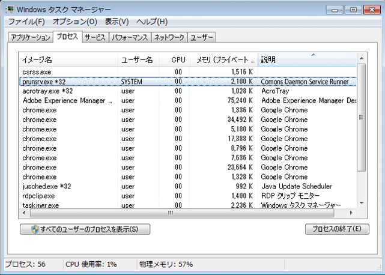

# カスタムスタンドアロンインストール{#custom-standalone-install}

この節では、スタンドアロンのAEMインスタンスをインストールする際に使用できるオプションについて説明します。 また、 [ストレージ要素](/help/sites-deploying/storage-elements-in-aem-6.md) AEM 6 を新規インストールした後のバックエンドストレージタイプの選択に関する詳細

## ファイル名を変更してポート番号を変更する {#changing-the-port-number-by-renaming-the-file}

AEM のデフォルトのポートは 4502 です。このポートが使用できない場合や、既に使用中の場合は、最初に有効なポート番号（4502、8080、8081、8082、8083、8084、8085、8888、9362、`<random>`）を使用するようにクイックスタートによって自動的に設定されます。

ファイル名にポート番号が含まれるようにクイックスタート jar ファイルの名前を変更して（例：`cq5-publish-p4503.jar`、`cq5-author-p6754.jar`）、ポート番号を設定することもできます。

クイックスタート jar ファイル名を変更する際に従わなければならない様々なルールがあります。

* ファイル名を変更する場合は、先頭を `cq;` にする必要があります。例えば、`cq5-publish-p4503.jar` のように指定します。

* ポート番号の直前には -p を付けることをお勧めします。例えば、cq5-publish-p4503.jar または cq5-author-p6754.jar のように指定します&#x200B;*。*

>[!NOTE]
>
>これは、ポート番号の抽出に使用される規則を満たすことについて心配する必要がないようにするためです。
>
>* ポート番号は 4 桁または 5 桁にする必要があります
>* これらの数字はダッシュの後に来る必要があります
>* ファイル名にその他の数字が含まれる場合は、ポート番号の直前に `-p` を付ける
>* ファイル名の先頭のプレフィックス「cq5」は無視される
>


>[!NOTE]
>
>start コマンドで `-port` オプションを使用してポート番号を変更することもできます。

## 実行モード {#run-modes}

**実行モード** を使用すると、特定の目的でAEMインスタンスを調整できます。例えば、オーサーまたはパブリッシュ、テスト、開発、イントラネットなどです。 また、これらのモードでは、サンプルコンテンツの使用を制御することもできます。 このサンプルコンテンツは、クイックスタートの構築前に定義され、パッケージ、設定などを含めることができます。 これは、インストールをリーンな状態に保ち、サンプルコンテンツを含まない実稼動環境でのインストールに特に役立ちます。 詳しくは、以下を参照してください。

* [実行モード](/help/sites-deploying/configure-runmodes.md)

## ファイルインストールプロバイダーの追加 {#adding-a-file-install-provider}

デフォルトでは、`crx-quickstart/install` フォルダーのファイルが監視されます。
\
このフォルダーは存在しませんが、実行時に作成できます。

バンドル、設定またはコンテンツパッケージがこのディレクトリに配置されると、自動的に取得されてインストールされます。削除された場合は、アンインストールされます。\
これは、バンドル、コンテンツパッケージまたは設定をリポジトリに配置する別の方法です。

これは、次のようないくつかの使用例で特に興味深いものです。

* 開発時に、ファイル・システムに何かを配置する方が簡単な場合があります。
* 問題が発生した場合、Web コンソールとリポジトリにアクセスできません。 これにより、このディレクトリに追加のバンドルを配置できます。
* クイックスタートを起動する前に `crx-quickstart/install` フォルダーを作成して、そこにパッケージを追加できます。

>[!NOTE]
>
>例として、[サーバーの起動時に CRX パッケージを自動的にインストールする方法](https://helpx.adobe.com/jp/experience-manager/kb/HowToInstallPackagesUsingRepositoryInstall.html)を参照してください。

## Adobe Experience Manager as a Windows Service のインストールと開始 {#installing-and-starting-adobe-experience-manager-as-a-windows-service}

>[!NOTE]
>
>管理者としてログオンしている間に必ず次の手順を実行するか、 **管理者として実行** コンテキストメニューの選択。
>
>管理者権限を持つユーザーとしてログオンしただけでは&#x200B;**不十分**&#x200B;です。管理者としてログオンしていない状態でこれらの手順の完了すると、「**アクセスが拒否されました**」というエラーが表示されます。

AEM as a Windows サービスをインストールして開始するには：

1. crx-quickstart\opt\helpers\instsrv.batファイルをテキストエディターで開きます。
1. 64 ビット Windows Server を設定する場合は、オペレーティングシステムに応じて次のいずれかのコマンドを使用して、prunsrv のインスタンスをすべて置き換えます。

   * prunsrv_amd64
   * prunsrv_ia64

   このコマンドは、32 ビット Java ではなく 64 ビット Java で Windows サービスデーモンを起動する適切なスクリプトを呼び出します。

1. プロセスが複数のプロセスに分岐しないようにするには、最大ヒープサイズと PermGen JVM パラメーターの値を増やします。`set jvm_options` コマンドを探して、値を次のように設定します。

   `set jvm_options=-XX:MaxPermSize=256M;-Xmx1792m`

1. コマンドプロンプトを開き、現在のディレクトリを AEM インストールの crx-quickstart/opt/helpers フォルダーに変更し、次のコマンドを入力してサービスを作成します。

   `instsrv.bat cq5`

   サービスが作成されたことを確認するには、管理ツールコントロールパネルで「サービス」を開くか、コマンドプロンプトで「`start services.msc`」と入力します。リストに cq5 サービスが表示されます。

1. 次のいずれかの操作を行って、サービスを開始します。

   * Services コントロールパネルで、「cq5」をクリックし、「開始」をクリックします。

   

   * コマンドラインで、&quot;net start cq5&quot; と入力します。

   

1. Windows は、サービスが実行中であることを示します。AEMが起動し、prunsrv 実行可能ファイルがタスクマネージャーに表示されます。 AEM を使用開始するには、web ブラウザーで、AEM（例：`http://localhost:4502`）に移動します。 

   

>[!NOTE]
>
>instsrv.bat ファイル内のプロパティ値は、Windows サービスの作成時に使用されます。instsrv.bat 内のプロパティ値を編集する場合は、サービスをアンインストールしてから再インストールする必要があります。

>[!NOTE]
>
>AEM をサービスとしてインストールする場合は、Configuration Manager から、`com.adobe.xmp.worker.files.ncomm.XMPFilesNComm` でログディレクトリの絶対パスを指定する必要があります。

サービスをアンインストールするには、コントロールパネルの「**サービス**」で「**停止**」をクリックするか、コマンドラインでフォルダーに移動して、&quot;`instsrv.bat -uninstall cq5`&quot; と入力します。&quot;**&quot; と入力すると、コントロールパネルの「**&#x200B;サービス`net start`」のリストまたはコマンドライン内のリストからサービスが削除されます。

## 一時的な作業ディレクトリの場所の再定義 {#redefining-the-location-of-the-temporary-work-directory}

Java マシンの一時フォルダーのデフォルトの場所は `/tmp`です。AEM も、パッケージの構築時などにこのフォルダーを使用します。

一時フォルダーの場所を変更する場合（空き容量の多いディレクトリが必要な場合など）は、 `<new-tmp-path>` JVM パラメーターを追加して、次の手順に従います。

`-Djava.io.tmpdir="/<new-tmp-path>"`

定義先は次のいずれかです。

* サーバー起動コマンドライン
* serverctl または start スクリプトの CQ_JVM_OPTS 環境パラメーター

## クイックスタートファイルから使用できるその他のオプション {#further-options-available-from-the-quickstart-file}

「–help」 オプションを使用して表示するクイックスタートのヘルプファイルには、その他のオプションと名前変更の規則が記述されています。ヘルプにアクセスするには、次のように入力します。

* `java -jar cq5-<version>.jar -help`

```shell
Loading quickstart properties: default
Loading quickstart properties: instance
Setting properties from filename '/Users/Desktop/AEM/cq-quickstart-5.6.0.jar'
--------------------------------------------------------------------------------
Adobe Experience Manager Quickstart (build 20130129)                            
--------------------------------------------------------------------------------
Usage:                                                                          
 Use these options on the Quickstart command line.                              
--------------------------------------------------------------------------------

-help (--help,-h)
         Show this help message                                                 
-quickstart.server.port (-p,-port) <port>
         Set server port number                                                 
-contextpath (-c,-org.apache.felix.http.context_path) <contextpath>
         Set context path                                                       
-debug <port>
         Enable Java Debugging on port number; forces forking                   
-gui 
         Show GUI if running on a terminal                                      
-nobrowser (-quickstart.nobrowser)
         Do not open browser at startup                                         
-unpack
         Unpack installation files only, do not start the server (implies       
         -verbose)                                                              
-v (-verbose)
         Do not redirect stdout/stderr to files and do not close stdin          
-nofork
         Do not fork the JVM, even if not running on a console                  
-fork
         Force forking the JVM if running on a console, using recommended       
         default memory settings for the forked JVM.                            
-forkargs <args> [<args> ...]
         Additional arguments for the forked JVM, defaults to '-Xmx1024m        
         -XX:MaxPermSize=256m '.  Use -- to specify values starting with -,     
         example: '-forkargs -- -server'                                        
-a (--interface) <interface>
         Optional IP address (interface) to bind to                             
-pt <string>
         Process type (main/fork) - do not use directly, used when forking a    
         process                                                                
-r <string> [<string> [<string> [<string> [<string> [<string> [<string> [<string> [<string> [<string>]]]]]]]]]
         Runmode(s) - Use this to define the run mode(s)                        
-b <string>
         Base folder - defines the path under which the quickstart work folder  
         is created                                                             
-low-mem-action <string>
         Low memory action - what to do if memory is insufficient at startup    
-use-control-port
         Start a control port                                                   
-ll <level>
         Define launchpad log level (1 = error...4 = debug)                     
--------------------------------------------------------------------------------
Quickstart filename options                                                     
--------------------------------------------------------------------------------
Usage:                                                                          
 Rename the jar file, including one of the patterns shown below, to set the     
corresponding option. Command-line options have priority on these filename      
patterns.                                                                       
--------------------------------------------------------------------------------

-NNNN
         Include -NNNN.jar or -pNNNN in the renamed jar filename to run on port 
         NNNN, for example: quickstart-8085.jar                                 
-nobrowser
         Include -nobrowser in the renamed jar filename to avoid opening the    
         browser at startup, example: quickstart-nobrowser-8085.jar             
-publish
         Include -publish in the renamed jar filename to run cq5 in "publish"   
         mode, example: cq5-publish-7502.jar                                    
--------------------------------------------------------------------------------
The license.properties file
--------------------------------------------------------------------------------
  The license.properties file stores licensing information, created from the    
  licensing form displayed on first startup and stored in the folder from where 
  Quickstart is run.                                                            
--------------------------------------------------------------------------------
Log files
--------------------------------------------------------------------------------
  Once Quickstart has been unpacked and started, log files can be found under   
  ./crx-quickstart/logs.                                                        
--------------------------------------------------------------------------------
```

## Amazon EC2 環境への AEM のインストール {#installing-aem-in-the-amazon-ec-environment}

Amazon Elastic Compute Cloud(EC2) インスタンスにAEMをインストールする場合、EC2 インスタンスにオーサーとパブリッシュの両方をインストールすると、オーサーインスタンスが正しくインストールされます。 [AEMのインスタンスをインストール](/help/sites-deploying/custom-standalone-install.md);ただし、パブリッシュインスタンスは「オーサー」になります。

EC2 環境にパブリッシュインスタンスをインストールする前に、次の手順を実行してください。

1. インスタンスを初めて起動する前に、パブリッシュインスタンスの jar ファイルを解凍します。 ファイルを解凍するには、次のコマンドを使用します。

   ```xml
   java -jar quickstart.jar -unpack
   ```

   >[!NOTE]
   >
   >インスタンスを初めて起動した&#x200B;**後**&#x200B;にモードを変更する場合は、実行モードを変更できません。

1. 次のコマンドを実行してインスタンスを起動します。

   ```xml
   java -jar quickstart.jar -r publish
   ```

   >[!CAUTION]
   >
   >上記のコマンドを実行して、展開した後で最初にインスタンスを実行してください。 そうしないと、quickstart.properties の塗りは生成されません。 このファイルが生成されない場合は、以降の AEM のアップグレードが失敗します。

1. 内 **bin** フォルダーを開き、 **開始** スクリプトを作成し、次のセクションを確認します。

   ```xml
   # runmode(s)
   if [ -z "$CQ_RUNMODE" ]; then
    CQ_RUNMODE='author'
   fi
   ```

1. 実行モードをに変更します。 **公開** ファイルを保存します。

   ```xml
   # runmode(s)
   if [ -z "$CQ_RUNMODE" ]; then
    CQ_RUNMODE='publish'
   fi
   ```

1. インスタンスを停止し、 **開始** スクリプト

## インストールの確認 {#verifying-the-installation}

次のリンクを使用して、インストールが動作していることを確認できます（すべての例は、インスタンスが localhost のポート 8080 で実行され、CRX が/crx と Launchpad の下にインストールされていることに基づいています）。

* `http://localhost:8080/crx/de`

   
CRXDE Lite コンソール

* `http://localhost:8080/system/console`

   
Web コンソール

## インストール後のアクション {#actions-after-installation}

AEM WCM を設定する方法は多数ありますが、特定のアクションを実行するか、少なくともインストール後すぐに確認する必要があります。

* システムのセキュリティを確保するために必要なタスクについて、[セキュリティチェックリスト](/help/sites-administering/security-checklist.md)を参照してください。
* AEM WCM と共にインストールされるデフォルトのユーザーとグループのリストを確認します。 他のアカウントに対してアクションを実行するかどうかを確認します。詳しくは、 [セキュリティとユーザー管理](/help/sites-administering/security.md) 詳しくは、を参照してください。

## CRXDE Liteと Web コンソールへのアクセス {#accessing-crxde-lite-and-the-web-console}

AEM WCM を起動したら、次の場所にもアクセスできます。

* [CRXDE Lite](#accessing-crxde-lite)  — リポジトリにアクセスして管理するために使用
* [Web コンソール](#accessing-the-web-console) - OSGi バンドル（OSGi コンソールとも呼ばれます）の管理または設定に使用

### アクセスCRXDE Lite {#accessing-crxde-lite}

CRXDE Lite を開くには、スタートアップスクリーンから **CRXDE Lite** を選択するか、ブラウザーを使用して以下に移動します

```
 https://<<i>host</i>>:<<i>port</i>>/crx/de/index.jsp
```

例：\
`http://localhost:4502/crx/de/index.jsp` ``


### Web コンソールへのアクセス {#accessing-the-web-console}

Adobe CQ web コンソールにアクセスするには、ようこそ画面から **OSGi コンソール**&#x200B;を選択するか、ブラウザーを使用して以下に移動します

```
 https://<<i>host</i>>:<<i>port</i>>/system/console
```

例：\
`http://localhost:4502/system/console`\
または「Bundles」ページの\
`http://localhost:4502/system/console/bundles`


詳しくは、 [Web コンソールを使用した OSGi 設定](/help/sites-deploying/configuring-osgi.md#osgi-configuration-with-the-web-console) 詳しくは、を参照してください。

## トラブルシューティング {#troubleshooting}

インストール時に発生する可能性のある問題の対処方法については、以下を参照してください。

* [トラブルシューティング](/help/sites-deploying/troubleshooting.md)

## Adobe Experience Managerのアンインストール {#uninstalling-adobe-experience-manager}

AEMは単一のディレクトリにインストールされるので、アンインストールユーティリティは必要ありません。 AEMのアンインストール方法は、実行する内容と使用する永続的なストレージによって異なりますが、インストールディレクトリ全体を削除するのと同じくらい簡単にアンインストールできます。

例えば、デフォルトの TarPM インストールで永続的なストレージがインストールディレクトリに埋め込まれている場合、フォルダを削除すると、データも削除されます。

>[!NOTE]
>
>Adobeでは、AEMを削除する前にリポジトリをバックアップすることを強くお勧めします。 を削除すると、 &lt;cq-installation-directory>を削除する場合は、リポジトリを削除します。 削除する前にリポジトリデータを保持するには、 &lt;cq-installation-directory>/crx-quickstart/repository フォルダーを別の場所に移動してから、他のフォルダーを削除します。

AEMのインストールで外部ストレージ（データベースサーバーなど）を使用している場合、フォルダーを削除してもデータは自動的には削除されませんが、ストレージ設定は削除されるので、JCR コンテンツの復元が困難です。
