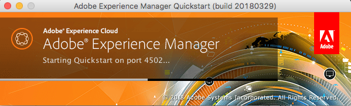
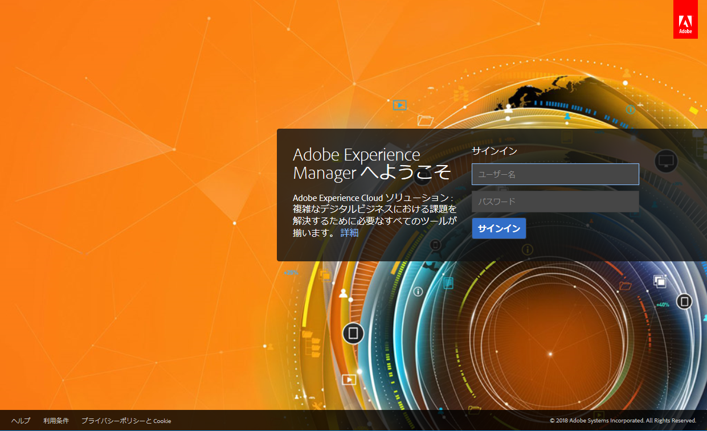

# デプロイとメンテナンス{#deploying-and-maintaining}

このページの内容は次のとおりです。

* [基本概念](#basic-concepts)

   * [AEM とは](#what-is-aem)
   * [典型的な開発](#typical-deployment-scenarios)

      * [オンプレミス](#on-premise)
      * [Cloud Manager を使用した Managed Services](#managed-services-using-cloud-manager)

* [はじめに](#getting-started)

   * [前提条件](#prerequisites)
   * [ソフトウェアの入手](#getting-the-software)
   * [デフォルトのローカルインストール](#default-local-install)
   * [オーサーとパブリッシュのインストール](#author-and-publish-installs)
   * [展開されたインストールディレクトリ](#unpacked-install-directory)
   * [起動と停止](#starting-and-stopping)

これらの基本を理解したうえで、より高度かつ詳細な情報を習得するには、次のサブページを参照してください。

* [技術要件](/help/sites-deploying/technical-requirements.md)
* [推奨されるデプロイメント](/help/sites-deploying/recommended-deploys.md)
* [カスタムスタンドアロンインストール](/help/sites-deploying/custom-standalone-install.md)
* [アプリケーションサーバーのインストール](/help/sites-deploying/application-server-install.md)
* [トラブルシューティング](/help/sites-deploying/troubleshooting.md)
* [コマンドラインによる起動と停止](/help/sites-deploying/command-line-start-and-stop.md)
* [設定](/help/sites-deploying/configuring.md)
* [AEM 6.4 へのアップグレード](/help/sites-deploying/upgrade.md)
* [e コマース](/help/sites-deploying/ecommerce.md)
* [設定方法に関する記事](/help/sites-deploying/ht-deploy.md)
* [Web コンソール](/help/sites-deploying/web-console.md)
* [レプリケーションのトラブルシューティング](/help/sites-deploying/troubleshoot-rep.md)
* [ベストプラクティス](/help/sites-deploying/best-practices.md)
* [Communities のデプロイ](/help/communities/deploy-communities.md)
* [AEM プラットフォームの概要](/help/sites-deploying/platform.md)
* [パフォーマンスガイドライン](/help/sites-deploying/performance-guidelines.md)
* [AEM Mobile 使用の手引き](/help/mobile/getting-started-aem-mobile.md)
* [AEM Screens とは](https://docs.adobe.com/content/help/ja/experience-manager-screens/user-guide/aem-screens-introduction.html)

## 基本概念 {#basic-concepts}

### AEM とは {#what-is-aem}

Adobe Experience Manager は、商業 Web サイトおよび関連サービスを構築、管理、デプロイするための、Web ベースのクライアントサーバーシステムです。インフラストラクチャレベルおよびアプリケーションレベルの多数の機能を組み合わせて単一の統合パッケージにします。

インフラストラクチャレベルでは、AEM は以下の機能を提供します。

* **Web アプリケーションサーバー**:AEMは、スタンドアロンモード（統合 Jetty Web サーバーを含む）で、またはサードパーティのアプリケーションサーバー（WebLogic、WebSphere など）内の Web アプリケーションとしてデプロイできます。
* **Web アプリケーションフレームワーク**：AEM には Sling Web アプリケーションフレームワークが組み込まれており、RESTful な、コンテンツ指向の Web アプリケーションを簡単に作成できます。
* **コンテンツリポジトリ**：AEM には、非構造化データおよび半構造化データ専用に設計された階層型データベースの一種である Java コンテンツリポジトリ（JCR）が含まれています。このリポジトリには、ユーザーに表示されるコンテンツだけでなく、アプリケーションで使用されるすべてのコード、テンプレートおよび内部データが格納されます。

この基礎を踏まえて、AEM は以下の管理のためにアプリケーションレベルの機能も数多く提供しています。

* **Web サイト**
* **モバイルアプリケーション**
* **デジタルパブリケーション**
* **Forms**
* **デジタルアセット**
* **Communities**
* **オンライン商取引**

最後に、ユーザーはこれらのインフラストラクチャレベルおよびアプリケーションレベルの構築ブロックを使用して、独自のアプリケーションを構築することによって、カスタマイズされたソリューションを作成できます。

AEMサーバーは **Java ベース** およびは、そのプラットフォームをサポートするほとんどのオペレーティングシステムで動作します。クライアントとAEMとのやり取りはすべて、 **web ブラウザー**.

### 典型的なデプロイメントシナリオ {#typical-deployment-scenarios}

AEM の用語では、「インスタンス」は、サーバー上で実行されている AEM のコピーのことです。AEM のインストールには通常少なくとも 2 つのインスタンスが関連し、これらは通常は別々のマシンで実行されます。

* **オーサー**：コンテンツを作成、アップロードおよび編集し、Web サイトを管理する AEM インスタンス。公開する準備ができたコンテンツは、パブリッシュインスタンスにレプリケートされます。
* **パブリッシュ**：発行されたコンテンツを公開する AEM インスタンス。

これらのインスタンスは、インストールされているソフトウェアという点では同一で、違いは設定のみです。また、多くのインストールではディスパッチャーを使用します。

* **ディスパッチャー**：AEM ディスパッチャーモジュールで補強された静的 Web サーバー（Apache httpd、Microsoft IIS など）。パブリッシュインスタンスで生成された Web ページをキャッシュしてパフォーマンスを向上します。

この設定には多くの高度なオプションと詳細がありますが、オーサー、パブリッシュ、ディスパッチャーの基本パターンは、ほとんどのデプロイメントの中核となっています。まず、比較的シンプルな設定に焦点を当てます。高度なデプロイメントオプションの説明が続きます。

以下のセクションでは、両方のシナリオについて説明します。

* **オンプレミス**：AEM はユーザーの企業環境に配置され管理されます。

* **Managed Services - Adobe Experience Manager のクラウドマネージャー**：AEM は、Adobe Managed Services によってデプロイおよび管理されます。

### オンプレミス {#on-premise}

企業環境内のサーバーに AEM をインストールできます。典型的なインストールインスタンスは、開発、テストおよびパブリッシング環境を含みます。AEM ソフトウェアをローカルにインストールする方法の基本的な詳細については、[はじめに](/help/sites-deploying/deploy.md#getting-started)セクションを参照してください。

一般的なオンプレミスデプロイメントの詳細については、[推奨されるデプロイメント](/help/sites-deploying/recommended-deploys.md)を参照してください。

### Cloud Manager を使用した Managed Services {#managed-services-using-cloud-manager}

AEM Managed Services は、デジタルエクスペリエンス管理のための完全なソリューションです。オンプレミスデプロイメントの制御、セキュリティ、およびカスタマイズのあらゆる利点を維持しながら、クラウドでエクスペリエンス配信ソリューションの利点を提供します。AEM Managed Services を使用すれば、クラウドへのデプロイによって、また Adobe のベストプラクティスとサポートの活用によって、より迅速にサービスを開始できます。組織や法人ユーザーは、最小限の時間で顧客を獲得し、市場シェアを拡大し、革新的なマーケティングキャンペーンの作成に集中しながらITの負担を軽減できます。

AEM Managed Services を使用すれば、次のようなメリットを享受できます。

**市場投入までの時間の短縮：** Adobe Managed Services の柔軟なクラウドインフラストラクチャにより、組織は成功するデジタルエクスペリエンスを迅速に計画し、立ち上げ、最適化することができます。Adobeは、追加の資本、ハードウェア、ソフトウェアを必要とせずにクラウドアーキテクチャを管理し、AdobeのカスタマーサクセスエンジニアがAEMのアーキテクチャ、プロビジョニング、バックエンドアプリへの接続と運用開始のベストプラクティスを支援します。

**より高い性能：** 99.5％、99.9％、99.95％、および 99.99％ の 4 つのサービス可用性オプションで、ビジネスに信頼性の高いデジタル体験を提供します。また、自動バックアップとマルチモードの災害復旧モデルを使用して、信頼性とコンティンジェンシー管理を確保できます。

**最適化された IT コスト：**&#x200B;事前のガイダンスと専門知識により、組織は AEM のバージョンを常に最新の状態に保つことができます。Adobe のプラチナメンテナンスおよびサポートは、AMS Enterprise／Basic の新規導入に自動的に組み込まれ、組織がミッションクリティカルなアプリケーションを維持するのに役立つ技術的専門知識と運用経験を提供します。無料の基本的なアナリティクス機能またはターゲット機能は、特に分析とパーソナライゼーションのニーズが限られている中堅企業にさらなる価値を提供します。

**最高のセキュリティ：**&#x200B;カスタマーアプリケーションを、アクセスが制限された施設、ファイアウォールシステムの背後や、仮想プライベートクラウド内でホストすることで、エンタープライズクラスの物理、ネットワーク、およびデータのセキュリティを確保します。堅牢なデータストレージ暗号化、アンチウイルス、およびデータ分離を備えたシングルテナント仮想マシンが含まれます。

**クラウドマネージャー**：Adobe Experience Manager Services 製品の一部である Cloud Manager は、組織がクラウド内で Adobe Experience Manager を自己管理することをさらに可能にするセルフサービスポータルです。これには、IT チームと実装パートナーがパフォーマンスやセキュリティを犠牲にすることなくカスタマイズやアップデートの提供を迅速化できるようにする、最先端の継続的インテグレーションと継続的配信（CI／CD）パイプラインが含まれます。Cloud Manager は、Adobe Managed Service のお客様のみご利用いただけます。

Cloud Manager とそのリソースについて詳しくは、 [**Cloud Manager ユーザーガイド**](https://helpx.adobe.com/experience-manager/cloud-manager/user-guide.html).

## はじめに {#getting-started}

### 前提条件 {#prerequisites}

通常、本番インスタンスは正式にサポートされている OS を実行する専用マシンで実行されます ( [技術要件](/help/sites-deploying/technical-requirements.md)) の場合、Experience Managerサーバーは、実際にはをサポートする任意のシステムで実行されます [**Java Standard Edition 8**](https://www.oracle.com/technetwork/java/javase/downloads/jdk8-downloads-2133151.html).

AEM に習熟したい場合や、AEM で開発する場合は、Apple OS X またはデスクトップ版の Microsoft Windows または Linux を実行しているローカルマシンにインストールされたインスタンスを使用するのが一般的です。

クライアント側では、AEMはすべての最新のブラウザー (**Microsoft Edge**, **Internet Explorer** 11, **クロム** 51 以降、 **Firefox** 47 以降、 **Safari** 8 以降 ) をデスクトップとタブレットの両方のオペレーティングシステムで使用できます。 詳しくは、 [サポートされるクライアントプラットフォーム](/help/sites-deploying/technical-requirements.md#supported-client-platforms) 」を参照してください。

### ソフトウェアの入手 {#getting-the-software}

有効なメンテナンスおよびサポート契約を締結しているお客様には、コードが記載された電子メール通知が届き、AEMを [**Adobeライセンス Web サイト**](https://licensing.adobe.com/).ビジネスパートナーは、からのダウンロードアクセスをリクエストできます [**spphelp@adobe.com**](mailto:spphelp@adobe.com).

AEM ソフトウェアパッケージには、次の 2 つの形式があります。

* **cq-quickstart-6.4.0.jar:** スタンドアロンの実行可能ファイル *jar* 起動および実行に必要なすべてを含むファイル。

* **cq-quickstart-6.4.0.war:** A *戦争* ファイルを使用して、サードパーティのアプリケーションサーバーにデプロイします。

次の節では、 **スタンドアロンインストール**.アプリケーションサーバーへのAEMのインストールについて詳しくは、 [アプリケーションサーバーのインストール](/help/sites-deploying/application-server-install.md).

### デフォルトのローカルインストール {#default-local-install}

1. ローカルマシンにインストールディレクトリを作成します。次に例を示します。

   UNIX のインストール場所： **/opt/aem**

   Windows のインストール場所： **`C:\Program Files\aem`**

   同様に、デスクトップ上のフォルダーにサンプルインスタンスをインストールするのが一般的です。いずれの場合も、ここではこの場所を次のように表現します：

   `<aem-install>`

   *ファイルディレクトリのパスには、US ASCII 文字のみを含めてください。*

1. を **jar** および **ライセンス** このディレクトリ内のファイル：

   ```shell
   <aem-install>/
       cq-quickstart-6.4.0.jar
       license.properties
   ```

   次の項目を指定しない場合、 `license.properties` ファイルの場合、AEMはブラウザを **ようこそ** 起動時の画面。ライセンスキーを入力できます。 アドビの有効なライセンスキーをお持ちでない場合は、依頼する必要があります。

1. GUI 環境でインスタンスを起動するには、 **`cq-quickstart-6.4.0.jar`** ファイル。

   また、AEM はコマンドラインから起動することもできます。32 ビット Java VM の場合は、次のように入力します。

   ```shell
       java -Xmx1024M -jar cq-quickstart-6.4.0.jar
   ```

   64 ビット VM の場合は、次のように入力します。

   ```shell
       java -XX:MaxPermSize=256m -Xmx1024M -jar cq-quickstart-6.4.0.jar
   ```

数分かけて、jar ファイルが展開され、AEM がインストールされ、起動します。上記の手順の結果、

* **AEM オーサー**&#x200B;インスタンスが、
* **localhost** 上の
* ポート **4502** で実行されます。

このインスタンスにアクセスするには、ブラウザーで次のように指定します。

**`http://localhost:4502`**

オーサーインスタンスの結果は、**** 上の&#x200B;**`localhost:4503`**&#x200B;パブリッシュインスタンスに接続するように自動的に設定されます。

### オーサーとパブリッシュのインストール {#author-and-publish-installs}

デフォルトのインストール（**上の**&#x200B;オーサー&#x200B;**`localhost:4502`**&#x200B;インスタンス）は、初めて起動する前に `jar` ファイルの名前を変更することによって変更できます。命名パターンは次のとおりです。

**`cq-<instance-type>-p<port-number>.jar`**

例えば、ファイル名を

**`cq-author-p4502.jar`**

に変更してから起動すると、オーサーインスタンスが **`localhost:4502`** 上で実行されます。

同様に、ファイル名を

**`cq-publish-p4503.jar`**

に変更してから起動すると、パブリッシュインスタンスが **`localhost:4503`** 上で実行されます。

これら 2 つのインスタンスを、例えば次の場所にインストールします。

`<aem-install>/author`および

**`<aem-install>/publish`**

インストールのカスタマイズについて詳しくは、以下を参照してください。

* [カスタムスタンドアロンインストール](/help/sites-deploying/custom-standalone-install.md)
* [実行モード](/help/sites-deploying/configure-runmodes.md)

### 展開されたインストールディレクトリ {#unpacked-install-directory}

quickstart jar を初めて起動すると、同じディレクトリの、新しいサブディレクトリ ( `crx-quickstart`.最終的には次のようになります。

```xml
<aem-install>/
    license.properties
    cq-quickstart-6.4.0.jar
    crx-quickstart/
        app/
        bin/
        conf/
        launchpad/
        logs/
        metrics/        
        monitoring/
        opt/
        repository/
        threaddumps/
        eula-de_DE.html
        eula-en_US.html
        eula-fr_FR.html
        eula-ja_JP.html
        readme.txt
```

インスタンスを GUI からインストールした場合は、ブラウザーウィンドウが自動的に開き、デスクトップアプリケーションウィンドウも開いて、インスタンスのホストおよびポートと、オン／オフのスイッチが表示されます。



>[!NOTE]
>
>シンボリックリンクを使用している場合は、[シンボリックリンクの問題](https://helpx.adobe.com/experience-manager/kb/changing-symlink.html)をご確認ください。

### 起動と停止 {#starting-and-stopping}

AEM が展開され、初めて起動した後は、インストールディレクトリの jar ファイルをダブルクリックしても、インスタンスが開始されるだけで、再インストールはされません。

GUI からインスタンスを停止するには、デスクトップアプリケーションウィンドウで&#x200B;**オン／オフ**&#x200B;スイッチをクリックするだけです。

また、コマンドラインからAEMを停止して起動することもできます。インスタンスを初めてインストールした場合は、 **コマンドラインスクリプト** は次の場所にあります。

**`<aem-install>/crx-quickstart/bin/`**

このフォルダーには、次の Unix bash シェルスクリプトが含まれています。

* **`start`**: インスタンスを開始
* `stop`: インスタンスを停止
* **`status`**: インスタンスのステータスを報告
* **`quickstart`**：必要に応じて開始情報の設定に使用

Windows 用に同等の **`bat`** ファイルもあります。詳しくは、以下を参照してください。

* [コマンドラインによる起動と停止](/help/sites-deploying/command-line-start-and-stop.md)

AEM が起動し、Web ブラウザーが適切なページに自動的にリダイレクトされます。通常は、次のようなログインページが表示されます。

`http://localhost:4502/`



ログインすれば、AEM にアクセスできます。詳しくは、役割に応じて、以下を参照してください。

* [オーサリング](/help/sites-authoring/home.md)
* [管理](/help/sites-administering/home.md)
* [開発](/help/sites-developing/home.md)
* [管理](/help/managing/best-practices.md)

## 高度なデプロイメント {#advanced-deployment}

これまでの節では、AEM インストールの基礎について説明しました。ただし、AEM の完全な実稼動システムのインストールは、より複雑な作業を伴う可能性があります。高度なインストールについて詳しくは、次のサブページを参照してください。

* [技術要件](/help/sites-deploying/technical-requirements.md)
* [推奨されるデプロイメント](/help/sites-deploying/recommended-deploys.md)
* [カスタムスタンドアロンインストール](/help/sites-deploying/custom-standalone-install.md)
* [アプリケーションサーバーのインストール](/help/sites-deploying/application-server-install.md)
* [トラブルシューティング](/help/sites-deploying/troubleshooting.md)
* [コマンドラインによる起動と停止](/help/sites-deploying/command-line-start-and-stop.md)
* [設定](/help/sites-deploying/configuring.md)
* [AEM 6.4 へのアップグレード](/help/sites-deploying/upgrade.md)
* [e コマース](/help/sites-deploying/ecommerce.md)
* [設定方法に関する記事](/help/sites-deploying/ht-deploy.md)
* [Web コンソール](/help/sites-deploying/web-console.md)
* [レプリケーションのトラブルシューティング](/help/sites-deploying/troubleshoot-rep.md)
* [ベストプラクティス](/help/sites-deploying/best-practices.md)
* [Communities のデプロイ](/help/communities/deploy-communities.md)
* [AEM プラットフォームの概要](/help/sites-deploying/platform.md)
* [パフォーマンスガイドライン](/help/sites-deploying/performance-guidelines.md)
* [AEM Mobile 使用の手引き](/help/mobile/getting-started-aem-mobile.md)
* [AEM Screens とは](https://docs.adobe.com/content/help/en/experience-manager-screens/user-guide/aem-screens-introduction.html)
