# Oak-run Jar を使用したインデックス作成{#indexing-via-the-oak-run-jar}

Oak-run は、JMX レベルから操作する必要なく、コマンドラインですべてのインデックス作成の使用例をサポートします。 oak-run アプローチの利点は次のとおりです。

1. AEM 6.4 の新しいインデックス作成ツールセットです。
1. これにより、大きなリポジトリでの再インデックス時間に影響を与える再インデックスの時間を短縮できます。
1. AEM でのインデックス再作成時のリソース消費を削減します。これにより、他の AEM アクティビティのシステムパフォーマンスが向上します。
1. Oak-run は、Out-of-band のサポートを提供しています。実稼動インスタンスでインデックス再作成を実行できない状況にある場合は、クローン環境を使用してインデックス再作成を実行し、パフォーマンスへの重大な影響を回避できます。

`oak-run` ツールでインデックス作成操作を実行する際に活用できるユースケースのリストを以下に示します。

## インデックスの整合性チェック {#indexconsistencychecks}

>[!NOTE]
>
>このシナリオについて詳しくは、 [使用例 1 — インデックスの整合性チェック](/help/sites-deploying/oak-run-indexing-usecases.md#usercase1indexconsistencycheck).

* `oak-run.jar`lucene oak インデックスが破損しているかどうかを迅速に判断します。
* 整合性チェックレベル 1 および 2 の場合は、使用中の AEM インスタンスで実行しても安全です。

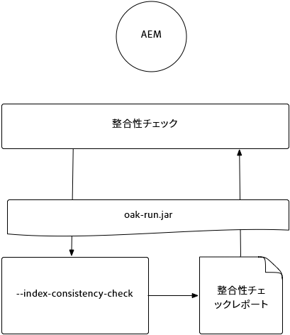

## インデックス統計 {#indexstatistics}

>[!NOTE]
>
>このシナリオについて詳しくは、 [使用例 2 — インデックス統計](/help/sites-deploying/oak-run-indexing-usecases.md#usecase2indexstatistics)

* `oak-run.jar` すべてのインデックス定義、重要なインデックス統計およびインデックス内容をオフライン分析用にダンプします。

* 使用中の AEM インスタンスで実行しても安全です。

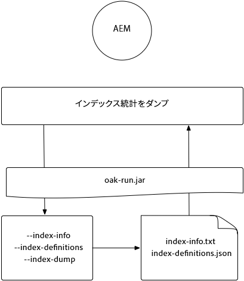

## インデックス再作成アプローチのデシジョンツリー {#reindexingapproachdecisiontree}

様々なインデックス再作成アプローチを使用すべき状況についてのデシジョンツリーを次の図に示します。

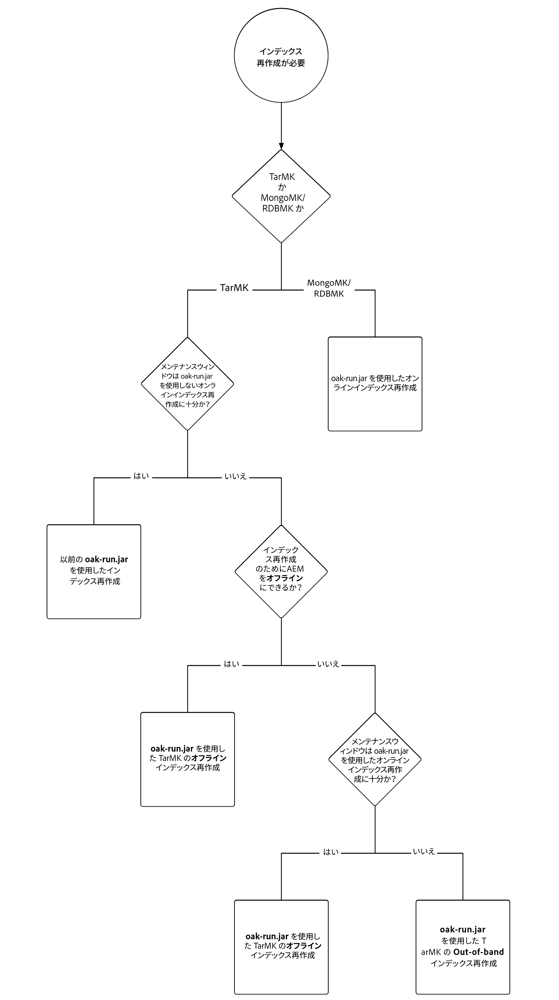

## MongoMK / RDMBMK のインデックス再作成 {#reindexingmongomk}

>[!NOTE]
>
>このシナリオについて詳しくは、 [使用例 3 — インデックスの再作成](/help/sites-deploying/oak-run-indexing-usecases.md#usecase3reindexing).

### SegmentNodeStore および DocumentNodeStore のテキスト事前抽出 {#textpre-extraction}

[テキストの事前抽出](/help/sites-deploying/best-practices-for-queries-and-indexing.md#how-to-perform-text-pre-extraction) (AEM 6.3 で存在していた機能 ) を使用して、インデックス再作成の時間を短縮できます。 テキストの事前抽出は、すべてのインデックス再作成アプローチと組み合わせて使用できます。

`oak-run.jar` のインデックス作成アプローチに応じて、次の図に示す「インデックス再作成の実行」ステップのどちら側にも様々なステップがあります。

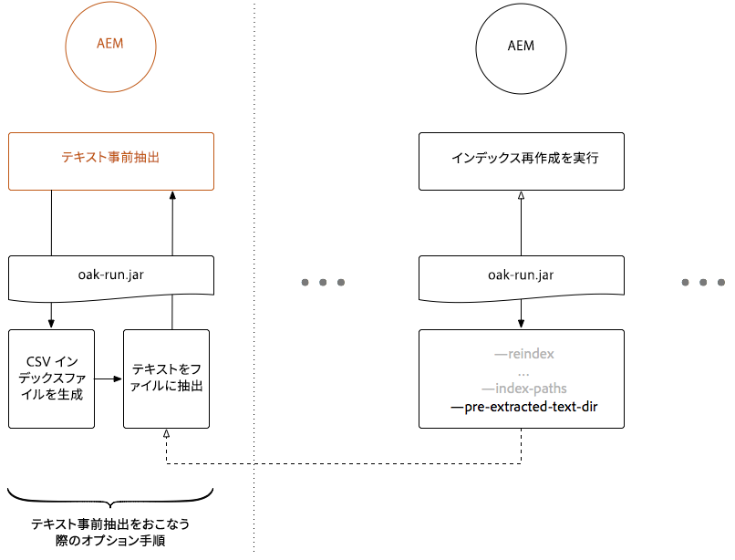

>[!NOTE]
>
>オレンジは、AEMがメンテナンスウィンドウに存在する必要があるアクティビティを示します。

### oak-run.jar を使用した MongoMK または RDBMK のオンラインインデックス再作成 {#onlinere-indexingformongomk}

>[!NOTE]
>
>このシナリオについて詳しくは、 [インデックス再作成 — DocumentNodeStore](/help/sites-deploying/oak-run-indexing-usecases.md#reindexdocumentnodestore).

MongoMK（および RDBMK）AEMインストールのインデックス再作成には、この方法をお勧めします。 他の方法は使用しないでください。

このプロセスは、クラスター内の 1 つのAEMインスタンスに対してのみ実行する必要があります。

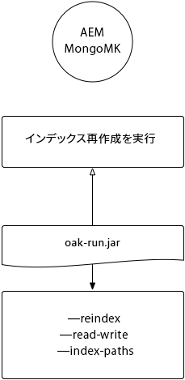

## TarMK のインデックス再作成 {#re-indexingtarmk}

>[!NOTE]
>
>このシナリオについて詳しくは、 [インデックス再作成 — SegmentNodeStore](/help/sites-deploying/oak-run-indexing-usecases.md#reindexsegmentnodestore).

* **コールドスタンバイに関する考慮事項（TarMK）**

   * コールドスタンバイに関しては特別な考慮事項はありません。コールドスタンバイインスタンスは、通常どおり変更を同期します。

* **AEM パブリッシュファーム（AEM パブリッシュファームは常に TarMK にする必要があります）**

   * パブリッシュファームの場合は、すべての OR に対しておこなう必要があります。また、1 つのパブリッシュで手順を実行し、他のパブリッシュに対して設定をクローンする必要があります (AEMインスタンスのクローンを作成する場合は、通常の手順を実行します )。sling.id — ここで何かにリンクする必要がある )

### TarMK のオンラインインデックス再作成 {#onlinere-indexingfortarmk}

>[!NOTE]
>
>このシナリオについて詳しくは、 [オンラインインデックス再作成 — SegmentNodeStore](/help/sites-deploying/oak-run-indexing-usecases.md#onlinereindexsegmentnodestore).

これは、oak-run.jar の新しいインデックス作成機能の導入前に使用された方法です。Oak インデックスの `reindex=true` プロパティを設定することで行うことができます。

このアプローチは、インデックス作成に対する時間効果とパフォーマンス効果がお客様に許容される場合に使用できます。 これは、多くの場合、中小のAEMインストールに該当します。

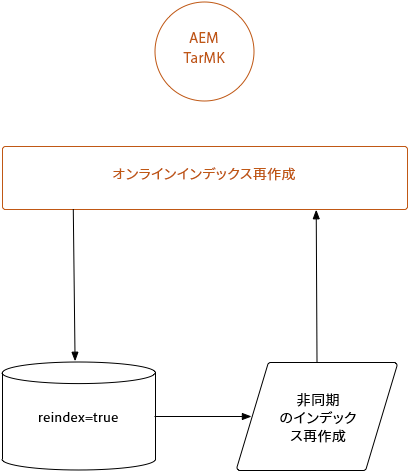

### oak-run.jar を使用した TarMK のオンラインインデックス再作成 {#onlinere-indexingtarmkusingoak-run-jar}

>[!NOTE]
>
>このシナリオについて詳しくは、[オンラインのインデックス再作成 - SegmentNodeStore - AEM インスタンス実行中](/help/sites-deploying/oak-run-indexing-usecases.md#onlinereindexsegmentnodestoretheaeminstanceisrunning)を参照してください。

oak-run.jar を使用した TarMK のオンラインインデックス再作成は、上記の [TarMK のオンラインインデックス再作成](#onlinere-indexingfortarmk)より高速です。ただし、メンテナンスウィンドウ中に実行する必要があり、時間は短くなりますが、インデックス再作成の実行に必要な手順が増えます。

>[!NOTE]
>
>オレンジ色は、メンテナンス期間中に AEM を実行する必要がある操作を示します。

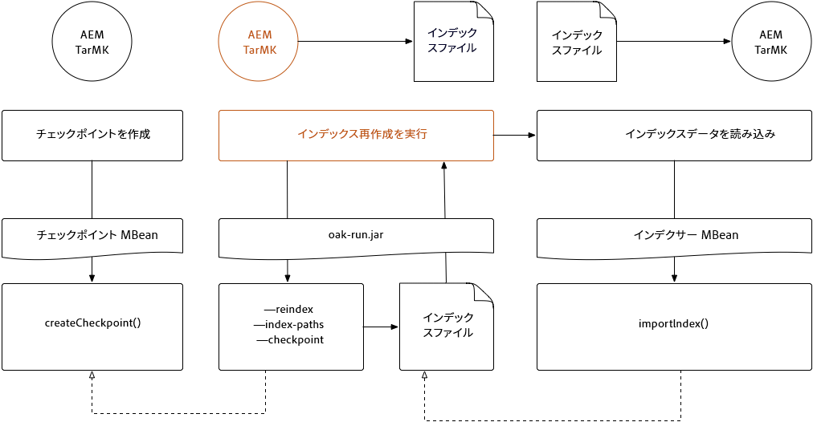

### oak-run.jar を使用した TarMK のオフラインインデックス再作成 {#offlinere-indexingtarmkusingoak-run-jar}

>[!NOTE]
>
>このシナリオについて詳しくは、 [オンラインインデックス再作成 — SegmentNodeStore - AEMインスタンスがシャットダウンされます](/help/sites-deploying/oak-run-indexing-usecases.md#onlinereindexsegmentnodestoreaeminstanceisdown).

TarMK のオフラインインデックス再作成は、必要な `oak-run.jar` コメントが 1 つだけなので、`oak-run.jar` ベースの TarMK 用インデックス再作成アプローチとしては最も簡単です。ただし、AEMインスタンスをシャットダウンする必要があります。

>[!NOTE]
>
>赤は、AEMをシャットダウンする必要がある操作を示します。

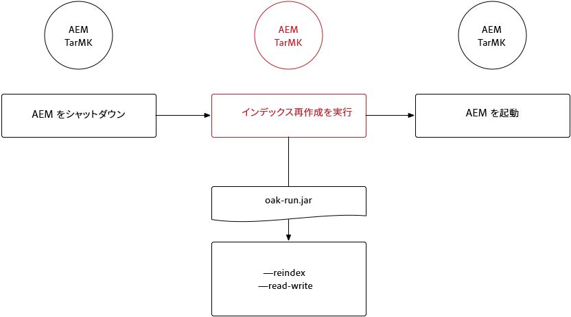

### oak-run.jar を使用した TarMK の Out-of-band インデックス再作成  {#out-of-bandre-indexingtarmkusingoak-run-jar}

>[!NOTE]
>
>このシナリオについて詳しくは、 [帯域外再インデックス — SegmentNodeStore](/help/sites-deploying/oak-run-indexing-usecases.md#outofbandreindexsegmentnodestore).

アウトオブバンドでのインデックス再作成により、使用中のAEMインスタンスに対するインデックス再作成の影響を最小限に抑えます。

>[!NOTE]
>
>赤は、AEMがシャットダウンされる可能性がある操作を示します。

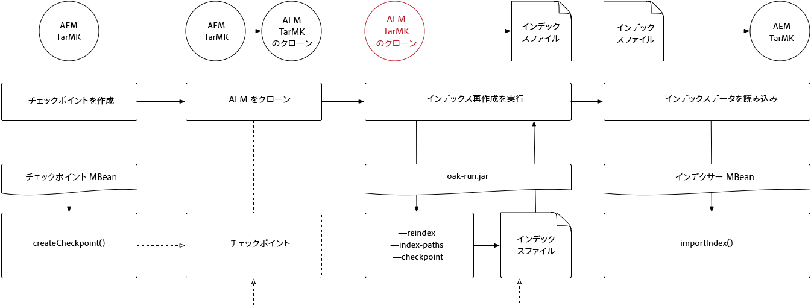

## インデックス作成定義の更新 {#updatingindexingdefinitions}

>[!NOTE]
>
>このシナリオについて詳しくは、[ユースケース 4 - インデックス定義の更新](/help/sites-deploying/oak-run-indexing-usecases.md#usecase4updatingindexdefinitions)を参照してください。

### ACS Ensure Index を使用した TarMK でのインデックス定義の作成と更新 {#creatingandupdatingindexdefinitionsontarmkusingacsensureindex}

>[!NOTE]
>
>ACS Ensure Index は、コミュニティでサポートされるプロジェクトで、Adobe・サポートではサポートされていません。

これにより、コンテンツパッケージを介したインデックス定義の発行が可能になり、後で reindex フラグをに設定してインデックスを再作成することができます。 `true`. これは、インデックス再作成に時間がかからない小規模な設定で機能します。

詳しくは、 [ACS Ensure Index ドキュメント](https://adobe-consulting-services.github.io/acs-aem-commons/features/ensure-oak-index/index.html) 」を参照してください。

### oak-run.jar を使用した TarMK でのインデックス定義の作成と更新 {#creatingandupdatingindexdefinitionsontarmkusingoak-run-jar}

`oak-run.jar` 以外の方法を使用したインデックス再作成の時間またはパフォーマンスへの影響が大きすぎる場合、次の `oak-run.jar` ベースのアプローチを使用して、TarMK ベースの AEM インストール環境に Lucene インデックス定義をインポートしてインデックスを再作成できます。

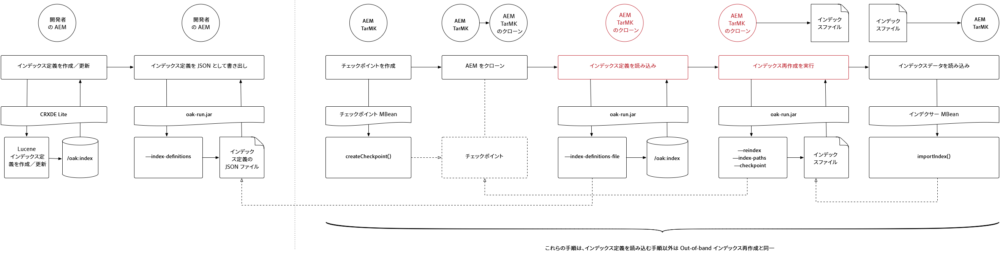

### oak-run.jar を使用した MonogMK でのインデックス定義の作成と更新 {#creatingandupdatingindexdefinitionsonmonogmkusingoak-run-jar}

`oak-run.jar` 以外の方法を使用したインデックス再作成の時間またはパフォーマンスへの影響が大きすぎる場合、次の `oak-run.jar` ベースのアプローチを使用して、MongoMK ベースの AEM インストール環境に Lucene インデックス定義をインポートしてインデックスを再作成できます。

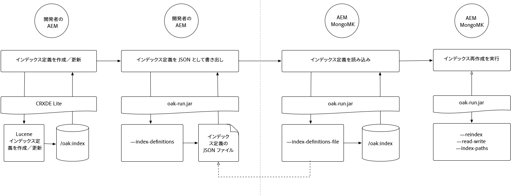
