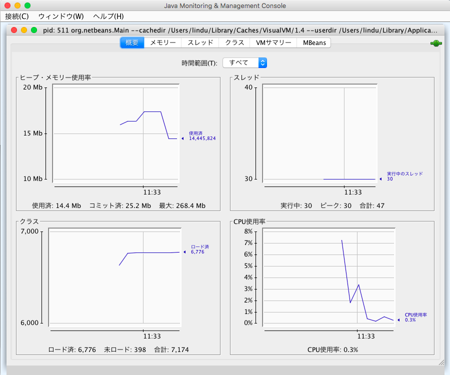

# AEM インスタンスの監視および保守{#monitoring-and-maintaining-your-aem-instance}

>[!CAUTION]
>
>AEM 6.4 の拡張サポートは終了し、このドキュメントは更新されなくなりました。 詳細は、 [技術サポート期間](https://helpx.adobe.com/jp/support/programs/eol-matrix.html). サポートされているバージョンを見つける [ここ](https://experienceleague.adobe.com/docs/?lang=ja).

AEM インスタンスがデプロイされた後は、操作、パフォーマンス、統合性を監視および保守するために、一定の作業が必要になります。

ここでの主な要因は、潜在的な問題を認識するために、システムが通常の状態でどのように見え、動作するかを知る必要がある点です。 これは、システムを監視し、一定期間にわたって情報を収集することで最も効果的です。

| チェック項目 | 検討事項 | コメント/アクション |
|---|---|---|
| バックアップ計画。 |  | 所要時間 [インスタンスのバックアップ](/help/sites-deploying/monitoring-and-maintaining.md#backups). |
| 災害復旧プラン | お客様の企業の災害復旧ガイドライン |  |
| 問題を報告するためのエラー追跡システムが利用可能であること | 例えば、[bugzilla](https://www.bugzilla.org/)、[jira](https://www.atlassian.com/software/jira/)、その他多数のうちいずれか。 |  |
| ファイル・システムが監視されている。 | 空きディスク領域が不十分な場合、CRX リポジトリは「フリーズ」します。 スペースが利用可能になると、再開されます。 | 空き容量が少なくなると、「`*ERROR* LowDiskSpaceBlocker`」メッセージがログファイルに表示されます。 |
| [ログファイル](/help/sites-deploying/monitoring-and-maintaining.md#working-with-audit-records-and-log-files)が監視されていること |  |  |
| システム監視は（常に）バックグラウンドで実行されています。 | CPU、メモリ、ディスク、ネットワーク使用量を含みます。 例えば、iostat / vmstat / perfmon を使用します。 | ログに記録されたデータは視覚化され、パフォーマンスの問題の追跡に使用できます。 生データにもアクセスできます。 |
| [AEMのパフォーマンスが監視されています](/help/sites-deploying/monitoring-and-maintaining.md#monitoring-performance). | 次を含む [要求カウンター](/help/sites-deploying/monitoring-and-maintaining.md#request-counters) トラフィックレベルを監視する。 | パフォーマンスが大幅に低下した、または長期的に低下した場合は、詳細な調査を行う必要があります。 |
| [レプリケーションエージェント](/help/sites-deploying/monitoring-and-maintaining.md#monitoring-your-replication-agents)を監視していること。 |  |  |
| ワークフローインスタンスを定期的にパージします。 | リポジトリのサイズとワークフローのパフォーマンス。 | 詳しくは、 [ワークフローインスタンスの定期的なパージ](/help/sites-administering/workflows-administering.md#regular-purging-of-workflow-instances). |

## バックアップ {#backups}

次のバックアップを実行することをお勧めします。

* ソフトウェアのインストール — 構成の大幅な変更の前後
* リポジトリ内に保持されるコンテンツ — 定期的

おそらく、お客様の会社には、従う必要のあるバックアップポリシーが用意されています。その他の考慮事項と、バックアップの対象となるタイミングについては、次の点が考慮されます。

* システムとデータの重要性。
* ソフトウェアまたはデータの変更頻度。
* データ量バックアップの実行に必要な時間と同様に、容量が問題になる場合があります。
* ユーザーがオンライン中にバックアップを実施できるかどうか。可能な場合は、パフォーマンスへの影響。
* ユーザの地理的分布（影響を最小限に抑えるために）バックアップする最適なタイミングはいつですか？
* 災害復旧ポリシーバックアップ・データの格納先に関するガイドライン（オフサイト、特定のメディアなど）があります。

多くの場合、フル・バックアップは定期的に（日別、週別、月別など）実行され、差分バックアップはその間（時間別、日別、週別など）に行われます。

>[!CAUTION]
>
>*実稼動インスタンスのバックアップを実装するときは、バックアップを正常に復元できることを確認するために、テストをおこなう必要があります。*
>
>そうしないと、最悪の場合、バックアップが無駄になる可能性があります。

>[!NOTE]
>
>バックアップのパフォーマンスの詳細については、 [バックアップのパフォーマンス](/help/sites-deploying/configuring-performance.md#backup-performance) 」セクションに入力します。

### ソフトウェアインストールのバックアップ {#backing-up-your-software-installation}

インストール後、または設定の大幅な変更後は、ソフトウェアのインストールのバックアップを作成します。

これをおこなうには、次の手順を実行します。 [リポジトリ全体のバックアップ](#backing-up-your-repository) そして次に、

1. AEMを停止します。
1. ファイルシステムから `<cq-installation-dir>` 全体をバックアップします。

>[!CAUTION]
>
>サードパーティ製のアプリケーションサーバーを使用している場合は、追加のフォルダーが別の場所に存在し、そのフォルダーのバックアップも必要になることがあります。アプリケーションサーバーのインストールについて詳しくは、[アプリケーションサーバーと共に AEM をインストールする方法](/help/sites-deploying/application-server-install.md)を参照してください。

>[!CAUTION]
>
>ファイルデータストアの増分バックアップがサポートされています。他のコンポーネント（Lucene インデックスなど）に対して増分バックアップを使用する場合は、削除されたファイルもバックアップで削除済みとしてマークされるようにしてください。

>[!NOTE]
>
>ディスク・ミラーリングは、バックアップ・メカニズムとしても使用できます。

### リポジトリのバックアップ {#backing-up-your-repository}

この [バックアップと復元](/help/sites-administering/backup-and-restore.md) CRX リポジトリのバックアップに関するすべての問題については、CRX ドキュメントの節で説明しています。

オンラインの「ホット」バックアップの作成の詳細については、を参照してください。 [オンラインバックアップの作成](/help/sites-administering/backup-and-restore.md#online-backup).

## バージョンのパージ {#version-purging}

この **バージョンをパージ** このツールは、リポジトリ内のノードまたはノードの階層のバージョンをパージすることを目的としています。 その主な目的は、古いバージョンのノードを削除して、リポジトリのサイズを小さくすることです。

この節では、AEMのバージョン管理機能に関連するメンテナンス操作について説明します。 この **バージョンをパージ** このツールは、リポジトリ内のノードまたはノードの階層のバージョンをパージすることを目的としています。 その主な目的は、古いバージョンのノードを削除して、リポジトリのサイズを小さくすることです。

### 概要 {#overview}

**バージョンのパージ**&#x200B;ツールは、**[ツール](/help/sites-administering/tools-consoles.md)コンソール**&#x200B;の「**バージョン管理**」の下か、次の場所にあります。

`https://<server>:<port>/etc/versioning/purge.html`


**開始パス** パージを実行する必要がある場所の絶対パスです。リポジトリツリーナビゲーターをクリックして「開始パス」を選択できます。

**繰り返し** データをパージする際は、「繰り返し」を選択して、1 つのノードで操作を実行するか、階層全体で操作を実行するかを選択できます。後者の場合は、指定したパスが階層のルートノードを定義します。

**保持するバージョンの最大数** ノード用に保持するバージョンの最大数。バージョンの数がこの値を超えると、最も古いバージョンがパージされます。

**バージョンの最長有効期間** ノードのバージョンの最長有効期間。バージョンの期間がこの値を超えると、パージされます。

**ドライラン** コンテンツのバージョンの削除は取り消しできず、元に戻すにはバックアップを復元するしかないので、バージョンのパージツールでは、パージ対象のバージョンをプレビューできるドライランモードが提供されています。パージ処理のドライランを開始するには、「ドライラン」をクリックします。

**パージ** 「開始パス」で定義したノードでバージョンのパージを開始します。

### Web サイトのバージョンのパージ {#purging-versions-of-a-web-site}

Web サイトのバージョンをパージするには、次の手順を実行します。

1. 次に移動： **[ツール](/help/sites-administering/tools-consoles.md) コンソール**&#x200B;を選択します。 **バージョン管理** をクリックし、ダブルクリックします。 **バージョンをパージ**.
1. パージ対象のコンテンツの開始パスを設定します（例：`/content/geometrixx-outdoors`）。

   * パスで定義されたノードのみをパージする場合は、選択を解除します **再帰**.
   * パスとその下位ノードで定義されたノードをパージする場合は、「 」を選択します。 **再帰**.

1. 保持するバージョンの最大数（ノードごと）を設定します。この設定を使用しない場合は、空のままにします。

1. 保持するバージョンの最長有効期間（ノードごと）を日数で設定します。この設定を使用しない場合は、空のままにします。

1. 「**ドライラン**」をクリックして、パージプロセスによる処理をプレビューします。
1. 「**パージ**」をクリックして処理を開始します。

>[!CAUTION]
>
>パージされたノードを元に戻すには、リポジトリを復元するしかありません。設定は自己管理する必要があるので、パージの前に必ずドライランを実行することをお勧めします。

### コンソールの分析 {#analyzing-the-console}

「**ドライラン**」と「**パージ**」の処理では、処理されたすべてのノードがリストされます。処理の間、ノードのステータスは次のうちいずれかになります。

* `ignore (not versionnable)`：ノードはバージョン管理をサポートしないので、処理中は無視されます。
* `ignore (no version)`：ノードにバージョンが含まれていないので、処理中は無視されます。
* `retained`：ノードはパージされません。
* `purged`：ノードはパージされます。

さらに、コンソールでは、バージョンに関して次のような有益な情報が提供されます。

* `V 1.0`：バージョン番号。
* `V 1.0.1`&amp;ast;:星は、バージョンが現在のバージョンであることを示します。
* `Thu Mar 15 2012 08:37:32 GMT+0100`：バージョンの日付。

例を以下に示します。

* この **シャツ** バージョンの年齢が 2 日を超えているので、バージョンはパージされます。
* この **トンガ・ファッションズ！** バージョンの数が 5 を超えているので、バージョンはパージされます。


## 監査レコードとログファイルの操作 {#working-with-audit-records-and-log-files}

Adobe Experience Manager(AEM) に関する監査レコードおよびログファイルは、様々な場所で見つけることができます。 次に、場所の概要を示します。

### ログの使用 {#working-with-logs}

AEM WCM は詳細なログを記録します。 クイックスタートを解凍して起動した後、次の場所でログを検索できます。

* `<cq-installation-dir>/crx-quickstart/logs/`
* `<cq-installation-dir>/crx-quickstart/repository/`

#### ログファイルのローテーション {#log-file-rotation}

ログファイルのローテーションとは、定期的に新しいファイルを作成することによってファイルサイズの拡大を制限するプロセスのことです。AEM では、`error.log` というログファイルが、以下のルールに従って 1 日 1 回ローテーションされます。

* `error.log` ファイルは、{original_filename} `.yyyy-MM-dd` というパターンに従って名前が変更されます。例えば、2010年7月11日時点であれば、現在のログファイルの名前は `error.log-2010-07-10` に変更され、新しい `error.og` が作成されます。
* 以前のログファイルは削除されないので、古いログファイルを定期的にクリーンアップして、ディスクの使用量を制限する必要があります。

>[!NOTE]
>
>AEM をアップグレードする場合は、AEM でこれ以上使用されない既存のログファイルがディスク上に残ることに注意してください。これらは削除しても問題ありません。新しいログエントリはすべて、新しいログファイルに書き込まれます。

### ログファイルの検索 {#finding-the-log-files}

AEMをインストールしたファイルサーバーには、次のような様々なログファイルが保持されます。

* `<cq-installation-dir>/crx-quickstart/logs`

   * `access.log`

      
AEM WCM およびリポジトリに対するアクセス要求はすべてここに登録されます。

   * `audit.log`

      
モデレートアクションはここに登録されます。

   * `error.log`

      
エラーメッセージ（様々な深刻度レベル）はここに登録されます。

   * [ `ImageServer-<PortId>-yyyy>-<mm>-<dd>.log`](https://experienceleague.adobe.com/docs/dynamic-media-developer-resources/image-serving-api/image-serving-api/config-admin/server-logging/c-image-server-log.html?lang=ja)

      このログは、Dynamic Media が有効な場合にのみ使用されます。 内部の ImageServer プロセスの動作を分析するための統計情報と分析情報を提供します。

   * `request.log`

      
各アクセス要求が、応答と共にここに登録されます。

   * [ `s7access-<yyyy>-<mm>-<dd>.log`](https://experienceleague.adobe.com/docs/dynamic-media-developer-resources/image-serving-api/image-serving-api/config-admin/server-logging/c-access-log.html?lang=ja)

      このログは、Dynamic Media が有効な場合にのみ使用されます。 s7access ログは、を通じてDynamic Mediaに対しておこなわれた各要求を記録します。 `/is/image` および `/is/content`.

   * `stderr.log`

      
起動時に生成される様々な深刻度レベルのエラーメッセージを保持します。デフォルトでは、ログレベルはに設定されています。 `Warning` ( `WARN`)

   * `stdout.log`

      
起動時のイベントを示すログメッセージを保持します。

   * `upgrade.log`

      から実行されるすべてのアップグレード操作のログを提供します。 `com.day.compat.codeupgrade` および `com.adobe.cq.upgradesexecutor` パッケージ。

* `<cq-installation-dir>/crx-quickstart/repository`

   * `revision.log`

      
リビジョンジャーナル処理の情報。

>[!NOTE]
>
>ImageServer と s7access のログは、 **完全にダウンロード** 次から生成されたパッケージ **system/console/status-Bundlelist** ページ。 サポートのために、Dynamic Mediaで問題が発生した場合は、カスタマーサポートに連絡する際に、ImageServer と s7access ログも追加してください。

### デバッグログレベルのアクティベート {#activating-the-debug-log-level}

デフォルトのログレベル [Apache Sling Logging Configuration](/help/sites-deploying/osgi-configuration-settings.md#osgi-configuration-settings) は情報なので、デバッグメッセージはログに記録されません。

ロガーのデバッグログレベルをアクティブにするには、リポジトリでプロパティ `org.apache.sling.commons.log.level` をデバッグに設定します。例えば、`/libs/sling/config/org.apache.sling.commons.log.LogManager` で [global Apache Sling Logging](/help/sites-deploying/osgi-configuration-settings.md#osgi-configuration-settings) を設定します。

>[!CAUTION]
>
>多数のログエントリが生成され、リソースを消費するので、デバッグログレベルのログを必要以上に長く残さないでください。

デバッグファイルの行は、通常は DEBUG で始まり、ログレベル、インストーラーのアクション、ログメッセージを示します。 次に例を示します。

```shell
DEBUG 3 WebApp Panel: WebApp successfully deployed
```

ログレベルは次のとおりです。

| 0 | 致命的なエラー | アクションに失敗したので、インストーラーを続行できません。 |
|---|---|---|
| 1 | エラー | アクションが失敗しました。 インストールは続行しますが、AEM WCM の一部が正常にインストールされなかったので、機能しません。 |
| 2 | 警告 | アクションは成功しましたが、問題が発生しました。 AEM WCM は正常に機能する場合と機能しない場合があります。 |
| 3 | 情報 | アクションが成功しました。 |

### カスタムログファイルの作成 {#create-a-custom-log-file}

>[!NOTE]
>
>Adobe Experience Managerを操作する場合、このようなサービスの設定を管理する方法はいくつかあります。参照 [OSGi の設定](/help/sites-deploying/configuring-osgi.md) を参照してください。

状況によっては、異なるログレベルでカスタムログファイルを作成する必要があります。 リポジトリでは、次の方法で実行できます。

1. 既存のものがない場合は、新しい設定フォルダー（`sling:Folder`）を、プロジェクト（`/apps/<project-name>/config`）用に作成します。
1. `/apps/<project-name>/config` の下に、新しい [Apache Sling Logging Logger Configuration](/help/sites-deploying/osgi-configuration-settings.md#osgi-configuration-settings) 用のノードを作成します。

   * 名前：

   `org.apache.sling.commons.log.LogManager.factory.config-<identifier>` （ロガーの場合）

   `<identifier>` の部分は、インスタンスを識別するフリーテキストに置き換えます（この情報は省略できません）。例：`org.apache.sling.commons.log.LogManager.factory.config-MINE`

   * 型：`sling:OsgiConfig`
   >[!NOTE]
   >
   >技術的に必須ではありませんが、`<identifier>` は一意にすることをお勧めします。

1. このノードで次のプロパティを設定します。

   * 名前：`org.apache.sling.commons.log.file`

      タイプ：String

      値：ログファイルを指定します。例：`logs/myLogFile.log`

   * 名前：`org.apache.sling.commons.log.names`

      型：`String[] (String + Multi)`

      値：ロガーによってメッセージをログに記録する OSGi サービスを指定します。例えば、以下すべてを指定します。

      * `org.apache.sling`
      * `org.apache.felix`
      * `com.day`
   * 名前：`org.apache.sling.commons.log.level`

      タイプ：String

      値：必要なログレベル（`debug`、`info`、`warn`、`error` のいずれか）例： `debug`

   * 必要に応じてその他のパラメーターを設定します。

      * 名前：`org.apache.sling.commons.log.pattern`

         型：`String`

         値：必要に応じてログメッセージのパターンを指定します。次に例を示します。

         `{0,date,dd.MM.yyyy HH:mm:ss.SSS} *{4}* [{2}] {3} {5}`
   >[!NOTE]
   >
   >`org.apache.sling.commons.log.pattern` では、最大 6 個の引数がサポートされています。
   >
   >{0} タイプ `java.util.Date` のタイムスタンプ
   >
   >{1} ログマーカー
   >
   >{2} 現在のスレッドの名前
   >
   >{3} ロガーの名前
   >
   >{4} ログレベル
   >
   >{5} ログメッセージ
   >
   >ログ呼び出しに `Throwable` が含まれている場合は、スタックトレースがメッセージに付加されます。

   >[!CAUTION]
   >
   >org.apache.sling.commons.log.names には値が必要です。

   >[!NOTE]
   >
   >ログライターのパスは、`crx-quickstart` の場所と相対的です。
   >
   >したがって、ログファイルが
   >
   >`logs/thelog.log`
   >
   >と指定されている場合、書き込み先は以下となります。
   >
   >`<cq-installation-dir>/crx-quickstart/logs/thelog.log`。
   >
   >また、ログファイルが
   >
   >`../logs/thelog.log`
   >
   >と指定されている場合、書き込み先は以下のディレクトリとなります。
   >
   >`<cq-installation-dir>/logs/`\
   >（例：`<cq-installation-dir>/crx-quickstart/` の次）

1. この手順は、新しいライターが必要な場合（つまり、デフォルトのライターとは異なる設定の場合）にのみ必要です。

   >[!CAUTION]
   >
   >新しい Logging Writer Configuration は、既存のデフォルトが適切でない場合にのみ必要です。\
   >明示的なライターが設定されていない場合は、デフォルトに基づいて暗黙のライターが自動的に生成されます。

   `/apps/<project-name>/config` の下に、新しい [Apache Sling Logging Writer Configuration](/help/sites-deploying/osgi-configuration-settings.md#osgi-configuration-settings) 用のノードを作成します。

   * 名前：`org.apache.sling.commons.log.LogManager.factory.writer-<identifier>`（Writer の場合）

      Logger の場合のように、`<identifier>` の部分は、インスタンスを識別するフリーテキストに置き換えます（この情報は省略できません）。例：`org.apache.sling.commons.log.LogManager.factory.writer-MINE`

   * 型：`sling:OsgiConfig`
   >[!NOTE]
   >
   >技術的に必須ではありませんが、`<identifier>` は一意にすることをお勧めします。

   このノードで次のプロパティを設定します。

   * 名前：`org.apache.sling.commons.log.file`

      型：`String`

      値：Logger で指定したファイルと一致するようにログファイルを指定します。

      この例の場合は `../logs/myLogFile.log` です。

   * 必要に応じてその他のパラメーターを設定します。

      * 名前：`org.apache.sling.commons.log.file.number`

         型：`Long`

         値：保持するログファイルの数を指定します。例えば、`5` とします。

      * 名前：`org.apache.sling.commons.log.file.size`

         型：`String`

         値：ファイルのローテーションをサイズや日付によって制御するために、必要に応じて指定します。例えば、`'.'yyyy-MM-dd` とします。
   >[!NOTE]
   >
   >`org.apache.sling.commons.log.file.size` は、次のいずれかを設定することによって、ログファイルのローテーションを制御します。
   >
   >* 最大ファイルサイズ
   >* 時刻／日付のスケジュール

   >
   >これにより、新しいファイルを作成する（また、名前のパターンに従って既存のファイルを名前変更する）条件を示します。
   >
   >* サイズの制限は数値で指定できます。サイズインジケーターが指定されていない場合、これはバイト数と見なされます。または、サイズインジケーターの 1 つ（`KB`、`MB`、`GB` のいずれか）を追加できます（大文字と小文字は区別されません）。
   >* 日時スケジュールは、`java.util.SimpleDateFormat` パターンとして指定できます。これは、ファイルがローテーションされるまでの期間と、ローテーションされたファイルに追加されるサフィックス（識別用）を定義します。

   >
   >デフォルトは「.」です。yyyy-MM-dd（毎日のログローテーションの場合）
   >
   >例えば、2010年1月20日午前 0 時（またはこの後の最初のログメッセージが正確になった場合）に、../logs/error.log は ../logs/error.log.2010-01-20 に名前が変更されます。1月21日のログは、次の日の変更時にロールオーバーされるまで、../logs/error.log（新しく空のもの）に出力されます。
   >
   >| `'.'yyyy-MM` | 毎月の初めにローテーション。 |
   >|---|---|
   >| `'.'yyyy-ww` | 毎週最初の日（ロケールによって異なる）にローテーション。 |
   >| `'.'yyyy-MM-dd` | 毎日深夜 12 時にローテーション。 |
   >| `'.'yyyy-MM-dd-a` | 毎日深夜 12 時および正午にローテーション。 |
   >| `'.'yyyy-MM-dd-HH` | 毎正時にローテーション。 |
   >| `'.'yyyy-MM-dd-HH-mm` | 毎分の初めにローテーション。 |
   >
   >メモ：日時を指定する場合：
   > 1. 一重引用符（&#39; &#39;）の範囲内で、リテラルテキストを「エスケープ」する必要があります。
      >
      >     これは、特定の文字がパターン文字として解釈されるのを防ぐためです。
   >
   >  1. オプションの任意の場所で、有効なファイル名に使用できる文字のみを使用します。


1. 任意のツールで新しいログファイルを読み取ります。

   この例で作成されるログファイルは `../crx-quickstart/logs/myLogFile.log` となります。

Felix コンソールでは、`../system/console/slinglog` の Sling Log Support に関する情報も提供されます。例えば、`http://localhost:4502/system/console/slinglog`. です。

### 監査レコードの検索 {#finding-the-audit-records}

監査記録は、誰がいつ何をしたかを記録するために保持されます。 AEM WCM と OSGi の両方のイベントに対して、異なる監査レコードが生成されます。

#### ページオーサリング時に表示されるAEM WCM 監査レコード {#aem-wcm-audit-records-shown-when-page-authoring}

1. ページを開きます。
1. サイドキックから、ロックアイコン付きのタブを選択し、 **監査ログ…**
1. 新しいウィンドウが開き、現在のページの監査レコードのリストが表示されます。

   

1. クリック **OK** ウィンドウを閉じるとき。

#### リポジトリ内のAEM WCM 監査レコード {#aem-wcm-auditing-records-within-the-repository}

`/var/audit` フォルダー内で、監査レコードは、リソースに応じて保持されます。個々のレコードとそのレコードに含まれる情報が表示されるまでドリルダウンできます。

これらのエントリには、ページの編集時に表示される情報と同じ情報が含まれます。

#### Web コンソールからの OSGi 監査レコード {#osgi-audit-records-from-the-web-console}

OSGi イベントで生成される監査記録は、AEM Web コンソールの「**設定ステータス**」タブ／「**ログファイル**」タブから確認できます。 


## レプリケーションエージェントの監視 {#monitoring-your-replication-agents}

次の項目を監視できます： [レプリケーションキュー](/help/sites-deploying/replication.md) キューが停止したかブロックされたかを検出するには、次の手順を実行します。この場合、パブリッシュインスタンスまたは外部システムに問題がある可能性があります。

* すべての必須キューを有効にしますか？
* 無効なキューがまだ必要か
* `enabled`（有効な状態）のキューはすべて、ステータスが `idle` または `active` であり、これは正常な動作を示します。キューを `blocked`（ブロック状態）にしてはいけません。ブロックされている場合、多くは受信者側に問題があります。

* 時間の経過と共にキューのサイズが大きくなる場合は、キューがブロックされている可能性があります。

レプリケーションエージェントを監視するには：

1. 次にアクセス： **ツール** 」タブをAEMでクリックします。
1. クリック **レプリケーション**.
1. 適切な環境のエージェントへのリンク（左または右のウィンドウ）をダブルクリックします。例： **作成者のエージェント**.

   表示されるウィンドウには、オーサー環境のすべてのレプリケーションエージェントの概要が表示されます。この概要には、ターゲットとステータスも含まれます。

1. 適切なエージェント名（リンク）をクリックすると、そのエージェントに関する詳細情報が表示されます。

   

   ここでは、以下のことができます。

   * エージェントが有効かどうかを確認します。
   * レプリケーションのターゲットを確認します。
   * レプリケーションキューが現在アクティブ（有効）かどうかを確認します。
   * キュー内に項目があるかどうかを確認します。
   * **更新** または **クリア** キュー・エントリの表示を更新するこれにより、キューに入って離れた項目を確認できます。
   * **ログを表示** をクリックして、レプリケーションエージェントによるアクションのログにアクセスします。
   * **接続をテスト** をターゲットインスタンスに追加します。
   * **再試行を強制** （必要に応じて、すべてのキュー項目）に対して実行します。

   >[!CAUTION]
   >
   >パブリッシュインスタンスのリバースレプリケーションアウトボックスには、「接続をテスト」リンクを使用しないでください。
   >
   >アウトボックスクエリ用にレプリケーションテストが実行されると、リバースレプリケーションのたびに、テストレプリケーションより古い項目がすべて再処理されます。
   >
   >そのような項目がキュー内に既に存在する場合は、次の XPath JCR クエリを使用して検索し、削除する必要があります。
   >
   >`/jcr:root/var/replication/outbox//*[@cq:repActionType='TEST']`

ここでも、すべてのレプリケーションエージェント（`/etc/replication/author` または `/etc/replication/publish` の下）を検出して、エージェントのステータス（`enabled`、`disabled`）および基になるキューのステータス（`active`、`idle`、`blocked`）を確認するソリューションを開発できます。

## パフォーマンスの監視 {#monitoring-performance}

[パフォーマンスの最適化](/help/sites-deploying/configuring-performance.md)は、開発時に注目を集めるインタラクティブなプロセスです。デプロイメント後、通常は特定の間隔またはイベントの後でレビューされます。

最適化のための情報収集に使用する方法は、継続中の監視にも使用できます。

>[!NOTE]
>
>具体的な[パフォーマンス向上のための設定](/help/sites-deploying/configuring-performance.md#configuring-for-performance)も確認できます。

以下のリストは、よく発生するパフォーマンス上の問題と、それぞれの見分け方および対策を示しています。

| 領域 | 症状 | 容量を増やすには… | ボリュームを減らすには… |
|---|---|---|---|
| クライアント | クライアントの CPU 使用率が高くなります。 | より高いパフォーマンスでクライアント CPU をインストールします。 | (HTML) レイアウトを簡素化します。 |
|  | サーバーの CPU 使用率が低い。 | より高速なブラウザーにアップグレードします。 | クライアント側のキャッシュを改善します。 |
|  | 高速のクライアントと低速のクライアントがある。 |  |  |
| サーバー |  |  |  |
| ネットワーク | サーバーとクライアントの両方で CPU 使用率が低い。 | ネットワークのボトルネックを解消します。 | クライアントキャッシュの設定を改善/最適化します。 |
|  | サーバー上のローカルでの閲覧は（比較的）高速です。 | ネットワーク帯域幅を増やします。 | Web ページの「重み付け」を軽減します ( 例：画像の量を減らし、HTMLを最適化 )。 |
| Web サーバー | Web サーバーの CPU 使用率が高い。 | Web サーバーをクラスター化します。 | ページあたりのヒット数を減らす（訪問）。 |
|  |  | ハードウェアのロードバランサーを使用。 |  |
| アプリケーション | サーバの CPU 使用率が高い。 | AEMインスタンスをクラスター化します。 | CPU およびメモリが集中的に使用されている箇所を検索して除去（コードレビュー、タイミング出力などを使用）。 |
|  | メモリ消費率が高い。 |  | すべてのレベルでキャッシュを改善。 |
|  | 応答時間が遅い。 |  | テンプレートとコンポーネントを最適化します（構造、ロジックなど）。 |
| リポジトリ |  |  |  |
| キャッシュ |  |  |  |

パフォーマンスの問題は、接続速度の一時的な低下、CPU 負荷など、Web サイトとは何の関係もない多くの原因に起因する場合があります。

また、すべての訪問者に影響を与えるか、一部の訪問者にのみ影響を与える場合があります。

この情報をすべて入手し、分類および分析して初めて、一般的なパフォーマンスを最適化したり、特定の問題を解決したりできます。

* パフォーマンスに関する問題が発生する前に、次の手順に従ってください。

   * 通常の状況下で、システムに関する十分な実務知識を構築するためにできるだけ多くの情報を収集する

* パフォーマンスの問題が発生した場合：

   * 1 つ（または複数）の標準の Web ブラウザーを使用して、（可能であれば）サーバー自体や一般的なパフォーマンスが優れていることがわかっている別のクライアント上で、それをレプリケートしてみます。
   * （システムに関連する）何かが適切な時間内に変更されたかどうか、およびこれらの変更がパフォーマンスに影響を与えた可能性があるかどうかを確認します
   * 次のような質問をします。

      * 問題は特定の時間にのみ発生しますか？
      * 問題は特定のページでのみ発生しますか？
      * 他のリクエストに影響があるか
   * 通常の状況でのシステムに関する知識と比較できるだけ多くの情報を収集します。


### パフォーマンスの監視および分析用ツール {#tools-for-monitoring-and-analyzing-performance}

次に、パフォーマンスの監視と分析に使用できるツールの一部の概要を示します。

これらの一部は、オペレーティングシステムに依存します。

<table> 
 <tbody> 
  <tr> 
   <td>ツール</td> 
   <td>分析に使用…</td> 
   <td>使用状況/詳細情報…</td> 
  </tr> 
  <tr> 
   <td>request.log</td> 
   <td>応答時間と同時実行性。</td> 
   <td><a href="#interpreting-the-request-log">request.log の解釈</a>.</td> 
  </tr> 
  <tr> 
   <td>トラス/ストレース</td> 
   <td>ページ読み込み</td> 
   <td><p>システムの呼び出しおよびシグナルをトレースする Unix／Linux コマンド。ログレベルを <code>INFO</code> に上げます。</p> <p>リクエストごとのページ読み込み数（ページなど）を分析します。</p> </td> 
  </tr> 
  <tr> 
   <td>スレッドダンプ</td> 
   <td>JVM スレッドを観察します。 競合、ロック、および長期実行者を特定します。</td> 
   <td><p>オペレーティングシステムによって異なります。<br /> - Unix／Linux：<code>kill -QUIT &lt;<em>pid</em>&gt;</code><br /> - Windows（コンソールモード）：Ctrl キーを押しながら Break キーをクリック<br /> </p> <p>また、 <a href="https://java.net/projects/tda/">TDA</a>.<br /> </p> </td> 
  </tr> 
  <tr> 
   <td>ヒープダンプ</td> 
   <td>パフォーマンスが低下する原因となるメモリ不足の問題。</td> 
   <td><p>AEM に対する Java 呼び出しに、<br />「<code>-XX:+HeapDumpOnOutOfMemoryError</code><br />」オプションを追加します。</p> <p>詳しくは、 <a href="https://java.sun.com/javase/6/webnotes/trouble/TSG-VM/html/clopts.html#gbzrr">HotSpot VM を使用した Java SE 6 のトラブルシューティング・ガイド</a>.</p> </td> 
  </tr> 
  <tr> 
   <td>システムコール</td> 
   <td>タイミングの問題を特定します。</td> 
   <td><p><code>System.currentTimeMillis()</code> または <code>com.day.util</code> に対する呼び出し。タイミングはコードから、または <a href="#html-comments">HTML コメント</a>経由でタイムスタンプを生成するために使用します。</p> <p><strong>注意：</strong> 必要に応じてアクティベート/アクティベート解除できるように、これらを実装する必要があります。システムがスムーズに稼働している場合は、統計を収集するオーバーヘッドは不要です。</p> </td> 
  </tr> 
  <tr> 
   <td>Apache Bench</td> 
   <td>メモリリークを特定し、応答時間を選択的に分析します。</td> 
   <td><p>基本的な使用方法は次のとおりです。</p> <p><code>ab -k -n &lt;<em>requests</em>&gt; -c &lt;<em>concurrency</em>&gt; &lt;<em>url</em>&gt;</code></p> <p>詳しくは、<a href="#apache-bench">Apache Bench</a> および <a href="https://httpd.apache.org/docs/2.2/programs/ab.html">ab man ページ</a>を参照してください。</p> </td> 
  </tr> 
  <tr> 
   <td>Search Analysis</td> 
   <td> </td> 
   <td>検索クエリをオフラインで実行し、クエリの応答時間を特定し、結果セットをテストして確認します。<br /> </td> 
  </tr> 
  <tr> 
   <td>JMeter</td> 
   <td>読み込みおよび機能テスト。</td> 
   <td><a href="https://jakarta.apache.org/jmeter/">https://jakarta.apache.org/jmeter/</a></td> 
  </tr> 
  <tr> 
   <td>JProfiler</td> 
   <td>CPU とメモリの詳細なプロファイル。</td> 
   <td><a href="https://www.ej-technologies.com/">https://www.ej-technologies.com/</a></td> 
  </tr> 
  <tr> 
   <td>JConsole</td> 
   <td>JVM の指標とスレッドを観察します。</td> 
   <td><p>使用方法：jconsole</p> <p><a href="https://java.sun.com/developer/technicalArticles/J2SE/jconsole.html">jconsole</a> および <a href="#monitoring-performance-using-jconsole">JConsole を使用したパフォーマンスの監視</a> を参照してください。</p> <p><strong>メモ：</strong>JDK 1.6 では、Top や TDA（Thread Dump Analyzer）などのプラグインを使用して JConsole を拡張できます。</p> </td> 
  </tr> 
  <tr> 
   <td>Java VisualVM</td> 
   <td>JVM 指標、スレッド、メモリおよびプロファイルを観察します。</td> 
   <td><p>使用方法：jvisualvm または visualvm<br /> </p> <p>詳しくは、 <a href="https://java.sun.com/javase/6/docs/technotes/tools/share/jvisualvm.html">jvisualvm</a>, <a href="https://visualvm.github.io/releases.html">visualvm</a> および <a href="#monitoring-performance-using-j-visualvm">(J)VisualVM を使用したパフォーマンスの監視</a>.</p> <p><strong>メモ：</strong>JDK 1.6 では、プラグインを使用して VisualVM を拡張できます。</p> </td> 
  </tr> 
  <tr> 
   <td>トラス、ストラス、lsof</td> 
   <td>詳細なカーネル呼び出しとプロセス分析 (Unix)。</td> 
   <td>Unix/Linux コマンド。</td> 
  </tr> 
  <tr> 
   <td>タイミング統計</td> 
   <td>ページのレンダリングのタイミングの統計を参照してください。</td> 
   <td><p>ページレンダリングのタイミングの統計を確認するには、<strong>Ctrl と Shift キーを押しながら U キーをクリック</strong>し、URL で設定されている <code>?debugClientLibs=true</code> と共に使用します。</p> </td> 
  </tr> 
  <tr> 
   <td>CPU およびメモリプロファイリングツール<br /> </td> 
   <td><a href="#interpreting-the-request-log">開発中に低速の要求を分析する際に使用</a>。</td> 
   <td>例えば、<a href="https://www.yourkit.com/">YourKit</a> などです。</td> 
  </tr> 
  <tr> 
   <td><a href="#information-collection">情報収集</a></td> 
   <td>インストールの進行中の状態。</td> 
   <td>また、インストールに関する情報を可能な限り把握することで、パフォーマンスの変化の原因となった可能性がある項目を追跡し、その変更が正当かどうかを確認するのに役立ちます。 これらの指標は、大幅な変更を簡単に確認できるよう、一定の間隔で収集する必要があります。</td> 
  </tr> 
 </tbody> 
</table>

### request.log の解釈 {#interpreting-the-request-log}

このファイルは、AEMに対しておこなわれたすべてのリクエストに関する基本情報を登録します。 この貴重な結論から抜き出すことができる。

`request.log` は、リクエストにかかる時間を確認するための組み込みの方法を提供します。開発目的では、`request.log` を `tail -f` して、応答時間の遅延を監視することが有用です。より大きな `request.log` を分析するには、[応答時間の並べ替えおよびフィルタリングが可能な `rlog.jar` の使用を推奨します](#using-rlog-jar-to-find-requests-with-long-duration-times)。

「遅い」ページを `request.log` から分離してから、パフォーマンスを向上させるために個別に調整することをお勧めします。これは、通常、コンポーネントごとのパフォーマンス指標を含めるか、` [yourkit](https://www.yourkit.com/)` のようなパフォーマンスプロファイルツールを使用して行います。

#### Web サイト上のトラフィックの監視 {#monitoring-traffic-on-your-website}

リクエストログは、おこなわれた各リクエストと、おこなわれた応答を登録します。

```xml
09:43:41 [66] -> GET /author/y.html HTTP/1.1
09:43:41 [66] <- 200 text/html 797ms
```

特定の期間（例：様々な 24 時間以上）内のすべてのGETエントリを合計することで、Web サイトの平均トラフィックに関する情報を提供できます。

#### request.log を使用した応答時間の監視 {#monitoring-response-times-with-the-request-log}

パフォーマンス分析は、request.log から始めることをお勧めします。

`<cq-installation-dir>/crx-quickstart/logs/request.log`

ログは次のようになります（行が短くなり、簡単になります）。

```xml
31/Mar/2009:11:32:57 +0200 [379] -> GET /path/x HTTP/1.1 
31/Mar/2009:11:32:57 +0200 [379] <- 200 text/html 33ms 
31/Mar/2009:11:33:17 +0200 [380] -> GET /path/y HTTP/1.1 
31/Mar/2009:11:33:17 +0200 [380] <- 200 application/json 39ms
```

このログは、リクエストまたは応答ごとに 1 行です。

* 各リクエストまたは応答がおこなわれた日付。
* リクエストの番号を角括弧で囲みます。 この数は、リクエストと応答に一致します。
* リクエスト（右向き矢印）か応答（左向き矢印）かを示す矢印です。
* 要求の行には、以下が含まれます。

   * メソッド ( 通常、GET、HEAD、POST)
   * リクエストされたページ
   * 議定書

* 応答の行には、以下が含まれます。

   * ステータスコード (200 は「成功」を表し、404 は「ページが見つかりません」を表します。
   * MIME タイプ
   * 応答時間

小さなスクリプトを使用して、必要な情報をログファイルから抽出し、必要な統計を組み立てることができます。 これらから、どのページまたはページのタイプが低速か、および全体的なパフォーマンスが満足のいくものかを確認できます。

#### request.log を使用した検索応答時間の監視 {#monitoring-search-response-times-with-the-request-log}

検索リクエストもログファイルに登録されます。

```xml
31/Mar/2009:11:35:34 +0200 [338] -> GET /author/playground/en/tools/search.html?query=dilbert&size=5&dispenc=utf-8 HTTP/1.1
31/Mar/2009:11:35:34 +0200 [338] <- 200 text/html 1562ms
```

したがって、上記のように、スクリプトを使用して関連情報を抽出し、統計を構築できます。

ただし、応答時間を決定したら、リクエストに時間がかかっている理由と、応答を改善するために何ができるかを分析する必要がある場合があります。

#### 現在のユーザーの数と影響の監視 {#monitoring-the-number-and-impact-of-concurrent-users}

ここでも、`request.log` を使用して、並行性およびそれに対するシステムの反応を監視できます。

負の影響が見られる前に、システムが処理できる同時ユーザー数を判断するためにテストを実施する必要があります。 ログファイルから結果を抽出するスクリプトを再度使用できます。

* 特定の期間内（例：1 分間）に実行されたリクエスト数を監視する
* 特定の数のユーザーがすべて同じリクエストを同時に（できるだけ近い場所で）おこなった場合の影響をテストする。例： 30 人のユーザーが **保存** 同時に

```xml
31/Mar/2009:11:45:29 +0200 [333] -> GET /author/libs/Personalize/content/statics.close.gif HTTP/1.1
31/Mar/2009:11:45:29 +0200 [334] -> GET /author/libs/Personalize/content/statics.detach.gif HTTP/1.1
31/Mar/2009:11:45:30 +0200 [335] -> GET /author/libs/CFC/content/imgs/logo.rZMNURccynWcTpCxyuBNiTCoiBMmw000.default.gif HTTP/1.1
31/Mar/2009:11:45:32 +0200 [335] <- 304 text/html 0ms
31/Mar/2009:11:45:33 +0200 [334] <- 200 image/gif 31ms
31/Mar/2009:11:45:38 +0200 [333] <- 200 image/gif 31ms
31/Mar/2009:11:45:42 +0200 [336] -> GET /author/libs/CFC/content/imgs/logo.rZMNURccynWcTZRXunQbbQtvuuCMbRRBuWXz0000.default.gif HTTP/1.1
31/Mar/2009:11:45:43 +0200 [337] -> GET /author/titlebar_bg.gif HTTP/1.1
31/Mar/2009:11:45:43 +0200 [336] <- 304 text/html 0ms
31/Mar/2009:11:45:44 +0200 [337] <- 304 text/html 0ms
```

### rlog.jar を使用した長期間のリクエストの検索 {#using-rlog-jar-to-find-requests-with-long-duration-times}

AEM には、次の場所に様々なヘルパーツールが含まれています。
\
`<cq-installation-dir>/crx-quickstart/opt/helpers`

その 1 つ、`rlog.jar` を使用すると、`request.log` を短時間で分類し、所要時間を基準として、最長から最短の順序で要求を表示できます。

次のコマンドは、考えられる引数を示しています。

```shell
$java -jar rlog.jar 
Request Log Analyzer Version 21584 Copyright 2005 Day Management AG 
Usage: 
  java -jar rlog.jar [options] <filename> 
Options: 
  -h               Prints this usage. 
  -n <maxResults>  Limits output to <maxResults> lines. 
  -m <maxRequests> Limits input to <maxRequest> requests. 
  -xdev            Exclude POST request to CRXDE.
```

例えば、`request.log` ファイルをパラメーターとして指定してコマンドを実行し、所要時間が長いほうから 10 個の要求を表示することができます。

```shell
$ java -jar ../opt/helpers/rlog.jar -n 10 request.log 
*Info * Parsed 464 requests. 
*Info * Time for parsing: 22ms 
*Info * Time for sorting: 2ms 
*Info * Total Memory: 1mb 
*Info * Free Memory: 1mb 
*Info * Used Memory: 0mb 
------------------------------------------------------ 
     18051ms 31/Mar/2009:11:15:34 +0200 200 GET /content/geometrixx/en/company.html text/ html 
      2198ms 31/Mar/2009:11:15:20 +0200 200 GET /libs/cq/widgets.js application/x-javascript 
      1981ms 31/Mar/2009:11:15:11 +0200 200 GET /libs/wcm/content/welcome.html text/html 
      1973ms 31/Mar/2009:11:15:52 +0200 200 GET /content/campaigns/geometrixx.teasers..html text/html 
      1883ms 31/Mar/2009:11:15:20 +0200 200 GET /libs/security/cq-security.js application/x-javascript 
      1876ms 31/Mar/2009:11:15:20 +0200 200 GET /libs/tagging/widgets.js application/x-javascript
      1869ms 31/Mar/2009:11:15:20 +0200 200 GET /libs/tagging/widgets/themes/default.js application/x-javascript 
      1729ms 30/Mar/2009:16:45:56 +0200 200 GET /libs/wcm/content/welcome.html text/html; charset=utf-8 
      1510ms 31/Mar/2009:11:15:34 +0200 200 GET /bin/wcm/contentfinder/asset/view.json/ content/dam?_dc=1238490934657&query=&mimeType=image&_charset_=utf-8 application/json 
      1462ms 30/Mar/2009:17:23:08 +0200 200 GET /libs/wcm/content/welcome.html text/html; charset=utf-8 
```

大容量のデータサンプルに関してこの処理をおこなう必要がある場合は、個々の `request.log` ファイルを連結する必要があります。

### Apache Bench {#apache-bench}

特殊なケース（ガベージコレクションなど）の影響を最小限にするために、`apachebench`（詳細なドキュメントについては [ab](https://httpd.apache.org/docs/2.2/programs/ab.html) などを参照）などのツールを使用してメモリリークを特定し、応答時間を選択分析することをお勧めします。

Apache Bench は次の方法で使用できます。

```shell
$ ab -c 5 -k -n 1000 "http://localhost:4503/content/geometrixx/en/company.html"
This is ApacheBench, Version 2.3 <$Revision: 655654 $>
Copyright 1996 Adam Twiss, Zeus Technology Ltd, https://www.zeustech.net/
Licensed to The Apache Software Foundation, https://www.apache.org/

Benchmarking localhost (be patient)
Completed 100 requests
Completed 200 requests
Completed 300 requests
Completed 400 requests
Completed 500 requests
Completed 600 requests
Completed 700 requests
Completed 800 requests
Completed 900 requests
Completed 1000 requests
Finished 1000 requests

Server Software: Day-Servlet-Engine/4.1.52
Server Hostname: localhost
Server Port: 4503

Document Path: /content/geometrixx/en/company.html
Document Length: 24127 bytes

Concurrency Level: 5
Time taken for tests: 69.766 seconds
Complete requests: 1000
Failed requests: 998
(Connect: 0, Receive: 0, Length: 998, Exceptions: 0)
Write errors: 0
Keep-Alive requests: 0
Total transferred: 24160923 bytes
HTML transferred: 24010923 bytes
Requests per second: 14.33 /sec (mean)
Time per request: 348.828 [ms] (mean)
Time per request: 69.766 [ms] (mean, across all concurrent requests)
Transfer rate: 338.20 [Kbytes/sec] received

Connection Times (ms)
min mean[+/-sd] median max
Connect: 0 1 3.9 0 58
Processing: 138 347 568.5 282 8106
Waiting: 137 344 568.1 281 8106
Total: 139 348 568.4 283 8106

Percentage of the requests served within a certain time (ms)
50% 283
66% 323
75% 356
80% 374
90% 439
95% 512
98% 1047
99% 1132
100% 8106 (longest request)
```

上記の番号は、デフォルトのAEMインストールに含まれている、geometrixx 会社ページにアクセスする標準の MAcBook Pro ノートパソコン（2010 年中頃）から取得されます。 このページは非常に単純ですが、パフォーマンスが最適化されていません。

`apachebench` は、すべての同時リクエストの平均として、リクエストあたりの時間も表示します。`Time per request: 54.595 [ms]`（すべての同時リクエストの平均）を参照してください。同時実行パラメーター `-c` の値（一度に実行する複数リクエストの数）を変更して、影響を確認できます。

### 要求カウンター {#request-counters}

リクエストトラフィックに関する情報（特定の期間内のリクエスト数）は、インスタンスの負荷を示します。 この情報は、 [request.log](#interpreting-the-request-log)カウンターを使用すると、データ収集が自動化され、以下が確認できます。

* アクティビティの大きな違い（「多数のリクエスト」と「低アクティビティ」を区別する）
* インスタンスが使用されていない場合
* 再起動（カウンタが 0 にリセットされる）が発生した場合

情報の収集を自動化するには、RequestFilter をインストールして、リクエストごとにカウンタを増やすこともできます。 異なる期間に対して複数のカウンタを使用できます。

収集された情報は、次の内容を示すために使用できます。

* 活動の大きな変化
* 冗長なインスタンス
* 再起動（カウンターが 0 にリセットされた場合）

### HTMLコメント {#html-comments}

サーバーのパフォーマンスのために、すべてのプロジェクトに `html comments` を含めることをお勧めします。多くの優れた公開事例を見ることができます。ページを選択し、表示するページソースを開いて、下までスクロールすると、次のようなコードを表示できます。

```xml
</body>
 </html>
        <!--
        Page took 58 milliseconds to be rendered by server
         -->
```

### JConsole を使用したパフォーマンスの監視 {#monitoring-performance-using-jconsole}

ツールコマンド `jconsole` を、JDK で使用できます。

1. AEM インスタンスを起動します。
1. 実行 `jconsole.`
1. AEM インスタンスを選択して「**接続**」をクリックします。

1. `Local` アプリケーション内から、`com.day.crx.quickstart.Main` をダブルクリックします。「概要」がデフォルトで表示されます。

   

   この後、他のオプションを選択できます。

### （J）VisualVM を使用したパフォーマンスの監視 {#monitoring-performance-using-j-visualvm}

JDK 1.6 以降、ツールコマンド `jvisualvm` を使用できます。JDK 1.6 をインストールすると、次の操作を実行できます。

1. AEM インスタンスを起動します。

   >[!NOTE]
   >
   >Java 5 を使用している場合、JVM を起動する java コマンドラインに `-Dcom.sun.management.jmxremote` 引数を追加できます。JMX は、Java 6 ではデフォルトで有効になっています。

1. 次のいずれかを実行します。

   * `jvisualvm`：JDK 1.6 bin フォルダー内（テスト済みバージョン）
   * `visualvm`：[VisualVM](https://visualvm.github.io/releases.html) からダウンロードできます（最先端バージョン）

1. `Local` アプリケーション内から、`com.day.crx.quickstart.Main` をダブルクリックします。「概要」がデフォルトで表示されます。

   

   この後、「監視」など、他のオプションを選択できます。

   

このツールを使用して、スレッドダンプとメモリヘッドダンプを生成できます。 この情報は、多くの場合、テクニカルサポートチームからリクエストされます。

### 情報収集 {#information-collection}

インストールについてできる限り知っておくことは、パフォーマンスの変化の原因や、変化が正当かどうかを追跡する上で役立ちます。これらの指標を一定の間隔で収集し、重大な変化を簡単に確認できるようにする必要があります。

有益な情報を以下に示します。

* [システムで作業をしている作成者の数](#how-many-authors-are-working-with-the-system)
* [1 日あたりのページアクティベーションの平均数](#what-is-the-average-number-of-page-activations-per-day)
* [このシステムで現在保守しているページ数](#how-many-pages-do-you-currently-maintain-on-this-system)
* [MSM を使用する場合は、1 ヶ月あたりのロールアウトの平均数](#if-you-use-msm-what-is-the-average-number-of-rollouts-per-month)
* [1 ヶ月あたりのライブコピーの平均数](#what-is-the-average-number-of-live-copies-per-month)
* [AEM Assets を使用する場合は、Assets で現在保守しているアセットの数](#if-you-use-aem-assets-how-many-assets-do-you-currently-maintain-in-assets)
* [アセットの平均サイズ](#what-is-the-average-size-of-the-assets)
* [現在使用されているテンプレートの数](#how-many-templates-are-currently-used)
* [現在使用されているコンポーネントの数](#how-many-components-are-currently-used)
* [ピーク時のオーサーシステムの 1 時間あたりの要求数](#how-many-requests-per-hour-do-you-have-on-the-author-system-at-peak-time)
* [ピーク時のパブリッシュシステムの 1 時間あたりの要求数](#how-many-requests-per-hour-do-you-have-on-the-publish-system-at-peak-time)

#### システムで作業をしている作成者の数 {#how-many-authors-are-working-with-the-system}

インストール以降にシステムを使用した作成者の数を確認するには、次のコマンドラインを使用します。

```shell
cd <cq-installation-dir>/crx-quickstart/logs
cut -d " " -f 3 access.log | sort -u | wc -l
```

特定の日付で作業している作成者の数を確認するには：

```shell
grep "<date>" access.log | cut -d " " -f 3 | sort -u | wc -l
```

#### 1 日あたりのページアクティベーションの平均数 {#what-is-the-average-number-of-page-activations-per-day}

サーバーのインストール以降のページのアクティベーションの合計数を確認するには、リポジトリクエリを使用します。CRXDE — ツール — クエリ：

* **型** `XPath`

* **パス** `/`

* **クエリ** `//element(*, cq:AuditEvent)[@cq:type='Activate']`

その後、インストール以降の経過日数を計算し、平均を計算します。

#### このシステムで現在保守しているページ数 {#how-many-pages-do-you-currently-maintain-on-this-system}

サーバー上の現在のページ数を確認するには、リポジトリクエリを使用します。CRXDE — ツール — クエリ：

* **型** `XPath`

* **パス** `/`

* **クエリ** `//element(*, cq:Page)`

#### MSM を使用する場合は、1 ヶ月あたりのロールアウトの平均数 {#if-you-use-msm-what-is-the-average-number-of-rollouts-per-month}

インストール後のロールアウトの総数を判断するには、リポジトリクエリを使用します。CRXDE — ツール — クエリ：

* **型** `XPath`

* **パス** `/`

* **クエリ** `//element(*, cq:AuditEvent)[@cq:type='PageRolledOut']`

インストール以降の経過月数を計算し、平均を計算します。

#### 1 ヶ月あたりのライブコピーの平均数 {#what-is-the-average-number-of-live-copies-per-month}

インストール後に行われたライブコピーの合計数を確認するには、リポジトリクエリを使用します。CRXDE — ツール — クエリ：

* **型** `XPath`

* **パス** `/`

* **クエリ** `//element(*, cq:LiveSyncConfig)`

ここでも、インストール以降の経過月数を使用して、平均を計算します。

#### AEM Assets を使用する場合は、Assets で現在保守しているアセットの数 {#if-you-use-aem-assets-how-many-assets-do-you-currently-maintain-in-assets}

現在保守している DAM アセットの数を確認するには、リポジトリクエリを使用します。CRXDE のツール／クエリで、次のように指定します。

* **型** `XPath`

* **パス** `/`

* **クエリ** `/jcr:root/content/dam//element(*, dam:Asset)`

#### アセットの平均サイズ {#what-is-the-average-size-of-the-assets}

`/var/dam` フォルダーの合計サイズを特定するには：

1. WebDAV を使用して、 リポジトリをローカルファイルシステムにマップします。

1. 次のコマンドラインを使用します。

   ```shell
   cd /Volumes/localhost/var
   du -sh dam/
   ```

   平均サイズを取得するには、グローバルサイズを、`/var/dam` 内のアセットの合計数（上記で得られた値）で割ります。

#### 現在使用されているテンプレートの数 {#how-many-templates-are-currently-used}

現在サーバー上にあるテンプレートの数を確認するには、リポジトリクエリを使用します。CRXDE — ツール — クエリ：

* **型** `XPath`

* **パス** `/`

* **クエリ** `//element(*, cq:Template)`

#### 現在使用されているコンポーネントの数 {#how-many-components-are-currently-used}

現在サーバー上にあるコンポーネントの数を確認するには、リポジトリクエリを使用します。CRXDE — ツール — クエリ：

* **型** `XPath`

* **パス** `/`

* **クエリ** `//element(*, cq:Component)`

#### ピーク時のオーサーシステムの 1 時間あたりの要求数 {#how-many-requests-per-hour-do-you-have-on-the-author-system-at-peak-time}

ピーク時のオーサーシステムの 1 時間あたりの要求数を特定するには：

1. インストール以降の要求の合計数を特定するには、次のコマンドラインを使用します。

   ```shell
   cd <cq-installation-dir>/crx-quickstart/logs
   grep -R "\->" request.log | wc -l
   ```

1. 開始日と終了日を特定するには、以下を使用します。

   ```shell
   vim request.log
   G / 1G: for the last/first lines
   ```

   これらの値を使用して、インストール後の経過時間数を計算し、1 時間あたりの平均リクエスト数を計算します。

#### ピーク時のパブリッシュシステムの 1 時間あたりの要求数 {#how-many-requests-per-hour-do-you-have-on-the-publish-system-at-peak-time}

パブリッシュインスタンスで上記の手順を繰り返します。

## 具体的なシナリオの分析 {#analyzing-specific-scenarios}

次に、特定のパフォーマンスの問題が発生し始めた場合の確認方法に関する推奨事項を示します。 リストは（残念ながら）完全に網羅的ではありません。

>[!NOTE]
>
>詳しくは、以下の記事も参照してください。
>
>* [スレッドダンプ](https://helpx.adobe.com/jp/experience-manager/kb/TakeThreadDump.html)
>* [メモリの問題の分析](https://helpx.adobe.com/experience-manager/kb/AnalyzeMemoryProblems.html)
>* [ビルトインプロファイラーによる分析](https://helpx.adobe.com/jp/experience-manager/kb/AnalyzeUsingBuiltInProfiler.html)
>* [遅いプロセスとブロックされたプロセスの分析](https://helpx.adobe.com/jp/experience-manager/kb/AnalyzeSlowAndBlockedProcesses.html)
>


### 100 %の CPU {#cpu-at}

システムの CPU が常に 100 %で稼働している場合は、次のように表示されます。

* ナレッジベース

   * [遅延しているプロセスおよびブロックされたプロセスの分析](https://helpx.adobe.com/jp/experience-manager/kb/AnalyzeSlowAndBlockedProcesses.html)

### メモリ不足 {#out-of-memory}

このようなエラーは開発およびテスト中に検出されるはずですが、一部のシナリオが誤って検出される場合があります。

システムのメモリが不足している場合は、パフォーマンスの低下やサブテキストを含むエラーメッセージなど、様々な方法で表示されます。

`java.lang.OutOfMemoryError`

このような場合は、以下をチェックします。

* 使用する JVM 設定 [AEMを起動](/help/sites-deploying/deploy.md#getting-started)
* ナレッジベース

   * [メモリの問題を分析](https://helpx.adobe.com/experience-manager/kb/AnalyzeMemoryProblems.html)

### ディスク I/O {#disk-i-o}

システムのディスク容量が不足しているか、ディスクのスラッシュが開始している場合は、次を参照してください。

* デバッグ情報の収集を無効にしているかどうか。これは、以下を含む様々な場所で設定できます。

   * [Apache Sling JSP Script Handler](/help/sites-deploying/osgi-configuration-settings.md#osgi-configuration-settings)
   * [Apache Sling Java Script Handler](/help/sites-deploying/osgi-configuration-settings.md#osgi-configuration-settings)
   * [Apache Sling Logging Configuration](/help/sites-deploying/osgi-configuration-settings.md#osgi-configuration-settings)
   * [CQ HTML Library Manager](/help/sites-deploying/osgi-configuration-settings.md#osgi-configuration-settings)
   * [CQ WCM Debug Filter](/help/sites-deploying/osgi-configuration-settings.md#osgi-configuration-settings)
   * [Logger](/help/sites-deploying/monitoring-and-maintaining.md#activating-the-debug-log-level)

* [バージョンのパージ](/help/sites-deploying/version-purging.md)を設定しているかどうかと、その設定方法
* ナレッジベース

   * [開いているファイルが多すぎます](https://helpx.adobe.com/experience-manager/kb/TooManyOpenFiles.html)
   * [ジャーナルの消費ディスク容量が多すぎます](https://helpx.adobe.com/jp/experience-manager/kb/JournalTooMuchDiskSpace.html)

### 通常のパフォーマンス低下 {#regular-performance-degradation}

再起動後（場合によっては 1 週間以上後）にインスタンスのパフォーマンスが低下している場合は、次の点を確認できます。

* [メモリ不足](#out-of-memory)
* ナレッジベース

   * [閉じられていないセッション](https://helpx.adobe.com/jp/experience-manager/kb/AnalyzeUnclosedSessions.html)

### JVM の調整 {#jvm-tuning}

Java 仮想マシン (JVM) は、チューニング（特に Java 7 以降）に関して大幅に改善されました。 このため、適切な固定 JVM サイズを指定し、デフォルトを使用することが適している場合が多いです。

デフォルト設定が適切でない場合は、JVM を調整する前に、GC のパフォーマンスを監視および評価する方法を確立することが重要です。これには、ヒープサイズ、アルゴリズム、その他の側面などの監視要因が含まれる場合があります。

一般的な選択肢は次のとおりです。

* VerboseGC：

   ```
   -verbose:gc \
    -Xloggc:$LOGS/verbosegc.log \
    -XX:+PrintGCDetails \
    -XX:+PrintGCDateStamps
   ```

結果のログは、次のような GC 可視化機能によって取り込み可能です。

` [https://www.ibm.com/developerworks/library/j-ibmtools2/](https://www.ibm.com/developerworks/library/j-ibmtools2/)`

JConsole の場合は以下のとおりです。

* これらの設定は、「広く開放された」JMX 接続用です。

   ```
   -Dcom.sun.management.jmxremote \
    -Dcom.sun.management.jmxremote.port=8889 \
    -Dcom.sun.management.jmxremote.authenticate=false \
    -Dcom.sun.management.jmxremote.ssl=false
   ```

* 次に、JConsole を使用して JVM に接続します。次を参照してください。\
   ` [https://docs.oracle.com/javase/6/docs/technotes/guides/management/jconsole.html](https://docs.oracle.com/javase/6/docs/technotes/guides/management/jconsole.html)`

これは、使用中のメモリ量、使用されている GC アルゴリズム、アルゴリズムの実行にかかる時間、アプリケーションのパフォーマンスへの影響を確認するうえで役立ちます。これがないと、チューニングは「ノブをランダムに回している」だけになります。

>[!NOTE]
>
>Oracle の VM に関しては、以下にも情報があります。
>
>[https://docs.oracle.com/javase/7/docs/technotes/guides/vm/server-class.html](https://docs.oracle.com/javase/7/docs/technotes/guides/vm/server-class.html)
