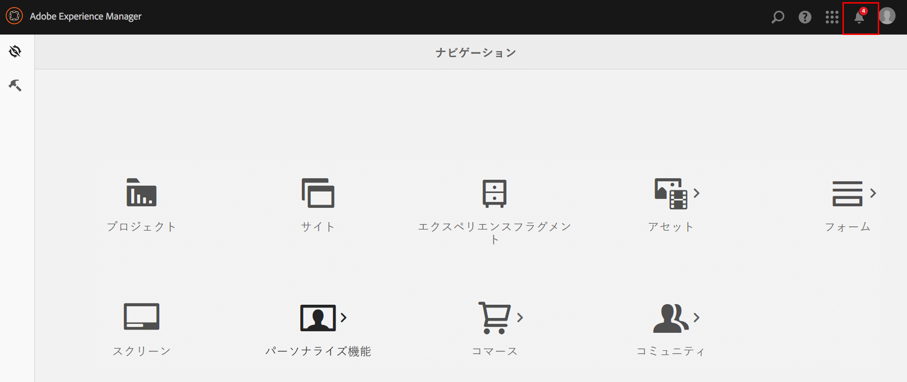
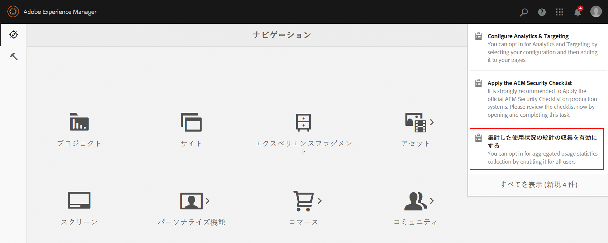
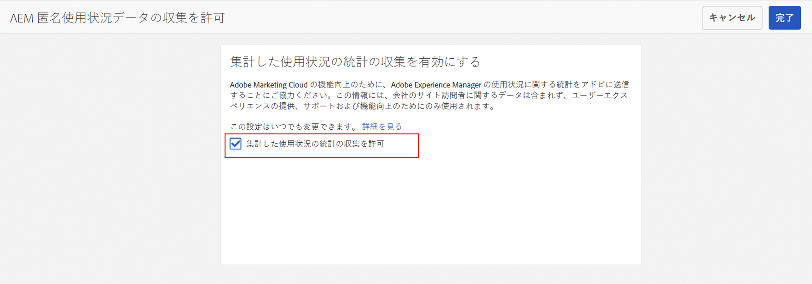
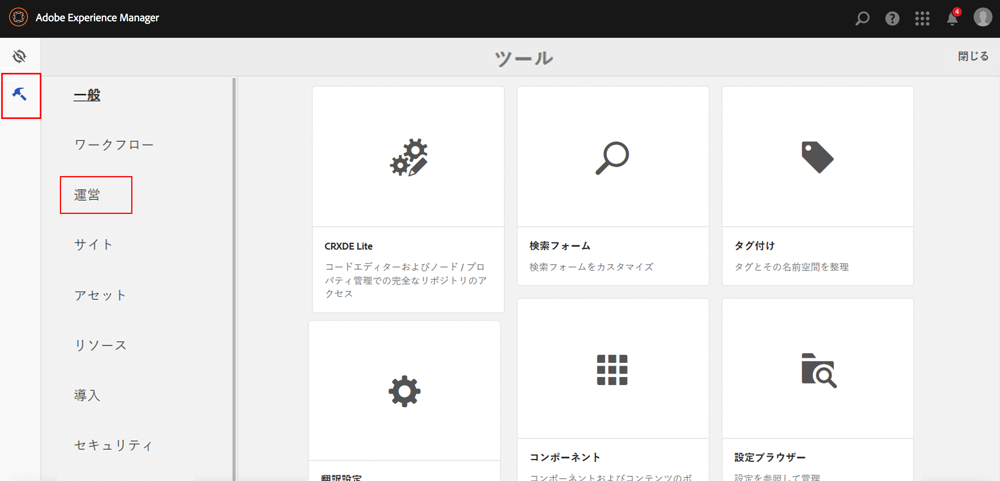
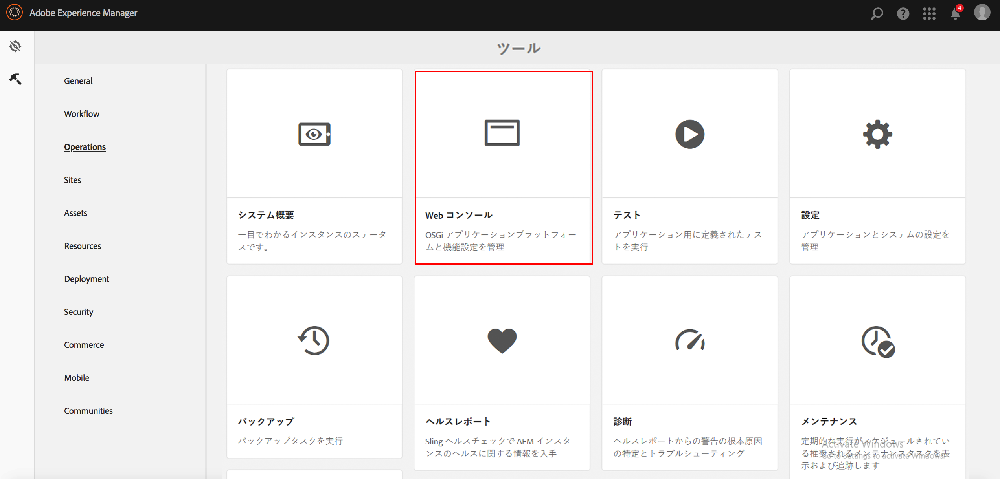

# 集計した使用状況の統計の収集をオプトインする方法{#opting-into-aggregated-usage-statistics-collection}

## はじめに {#introduction}

AEM とのやり取りの状況に関する統計情報をアドビに送信することで、Adobe Marketing Cloud の改善に協力することができます。この情報は、貴社のサイト訪問者に関するデータを含んでおらず、アドビによるユーザーエクスペリエンスの提供、サポート、改善に役立てるためにのみ使用されます。

使用状況に関する統計情報の収集をオプトインするには、タッチ UI または Web コンソールを使用します。

>[!NOTE]
>
>GDPR や CCPA など、様々なデータ保護およびプライバシー規制があります。AEM Sites では、データ保護やプライバシーコンプライアンスに関する義務をお客様が果たすのを支援する準備が整っています。このページでは、集計した使用状況の統計の収集をオプトイン（またはオプトアウト）する手順を説明します。
>
>詳しくは、[アドビのプライバシーセンター](https://www.adobe.com/jp/privacy.html)も参照してください。

>[!NOTE]
>
>また、[web コンソール](/help/sites-deploying/opt-in-aggregated-usage-statistics.md#opt-in-by-using-the-web-console)を使用するか、AEM オプトイン画面でオプトインオプションを選択しないことで、いつでもオプトアウトすることができます。

## タッチ UI を使用したオプトイン {#opt-in-by-using-the-touch-ui}

AEM を初めて起動したときに、タッチ UI を次のように使用してオプトインすることができます。

1. AEM ナビゲーション画面で、**インボックス**（ベル）アイコンをクリックします。

   

1. ドロップダウンリストで、「**集計した使用状況の統計の収集を有効にする**」を選択します。

   

1. オプトイン画面で、「**集計した使用状況の統計の収集を許可**」を選択します。

   

1. 「**完了**」をクリックします。

## Web コンソールを使用したオプトイン {#opt-in-by-using-the-web-console}

Web コンソールを次のように使用してオプトイン（またはオプトアウト）することができます。

1. AEM ナビゲーション画面で、**ツール**／**操作** の順にクリックします。

   

1. 操作ウィンドウで「**Web コンソール**」をクリックします。

   

1. 「**Aggregated Usage Statistics Collection**」を探します。
1. **編集**&#x200B;アイコンをクリックします。

   

1. 「**Enabled**」チェックボックスをオンにします。または、使用状況の統計の収集をオプトアウトする場合は、このチェックボックスをオフにします。

   

1. 「**保存**」をクリックします。
