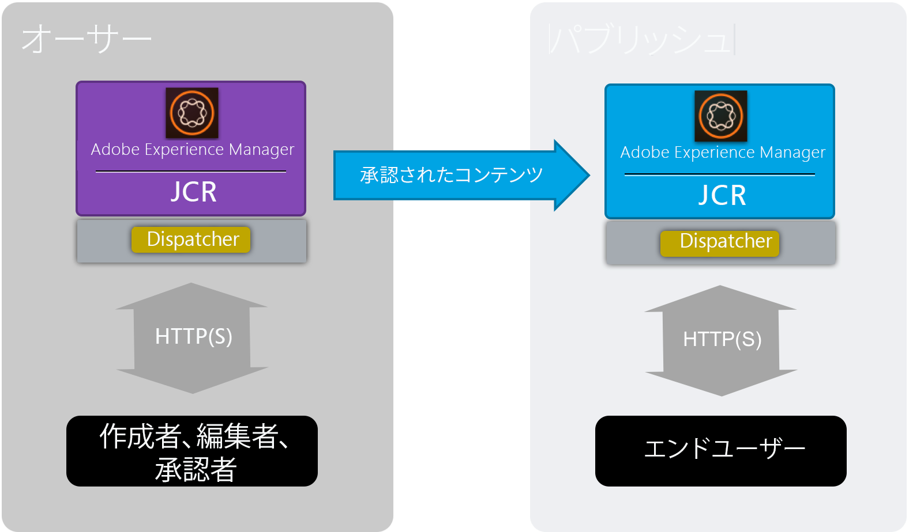
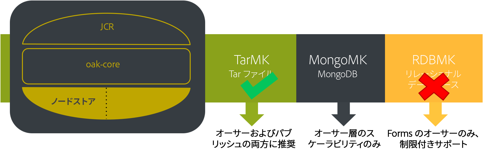
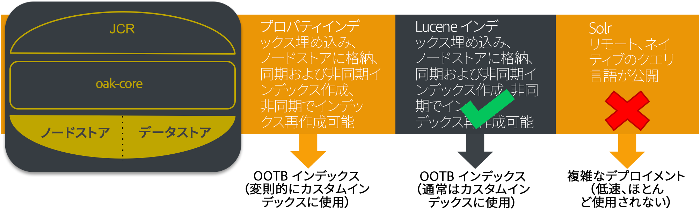
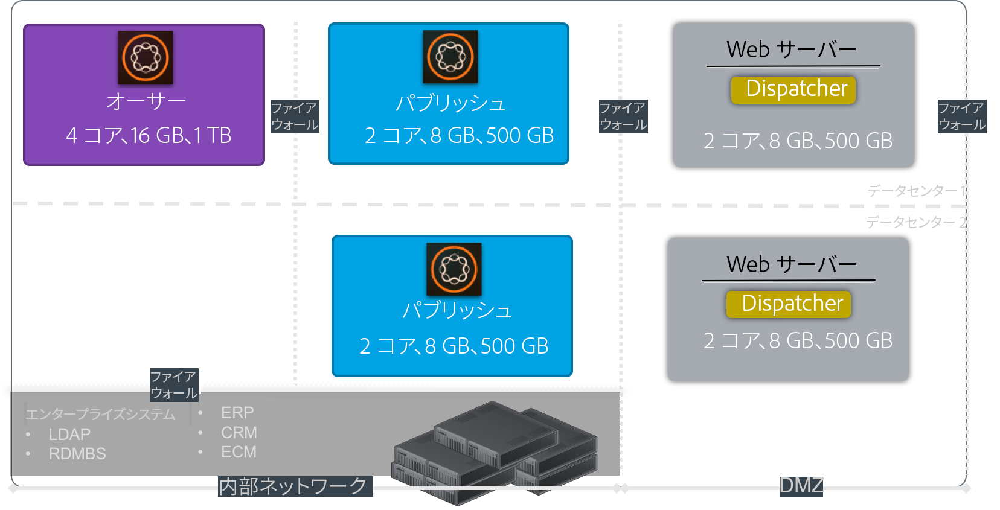
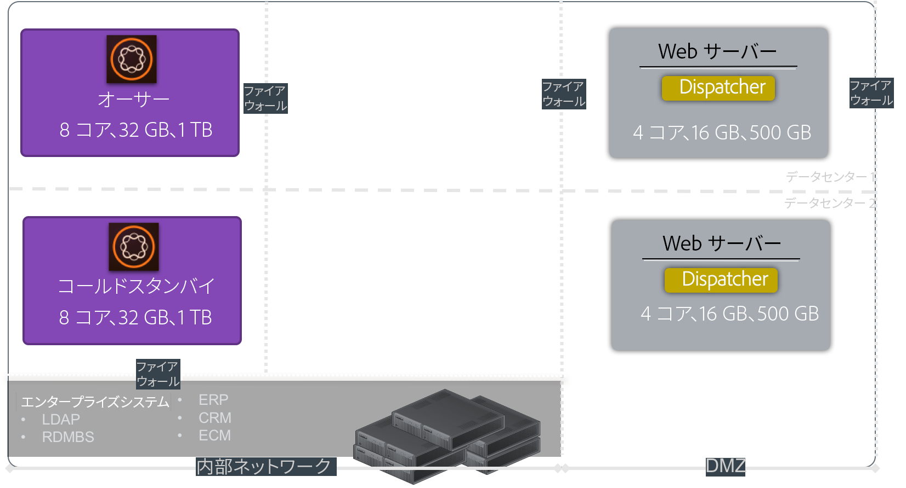
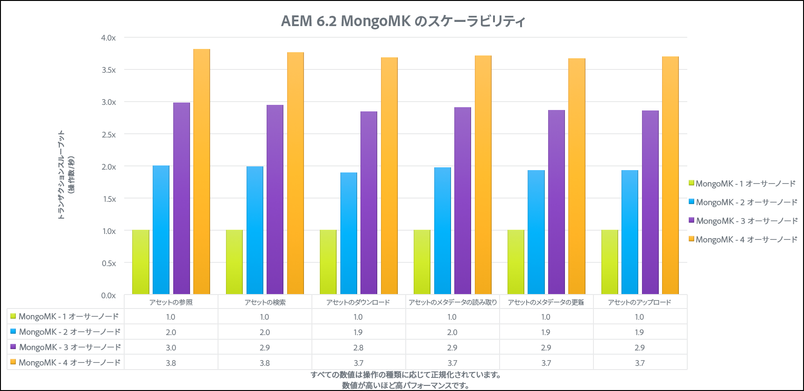
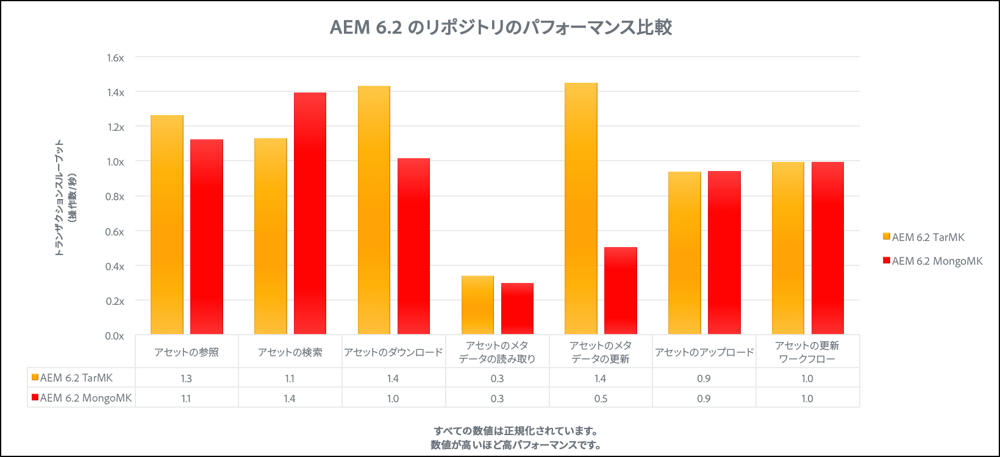

# パフォーマンスガイドライン{#performance-guidelines}

>[!CAUTION]
>
>AEM 6.4 の拡張サポートは終了し、このドキュメントは更新されなくなりました。 詳細は、 [技術サポート期間](https://helpx.adobe.com/jp/support/programs/eol-matrix.html). サポートされているバージョンを見つける [ここ](https://experienceleague.adobe.com/docs/?lang=ja).

このページでは、AEMデプロイメントのパフォーマンスを最適化する方法に関する一般的なガイドラインを示します。 AEMを初めて使用する場合は、パフォーマンスガイドラインを読む前に、次のページを参照してください。

* [AEM の基本概念](/help/sites-deploying/deploy.md#basic-concepts)
* [AEM のストレージの概要](/help/sites-deploying/storage-elements-in-aem-6.md#overview-of-storage-in-aem)
* [推奨されるデプロイメント](/help/sites-deploying/recommended-deploys.md)
* [技術要件](/help/sites-deploying/technical-requirements.md)

以下に AEM で使用できるデプロイメントオプションを示します（すべてのオプションを表示するにはスクロールしてください）。

<table> 
 <tbody> 
  <tr> 
   <td>
<strong>AEM</strong>
 
<strong>製品</strong>
 </td> 
   <td>
<strong>トポロジ</strong>
 </td> 
   <td>
<strong>オペレーティングシステム</strong>
 </td> 
   <td>
<strong>アプリケーションサーバー</strong>
 </td> 
   <td>
<strong>JRE</strong>
 </td> 
   <td>
<strong>セキュリティ</strong>
 </td> 
   <td>
<strong>マイクロカーネル</strong>
 </td> 
   <td>
<strong>データストア</strong>
 </td> 
   <td>
<strong>インデックス作成</strong>
 </td> 
   <td>
<strong>Web サーバー</strong>
 </td> 
   <td>
<strong>ブラウザー</strong>
 </td> 
   <td>
<strong>Marketing Cloud</strong>
 </td> 
  </tr> 
  <tr> 
   <td>
Sites
 </td> 
   <td>
非 HA
 </td> 
   <td>
Windows
 </td> 
   <td>
CQSE
 </td> 
   <td>
Oracle
 </td> 
   <td>
LDAP
 </td> 
   <td>
Tar
 </td> 
   <td>
セグメント
 </td> 
   <td>
プロパティ
 </td> 
   <td>
Apache
 </td> 
   <td>
Edge
 </td> 
   <td>
ターゲット
 </td> 
  </tr> 
  <tr> 
   <td>
Assets
 </td> 
   <td>
Publish-HA
 </td> 
   <td>
Solaris
 </td> 
   <td>
WebLogic
 </td> 
   <td>
IBM
 </td> 
   <td>
SAML
 </td> 
   <td>
MongoDB
 </td> 
   <td>
File
 </td> 
   <td>
Lucene
 </td> 
   <td>
IIS
 </td> 
   <td>
IE
 </td> 
   <td>
Analytics
 </td> 
  </tr> 
  <tr> 
   <td>
Communities
 </td> 
   <td>
Author-CS
 </td> 
   <td>
Red Hat
 </td> 
   <td>
WebSphere
 </td> 
   <td>
HP
 </td> 
   <td>
OAuth
 </td> 
   <td>
RDB/Oracle
 </td> 
   <td>
S3/Azure
 </td> 
   <td>
Solr
 </td> 
   <td>
iPlanet
 </td> 
   <td>
FireFox
 </td> 
   <td>
Campaign
 </td> 
  </tr> 
  <tr> 
   <td>
Forms
 </td> 
   <td>
オーサー — オフロード
 </td> 
   <td>
HP-UX
 </td> 
   <td>
Tomcat
 </td> 
   <td>
 
 </td> 
   <td>
 
 </td> 
   <td>
RDB/DB2
 </td> 
   <td>
MongoDB
 </td> 
   <td>
 
 </td> 
   <td>
 
 </td> 
   <td>
Chrome
 </td> 
   <td>
ソーシャル
 </td> 
  </tr> 
  <tr> 
   <td>
モバイル
 </td> 
   <td>
オーサー — クラスター
 </td> 
   <td>
IBM AIX
 </td> 
   <td>
JBoss
 </td> 
   <td>
 
 </td> 
   <td>
 
 </td> 
   <td>
RDB/MySQL
 </td> 
   <td>
RDBMS
 </td> 
   <td>
 
 </td> 
   <td>
 
 </td> 
   <td>
Safari
 </td> 
   <td>
対象読者
 </td> 
  </tr> 
  <tr> 
   <td>
マルチサイト
 </td> 
   <td>
ASRP
 </td> 
   <td>
SUSE
 </td> 
   <td>
 
 </td> 
   <td>
 
 </td> 
   <td>
 
 </td> 
   <td>
RDB／SQLServer
 </td> 
   <td>
 
 </td> 
   <td>
 
 </td> 
   <td>
 
 </td> 
   <td>
 
 </td> 
   <td>
Assets
 </td> 
  </tr> 
  <tr> 
   <td>
コマース
 </td> 
   <td>
MSRP
 </td> 
   <td>
Apple OS
 </td> 
   <td>
 
 </td> 
   <td>
 
 </td> 
   <td>
 
 </td> 
   <td>
 
 </td> 
   <td>
 
 </td> 
   <td>
 
 </td> 
   <td>
 
 </td> 
   <td>
 
 </td> 
   <td>
アクティベーション
 </td> 
  </tr> 
  <tr> 
   <td>
Dynamic Media
 </td> 
   <td>
JSRP
 </td> 
   <td>
 
 </td> 
   <td>
 
 </td> 
   <td>
 
 </td> 
   <td>
 
 </td> 
   <td>
 
 </td> 
   <td>
 
 </td> 
   <td>
 
 </td> 
   <td>
 
 </td> 
   <td>
 
 </td> 
   <td>
モバイル
 </td> 
  </tr> 
  <tr> 
   <td>
Brand Portal
 </td> 
   <td>
J2E
 </td> 
   <td>
 
 </td> 
   <td>
 
 </td> 
   <td>
 
 </td> 
   <td>
 
 </td> 
   <td>
 
 </td> 
   <td>
 
 </td> 
   <td>
 
 </td> 
   <td>
 
 </td> 
   <td>
 
 </td> 
   <td>
 
 </td> 
  </tr> 
  <tr> 
   <td>
AoD
 </td> 
   <td>
 
 </td> 
   <td>
 
 </td> 
   <td>
 
 </td> 
   <td>
 
 </td> 
   <td>
 
 </td> 
   <td>
 
 </td> 
   <td>
 
 </td> 
   <td>
 
 </td> 
   <td>
 
 </td> 
   <td>
 
 </td> 
   <td>
 
 </td> 
  </tr> 
  <tr> 
   <td>
LiveFyre
 </td> 
   <td>
 
 </td> 
   <td>
 
 </td> 
   <td>
 
 </td> 
   <td>
 
 </td> 
   <td>
 
 </td> 
   <td>
 
 </td> 
   <td>
 
 </td> 
   <td>
 
 </td> 
   <td>
 
 </td> 
   <td>
 
 </td> 
   <td>
 
 </td> 
  </tr> 
  <tr> 
   <td>
スクリーン
 </td> 
   <td>
 
 </td> 
   <td>
 
 </td> 
   <td>
 
 </td> 
   <td>
 
 </td> 
   <td>
 
 </td> 
   <td>
 
 </td> 
   <td>
 
 </td> 
   <td>
 
 </td> 
   <td>
 
 </td> 
   <td>
 
 </td> 
   <td>
 
 </td> 
  </tr> 
  <tr> 
   <td>
Doc Security
 </td> 
   <td>
 
 </td> 
   <td>
 
 </td> 
   <td>
 
 </td> 
   <td>
 
 </td> 
   <td>
 
 </td> 
   <td>
 
 </td> 
   <td>
 
 </td> 
   <td>
 
 </td> 
   <td>
 
 </td> 
   <td>
 
 </td> 
   <td>
 
 </td> 
  </tr> 
  <tr> 
   <td>
Process Mgt
 </td> 
   <td>
 
 </td> 
   <td>
 
 </td> 
   <td>
 
 </td> 
   <td>
 
 </td> 
   <td>
 
 </td> 
   <td>
 
 </td> 
   <td>
 
 </td> 
   <td>
 
 </td> 
   <td>
 
 </td> 
   <td>
 
 </td> 
   <td>
 
 </td> 
  </tr> 
  <tr> 
   <td>
デスクトップアプリケーション
 </td> 
   <td>
 
 </td> 
   <td>
 
 </td> 
   <td>
 
 </td> 
   <td>
 
 </td> 
   <td>
 
 </td> 
   <td>
 
 </td> 
   <td>
 
 </td> 
   <td>
 
 </td> 
   <td>
 
 </td> 
   <td>
 
 </td> 
   <td>
 
 </td> 
  </tr> 
 </tbody> 
</table>

>[!NOTE]
>
>パフォーマンスガイドラインは主にAEM Sitesに適用されます。

## パフォーマンスガイドラインを使用するタイミング {#when-to-use-the-performance-guidelines}

次の状況では、パフォーマンスガイドラインを使用する必要があります。

* **初めてのデプロイメント**:AEM Sitesまたは Assets の初めてのデプロイを計画する場合は、（デフォルト設定と比べて）マイクロカーネル、ノードストア、データストアを設定する際に使用できるオプションを理解しておくことが重要です。 例えば、TarMK のデータストアのデフォルト設定をファイルデータストアに変更します。
* **新しいバージョンへのアップグレード**:新しいバージョンにアップグレードする場合は、実行中の環境と比較したパフォーマンスの違いを理解することが重要です。 例えば、AEM 6.1 から 6.2 へ、またはAEM 6.0 CRX2 から 6.2 OAK へのアップグレードです。
* **応答時間が遅い**:選択したノードストアアーキテクチャが要件を満たしていない場合は、他のトポロジオプションと比較してパフォーマンスの違いを理解することが重要です。 例えば、MongoMK の代わりに TarMK をデプロイしたり、Amazon S3 またはMicrosoft Azure Data Store の代わりにファイルデータストアを使用したりします。
* **作成者の追加**:推奨される TarMK トポロジがパフォーマンス要件を満たさず、オーサーノードのアップサイズが最大容量に達した場合は、3 つ以上のオーサーノードで MongoMK を使用する場合と比較して、パフォーマンスの違いを理解することが重要です。 例えば、TarMK の代わりに MongoMK をデプロイします。
* **コンテンツの追加**：推奨データストアアーキテクチャが要件を満たさない場合は、他のデータストアオプションと比較してパフォーマンスの違いを理解することが重要です。例えば、ファイルデータストアの代わりに Amazon S3 または Microsoft Azure データストアを使用する場合などです。

## はじめに {#introduction}

この章では、AEMのアーキテクチャと最も重要なコンポーネントの概要を説明します。 また、開発ガイドラインを提供し、TarMK および MongoMK ベンチマークテストで使用されるテストシナリオについて説明します。

### AEM Platform {#the-aem-platform}

AEMプラットフォームは、次のコンポーネントで構成されています。

AEM のプラットフォームについて詳しくは、[AEM とは](/help/sites-deploying/deploy.md#what-is-aem)を参照してください。

### AEMアーキテクチャ {#the-aem-architecture}

AEMデプロイメントには、3 つの重要な構築要素があります。 この **オーサーインスタンス** コンテンツ作成者、編集者および承認者がコンテンツの作成とレビューに使用する コンテンツが承認されると、コンテンツは、 **発行インスタンス** エンドユーザーがアクセスする場所から。 3 番目のビルディングブロックは **Dispatcher** で、これはキャッシュおよび URL フィルタリングを処理するモジュールとして、web サーバーにインストールされます。AEM のアーキテクチャについて詳しくは、[典型的なデプロイメントシナリオ](/help/sites-deploying/deploy.md#typical-deployment-scenarios)を参照してください。

### マイクロカーネル {#micro-kernels}

マイクロカーネルは、AEMの永続性マネージャーとして機能します。 AEM で使用されるマイクロカーネルには、TarMK、MongoDB、リレーショナルデータベース（制限付きサポート）の 3 つのタイプがあります。インスタンスの目的と検討しているデプロイメントタイプによって、ニーズに合うマイクロカーネルを選択します。マイクロカーネルについて詳しくは、[推奨されるデプロイメント](/help/sites-deploying/recommended-deploys.md)のページを参照してください。

### ノードストア {#nodestore}

AEMでは、バイナリデータをコンテンツノードとは独立して保存できます。 バイナリデータが保存される場所は、 **データストア**&#x200B;コンテンツノードとプロパティの場所は **ノードストア**.

>[!NOTE]
>
>Adobeでは、AEM オーサーインスタンスとパブリッシュインスタンスの両方で顧客が使用するデフォルトの永続化テクノロジーとして TarMK を推奨します。

>[!CAUTION]
>
>リレーショナルデータベースマイクロカーネルは制限付きでサポートされています。 連絡先 [Adobeカスタマーケア](https://helpx.adobe.com/jp/marketing-cloud/contact-support.html) このタイプのマイクロカーネルを使用する前に。

### データストア {#data-store}

多数のバイナリを処理する場合は、最大限のパフォーマンスを確保するために、デフォルトのノードストアではなく外部のデータストアを使用することをお勧めします。例えば、プロジェクトで多数のメディアアセットが必要な場合は、それらをファイルデータストアまたは Azure／S3 データストアに格納すると、MongoDB 内に直接格納するよりも迅速にアセットにアクセスできます。

使用可能な設定オプションについて詳しくは、[ノードストアとデータストアの設定](/help/sites-deploying/data-store-config.md)を参照してください。

>[!NOTE]
>
>AEM を Azure または Amazon Web Services（AWS）にデプロイする場合は、Adobe Managed Services を使用することをお勧めします。このサービスでは、これらのクラウドコンピューティング環境での AEM のデプロイと運用の経験とスキルを持つチームのサポートを受けられます。[Adobe Managed Services に関するドキュメント](https://www.adobe.com/jp/marketing-cloud/enterprise-content-management/managed-services-cloud-platform.html?aemClk=t)も参照してください。
>
>Adobe Managed Services 以外の Azure またはAWSにAEMをデプロイする方法に関する推奨事項については、クラウドプロバイダー、または選択したクラウド環境でのAEMのデプロイをサポートするパートナーと直接連携することを強くお勧めします。 選択したクラウドプロバイダーまたはパートナーは、特定のパフォーマンス、負荷、拡張性、セキュリティ要件を満たすためにサポートするアーキテクチャのサイズ設定、設計、実装を担当します。
>
>詳細については、[技術要件](/help/sites-deploying/technical-requirements.md#supported-platforms)ページも参照してください。

### 検索 {#search-features}

この節では AEM で使用されるカスタムインデックスプロバイダーを示します。インデックス作成について詳しくは、[Oak クエリとインデックス作成](/help/sites-deploying/queries-and-indexing.md)を参照してください。

>[!NOTE]
>
>ほとんどのデプロイメントでは、Adobeは Lucene インデックスを使用することをお勧めします。 Solr は、特殊で複雑なデプロイメントのスケーラビリティにのみ使用してください。

### 開発のガイドライン {#development-guidelines}

目指すAEMの開発が必要 **パフォーマンスと拡張性**. 以下に、従うことのできるベストプラクティスをいくつか示します。

**実行**

* プレゼンテーション、ロジック、コンテンツの分離を適用
* 既存のAEM API を使用 ( 例：Sling) とツール ( 例：レプリケーション )
* 実際のコンテンツのコンテキストで開発
* 最適なキャッシュ性を実現する開発
* 保存数を最小限に抑える ( 例：一時的なワークフローの使用
* すべての HTTP エンドポイントが RESTful であることを確認します。
* JCR 監視の範囲の制限
* 非同期スレッドに注意する

**DON&#39;T**

* 可能な場合は、JCR API を直接使用しないでください
* /libs を変更せず、オーバーレイを使用
* 可能な限りクエリを使用しない
* Java コードで OSGi サービスを取得する際には Sling バインディングを使用せず、次のように使用します。

   * @Reference in DS component
   * @Inject in a Sling Model
   * Sightly 使用クラスの sling.getService()
   * JSP の sling.getService()
   * ServiceTracker
   * OSGi サービスレジストリへの直接アクセス

AEMでの開発について詳しくは、 [開発 — 基本](/help/sites-developing/the-basics.md). その他のベストプラクティスについては、 [開発のベストプラクティス](/help/sites-developing/best-practices.md).

### ベンチマークのシナリオ {#benchmark-scenarios}

>[!NOTE]
>
>このページに表示されるすべてのベンチマークテストは、ラボ設定で実行されています。

以下に説明するテストシナリオは、TarMK、MongoMk、TarMK と MongoMk の各章のベンチマークセクションで使用されます。 特定のベンチマークテストで使用されているシナリオを確認するには、[技術仕様](/help/sites-deploying/performance-guidelines.md#tarmk-performance-benchmark)表のシナリオフィールドを参照してください。

**単一製品シナリオ**

AEM Assets：

* ユーザーインタラクション：アセットの参照/アセットの検索/アセットのダウンロード/アセットメタデータの読み込み/アセットメタデータの更新/アセットのアップロード/アセットのアップロードアップロードワークフローの実行
* 実行モード：同時ユーザー数、ユーザーごとの単一インタラクション数

**製品の混在シナリオ**

AEM Sites + Assets：

* Sites のユーザーインタラクション：記事ページを読む/ページを読む/段落を作成/段落を編集/コンテンツページを作成/コンテンツページをアクティベート/検索を作成
* Assets のユーザーインタラクション：アセットの参照/アセットの検索/アセットのダウンロード/アセットメタデータの読み込み/アセットメタデータの更新/アセットのアップロード/アセットのアップロードアップロードワークフローの実行
* 実行モード：同時ユーザー、ユーザーごとの混合インタラクション

**垂直方向の使用例のシナリオ**

メディア：

* 記事ページを読む (27.4%)、ページを読む (10.9%)、セッションを作成 (2.6%)、コンテンツページをアクティベート (1.7%)、コンテンツページを作成 (0.4%)、段落を作成 (4.3%)、段落を編集 (0.9%)、参照 (0.9%)、アセット (20%)、アセットメタデータ読み込み (8.5%)、アセットのダウンロード (4.2%)、アセットの検索 (0.2%)、アセットメタデータの更新 (2.4%)、アセットをアップロード (1.2%)、プロジェクトを参照 (4.9%)、プロジェクトを読み込み (6.6%)、アセットを追加 (1.2%)、プロジェクト追加サイト (1.2%)、プロジェクトを作成 (0.1%)、作成者検索 (0.4%)
* 実行モード：同時ユーザー、ユーザーごとの混合インタラクション

## TarMK {#tarmk}

この章では、TarMK の一般的なパフォーマンスガイドラインで、アーキテクチャの最小要件と設定設定を指定します。 さらに明確化するために、ベンチマークテストも提供されています。

アドビでは、すべてのデプロイメントシナリオにおいて、AEM オーサーインスタンスとパブリッシュインスタンスの両方に対し TarMK をデフォルトの優先使用する技術とすることを顧客に推奨します。

TarMK について詳しくは、[デプロイメントのシナリオ](/help/sites-deploying/recommended-deploys.md#deployment-scenarios)および [Tar ストレージ](/help/sites-deploying/storage-elements-in-aem-6.md#tar-storage)を参照してください。

### TarMK 最小アーキテクチャガイドライン {#tarmk-minimum-architecture-guidelines}

>[!NOTE]
>
>以下に示す最小アーキテクチャガイドラインは、実稼動環境および高トラフィックサイト向けです。 これらのガイドラインは、AEM を実行するために必要な[最小仕様](/help/sites-deploying/technical-requirements.md#prerequisites)では&#x200B;**ありません**。

TarMK を使用する際に優れたパフォーマンスを確立するには、次のアーキテクチャから始める必要があります。

* 1 つのオーサーインスタンス
* 2 つのパブリッシュインスタンス
* 2 つの Dispatcher

次に、AEM Sites とAEM Assetsのアーキテクチャガイドラインを示します。

>[!NOTE]
>
>ファイルデータストアを共有する場合は、バイナリなしのレプリケーションを&#x200B;**オン**&#x200B;にする必要があります。

**AEM Sitesの Tar アーキテクチャのガイドライン**

**AEM Assets での Tar アーキテクチャガイドライン**

### TarMK 設定ガイドライン {#tarmk-settings-guideline}

パフォーマンスを高めるには、次に示す設定ガイドラインに従う必要があります。 設定を変更する手順については、[このページを参照してください](https://helpx.adobe.com/experience-manager/kb/performance-tuning-tips.html)。

<table> 
 <tbody> 
  <tr> 
   <td><strong>設定</strong></td> 
   <td><strong>パラメーター</strong></td> 
   <td><strong>値</strong></td> 
   <td><strong>説明</strong></td> 
  </tr> 
  <tr> 
   <td>Sling ジョブキュー</td> 
   <td><code>queue.maxparallel</code></td> 
   <td>CPU コア数の半分の値に設定します。 </td> 
   <td>デフォルトでは、ジョブキューあたりの同時スレッド数は、CPU コア数と同じです。</td> 
  </tr> 
  <tr> 
   <td>Granite 一時的なワークフローキュー</td> 
   <td><code>Max Parallel</code></td> 
   <td>CPU コア数の半分の値に設定します。</td> 
   <td> </td> 
  </tr> 
  <tr> 
   <td>JVM パラメーター</td> 
   <td>
<code>Doak.queryLimitInMemory</code>
 
<code>Doak.queryLimitReads</code>
 
<code>Dupdate.limit</code>
 
<code>Doak.fastQuerySize</code>
 </td> 
   <td>
500000
 
100000
 
250000
 
True
 </td> 
   <td>AEMの起動スクリプトにこれらの JVM パラメーターを追加して、拡張クエリがシステムをオーバーロードしないようにします。</td> 
  </tr> 
  <tr> 
   <td>Lucene インデックスの設定</td> 
   <td>
<code>CopyOnRead</code>
 
<code>CopyOnWrite</code>
 
<code>Prefetch Index Files</code>
 </td> 
   <td>
Enabled
 
Enabled
 
Enabled
 </td> 
   <td>使用可能なパラメーターの詳細については、 <a href="https://jackrabbit.apache.org/oak/docs/query/lucene.html">このページ</a>.</td> 
  </tr> 
  <tr> 
   <td>データストア= S3 データストア</td> 
   <td>
<code>maxCachedBinarySize</code>
 
<code>cacheSizeInMB</code>
 </td> 
   <td>
1048576(1 MB) 以下
 
最大ヒープサイズの 2～10%
 </td> 
   <td>関連トピック <a href="/help/sites-deploying/data-store-config.md#data-store-configurations">データストアの設定</a>.</td> 
  </tr> 
  <tr> 
   <td>DAM アセットの更新ワークフロー</td> 
   <td><code>Transient Workflow</code></td> 
   <td>チェック済み</td> 
   <td>このワークフローではアセットの更新を管理します.</td> 
  </tr> 
  <tr> 
   <td>DAM メタデータの書き戻し</td> 
   <td><code>Transient Workflow</code></td> 
   <td>チェック済み</td> 
   <td>このワークフローは、元のバイナリへのXMPの書き戻しを管理し、JCR で最終変更日を設定します。</td> 
  </tr> 
 </tbody> 
</table>

### TarMK パフォーマンスベンチマーク {#tarmk-performance-benchmark}

#### 技術仕様 {#technical-specifications}

ベンチマークテストは以下の仕様に基づいて行われた。

|  | **オーサーノード** |
|---|---|
| サーバー | ベアメタルハードウェア（HP） |
| オペレーティングシステム | RedHat Linux |
| CPU／コア | Intel(R) Xeon(R) CPU E5-2407 @2.40GHz、8 コア |
| RAM | 32 GB |
| ディスク | 磁気 |
| Java | Oracle JRE バージョン 8 |
| JVM ヒープ | 16 GB |
| 製品 | AEM 6.2 |
| ノードストア | TarMK |
| データストア | ファイル DS |
| シナリオ | 単一の製品：アセット／30 個の同時スレッド |

#### パフォーマンスベンチマークの結果 {#performance-bechmark-results}

>[!NOTE]
>
>以下に示す数値は、ベースラインとして 1 に正規化されており、実際のスループット数ではありません。

 

## MongoMK {#mongomk}

TarMK よりも MongoMK 永続性バックエンドを選択する主な理由は、インスタンスを水平方向にスケールすることです。 つまり、2 つ以上のアクティブなオーサーインスタンスが常に実行され、MongoDB を永続性ストレージシステムとして使用します。 複数のオーサーインスタンスを実行する必要があるのは、通常、すべての同時オーサリングアクティビティをサポートする単一のサーバーの CPU とメモリの容量が持続不可能になったためです。

TarMK について詳しくは、[デプロイメントのシナリオ](/help/sites-deploying/recommended-deploys.md#deployment-scenarios)および [Mongo ストレージ](/help/sites-deploying/storage-elements-in-aem-6.md#mongo-storage)を参照してください。

### MongoMK 最小アーキテクチャのガイドライン {#mongomk-minimum-architecture-guidelines}

MongoMK を使用する際に優れたパフォーマンスを確立するには、次のアーキテクチャから始める必要があります。

* 3 つのオーサーインスタンス
* 2 つのパブリッシュインスタンス
* 3 つの MongoDB インスタンス
* 2 つの Dispatcher

>[!NOTE]
>
>実稼動環境では、MongoDB は常に、プライマリと 2 つのセカンダリを持つレプリカセットとして使用されます。 読み取りと書き込みはプライマリに送られ、読み取りはセカンダリに送られます。 ストレージが使用できない場合、セカンダリの 1 つをアービターに置き換えることができますが、MongoDB レプリカセットは常に奇数のインスタンスで構成する必要があります。

>[!NOTE]
>
>ファイルデータストアを共有する場合は、バイナリなしのレプリケーションを&#x200B;**オン**&#x200B;にする必要があります。

### MongoMK 設定のガイドライン {#mongomk-settings-guidelines}

パフォーマンスを高めるには、次に示す設定ガイドラインに従う必要があります。 設定を変更する手順については、[このページを参照してください](https://helpx.adobe.com/experience-manager/kb/performance-tuning-tips.html)。

<table> 
 <tbody> 
  <tr> 
   <td><strong>設定</strong></td> 
   <td><strong>パラメーター</strong></td> 
   <td><strong>値（デフォルト）</strong></td> 
   <td><strong>説明</strong></td> 
  </tr> 
  <tr> 
   <td>Sling ジョブキュー</td> 
   <td><code>queue.maxparallel</code></td> 
   <td>CPU コア数の半分の値に設定します。 </td> 
   <td>デフォルトでは、ジョブキューあたりの同時スレッド数は、CPU コア数と同じです。</td> 
  </tr> 
  <tr> 
   <td>Granite 一時的なワークフローキュー</td> 
   <td><code>Max Parallel</code></td> 
   <td>CPU コア数の半分の値に設定します。</td> 
   <td> </td> 
  </tr> 
  <tr> 
   <td>JVM パラメーター</td> 
   <td>
<code>Doak.queryLimitInMemory</code>
 
<code>Doak.queryLimitReads</code>
 
<code>Dupdate.limit</code>
 
<code>Doak.fastQuerySize</code>
 
<code>Doak.mongo.maxQueryTimeMS</code>
 </td> 
   <td>
500000
 
100000
 
250000
 
True
 
60000
 </td> 
   <td>AEMの起動スクリプトにこれらの JVM パラメーターを追加して、拡張クエリがシステムをオーバーロードしないようにします。</td> 
  </tr> 
  <tr> 
   <td>Lucene インデックスの設定</td> 
   <td>
<code>CopyOnRead</code>
 
<code>CopyOnWrite</code>
 
<code>Prefetch Index Files</code>
 </td> 
   <td>
Enabled
 
Enabled
 
Enabled
 </td> 
   <td>使用可能なパラメーターについて詳しくは、 <a href="https://jackrabbit.apache.org/oak/docs/query/lucene.html">このページ</a>.</td> 
  </tr> 
  <tr> 
   <td>データストア= S3 データストア</td> 
   <td>
<code>maxCachedBinarySize</code>
 
<code>cacheSizeInMB</code>
 </td> 
   <td>
1048576(1 MB) 以下
 
最大ヒープサイズの 2～10%
 </td> 
   <td>関連トピック <a href="/help/sites-deploying/data-store-config.md#data-store-configurations">データストアの設定</a>.</td> 
  </tr> 
  <tr> 
   <td>DocumentNodeStoreService</td> 
   <td>
<code>cache</code>
 
<code>nodeCachePercentage</code>
 
<code>childrenCachePercentage</code>
 
<code>diffCachePercentage</code>
 
<code>docChildrenCachePercentage</code>
 
<code>prevDocCachePercentage</code>
 
<code>persistentCache</code>
 </td> 
   <td>
2048
 
35 (25)
 
20 (10)
 
30 (5)
 
10 (3)
 
4 (4)
 
。/cache,size=2048,binary=0,-compact,-compress
 </td> 
   <td>
キャッシュのデフォルトのサイズは 256 MB に設定されています。
 
キャッシュの無効化の実行に要する時間に影響を与えます。
 </td> 
  </tr> 
  <tr> 
   <td>oak-observation</td> 
   <td>
<code>thread pool</code>
 
<code>length</code>
 </td> 
   <td>
最小値と最大値= 20
 
50000
 </td> 
   <td> </td> 
  </tr> 
 </tbody> 
</table>

### MongoMK パフォーマンスベンチマーク {#mongomk-performance-benchmark}

### 技術仕様 {#technical-specifications-1}

ベンチマークテストは以下の仕様に基づいて行われた。

|  | **オーサーノード** | **MongoDB ノード** |
|---|---|---|
| サーバー | ベアメタルハードウェア（HP） | ベアメタルハードウェア（HP） |
| オペレーティングシステム | RedHat Linux | RedHat Linux |
| CPU／コア | Intel(R) Xeon(R) CPU E5-2407 @2.40GHz、8 コア | Intel(R) Xeon(R) CPU E5-2407 @2.40GHz、8 コア |
| RAM | 32 GB | 32 GB |
| ディスク | 磁気 - 1,000 IOPS を超える | 磁気 - 1,000 IOPS を超える |
| Java | Oracle JRE バージョン 8 | 該当なし |
| JVM ヒープ | 16 GB | 該当なし |
| 製品 | AEM 6.2 | MongoDB 3.2 WiredTiger |
| ノードストア | MongoMK | 該当なし |
| データストア | ファイル DS | 該当なし |
| シナリオ | 単一の製品：アセット／30 個の同時スレッド | 単一の製品：アセット／30 個の同時スレッド |

### パフォーマンスベンチマーク結果 {#performance-benchmark-results}

>[!NOTE]
>
>以下に示す数値は、ベースラインとして 1 に正規化されており、実際のスループット数ではありません。

 

## TarMK と MongoMK {#tarmk-vs-mongomk}

この 2 つのいずれかを選択する際には、TarMK はパフォーマンスを重視して設計されているのに対して、MongoMK はスケーラビリティを重視して使用されるという基本ルールを考慮する必要があります。アドビでは、すべてのデプロイメントシナリオにおいて、AEM オーサーインスタンスとパブリッシュインスタンスの両方に対し TarMK をデフォルトの優先使用する技術とすることを顧客に推奨します。

TarMK よりも MongoMK 永続性バックエンドを選択する主な理由は、インスタンスを水平方向にスケールすることです。 つまり、2 つ以上のアクティブなオーサーインスタンスが常に実行され、MongoDB を永続性ストレージシステムとして使用します。 通常、複数のオーサーインスタンスを実行する必要があるのは、同時に実行するすべてのオーサリングアクティビティをサポートする単一のサーバーの CPU とメモリの容量が維持できなくなったためです。

TarMK と MongoMK の詳細については、 [推奨されるデプロイメント](/help/sites-deploying/recommended-deploys.md#microkernels-which-one-to-use).

### TarMK と MongoMk のガイドライン {#tarmk-vs-mongomk-guidelines}

**TarMK のメリット**

* コンテンツ管理アプリケーション向けに設計
* ファイルは常に一貫性があり、任意のファイルベースのバックアップ・ツールを使用してバックアップできます。
* フェイルオーバーメカニズムを備えています。詳しくは、[コールドスタンバイ](/help/sites-deploying/tarmk-cold-standby.md)を参照してください。
* 運用上のオーバーヘッドを最小限に抑え、高パフォーマンスで信頼性の高いデータストレージを提供
* TCO（総所有コスト）の削減

**MongoMK を選択するための条件**

* 1 日に接続した名前付きユーザーの数：何千もの間
* 同時ユーザー数：数百以上の
* 1 日あたりのアセット取り込みの量：何十万以上で
* 1 日あたりのページ編集の量：何十万以上で
* 1 日あたりの検索数：数十万以上で

### TarMK と MongoMK のベンチマーク {#tarmk-vs-mongomk-benchmarks}

>[!NOTE]
>
>以下に示す数値は、ベースラインとして 1 に正規化されており、実際のスループット数ではありません。

### シナリオ 1 技術仕様 {#scenario-technical-specifications}

<table> 
 <tbody> 
  <tr> 
   <td><strong> </strong></td> 
   <td><strong>OAK オーサーノード</strong></td> 
   <td><strong>MongoDB ノード</strong></td> 
   <td> </td> 
  </tr> 
  <tr> 
   <td>サーバー</td> 
   <td>ベアメタルハードウェア（HP）</td> 
   <td>ベアメタルハードウェア（HP）</td> 
   <td> </td> 
  </tr> 
  <tr> 
   <td>オペレーティングシステム</td> 
   <td>RedHat Linux</td> 
   <td>RedHat Linux</td> 
   <td> </td> 
  </tr> 
  <tr> 
   <td>CPU／コア</td> 
   <td>Intel(R) Xeon(R) CPU E5-2407 @2.40GHz、8 コア</td> 
   <td>Intel(R) Xeon(R) CPU E5-2407 @2.40GHz、8 コア</td> 
   <td> </td> 
  </tr> 
  <tr> 
   <td>RAM</td> 
   <td>32 GB</td> 
   <td>32 GB</td> 
   <td> </td> 
  </tr> 
  <tr> 
   <td>ディスク</td> 
   <td>磁気 - 1,000 IOPS を超える</td> 
   <td>磁気 - 1,000 IOPS を超える</td> 
   <td> </td> 
  </tr> 
  <tr> 
   <td>Java</td> 
   <td>Oracle JRE バージョン 8</td> 
   <td>該当なし</td> 
   <td> </td> 
  </tr> 
  <tr> 
   <td>JVM ヒープ 16 GB</td> 
   <td>16 GB</td> 
   <td>該当なし</td> 
   <td> </td> 
  </tr> 
  <tr> 
   <td>製品 </td> 
   <td>AEM 6.2</td> 
   <td>MongoDB 3.2 WiredTiger</td> 
   <td> </td> 
  </tr> 
  <tr> 
   <td>ノードストア</td> 
   <td>TarMK または MongoMK</td> 
   <td>該当なし</td> 
   <td> </td> 
  </tr> 
  <tr> 
   <td>データストア</td> 
   <td>ファイル DS </td> 
   <td>該当なし</td> 
   <td> </td> 
  </tr> 
  <tr> 
   <td>シナリオ</td> 
   <td>
  単一の製品：Assets／実行あたり 30 個の同時スレッド
 </td> 
   <td> </td> 
   <td> </td> 
  </tr> 
 </tbody> 
</table>

### シナリオ 1 パフォーマンスベンチマークの結果 {#scenario-performance-benchmark-results}

### シナリオ 2 技術仕様 {#scenario-technical-specifications-1}

>[!NOTE]
>
>1 つの TarMK システムと同数の MongoDB を使用して作成者を有効にするには、2 つのAEMノードを持つクラスターが必要です。 4 ノードの MongoDB クラスターは、1 つの TarMK インスタンスの 1.8 倍のオーサー数を処理できます。 8 ノードの MongoDB クラスターは、1 つの TarMK インスタンスの 2.3 倍のオーサー数を処理できます。

<table> 
 <tbody> 
  <tr> 
   <td><strong> </strong></td> 
   <td><strong>TarMK オーサーノード</strong></td> 
   <td><strong>MongoMK オーサーノード</strong></td> 
   <td><strong>MongoDB ノード</strong></td> 
  </tr> 
  <tr> 
   <td>サーバー</td> 
   <td>AWS c3.8xlarge</td> 
   <td>AWS c3.8xlarge</td> 
   <td>AWS c3.8xlarge</td> 
  </tr> 
  <tr> 
   <td>オペレーティングシステム</td> 
   <td>RedHat Linux</td> 
   <td>RedHat Linux</td> 
   <td>RedHat Linux</td> 
  </tr> 
  <tr> 
   <td>CPU／コア</td> 
   <td>32</td> 
   <td>32</td> 
   <td>32</td> 
  </tr> 
  <tr> 
   <td>RAM</td> 
   <td>60 GB</td> 
   <td>60 GB</td> 
   <td>60 GB</td> 
  </tr> 
  <tr> 
   <td>ディスク</td> 
   <td>SSD - 10k IOPS</td> 
   <td>SSD - 10k IOPS</td> 
   <td>SSD - 10k IOPS</td> 
  </tr> 
  <tr> 
   <td>Java</td> 
   <td>Oracle JRE バージョン 8</td> 
   <td>  Oracle JRE バージョン 8</td> 
   <td>該当なし</td> 
  </tr> 
  <tr> 
   <td>JVM ヒープ 16 GB</td> 
   <td>30 GB</td> 
   <td>30 GB</td> 
   <td>該当なし</td> 
  </tr> 
  <tr> 
   <td>製品 </td> 
   <td>AEM 6.2</td> 
   <td>AEM 6.2</td> 
   <td>  MongoDB 3.2 WiredTiger</td> 
  </tr> 
  <tr> 
   <td>ノードストア</td> 
   <td>TarMK </td> 
   <td>MongoMK</td> 
   <td>  該当なし</td> 
  </tr> 
  <tr> 
   <td>データストア</td> 
   <td>ファイル DS </td> 
   <td>  ファイル DS</td> 
   <td>  該当なし</td> 
  </tr> 
  <tr> 
   <td>シナリオ</td> 
   <td>
    垂直方向の使用例：メディア／2000 の同時スレッド
 </td>
   <td></td>
   <td></td>
  </tr> 
 </tbody> 
</table>

### シナリオ 2 パフォーマンスベンチマークの結果 {#scenario-performance-benchmark-results-1}

### AEM Sites および AEM Assets のアーキテクチャスケーラビリティのガイドライン {#architecture-scalability-guidelines-for-aem-sites-and-assets}

## パフォーマンスガイドラインの概要  {#summary-of-performance-guidelines}

このページで説明するガイドラインの概要を次に示します。

* **ファイルデータストアを使用する TarMK** は、ほとんどのお客様にとって推奨されるアーキテクチャです。

   * 最小トポロジ：1 つのオーサーインスタンス、2 つのパブリッシュインスタンス、2 つの Dispatcher
   * ファイルデータストアが共有されている場合、バイナリレスレプリケーションはオンになります

* **ファイルデータストアを使用する MongoMK** は、オーサー層の水平方向の拡張性を実現するための推奨アーキテクチャです。

   * 最小トポロジ：3 つのオーサーインスタンス、3 つの MongoDB インスタンス、2 つのパブリッシュインスタンス、2 つの Dispatcher
   * ファイルデータストアが共有されている場合、バイナリレスレプリケーションはオンになります

* **ノードストア** は、NAS（ネットワーク接続型ストレージ）ではなく、ローカルディスクに保存する必要があります。
* **Amazon S3** を使用する場合：

   * Amazon S3 データストアは、オーサー層とパブリッシュ層の間で共有されます
   * バイナリレスレプリケーションを有効にする必要があります
   * データストアのガベージコレクションを使用するには、最初にすべてのオーサーノードとパブリッシュノードで実行し、次にオーサーノードで 2 回目に実行する必要があります

* **標準提供のインデックスに加えて、カスタムインデックスを作成する必要があります** 最も一般的な検索に基づく

   * Lucene インデックスは、カスタムインデックスに使用する必要があります

* **ワークフローをカスタマイズすると、パフォーマンスが大幅に向上する場合があります**。例えば、「アセットの更新」ワークフローのビデオ手順を削除したり、使用されないリスナーを削除したりします。

詳しくは、[推奨されるデプロイメント](/help/sites-deploying/recommended-deploys.md)のページも参照してください。
