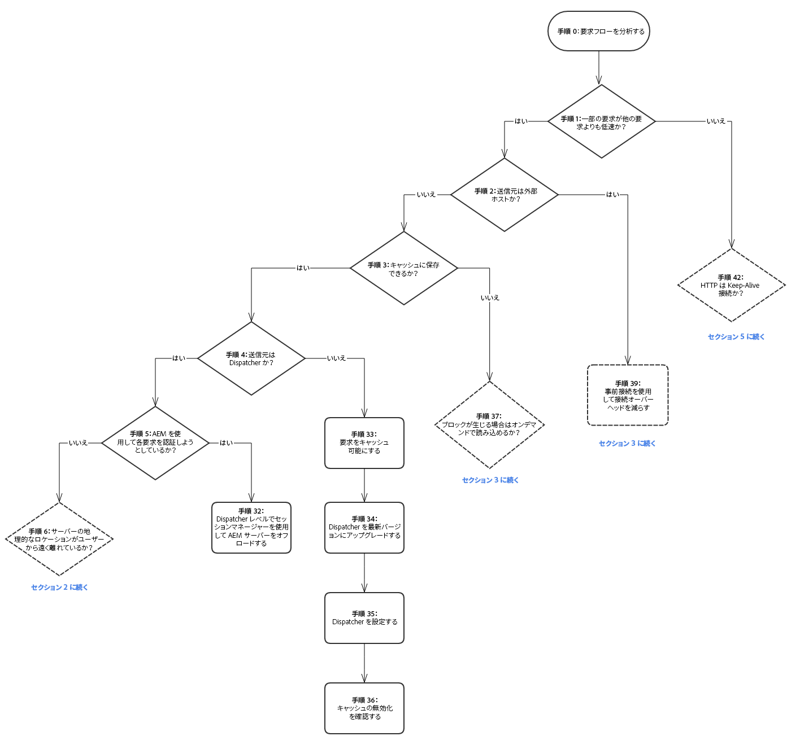
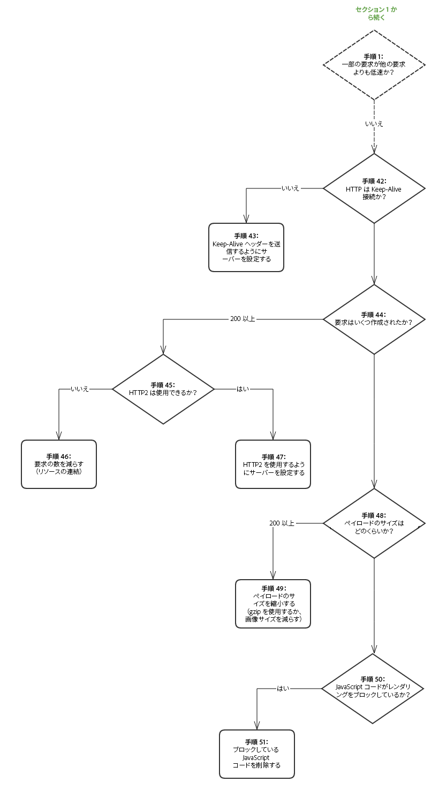

# パフォーマンスツリー{#performance-tree}

>[!CAUTION]
>
>AEM 6.4 の拡張サポートは終了し、このドキュメントは更新されなくなりました。 詳細は、 [技術サポート期間](https://helpx.adobe.com/jp/support/programs/eol-matrix.html). サポートされているバージョンを見つける [ここ](https://experienceleague.adobe.com/docs/?lang=ja).

## 範囲 {#scope}

次の図は、パフォーマンスの問題をトラブルシューティングするために実行する必要がある手順に関するガイダンスを提供することを目的としています。 読みやすくするために、5 つのセクションに分かれています。

図の各手順は、ドキュメントリソースまたは推奨事項にリンクされています。

## 前提条件と前提条件 {#prerequisites-and-assumptions}

パフォーマンスの問題が特定のページ (AEMコンソールまたは Web ページ ) で発生し、一貫して再現できると仮定しています。 パフォーマンスをテストまたは監視する方法を持つことは、調査を開始する前に前提条件です。

分析は手順 0 で開始します。 目的は、パフォーマンスの問題の原因であるエンティティ（Dispatcher、外部ホストまたは AEM）を特定し、調査する必要がある領域（サーバーまたはネットワーク）を判別することです。

### セクション 1 {#section}

### セクション 2 {#section-1}

### セクション 3 {#section-2}

### セクション 4 {#section-3}

### セクション 5 {#section-4}

## 参照リンク {#reference-links}

<table> 
 <tbody> 
  <tr> 
   <td><strong>手順</strong></td> 
   <td><strong>タイトル</strong></td> 
   <td><strong>リソース</strong></td> 
  </tr> 
  <tr> 
   <td><strong>手順 0</strong></td> 
   <td>リクエストフローの分析</td> 
   <td>
ブラウザーで標準的な HTTP リクエスト分析を使用して、リクエストフローを分析できます。 Chrome でこれをおこなう方法について詳しくは、次を参照してください。  
 
<a href="https://developers.google.com/web/tools/chrome-devtools/profile/network-performance/resource-loading">https://developers.google.com/web/tools/chrome-devtools/profile/network-performance/resource-loading</a><a href="https://developers.google.com/web/tools/chrome-devtools/profile/network-performance/understanding-resource-timing">  https://developers.google.com/web/tools/chrome-devtools/profile/network-performance/understanding-resource-timing</a>  
 </td> 
  </tr> 
  <tr> 
   <td><strong>手順 2</strong></td> 
   <td>リクエストは外部ホストから送信されますか？</td> 
   <td>ブラウザーで標準的な HTTP リクエスト分析を使用して、リクエストフローを分析できます。 Chrome でこれをおこなう方法に関する上記のリンクを参照してください。  </td> 
  </tr> 
  <tr> 
   <td><strong>手順 3</strong></td> 
   <td>要求をキャッシュできますか？</td> 
   <td>キャッシュ可能なリクエストと一般的な Dispatcher のパフォーマンス最適化に関するアドバイスについて詳しくは、 <a href="/help/sites-deploying/configuring-performance.md#optimizing-performance-when-using-the-dispatcher">Dispatcher のパフォーマンス最適化</a>.</td> 
  </tr> 
  <tr> 
   <td><strong>手順 4</strong></td> 
   <td>要求の送信元は Dispatcher ですか。</td> 
   <td>
<a href="https://helpx.adobe.com/jp/experience-manager/dispatcher/using/dispatcher-configuration.html#debugging">Dispatcher のデバッグドキュメント</a>を確認して、要求が正しくキャッシュされているか確認してください。  
 </td> 
  </tr> 
  <tr> 
   <td><strong>手順 5</strong></td> 
   <td>Dispatcher は AEM を使用して各要求を認証しようとしていますか。</td> 
   <td>Dispatcher が、キャッシュされたリソースを配信する前に、認証のために <code>HEAD</code> 要求を AEM に送信しているかどうか確認します。これを行うには、AEM の <code>HEAD</code> で <code>access.log</code> 要求を確認します。詳しくは、<a href="/help/sites-deploying/configure-logging.md">ログ</a>を参照してください。  </td> 
  </tr> 
  <tr> 
   <td><strong>手順 6</strong></td> 
   <td>Dispatcher の地理的な位置はユーザーから遠いですか？</td> 
   <td>Dispatcher をユーザーの近くに移動します。</td> 
  </tr> 
  <tr> 
   <td><strong>手順 7</strong></td> 
   <td>Dispatcher のネットワークレイヤーに問題はありませんか。</td> 
   <td>  ネットワークレイヤーで、輻輳や遅延の問題がないかどうかを調べます。
 
 </td> 
  </tr> 
  <tr> 
   <td><strong>手順 8</strong></td> 
   <td>ローカルインスタンスでは、遅さは再現可能ですか？</td> 
   <td>  
用途 <a href="/help/sites-developing/tough-day.md">Tough Day</a> 本番インスタンスから「実世界」の条件をレプリケートする場合。 開発の場所でこれが現実的でない場合は、異なるネットワークコンテキストで実稼動インスタンス（または同一のステージングインスタンス）をテストしてください。  
 </td> 
  </tr> 
  <tr> 
   <td><strong>手順 9</strong></td> 
   <td>サーバーの地理的な位置はユーザーから遠いですか？</td> 
   <td>サーバーをユーザーに近づけます。</td> 
  </tr> 
  <tr> 
   <td><strong>手順 10 および 29</strong></td> 
   <td>ネットワーク層の調査</td> 
   <td>
ネットワークレイヤーで、輻輳や遅延の問題がないかどうかを調べます。
 
オーサー層では、待ち時間が 100 ミリ秒を超えないことをお勧めします。
 
パフォーマンスの最適化に関するヒントについて詳しくは、<a href="https://helpx.adobe.com/experience-manager/kb/performance-tuning-tips.html">このページ</a>を参照してください。
 </td> 
  </tr> 
  <tr> 
   <td><strong>手順 11</strong></td> 
   <td>サーバーを近い場所に移動するか、地域ごとに 1 つ追加します</td> 
   <td> </td> 
  </tr> 
  <tr> 
   <td><strong>手順 12</strong></td> 
   <td>AEM server のトラブルシューティング</td> 
   <td>詳しくは、図の次のサブ手順を参照してください。</td> 
  </tr> 
  <tr> 
   <td><strong>手順 13</strong></td> 
   <td>ハードウェア要件の確認</td> 
   <td>に関するドキュメントを確認してください。 <a href="/help/managing/hardware-sizing-guidelines.md">ハードウェアのサイズ設定のガイドライン</a>.  </td> 
  </tr> 
  <tr> 
   <td><strong>手順 14</strong></td> 
   <td>パフォーマンスの問題のよくある原因を確認します</td> 
   <td> </td> 
  </tr> 
  <tr> 
   <td><strong>手順 15</strong></td> 
   <td>処理に時間のかかる要求を見つけます</td> 
   <td>
<code>request.log</code> を分析するか、<code>rlog.jar</code> を使用すると、処理に時間のかかる要求を確認できます。
 
rlog.jar の使用方法の詳細については、このページを参照してください。
 
詳しくは、 <a href="/help/sites-deploying/monitoring-and-maintaining.md#using-rlog-jar-to-find-requests-with-long-duration-times">rlog.jar を使用した長期間のリクエストの検索</a>.  
 
 
 </td> 
  </tr> 
  <tr> 
   <td><strong>手順 16</strong></td> 
   <td>プロファイルサーバー</td> 
   <td>
AEMで使用できるプロファイルツールについて詳しくは、 <a href="/help/sites-deploying/monitoring-and-maintaining.md#tools-for-monitoring-and-analyzing-performance">パフォーマンスの監視および分析用ツール</a>.  
 </td> 
  </tr> 
  <tr> 
   <td><strong>手順 17</strong></td> 
   <td>プロファイリングで処理に時間のかかるメソッドを見つける</td> 
   <td> </td> 
  </tr> 
  <tr> 
   <td><strong>手順 18</strong></td> 
   <td>プロファイルの一般的なシナリオ</td> 
   <td>詳しくは、 <a href="/help/sites-deploying/monitoring-and-maintaining.md#analyzing-specific-scenarios">特定のシナリオの分析</a> （「パフォーマンスの最適化」セクション内）。  </td> 
  </tr> 
  <tr> 
   <td><strong>手順 19</strong></td> 
   <td>CPU 100％</td> 
   <td><a href="/help/sites-deploying/monitoring-and-maintaining.md#monitoring-performance">https://helpx.adobe.com/jp/experience-manager/6-3/sites-deploying/monitoring-and-maintaining.html#MonitoringPerformance</a></td> 
  </tr> 
  <tr> 
   <td><strong>手順 20</strong></td> 
   <td>メモリ不足</td> 
   <td>  
    <ol> 
     <li><a href="/help/sites-deploying/monitoring-and-maintaining.md#out-of-memory">メモリ不足</a></li> 
     <li><a href="/help/sites-deploying/troubleshooting.md">アプリケーションからメモリ不足エラーがスローされる</a></li> 
     <li><a href="https://helpx.adobe.com/experience-manager/kb/AnalyzeMemoryProblems.html">Helpx で「メモリの問題の分析」を参照してください。</a>  </li> 
    </ol> </td> 
  </tr> 
  <tr> 
   <td><strong>手順 21</strong></td> 
   <td>ディスク I/O</td> 
   <td>
詳しくは、 <a href="/help/sites-deploying/monitoring-and-maintaining.md#disk-i-o">ディスク I/O</a> の節を参照してください。
 </td> 
  </tr> 
  <tr> 
   <td><strong>手順 22 および 22.1</strong></td> 
   <td>キャッシュ率</td> 
   <td>詳しくは、 <a href="/help/sites-deploying/configuring-performance.md#calculating-the-dispatcher-cache-ratio">Dispatcher のキャッシュ率の計算</a>.    </td> 
  </tr> 
  <tr> 
   <td><strong>手順 23</strong></td> 
   <td>処理に時間のかかるクエリ</td> 
   <td><a href="/help/sites-deploying/best-practices-for-queries-and-indexing.md">クエリとインデックスに関するベストプラクティス</a></td> 
  </tr> 
  <tr> 
   <td><strong>手順 24</strong></td> 
   <td>リポジトリチューニング</td> 
   <td> 
    <ul> 
     <li><a href="https://helpx.adobe.com/experience-manager/kb/performance-tuning-tips.html">パフォーマンスチューニングのヒント</a></li> 
     <li><a href="/help/sites-deploying/configuring-performance.md#configuring-for-performance">パフォーマンスの設定</a></li> 
     <li><a href="https://www.slideshare.net/jukka/repository-performance-tuning">リポジトリのパフォーマンスの調整</a></li> 
    </ul> </td> 
  </tr> 
  <tr> 
   <td><strong>手順 25</strong></td> 
   <td>実行されているワークフロー</td> 
   <td> 
    <ul> 
     <li><a href="/help/sites-deploying/configuring-performance.md#concurrent-workflow-processing">ワークフローの同時処理</a></li> 
     <li><a href="/help/sites-deploying/configuring-performance.md#configure-the-queue-for-a-specific-workflow">特定のワークフロー用のキューの設定</a></li> 
     <li><a href="/help/sites-administering/workflows-administering.md#regular-purging-of-workflow-instances">ワークフローインスタンスの定期的なパージ</a></li> 
     <li><a href="/help/sites-developing/workflows.md#transient-workflows">一時的なワークフロー</a>  </li> 
    </ul> 
 
 </td> 
  </tr> 
  <tr> 
   <td><strong>手順 26</strong></td> 
   <td>MSM インフラストラクチャ</td> 
   <td>
<a href="/help/sites-administering/msm-best-practices.md">Multi Site Manager のベストプラクティス</a>  
 </td> 
  </tr> 
  <tr> 
   <td><strong>手順 27</strong></td> 
   <td>アセットのチューニング</td> 
   <td> 
    <ol> 
     <li><a href="/help/sites-deploying/configuring-performance.md#cq-dam-asset-synchronization-service">アセット同期サービス</a></li> 
     <li><a href="/help/sites-deploying/configuring-performance.md#multiple-dam-instances">複数の DAM インスタンス</a></li> 
     <li><a href="https://helpx.adobe.com/experience-manager/kb/performance-tuning-tips.html">こちら</a>および<a href="https://helpx.adobe.com/experience-manager/kb/performance-tuning-tips.html">こちら</a>にあるパフォーマンスチューニングのヒントに関する記事  </li> 
    </ol> </td> 
  </tr> 
  <tr> 
   <td><strong>手順 28</strong></td> 
   <td>閉じられていないセッション</td> 
   <td>
 
 
<a href="/help/sites-administering/troubleshoot.md#checking-for-unclosed-jcr-sessions">閉じられていない JCR セッションの確認</a>
 
 
 </td> 
  </tr> 
  <tr> 
   <td><strong>手順 30</strong></td> 
   <td>Dispatcher を近くに移動します（または地域ごとに 1 つ追加します）</td> 
   <td> </td> 
  </tr> 
  <tr> 
   <td><strong>手順 31</strong></td> 
   <td>Dispatcher の前で CDN を使用する</td> 
   <td><a href="https://experienceleague.adobe.com/docs/experience-manager-dispatcher/using/dispatcher.html?lang=ja#using-dispatcher-with-a-cdn">CDN での Dispatcher の使用</a>  </td> 
  </tr> 
  <tr> 
   <td><strong>手順 32</strong></td> 
   <td>Dispatcher レベルでセッション管理を使用して AEM サーバーをオフロードする</td> 
   <td>
<a href="https://helpx.adobe.com/jp/experience-manager/dispatcher/using/dispatcher-configuration.html#enabling-secure-sessions-sessionmanagement">セキュアセッションの有効化</a>
 </td> 
  </tr> 
  <tr> 
   <td><strong>手順 33</strong></td> 
   <td>リクエストをキャッシュ可能にする</td> 
   <td> 
    <ol> 
     <li><a href="https://experienceleague.adobe.com/docs/experience-manager-dispatcher/using/dispatcher.html?lang=ja">一般的な Dispatcher 設定</a></li> 
     <li><a href="https://helpx.adobe.com/jp/experience-manager/dispatcher/using/dispatcher-configuration.html#configuring-the-dispatcher-cache-cache">Dispatcher キャッシュの設定</a></li> 
    </ol> 
キャッシュ率を向上させる方法要求をキャッシュ可能にする（Dispatcher のベストプラクティス）
 
また、キャッシュ設定を最適化するために、以下の設定も考慮に入れます。  
 
    <ol> 
     <li>GET以外の HTTP リクエストに対してキャッシュなしルールを設定する</li> 
     <li>クエリー文字列をキャッシュ不可に設定</li> 
     <li>拡張子のない URL をキャッシュしない</li> 
     <li>認証ヘッダーをキャッシュします（Dispatcher バージョン 4.1.10 以降で可能）</li> 
    </ol> </td> 
  </tr> 
  <tr> 
   <td><strong>手順 34</strong></td> 
   <td>Dispatcher のバージョンをアップグレードします</td> 
   <td>
最新バージョンの Dispatcher は、次の場所でダウンロードできます。
 
<a href="https://helpx.adobe.com/jp/experience-manager/dispatcher/release-notes.html">リンク先</a>
 </td> 
  </tr> 
  <tr> 
   <td><strong>手順 35</strong></td> 
   <td>Dispatcher を設定します</td> 
   <td><a href="https://helpx.adobe.com/jp/experience-manager/dispatcher/using/dispatcher-configuration.html">Dispatcher の設定</a>  </td> 
  </tr> 
  <tr> 
   <td><strong>手順 36</strong></td> 
   <td>キャッシュの無効化を確認します</td> 
   <td>  
    <ul> 
     <li><a href="https://experienceleague.adobe.com/docs/experience-manager-dispatcher/using/configuring/page-invalidate.html?lang=ja#invalidating-dispatcher-cache-from-the-authoring-environment">オーサー層のキャッシュ無効化</a></li> 
     <li><a href="https://experienceleague.adobe.com/docs/experience-manager-dispatcher/using/configuring/page-invalidate.html?lang=ja#invalidating-dispatcher-cache-from-a-publishing-instance">パブリッシュ層のキャッシュ無効化</a></li> 
    </ul> </td> 
  </tr> 
  <tr> 
   <td><strong>手順 37 および 38</strong></td> 
   <td>遅延読み込み</td> 
   <td><a href="https://experienceleague.adobe.com/docs/experience-manager-gems-events/gems/gems2016/aem-web-performance.html">AEM Web パフォーマンスに関する Gem セッション</a> を参照してください。 </td> 
  </tr> 
  <tr> 
   <td><strong>手順 39</strong></td> 
   <td>接続オーバーヘッドを削減するには、事前接続を使用します</td> 
   <td>上記の Gem セッションを参照してください。 また、W3c にも preconnect に関する記載があります。 <a href="https://www.w3.org/TR/resource-hints/#dfn-preconnect">https://www.w3.org/TR/resource-hints/#dfn-preconnect</a></td> 
  </tr> 
  <tr> 
   <td><strong>手順 40 および 41</strong>  </td> 
   <td>外部ホストの遅延と応答時間</td> 
   <td>外部ホストの待ち時間と応答時間を調べます。</td> 
  </tr> 
  <tr> 
   <td><strong>手順 45  および 47</strong>  </td> 
   <td>HTTP/2 の使用</td> 
   <td>手順 37、38 および 39 の Gem セッションを参照してください。HTTP/2 サポートに関する<a href="https://help-forums.adobe.com/content/adobeforums/en/experience-manager-forum/adobe-experience-manager.topic.html/forum__kdzc-does_anyoneknowwhe.html">こちら</a>のフォーラムへの投稿も参照してください。  </td> 
  </tr> 
  <tr> 
   <td><strong>手順 49</strong></td> 
   <td>ペイロードサイズを縮小</td> 
   <td><a href="/help/sites-deploying/osgi-configuration-settings.md">Gzip を有効にする</a> および <a href="https://experienceleague.adobe.com/docs/experience-manager-gems-events/gems/gems2016/aem-web-performance.html">画像サイズを縮小する</a>.  </td> 
  </tr> 
  <tr> 
   <td><strong>手順 42 および 43</strong></td> 
   <td>Keep-Alive</td> 
   <td>
接続を再利用する別のリクエストに <code>Keep-Alive</code> ヘッダーが存在しますか。そうしないと、各リクエストが別の接続確立につながり、不要なオーバーヘッドが生じます。 （ブラウザーでの標準 HTTP リクエスト分析）
 
次の項目を確認できます。 <a href="/help/sites-administering/proxy-jar.md">プロキシサーバーツール</a> ：キープアライブ接続を確認します。  
 </td> 
  </tr> 
  <tr> 
   <td><strong>手順 44</strong></td> 
   <td>リクエストは何件おこなわれますか？</td> 
   <td>ブラウザーで標準的な HTTP リクエスト分析を実行します。</td> 
  </tr> 
  <tr> 
   <td><strong>手順 46</strong></td> 
   <td>リクエスト数の削減</td> 
   <td> 
    <ol> 
     <li>リソース（画像、CSS スプライト、JSON など）を  </li> 
     <li>clientlibs の埋め込み： 
      <ol> 
       <li><a href="/help/sites-developing/clientlibs.md#creating-client-library-folders">クライアントライブラリフォルダーの作成</a> -「埋め込みを使用したリクエストの最小化」の見出しを参照してください</li> 
      </ol> </li> 
    </ol> </td> 
  </tr> 
  <tr> 
   <td><strong>手順 48</strong></td> 
   <td>ペイロードのサイズはどれくらいですか？</td> 
   <td>ブラウザーでの標準 HTTP リクエスト分析</td> 
  </tr> 
  <tr> 
   <td><strong>手順 50 および 51</strong></td> 
   <td>JS コードのブロック</td> 
   <td><a href="https://experienceleague.adobe.com/docs/experience-manager-gems-events/gems/gems2016/aem-web-performance.html">AEM web パフォーマンス</a></td> 
  </tr> 
 </tbody> 
</table>
