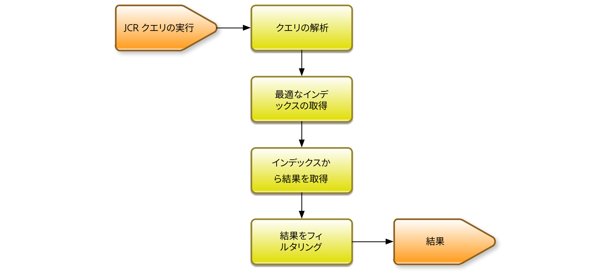

# Oak クエリとインデックス作成{#oak-queries-and-indexing}

>[!NOTE]
>
>この記事では、AEM 6 でのインデックスの設定について説明します。 クエリおよびインデックス作成のパフォーマンスの最適化のベストプラクティスについては、[クエリとインデックスに関するベストプラクティス](/help/sites-deploying/best-practices-for-queries-and-indexing.md)を参照してください。

## はじめに {#introduction}

Jackrabbit 2 とは異なり、Oak はデフォルトでコンテンツのインデックスを作成しません。 従来のリレーショナルデータベースと同様に、必要に応じてカスタムインデックスを作成する必要があります。 特定のクエリのインデックスがない場合は、多数のノードがトラバースされる可能性があります。 クエリはまだ動作する可能性がありますが、非常に遅い可能性があります。

Oak でインデックスのないクエリが検出された場合、WARN レベルのログメッセージが表示されます。

```xml
*WARN* Traversed 1000 nodes with filter Filter(query=select ...) consider creating an index or changing the query
```

## サポートされるクエリ言語 {#supported-query-languages}

Oak クエリエンジンは、次の言語をサポートしています。

* XPath （推奨）
* SQL-2
* SQL （非推奨）
* JQOM

## インデクサーのタイプとコストの計算 {#indexer-types-and-cost-calculation}

Apache Oak ベースのバックエンドを使用すると、様々なインデクサーをリポジトリにプラグインできます。

1 つのインデクサーは、 **プロパティインデックス**：インデックス定義をリポジトリ自体に格納します。

デフォルトでは、**Apache Lucene** および **Solr** の実装も使用できます。どちらもフルテキストのインデックスをサポートしています。

使用できるインデクサーがない場合は、**トラバーサルインデックス**&#x200B;が使用されます。つまり、コンテンツのインデックスが作成されず、クエリに一致するコンテンツノードが検索されます。

1 つのクエリに対して複数のインデクサーを使用できる場合、使用可能な各インデクサーは、クエリの実行にかかるコストを見積もります。 次に、Oak は推定コストが最も低いインデクサーを選択します。



上の図は、Apache Oak のクエリ実行メカニズムの概要を示しています。

まず、クエリは抽象構文ツリーに解析されます。 次に、クエリがチェックされ、Oak クエリのネイティブ言語である SQL-2 に変換されます。

次に、各インデックスを参照して、クエリのコストを見積もります。 完了すると、最も安いインデックスの結果が取得されます。 最後に、結果がフィルタリングされ、現在のユーザーが結果に対する読み取りアクセス権を持ち、結果が完全なクエリと一致するようにします。

## インデックスの設定 {#configuring-the-indexes}

>[!NOTE]
>
>大規模なリポジトリでインデックスを構築するには時間がかかります。これは、インデックスの初期作成とインデックスの再作成（定義を変更した後にインデックスを再構築）の両方に当てはまります。 [Oak インデックスのトラブルシューティング](/help/sites-deploying/troubleshooting-oak-indexes.md)と[時間のかかるインデックス再作成の防止](/help/sites-deploying/troubleshooting-oak-indexes.md#preventing-slow-re-indexing)も参照してください。

非常に大きなリポジトリでインデックス再作成が必要な場合、特に MongoDB を使用し、フルテキストインデックスの場合は、テキストの事前抽出を検討し、oak-run を使用して初期インデックスを作成し、インデックスを再作成します。

インデックスは、リポジトリ内のノードとして、 **oak:index** ノード。

インデックスノードのタイプは、 **oak:QueryIndexDefinition** 各インデクサーでは、ノードプロパティとして複数の設定オプションを使用できます。 詳しくは、以下の各インデクサータイプの設定の詳細を参照してください。

### プロパティインデックス {#the-property-index}

プロパティインデックスは通常、プロパティの制約はあるがフルテキスト検索ではないクエリに適しています。このインデックスを設定するには、次の手順に従います。

1. `http://localhost:4502/crx/de/index.jsp` に移動して CRXDE を開きます。
1. の下に新しいノードを作成します。 **oak:index**
1. ノードに名前を付けます。 **PropertyIndex**&#x200B;をクリックし、ノードタイプをに設定します。 **oak:QueryIndexDefinition**
1. 新しいノードに対して次のプロパティを設定します。

   * **タイプ：** `property` property（String タイプ）
   * **プロパティ名：** `jcr:uuid`（Name タイプ）

   この例では、`jcr:uuid` プロパティに対してインデックスを作成します。このプロパティの役割は、関連付けられたノードの Universally Unique Identifier（UUID）を公開することです。

1. 変更内容を保存します。

プロパティインデックスには次の設定オプションがあります。

* **type** プロパティは、インデックスのタイプを指定するものであり、この例の場合は **property** に設定する必要があります。

* この **propertyNames** プロパティは、インデックスに格納されるプロパティのリストを示します。 見つからない場合は、ノード名がプロパティ名の参照値として使用されます。 この例では、 **jcr:uuid** プロパティの名前を指定して、そのノードの一意の識別子 (UUID) をインデックスに追加します。

* **unique** フラグは、**true** に設定されている場合、プロパティインデックスに対して一意性制約を付加します。

* **declaringNodeTypes** プロパティでは、インデックスが唯一適用される特定のノードタイプを指定できます。
* この **再インデックス** に設定されている場合はフラグを設定 **true**&#x200B;は、コンテンツの完全なインデックス再作成をトリガーします。

### 順序付きインデックス {#the-ordered-index}

Ordered インデックスは、Property インデックスの拡張です。 ただし、非推奨（廃止予定）となりました。 このタイプのインデックスは、[Lucene プロパティインデックス](#the-lucene-property-index)に置き換える必要があります。

### Lucene フルテキストインデックス {#the-lucene-full-text-index}

AEM 6 では、Apache Lucene に基づいたフルテキストインデクサーを使用できます。

全文インデックスを設定した場合、全文インデックス条件を持つすべてのクエリは全文インデックスを使用します。インデックスが設定されている他の条件がある場合でも、パス制限がある場合でも使用します。

全文インデックスが設定されていない場合、全文条件を持つクエリは期待どおりに動作しません。

インデックスは非同期のバックグラウンドスレッドを介して更新されるので、一部のフルテキスト検索は、バックグラウンドプロセスが完了するまで、少しの時間枠で使用できません。

次の手順に従って、Lucene のフルテキストインデックスを設定できます。

1. CRXDE を開き、以下に新しいノードを作成します。 **oak:index**.
1. ノードに名前を付けます。 **LuceneIndex** ノードタイプをに設定します。 **oak:QueryIndexDefinition**
1. ノードに次のプロパティを追加します。

   * **タイプ：** `lucene` （String タイプ）
   * **async：** `async`（String タイプ）

1. 変更内容を保存します。

Lucene Index には次の設定オプションがあります。

* この **type** インデックスのタイプを指定するプロパティは、 **lucene**
* この **非同期** に設定する必要があるプロパティ **非同期**. これにより、インデックス更新プロセスがバックグラウンドスレッドに送信されます。
* この **includePropertyTypes** プロパティ。インデックスに含めるプロパティタイプのサブセットを定義します。
* プロパティ名のリストを定義する **excludePropertyNames** プロパティ - インデックスから除外する必要のあるプロパティ。
* この **再インデックス** に設定する際にフラグを設定 **true**、トリガーはコンテンツ全体のインデックスを再作成します。

### Lucene プロパティインデックス {#the-lucene-property-index}

次以降 **Oak 1.0.8**&#x200B;を使用すると、Lucene を使用して、フルテキストではないプロパティ制約を含むインデックスを作成できます。

Lucene プロパティインデックスを達成するには、 **fulltextEnabled** プロパティは常に false に設定する必要があります。

次のクエリの例について考えてみます。

```xml
select * from [nt:base] where [alias] = '/admin'
```

上記クエリのための Lucene プロパティインデックスを定義するには、**oak:index:** の下に新しいノードを作成して、次の定義を追加します。

* **名前：** `LucenePropertyIndex`
* **タイプ：** `oak:QueryIndexDefinition`

ノードを作成したら、次のプロパティを追加します。

* **type：**

   ```
   lucene (of type String)
   ```

* **async：**

   ```
   async (of type String)
   ```

* **fulltextEnabled：**

   ```
   false (of type Boolean)
   ```

* **includePropertyNames：** `[alias]` （String 型）

>[!NOTE]
>
>通常のプロパティインデックスと比較して、Lucene プロパティインデックスは常に非同期モードで設定されます。そのため、インデックスから返されるこの結果は、最新のリポジトリ状態を反映していない場合があります。

>[!NOTE]
>
>Lucene プロパティインデックスについて詳しくは、[Apache Jackrabbit Oak Lucene ドキュメントのページ](https://jackrabbit.apache.org/oak/docs/query/lucene.html)を参照してください。

### Lucene アナライザー {#lucene-analyzers}

バージョン 1.2.0 以降、Oak は Lucene アナライザーをサポートします。

アナライザは、ドキュメントのインデックスが作成されるときと、クエリ時の両方で使用されます。 アナライザはフィールドのテキストを調べ、トークンストリームを生成します。 Lucene アナライザーは、一連のトークン化クラスとフィルタークラスで構成されています。

このアナライザーは、`oak:index` 定義内の `analyzers` ノード（タイプ `nt:unstructured`）を介して定義できます。

インデックスのデフォルトのアナライザーは、analyzers ノードの子の `default` に設定されます。


>[!NOTE]
>
>使用可能なアナライザーのリストについては、使用している Lucene バージョンの API ドキュメントを参照してください。

#### Analyzer クラスの直接指定 {#specifying-the-analyzer-class-directly}

標準のアナライザを使用する場合は、次の手順に従って設定できます。

1. `oak:index` ノードの下で、アナライザーで使用するインデックスを見つけます。

1. このインデックスの下に `default` という子ノード（タイプ `nt:unstructured`）を作成します。

1. default ノードに次のプロパティを追加します。

   * **名前:** `class`
   * **タイプ：** `String`
   * **値:** `org.apache.lucene.analysis.standard.StandardAnalyzer`

   この値は、使用するアナライザークラスの名前です。

   また、特定の Lucene バージョンで使用するアナライザーを設定するには、オプションの `luceneMatchVersion` プロパティ（string）を使用することもできます。Lucene 4.7 で使用する場合の有効な構文は次のとおりです。

   * **名前:** `luceneMatchVersion`
   * **タイプ：** `String`
   * **値:** `LUCENE_47`

   `luceneMatchVersion` が指定されない場合、Oak では出荷時の Lucene のバージョンが使用されます。

1. アナライザー設定にストップワードファイルを追加する場合は、`default` ノードの下に新しいノードを作成し、次のプロパティを設定します。

   * **名前:** `stopwords`
   * **タイプ:** `nt:file`

#### 構成によるアナライザーの作成 {#creating-analyzers-via-composition}

アナライザーは、`Tokenizers`、`TokenFilters`、および `CharFilters` に基づいて構成することもできます。そのためには、アナライザーを指定し、オプションの tokenizer および filtersの子ノードを作成します。これらはリストされた順序で適用されます。[https://wiki.apache.org/solr/AnalyzersTokenizersTokenFilters#Specifying_an_Analyzer_in_the_schema](https://wiki.apache.org/solr/AnalyzersTokenizersTokenFilters#Specifying_an_Analyzer_in_the_schema) を参照してください。

例えば、次のノード構造について考えてみます。

* **名前:** `analyzers`

   * **名前:** `default`

      * **名前:** `charFilters`
      * **タイプ:** `nt:unstructured`

         * **名前:** `HTMLStrip`
         * **名前:** `Mapping`
      * **名前:** `tokenizer`

         * **プロパティ名:** `name`

            * **タイプ:** `String`
            * **値：** `Standard`
      * **名前：** `filters`
      * **タイプ:** `nt:unstructured`

         * **名前:** `LowerCase`
         * **名前:** `Stop`

            * **プロパティ名:** `words`

               * **タイプ:** `String`
               * **値：** `stop1.txt, stop2.txt`
            * **名前：** `stop1.txt`

               * **タイプ:** `nt:file`
            * **名前:** `stop2.txt`

               * **タイプ:** `nt:file`


フィルタ、charFilters および tokenizers の名前は、ファクトリのサフィックスを削除することで形成されます。 したがって、

* `org.apache.lucene.analysis.standard.StandardTokenizerFactory` が `standard` になります

* `org.apache.lucene.analysis.charfilter.MappingCharFilterFactory` が `Mapping` になります

* `org.apache.lucene.analysis.core.StopFilterFactory` が `Stop` になります

ファクトリに必要な設定パラメーターは、該当するノードのプロパティとして指定されます。

ストップワードの読み込みなど、外部ファイルのコンテンツを読み込む必要がある場合は、対象ファイル用の子ノード（タイプ `nt:file`）を作成することによってコンテンツを指定できます。

### Solr インデックス {#the-solr-index}

Solr インデックスの目的は主にフルテキスト検索ですが、パス、プロパティ制限、プライマリタイプ制限による検索のインデックスを作成する場合にも使用できます。 つまり、Oak 内の Solr インデックスは、任意の種類の JCR クエリに使用できます。

AEMでの統合はリポジトリレベルでおこなわれるので、Solr は Oak で使用できるインデックスの 1 つです。Oak はAEMに付属の新しいリポジトリ実装です。

AEMは、リモートの Solr サーバーインスタンスと連携するように設定することもできます。

1. 最新バージョンの Solr をダウンロードして抽出します。 この方法について詳しくは、 [Apache Solr のインストールドキュメント](https://cwiki.apache.org/confluence/display/solr/Installing+Solr).
1. 次に、2 つの Solr シャードを作成します。 これをおこなうには、Solr がアップされたフォルダー内の各シャードのフォルダーを作成します。

   * 1 つ目のシャード用に、次のフォルダーを作成します。

   `<solrunpackdirectory>\aemsolr1\node1`

   * 2 つ目のシャード用に、次のフォルダーを作成します。

   `<solrunpackdirectory>\aemsolr2\node2`

1. Solr パッケージ内のサンプルインスタンスを探します。通常は、パッケージのルート内の「`example`」というフォルダーにあります。
1. サンプルインスタンスの次のフォルダーを、2 つのシャードフォルダー（`aemsolr1\node1` と `aemsolr2\node2`）にコピーします。

   * `contexts`
   * `etc`
   * `lib`
   * `resources`
   * `scripts`
   * `solr-webapp`
   * `webapps`
   * `start.jar`

1. 2 つのシャードフォルダーのそれぞれに、「`cfg`」というフォルダーを新規作成します。
1. 新規作成した `cfg` フォルダーに、Solr および Zookeeper 設定ファイルを配置します。

   >[!NOTE]
   >
   >Solr および ZooKeeper 設定について詳しくは、[Solr の設定に関するドキュメント](https://wiki.apache.org/solr/ConfiguringSolr)および [ZooKeeper 入門ガイド](https://zookeeper.apache.org/doc/r3.1.2/zookeeperStarted.html)を参照してください。

1. 1 つ目のシャードを ZooKeeper サポート付きで起動するために、`aemsolr1\node1` に移動し、次のコマンドを実行します。

   ```xml
   java -Xmx2g -Dbootstrap_confdir=./cfg/oak/conf -Dcollection.configName=myconf -DzkRun -DnumShards=2 -jar start.jar
   ```

1. 2 つ目のシャードを起動するために、`aemsolr2\node2` に移動し、次のコマンドを実行します。

   ```xml
   java -Xmx2g -Djetty.port=7574 -DzkHost=localhost:9983 -jar start.jar
   ```

1. 両方のシャードが起動したら、Solr インターフェイスに接続し（`http://localhost:8983/solr/#/`）、すべてが稼働していることをテストします。
1. AEM を起動し、次の Web コンソール（`http://localhost:4502/system/console/configMgr`）にアクセスします
1. 「**Oak Solr remote server configuration**」で次の設定を行います。

   * Solr HTTP URL：`http://localhost:8983/solr/`

1. 「**Oak Solr**」サーバープロバイダー下のドロップダウンリストで「**Remote Solr**」を選択します。

1. CRXDE に移動し、管理者としてログインします。
1. という名前の新しいノードを作成します。 **solrIndex** under **oak:index**&#x200B;をクリックし、次のプロパティを設定します。

   * **type:**solr （String 型）
   * **async:**async （String 型）
   * **reindex:**true（Boolean 型）

1. 変更内容を保存します。

#### Solr の推奨設定 {#recommended-configuration-for-solr}

以下に、この記事で説明する 3 つの Solr デプロイメントすべてで使用できる基本設定の例を示します。AEMに既に存在する専用プロパティインデックスが格納され、他のアプリケーションでは使用できません。

この設定を適切に使用するには、アーカイブの内容を直接 Solr ホームディレクトリに配置する必要があります。複数のノードから成るデプロイメントの場合は、各ノードの root フォルダー直下に配置してください。

Solr 推奨設定ファイル

[ファイルを入手](assets/recommended-conf.zip)

### AEM インデックス作成ツール {#aem-indexing-tools}

AEM 6.1 では、AEM 6.0 の次の 2 つのインデックス作成ツールが Adobe Consulting Services Commons ツールセットの一部として統合されています。

1. **クエリの説明を実行**&#x200B;は、管理者がクエリの実行方法を理解できるように設計されたツールです。
1. **Oak インデックスマネージャ**：既存のインデックスを維持するための Web ユーザーインターフェイス。

これで、 **ツール/運営/ダッシュボード/診断** AEMのようこそ画面から

使用方法について詳しくは、 [運用ダッシュボードのドキュメント](/help/sites-administering/operations-dashboard.md).

#### OSGi を使用したプロパティインデックスの作成 {#creating-property-indexes-via-osgi}

ACS Commons パッケージは、プロパティインデックスの作成に使用できる OSGi 設定も公開します。

Web コンソールからアクセスするには、「**Oak プロパティインデックスを確認**&quot;.


### インデックス作成の問題のトラブルシューティング {#troubleshooting-indexing-issues}

クエリの実行に時間がかかり、一般的なシステム応答時間が長くなる場合があります。

ここでは、そのような問題の原因を詳しく追跡するために行う必要のあること、およびその問題の解決策に関する推奨事項を示します。

#### 分析のデバッグ情報の準備 {#preparing-debugging-info-for-analysis}

実行中のクエリに必要な情報を取得する最も簡単な方法は、 [クエリの説明を実行ツール](/help/sites-administering/operations-dashboard.md#explain-query). これにより、ログレベルの情報を調べる必要なく、処理の遅いクエリのデバッグに必要な正確な情報を収集できます。 デバッグ対象となるクエリがわかっている場合は、このツールをお勧めします。

何らかの理由でこれが不可能な場合は、インデックス作成ログを単一のファイルで収集し、それを使用して特定の問題のトラブルシューティングを行うことができます。

#### ログを有効にする {#enable-logging}

ログを有効にするには、Oak インデックスおよびクエリに関連するカテゴリで **DEBUG** レベルのログを有効にする必要があります。対象のカテゴリは以下の通りです。

* org.apache.jackrabbit.oak.plugins.index
* org.apache.jackrabbit.oak.query
* com.day.cq.search

この **com.day.cq.search** カテゴリは、AEMが提供する QueryBuilder ユーティリティを使用する場合にのみ適用できます。

>[!NOTE]
>
>ログは、トラブルシューティングするクエリが実行されている間のみ DEBUG に設定することが重要です。設定しないと、時間の経過と共に大量のイベントがログに生成されます。 このため、必要なログが収集されたら、前述のカテゴリの情報レベルのログに戻します。

次の手順に従って、ログを有効にすることができます。

1. ブラウザーで `https://serveraddress:port/system/console/slinglog` を指定します。
1. コンソールの下部にある「**Add new Logger**」ボタンをクリックします。

1. 新しく作成された行で、前述のカテゴリを追加します。**+** 記号を使用して、1 つのロガーに複数のカテゴリを追加できます。

1. 「**Log level**」ドロップダウンリストから **DEBUG** を選択します。

1. 出力ファイルを `logs/queryDebug.log` に設定します。この設定によって、すべての DEBUG イベントが 1 つのログファイルに関連付けられます。

1. クエリを実行するか、デバッグ対象のクエリを使用しているページをレンダリングします。

1. クエリを実行したら、ログコンソールに戻り、新しく作成したロガーのログレベルを **INFO** に変更します。

#### インデックス設定 {#index-configuration}

クエリの評価方法は、インデックス設定の影響を大きく受けます。 サポートに対して分析または送信するには、インデックス設定を取得することが重要です。 設定は、コンテンツパッケージとして取得するか、JSON レンディションを取得できます。

ほとんどの場合、インデックス設定は CRXDE の `/oak:index` ノードの下に格納されているので、JSON バージョンは次から取得できます。

`https://serveraddress:port/oak:index.tidy.-1.json`

インデックスが別の場所で設定されている場合は、それに応じてパスを変更します。

#### MBean 出力 {#mbean-output}

場合によっては、デバッグにインデックス関連の MBean の出力を提供すると便利です。 手順は次のとおりです。

1. JMX コンソールに移動します。
   `https://serveraddress:port/system/console/jmx`

1. 次の MBean を検索します。

   * Lucene Index 統計
   * CopyOnRead のサポート統計
   * Oak クエリ統計
   * IndexStats

1. それぞれの MBean をクリックして、パフォーマンス統計を取得します。サポートへの提出が必要な場合に備え、スクリーンショットを取得するか、記録しておきます。

また、これらの統計に関する JSON 形式の情報を、次の URL で取得できます。

* `https://serveraddress:port/system/sling/monitoring/mbeans/org/apache/jackrabbit/oak/%2522LuceneIndex%2522.tidy.-1.json`
* `https://serveraddress:port/system/sling/monitoring/mbeans/org/apache/jackrabbit/oak/%2522LuceneIndex%2522.tidy.-1.json`
* `https://serveraddress:port/system/sling/monitoring/mbeans/org/apache/jackrabbit/oak/%2522LuceneIndex%2522.tidy.-1.json`
* `https://serveraddress:port/system/sling/monitoring/mbeans/org/apache/jackrabbit/oak/%2522LuceneIndex%2522.tidy.-1.json`

さらに、`https://serveraddress:port/system/sling/monitoring/mbeans/org/apache/jackrabbit/oak.tidy.3.json` から、統合された JMX 出力を提供することもできます。これには、Oak 関連のすべての MBean 詳細が JSON 形式で含まれています。

#### その他の詳細 {#other-details}

問題のトラブルシューティングに役立つ次のような詳細を収集できます。

1. インスタンスが実行されている Oak のバージョン。この情報を確認するには、CRXDE を開き、ようこそページの右下隅にあるバージョンを参照するか、`org.apache.jackrabbit.oak-core` バンドルのバージョンをチェックします。
1. 問題が発生しているクエリの QueryBuilder デバッガーの出力。デバッガーには、`https://serveraddress:port/libs/cq/search/content/querydebug.html` からアクセスできます。
