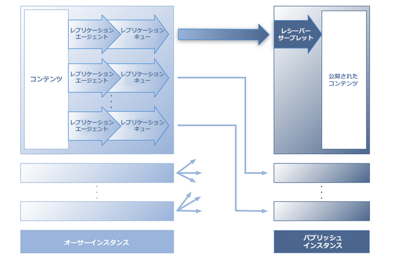
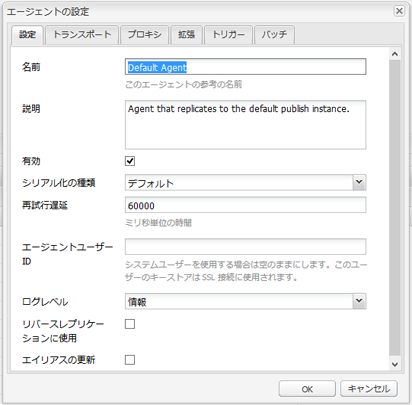
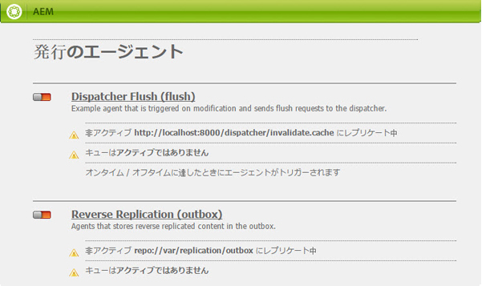
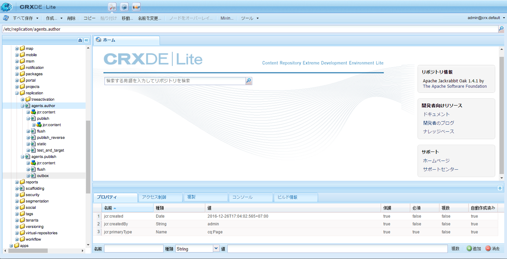
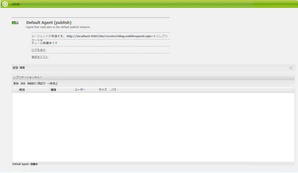

# レプリケーション{#replication}

レプリケーションエージェントは、次の目的で使用されるメカニズムとして Adobe Experience Manager（AEM）の中核を成すものです。

* オーサー環境からパブリッシュ環境へコンテンツを[公開（アクティベート）](/help/sites-authoring/publishing-pages.md#publishing-pages)
* Dispatcher キャッシュからコンテンツを明示的にフラッシュ
* ユーザー入力（フォーム入力など）をパブリッシュ環境からオーサー環境（オーサー環境の制御下）に戻す。

要求は適切なエージェントに[登録](/help/sites-deploying/osgi-configuration-settings.md)され、処理を待機します。

>[!NOTE]
>
>ユーザーデータ（ユーザー、ユーザーグループおよびユーザープロファイル）は、オーサーインスタンスとパブリッシュインスタンスの間でレプリケートされません。
>
>パブリッシュインスタンスが複数ある場合は、[ユーザーの同期](/help/sites-administering/sync.md)が有効化されたときにユーザーデータが Sling 分配されます。

## オーサーからパブリッシュへのレプリケーション {#replicating-from-author-to-publish}

パブリッシュインスタンスまたは Dispatcher へのレプリケーションは、いくつかの段階を踏んで実行されます。

* 作成者が特定のコンテンツの公開（アクティベート）を要求します。これは、手動の要求または設定済みの自動トリガーによって開始できます。
* デフォルトの適切なレプリケーションエージェントに要求が渡されます。このようなアクションのために選択されるデフォルトエージェントを、1 つの環境にいくつか用意することができます。
* レプリケーションエージェントがコンテンツを「パッケージ化」して、レプリケーションキューに配置します。
* 「Web サイト」タブで、個々のページに対して[色付きのステータスインジケーター](/help/sites-authoring/publishing-pages.md#determining-publication-status)が設定されます。
* 設定されたプロトコル（通常は HTTP）を使用して、コンテンツがキューから取り出されて、パブリッシュ環境に移されます。
* パブリッシュ環境内のサーブレットが要求を受信し、受信したコンテンツを公開します。デフォルトのサーブレットは `http://localhost:4503/bin/receive` です。

* 複数のオーサー環境とパブリッシュ環境を設定できます。

## パブリッシュ環境からオーサー環境へのレプリケーション {#replicating-from-publish-to-author}

一部の機能は、ユーザーに対してパブリッシュインスタンス上でのデータ入力を許可します。

状況によっては、このデータをオーサー環境に返してそこから別のパブリッシュ環境へ再分配するために、リバースレプリケーションという種類のレプリケーションが必要になることがあります。セキュリティ上の考慮事項により、パブリッシュからオーサー環境へのトラフィックは厳密に制御する必要があります。

リバースレプリケーションでは、オーサー環境を参照するパブリッシュ環境内のエージェントを使用します。このエージェントが、データをアウトボックスに配置します。このアウトボックスは、オーサー環境のレプリケーションリスナーに対応付けられています。リスナーはアウトボックスをポーリングして、入力されているすべてのデータを収集し、必要に応じて配布します。これにより、オーサー環境がすべてのトラフィックを確実に制御できるようになります。

その他の場合、例えばフォーラム、ブログ、コメント、レビューなどのコミュニティ機能では、パブリッシュ環境に入力されるユーザー生成コンテンツ（UGC）の量が多いので、AEM インスタンス間の効率的な同期をレプリケーションで実現することは難しくなります。

AEM [コミュニティ](/help/communities/overview.md) UGC にレプリケーションを使用しない。 代わりに、コミュニティのデプロイメントには UGC 用の共通ストアが必要です ( [コミュニティコンテンツストレージ](/help/communities/working-with-srp.md)) をクリックします。

## レプリケーション（デフォルト） {#replication-out-of-the-box}

AEM の標準インストールに含まれている Geometrixx Web サイトを使用して、レプリケーションの仕組みを見ていきましょう。

この例に従ってデフォルトのレプリケーションエージェントを使用するには、次の手順を実行する必要があります [AEMをインストール](/help/sites-deploying/deploy.md) 次を使用：

* オーサー環境（ポート `4502`）
* パブリッシュ環境（ポート `4503`）

>[!NOTE]
>
>以下はデフォルトで有効になっています。
>
>* 作成者のエージェント：デフォルトエージェント（publish）
>
>事実上、以下はデフォルトで無効になっています（AEM 6.1 以降）。
>
>* 作成者のエージェント：リバースレプリケーションエージェント (publish_reverse)
>* Agents on publish : Reverse Replication (outbox)

>
>エージェントまたはキューのステータスを確認するには、**ツール**&#x200B;コンソールを使用します。\
>[レプリケーションエージェントの監視](#monitoring-your-replication-agents)を参照してください。

### レプリケーション（オーサー環境からパブリッシュ環境へ） {#replication-author-to-publish}

1. オーサー環境でサポートページに移動します。

   `http://localhost:4502/content/geometrixx/en/support.html`

1. ページを編集して、新しいテキストをいくつか追加します。
1. **ページをアクティベート**&#x200B;して変更内容を公開します。
1. パブリッシュ環境でサポートページを開きます。

   `http://localhost:4503/content/geometrixx/en/support.html`

1. オーサー環境で入力した変更内容を確認できます。

このレプリケーションは、次のエージェントによってオーサー環境から実行されます。

* **デフォルトエージェント (publish)**
このエージェントは、デフォルトのパブリッシュインスタンスにコンテンツをレプリケートします。

   この詳細（設定とログ）は、オーサー環境のツールコンソールからアクセスできます。または

   `http://localhost:4502/etc/replication/agents.author/publish.html`

### レプリケーションエージェント（デフォルト） {#replication-agents-out-of-the-box}

次に示すエージェントは標準の AEM インストールで使用できます。

* [デフォルトエージェント](#replication-author-to-publish)  — オーサーからパブリッシュへのレプリケーションに使用します。

* Dispatcher フラッシュ — Dispatcher キャッシュの管理に使用されます。詳しくは、 [オーサリング環境からの Dispatcher キャッシュの無効化](https://helpx.adobe.com/experience-manager/dispatcher/using/page-invalidate.html#invalidating-dispatcher-cache-from-the-authoring-environment) および [パブリッシュインスタンスからの Dispatcher キャッシュの無効化](https://helpx.adobe.com/experience-manager/dispatcher/using/page-invalidate.html#invalidating-dispatcher-cache-from-a-publishing-instance) を参照してください。

* [リバースレプリケーション](#replicating-from-publish-to-author)  — パブリッシュからオーサーへのレプリケーションに使用します。 Reverse replication is not used for Communities features, such as forums, blogs, and comments. It is effectively disabled as the outbox is not enabled. Use of reverse replication would require custom configuration.

* 静的エージェント — 「ノードの静的表現をファイルシステムに保存するエージェント」です。 例えば、デフォルト設定では、コンテンツページと DAM アセットは、 `/tmp`(HTMLまたは適切なアセット形式 ) 詳しくは、 `Settings` および `Rules` タブを使用して設定を行います。 これは、ページがアプリケーションサーバーから直接要求される場合に、コンテンツを確認できるようにするためのエージェントです。これは特殊なエージェントであり、（おそらく）ほとんどのインスタンスでは必要ありません。

## レプリケーションエージェント - 設定パラメーター {#replication-agents-configuration-parameters}

ツールコンソールからレプリケーションエージェントを設定する場合は、ダイアログ内の 4 つのタブを使用できます。

### 設定 {#settings}

* **名前**

   レプリケーションエージェントの一意の名前です。

* **説明**

   このレプリケーションエージェントの用途の説明です。

* **有効**

   現在レプリケーションエージェントが有効かどうかを示します。

   エージェントが&#x200B;**有効**&#x200B;な場合は、キューが次のように表示されます。

   * **アクティブ**：項目が処理されています。
   * **待機中**：キューが空です。
   * **ブロック**：項目がキュー内にありますが、処理できません。例えば、受信側のキューが無効な場合などです。

* **シリアル化の種類**

   シリアル化の種類です。

   * **デフォルト**：エージェントを自動選択する場合に設定します。
   * **Dispatcher フラッシュ**：エージェントを使用して Dispatcher キャッシュをフラッシュする場合に選択します。

* **再試行遅延**

   問題が発生した場合の、2 回の再試行の間の遅延（ミリ秒単位の待機時間）です。

   デフォルト: `60000`

* **エージェントユーザー ID**

   環境に応じて、エージェントはこのユーザーアカウントを使用して次の処理をおこないます。

   * オーサー環境からのコンテンツの収集とパッケージ化
   * パブリッシュ環境でのコンテンツの作成と書き込み

   システムユーザーアカウント（sling で管理者ユーザーとして定義したアカウント。デフォルトでは、`admin` です）を使用するには、このフィールドを空白のままにします。

   >[!CAUTION]
   >
   >オーサー環境におけるエージェントの場合、このアカウントには、レプリケーションしたすべてのパスに対する読み取りアクセス権が必要です。**

   >[!CAUTION]
   >
   >*パブリッシュ環境におけるエージェントの場合、このアカウントでコンテンツをレプリケーションするには、作成／書き込みアクセス権が必要です。*

   >[!NOTE]
   >
   >これは、レプリケーション用の特定のコンテンツを選択するためのメカニズムとして使用できます。

* **ログレベル**

   ログメッセージに使用する詳細レベルを指定します。

   * `Error`:エラーのみがログに記録されます
   * `Info`: errors, warnings and other informational messages will be logged
   * `Debug`:詳細の概要は、主にデバッグ目的でメッセージで使用されます

   デフォルト: `Info`

* **リバースレプリケーションに使用**

   このエージェントをリバースレプリケーションに使用するかどうかを示します。パブリッシュ環境からオーサー環境にユーザーの入力を戻します。

* **エイリアスの更新**

   このオプションを選択すると、Dispatcher へのエイリアスまたはバニティーパスの無効化要求が有効になります。また、 [Dispatcher フラッシュエージェントの設定](/help/sites-deploying/replication.md#configuring-a-dispatcher-flush-agent).

### トランスポート {#transport}

* **URI**

   ターゲットの場所にある受信側のサーブレットを指定します。具体的には、ホスト名（またはエイリアス）とターゲットインスタンスのコンテキストパスを指定できます。

   次に例を示します。

   * デフォルトエージェントのレプリケート先 `http://localhost:4503/bin/receive`
   * A Dispatcher Flush agent may replicate to `http://localhost:8000/dispatcher/invalidate.cache`

   ここで指定するプロトコル（HTTP または HTTPS）によってトランスポート方法が決まります。

   Dispatcher フラッシュエージェントの場合、URI プロパティは、パスベースの仮想ホストエントリを使用してファームを区別する場合にのみ使用されます。このフィールドを使用して、無効にするファームをターゲット設定します。 例えば、ファーム #1 の仮想ホストは `www.mysite.com/path1/*` で、ファーム #2 の仮想ホストは `www.mysite.com/path2/*` です。この場合、`/path1/invalidate.cache` の URL を使用して最初のファームをターゲット設定し、`/path2/invalidate.cache` を使用して 2 つ目のファームをターゲット設定できます。

* **ユーザー**

   ターゲットへのアクセスに使用するアカウントのユーザー名です。

* **パスワード**

   ターゲットへのアクセスに使用するアカウントのパスワードです。

* **NTLM ドメイン**

   NTML 認証用のドメインです。

* **NTLM ホスト**

   NTML 認証用のホストです。

* **緩和された SSL を有効にする**

   自己証明 SSL 証明書を受け取る場合に有効にします。

* **期限切れの証明書を許可する**

   期限切れ SSL 証明書を受け取る場合に有効にします。

### プロキシ {#proxy}

以下の設定は、プロキシが必要な場合にのみおこないます。

* **プロキシホスト**

   トランスポートに使用するプロキシのホスト名です。

* **プロキシポート**

   プロキシのポートです。

* **プロキシユーザー**

   使用するアカウントのユーザー名です。

* **プロキシパスワード**

   使用するアカウントのパスワードです。

* **プロキシ NTLM ドメイン**

   プロキシの NTLM ドメインです。

* **プロキシ NTLM ホスト**

   プロキシの NTLM ドメインです。

### 拡張 {#extended}

* **インターフェイス**

   ここでは、バインド先のソケットインターフェイスを定義できます。

   接続の作成時に使用するローカルアドレスを設定します。設定しない場合は、デフォルトのアドレスが使用されます。これは、マルチホームシステムやクラスターシステムで使用するインターフェイスを指定する場合に役立ちます。

* **HTTP メソッド**

   使用する HTTP メソッドです。

   Dispatcher フラッシュエージェントでは、ほとんどの場合 GET です。この設定を変更しないでください（有効なもう 1 つの値は POST です）。

* **HTTP ヘッダー**

   Dispatcher フラッシュエージェントで使用されます。フラッシュする必要のある要素を指定します。

   Dispatcher フラッシュエージェントの場合、次の 3 つの標準エントリを変更する必要はありません。

   * `CQ-Action:{action}`
   * `CQ-Handle:{path}`
   * `CQ-Path:{path}`

   必要に応じてこれらを使用して、ハンドルまたはパスのフラッシュ時に使用するアクションを指定します。サブパラメーターは動的です。

   * `{action}` レプリケーションアクションを示します
   * `{path}` パスを示します

   これらは、要求に関連するパスまたはアクションで置き換えられるので、ハードコーディングする必要はありません。

   >[!NOTE]
   >
   >推奨されるデフォルトのコンテキスト以外のコンテキストに AEM をインストールした場合は、「HTTP ヘッダー」にそのコンテキストを登録する必要があります。次に例を示します。
   >
   >`CQ-Handle:/<*yourContext*>{path}`

* **接続を閉じる**

   各要求の後に接続を閉じられるようにします。

* **接続タイムアウト**

   接続の確立の試行時に適用するタイムアウト（ミリ秒単位）です。

* **Socket Timeout**

   接続の確立後のトラフィックの待機時に適用するタイムアウト（ミリ秒単位）です。

* **プロトコルのバージョン**

   プロトコルのバージョンです。例えば、HTTP/ の場合は `1.0`1.0 です。

#### トリガー {#triggers}

以下の設定を使用して、自動化されたレプリケーションのトリガーを定義します。

* **デフォルトを無視**

   オンにすると、デフォルトのレプリケーションからエージェントが除外されます。つまり、コンテンツの作成者がレプリケーションのアクションを実行しても、そのエージェントは使用されません。

* **変更時**

   ページが変更されると、このエージェントによるレプリケーションが自動的にトリガーされます。これは主に Dispatcher フラッシュエージェントに使用されますが、リバースレプリケーションにも使用されます。

* **配布時**

   オンにすると、配布用にマークされたコンテンツの変更時に、エージェントがそのコンテンツを自動的にレプリケーションします。

* **オン / オフタイムに達しました**

   ページに対して定義されたオンタイムまたはオフタイムになると、自動レプリケーションをトリガーします（必要に応じて、ページをアクティベート／アクティベート解除します）。これは主に Dispatcher フラッシュエージェントに使用されます。

* **受信時**

   オンにすると、レプリケーションイベントを受信するたびにエージェントがチェーンレプリケーションをおこないます。

* **ステータス更新がありません**

   オンにすると、エージェントはレプリケーションステータスの更新を強制しません。

* **バージョン管理がありません**

   オンにすると、エージェントはアクティベートされたページのバージョン管理を強制しません。

## レプリケーションエージェントの設定 {#configuring-your-replication-agents}

MSSL を使用してレプリケーションエージェントをパブリッシュインスタンスに接続する方法については、[相互 SSL を使用したレプリケーション](/help/sites-deploying/mssl-replication.md)を参照してください。

### オーサー環境からのレプリケーションエージェントの設定 {#configuring-your-replication-agents-from-the-author-environment}

オーサー環境の「ツール」タブから、オーサー環境（**作成者のエージェント**）またはパブリッシュ環境（**発行のエージェント**）にあるレプリケーションエージェントを設定できます。次の手順は、オーサー環境用のエージェントの設定方法を示していますが、どちらの環境にも使用できます。

>[!NOTE]
>
>Dispatcher がオーサーインスタンスまたはパブリッシュインスタンスの HTTP 要求を処理する場合は、レプリケーションエージェントからの HTTP 要求に PATH ヘッダーが含まれている必要があります。次の手順に加えて、クライアントヘッダーの Dispatcher のリストに PATH ヘッダーを追加する必要があります（[/clientheaders（クライアントヘッダー）](https://helpx.adobe.com/experience-manager/dispatcher/using/dispatcher-configuration.html#specifying-the-http-headers-to-pass-through-clientheaders)に関するページを参照してください）。

1. AEM の「**ツール**」タブにアクセスします。
1. 「**レプリケーション**」（フォルダーを開くための左側のウィンドウ）をクリックします。
1. 「**作成者のエージェント**」（左側または右側のウィンドウ）をダブルクリックします。
1. 適切なエージェント名（リンク）をクリックして、そのエージェントの詳細情報を表示します。
1. 「**編集**」をクリックして設定ダイアログを開きます。

   

1. 指定した値は、デフォルトのインストールで十分である必要があります。変更を加えた場合は、 **OK** それらを保存する ( [レプリケーションエージェント — 設定パラメーター](#replication-agents-configuration-parameters) 個々のパラメーターの詳細を参照 )。

>[!NOTE]
>
>AEM の標準インストールでは、`admin` をデフォルトのレプリケーションエージェント内のトランスポート資格情報のユーザーとして指定します。
>
>このユーザーを、必要なパスをレプリケーションする権限を持つ、サイト固有のレプリケーションのユーザーアカウントに変更する必要があります。

### リバースレプリケーションの設定 {#configuring-reverse-replication}

リバースレプリケーションは、パブリッシュインスタンスで生成されたユーザーコンテンツをオーサーインスタンスに戻すために使用されます。この機能は、通常はアンケート調査や登録フォームなどで使用されます。

ほとんどのネットワークトポロジは、セキュリティ上の理由により、「非武装地帯（DMZ）」（インターネットなどの信頼できないネットワークに外部サービスを公開するサブネットワーク）からの接続を許可しません。**

通常、パブリッシュ環境は DMZ にあるので、コンテンツをオーサー環境に戻すには、オーサーインスタンスから接続を開始する必要があります。そのためには、次のものを使用します。

* コンテンツが配置されているパブリッシュ環境のアウトボックス&#x200B;**
* 新しいコンテンツ用のアウトボックスを定期的にポーリングする、オーサー環境のエージェント（publish）

>[!NOTE]
>
>For AEM [Communities](/help/communities/overview.md), replication is not used for user generated content on a publish instance. See [Community Content Storage](/help/communities/working-with-srp.md).

そのためには、次のものが必要です。

**オーサー環境のリバースレプリケーションエージェント** これは、パブリッシュ環境のアウトボックスから情報を収集するアクティブなコンポーネントとして機能します。

リバースレプリケーションを使用する場合は、このエージェントをアクティベートします。

**パブリッシュ環境（アウトボックス）のリバースレプリケーションエージェント** これは「アウトボックス」として機能するパッシブ要素です。 User input is placed here, from where it is collected by the agent in the author environment.

### 複数のパブリッシュインスタンス用のレプリケーションの設定 {#configuring-replication-for-multiple-publish-instances}

>[!NOTE]
>
>コンテンツのみがレプリケートされます。ユーザーデータ（ユーザー、ユーザーグループ、ユーザープロファイル）はレプリケートされません。
>
>複数のパブリッシュインスタンス間でユーザーデータを同期するには、 [ユーザーの同期](/help/sites-administering/sync.md).

インストール時には、localhost のポート 4503 で実行されているパブリッシュインスタンスにコンテンツをレプリケートするデフォルトエージェントが既に設定されています。

その他のパブリッシュインスタンスへのコンテンツレプリケーションを設定するには、新しいレプリケーションエージェントを作成し、設定する必要があります。

1. AEM の「**ツール**」タブを開きます。
1. 「**レプリケーション**」を選択し、左側のパネルで「**作成者のエージェント**」を選択します。
1. 「**新規**」を選択します。
1. 「**タイトル**」と「**名前**」を設定し、「**レプリケーションエージェント**」を選択します。
1. 「**作成**」をクリックして新しいエージェントを作成します。
1. 新しいエージェント項目をダブルクリックして、設定パネルを開きます。
1. 「**編集**」をクリックします。**エージェントの設定**&#x200B;ダイアログが開きます。「**シリアル化の種類**」には既に「デフォルト」が定義されているので、そのままにしてください。

   * 「**設定**」タブで、次のように設定します。

      * 「**有効**」をアクティブにします。
      * 「**説明**」を入力します。
      * 「**再試行遅延**」を `60000` に設定します。
      * を **シリアル化の種類** as `Default`.
   * 「**トランスポート**」タブで、次のように設定します。

      * 新しいパブリッシュインスタンスに必要な URI を入力します。例：

         `http://localhost:4504/bin/receive`.

      * レプリケーションに使用する、サイト固有のユーザーアカウントを入力します。
      * 必要に応じて、その他のパラメーターを設定できます。

1. 「**OK**」をクリックして設定を保存します。

次に、オーサー環境でページを更新および公開して操作をテストできます。

更新された内容は、前述の手順で設定したすべてのパブリッシュインスタンスに表示されます。

If you encounter any problems, you can check the logs on the author instance. 必要な詳細レベルに応じて、 **ログレベル** から `Debug` の使用 **エージェント設定** ダイアログを開きます。

>[!NOTE]
>
>この設定を「[エージェントユーザー ID](#settings)」と一緒に使用すると、個々のパブリッシュ環境にレプリケーションする別のコンテンツを選択できます。それぞれのパブリッシュ環境に対して、次の手順を実行します。
>
>1. パブリッシュ環境へのレプリケーション用のレプリケーションエージェントを設定します。
>1. 特定のパブリッシュ環境にレプリケーションされるコンテンツを読み取るために必要なアクセス権を持つユーザーアカウントを設定します。
>1. そのユーザーアカウントをレプリケーションエージェントの「**エージェントユーザー ID**」として割り当てます。

>

### Dispatcher フラッシュエージェントの設定 {#configuring-a-dispatcher-flush-agent}

デフォルトエージェントはインストールに付属しています。ただし、一部の設定については調整が必要です。新しいエージェントを定義する場合も同様です。

1. AEM の「**ツール**」タブを開きます。
1. 「**導入**」をクリックします。
1. Select **Replication** and then **Agents on publish**.
1. **Dispatcher フラッシュ**&#x200B;項目をダブルクリックして、概要を開きます。
1. 「**編集**」をクリックします。**エージェントの設定**&#x200B;ダイアログが開きます。

   * 「**設定**」タブで、次のように設定します。

      * 「**有効**」をアクティブにします。
      * 「**説明**」を入力します。
      * を **シリアル化の種類** as `Dispatcher Flush`または、新しいエージェントを作成する場合はそのように設定します。
      * （オプション）を選択します。 **エイリアスの更新** Dispatcher に対するエイリアスまたはバニティーパスの無効化要求を有効にする。
   * 「**トランスポート**」タブで、次のように設定します。

      * Enter the required URI for the new publish instance; for example,

         `http://localhost:80/dispatcher/invalidate.cache`.

      * レプリケーションに使用する、サイト固有のユーザーアカウントを入力します。
      * 必要に応じて、その他のパラメーターを設定できます。

   Dispatcher フラッシュエージェントの場合、URI プロパティは、パスベースの仮想ホストエントリを使用してファームを区別する場合にのみ使用されます。このフィールドを使用して、無効にするファームをターゲット設定します。 例えば、ファーム #1 の仮想ホストは `www.mysite.com/path1/*` で、ファーム #2 の仮想ホストは `www.mysite.com/path2/*` です。この場合、`/path1/invalidate.cache` の URL を使用して最初のファームをターゲット設定し、`/path2/invalidate.cache` を使用して 2 つ目のファームをターゲット設定できます。

   >[!NOTE]
   >
   >推奨されるデフォルトのコンテキスト以外のコンテキストに AEM をインストールした場合は、「[拡張](#extended)」タブで **HTTP ヘッダー**&#x200B;を設定する必要があります。

1. 「**OK**」をクリックして、変更を保存します。
1. 「**ツール**」タブに戻ります。ここから **Dispatcher フラッシュ**&#x200B;エージェント（**発行のエージェント**）を&#x200B;**アクティベート**&#x200B;できます。

**Dispatcher フラッシュ**&#x200B;レプリケーションエージェントは、オーサーではアクティブではありません。同等の URI（例：`http://localhost:4503/etc/replication/agents.publish/flush.html`）を使用すると、パブリッシュ環境で同じページにアクセスできます。

### レプリケーションエージェントへのアクセスの制御 {#controlling-access-to-replication-agents}

`etc/replication` ノードに対するユーザーまたはグループのページの権限を使用して、レプリケーションエージェントの設定に使用するページへのアクセスを制御できます。

>[!NOTE]
>
>このような権限の設定は、例えば Web サイトコンソールやサイドキックのオプションからコンテンツをレプリケーションするユーザーには影響を及ぼしません。レプリケーションフレームワークでは、ページのレプリケーション時に、現在のユーザーの「ユーザーセッション」を使用してレプリケーションエージェントにアクセスしません。

### CRXDE Lite からのレプリケーションエージェントの設定 {#configuring-your-replication-agents-from-crxde-lite}

>[注意!]
>
>レプリケーションエージェントの作成は、 `/etc/replication` リポジトリの場所。 関連する ACL を正しく処理するには、これが必要です。 ツリーの別の場所にレプリケーションエージェントを作成すると、許可されていないアクセスが発生する場合があります。

CRXDE Lite を使用して、レプリケーションエージェントの様々なパラメーターを設定できます。

次に移動した場合： `/etc/replication` 次の 3 つのノードが表示されます。

* `agents.author`
* `agents.publish`
* `treeactivation`

2 人は `agents` 適切な環境に関する構成情報を保持し、その環境が実行中の場合にのみアクティブになります。 例： `agents.publish` は、パブリッシュ環境でのみ使用されます。 次のスクリーンショットは、AEM WCM に含まれる、オーサー環境のパブリッシュエージェントを示しています。

## レプリケーションエージェントの監視 {#monitoring-your-replication-agents}

レプリケーションエージェントを監視するには：

1. AEM の「**ツール**」タブにアクセスします。
1. 「**レプリケーション**」をクリックします。
1. 適切な環境のエージェントへのリンクをダブルクリックします（左右いずれかのウィンドウ）。例えば、「**オーサーのエージェント**」などです。

   ウィンドウが開き、オーサー環境のすべてのレプリケーションエージェントの概要が、それぞれのターゲットとステータスを含めて表示されます。

1. 適切なエージェント名（リンク）をクリックして、そのエージェントの詳細情報を表示します。

   

   ここでは、以下のことができます。

   * エージェントが有効かどうかを確認。
   * レプリケーションのターゲットを確認。
   * レプリケーションキューが現在アクティブ（有効）かどうかを確認。
   * キュー内に項目が含まれているかどうかを確認。
   * **更新**&#x200B;または&#x200B;**消去**&#x200B;して、キューエントリの表示を更新。これは、キューに出入りする項目の確認に役立ちます。
   * **ログを表示**&#x200B;して、レプリケーションエージェントによるアクションのログにアクセス。
   * ターゲットインスタンスへの&#x200B;**接続をテスト**。
   * 必要に応じて、任意のキュー項目で&#x200B;**強制的に再試行**。

   >[!CAUTION]
   >
   >パブリッシュインスタンスのリバースレプリケーションアウトボックスには、「接続をテスト」リンクは使用しないでください。
   >
   >アウトボックスクエリ用にレプリケーションテストが実行されると、リバースレプリケーションのたびに、テストレプリケーションより古い項目がすべて再処理されます。
   >
   >そのような項目がキュー内に既に存在する場合は、次の XPath JCR クエリを使用して検索し、削除する必要があります。
   >
   >`/jcr:root/var/replication/outbox//*[@cq:repActionType='TEST']`

## バッチレプリケーション {#batch-replication}

The batch replication does not replicate individual pages or assets, but waits for the fist threshold of the two, based on time or size, to be triggered.

It then packs all replication items into a package, which is then replicated as one single file to the publisher.

発行者は、すべての項目を解凍し、保存して作成者に報告します。

### バッチレプリケーションの設定 {#configuring-batch-replication}

1. `http://serveraddress:serverport/siteadmin` に移動します。
1. Press the **[!UICONTROL Tools]** icon in the uppper side of the screen
1. 左側のナビゲーションレールから、に移動します。 **[!UICONTROL レプリケーション — 作成者のエージェント]** をクリックし、 **[!UICONTROL デフォルトエージェント]**.
   * また、デフォルトのパブリッシュレプリケーションエージェントに直接アクセスするには、 `http://serveraddress:serverport/etc/replication/agents.author/publish.html`
1. Press the **[!UICONTROL Edit]** button above the replication queue.
1. In the following window, go to the **[!UICONTROL Batch]** tab:
   
1. エージェントを設定します。

### パラメーター {#parameters}

* `[!UICONTROL Enable Batch Mode]`  — バッチレプリケーションモードを有効または無効にします
* `[!UICONTROL Max Wait Time]`  — バッチリクエストが開始されるまでの最大待機時間（秒）。 デフォルト値は 2 秒です。
* `[!UICONTROL Trigger Size]`  — このサイズ制限に達すると、バッチレプリケーションを開始します（MB 単位）。 デフォルト値は 5 MB です。

## その他のリソース {#additional-resources}

トラブルシューティングの詳細については、[レプリケーションのトラブルシューティング](/help/sites-deploying/troubleshoot-rep.md)ページを参照してください。

Adobe では、追加情報として、レプリケーションに関連する一連のナレッジベースの記事を提供しています。

[https://helpx.adobe.com/experience-manager/kb/ReplicationSiblingReordering.html](https://helpx.adobe.com/experience-manager/kb/ReplicationSiblingReordering.html)\
[https://helpx.adobe.com/experience-manager/kb/ReplicationFailureAfterNewIP.html](https://helpx.adobe.com/experience-manager/kb/ReplicationFailureAfterNewIP.html)\
[https://helpx.adobe.com/experience-manager/kb/LimitAccessToReplicationAgents.html](https://helpx.adobe.com/experience-manager/kb/LimitAccessToReplicationAgents.html)\
[https://helpx.adobe.com/experience-manager/kb/PagePermissionsNotReplicatedWithUser.html](https://helpx.adobe.com/experience-manager/kb/PagePermissionsNotReplicatedWithUser.html)\
[https://helpx.adobe.com/experience-manager/kb/HowToUseReverseReplication.html](https://helpx.adobe.com/experience-manager/kb/HowToUseReverseReplication.html)\
[https://helpx.adobe.com/experience-manager/kb/CQ5ReplicateToSpecificAgents.html](https://helpx.adobe.com/experience-manager/kb/CQ5ReplicateToSpecificAgents.html)\
[https://helpx.adobe.com/experience-manager/kb/ReplicationListener.html](https://helpx.adobe.com/experience-manager/kb/ReplicationListener.html)\
[https://helpx.adobe.com/experience-manager/kb/replication-stuck.html](https://helpx.adobe.com/experience-manager/kb/replication-stuck.html)\
[https://helpx.adobe.com/experience-manager/kb/replication-privileges-missing-after-upgrade-to-cq-5-5.html](https://helpx.adobe.com/experience-manager/kb/replication-privileges-missing-after-upgrade-to-cq-5-5.html)\
[https://helpx.adobe.com/experience-manager/kb/CQ53UnableToCreateJobQueueDueToMaxQueues.html](https://helpx.adobe.com/experience-manager/kb/CQ53UnableToCreateJobQueueDueToMaxQueues.html)\
[https://helpx.adobe.com/experience-manager/kb/ACLReplication.html](https://helpx.adobe.com/experience-manager/kb/ACLReplication.html)\
[https://helpx.adobe.com/experience-manager/kb/content-grow-due-reverse-replication.html](https://helpx.adobe.com/experience-manager/kb/content-grow-due-reverse-replication.html)\
[https://helpx.adobe.com/experience-manager/kb/ReplicationAgentUsingAnonUser.html](https://helpx.adobe.com/experience-manager/kb/ReplicationAgentUsingAnonUser.html)
