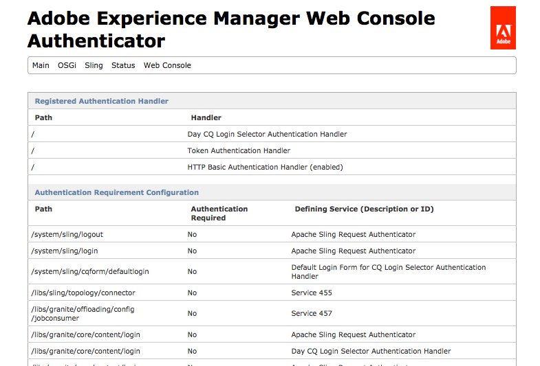

# シングルサインオン {#single-sign-on}

シングルサインオン (SSO) を使用すると、ユーザーは認証資格情報（ユーザー名やパスワードなど）を 1 回入力した後で、複数のシステムにアクセスできます。 別のシステム（信頼された認証子）が認証を実行し、Experience Managerにユーザーの資格情報を提供します。 Experience Managerは、ユーザーのアクセス権限を確認および強制します（つまり、ユーザーがアクセスできるリソースを決定します）。

SSO 認証ハンドラーサービス（`com.adobe.granite.auth.sso.impl.SsoAuthenticationHandler`）は、信頼された認証が提供する認証結果を処理します。SSO 認証ハンドラーは、次の順序で特別な属性の値として ssid（SSO 識別子）を検索します。

1. リクエストヘッダー
1. Cookie
1. リクエストパラメーター

値が見つかると、検索が終了し、この値が使用されます。

次の 2 つのサービスを設定して、ssid を保存している属性の名前を認識します。

* ログインモジュール。
* SSO 認証サービス。

両方のサービスに同じ属性名を指定する必要があります。属性は `Repository.login` に提供される `SimpleCredentials` が含められます。属性の値は無関係で無視されます。単に存在していることが重要で検証されます。

## SSO の設定 {#configuring-sso}

AEMインスタンスの SSO を設定するには、 [SSO 認証ハンドラ](/help/sites-deploying/osgi-configuration-settings.md#adobegranitessoauthenticationhandler):

1. AEM を操作しているときは、このようなサービスの設定を管理する方法がいくつかあります。詳細および推奨事項については、[OSGi の設定](/help/sites-deploying/configuring-osgi.md)を参照してください。

   例えば、NTLM セットの場合は、次のようになります。

   * **パス：**&#x200B;必要に応じて設定します（`/` など）。
   * **ヘッダー名**：`LOGON_USER`
   * **ID 形式**：`^<DOMAIN>\\(.+)$`

       `<*DOMAIN*>` を独自のドメイン名に置き換えてください。
   CoSign の場合：

   * **パス：**&#x200B;必要に応じて設定します（`/` など）。
   * **ヘッダー名**：remote_user
   * **ID 形式**：AsIs

   SiteMinder の場合：

   * **パス**：必要に応じて設定します（`/` など）。
   * **ヘッダー名**：SM_USER
   * **ID 形式**：AsIs


1. 認証を含め、シングルサインオンが要求どおりに動作していることを確認します。

>[!CAUTION]
>
>SSO が設定されている場合は、ユーザーがAEMに直接アクセスできないことを確認してください。
>
>SSO システムのエージェントを実行する Web サーバーをユーザーが経由するように求めることで、ユーザーが直接、ヘッダー、Cookie、またはパラメータを送信して、AEMが信頼できるようにすることはできません。
>
>Web サーバーを経由せずにAEMインスタンスに直接アクセスできるユーザーは、名前がわかっている場合は、ヘッダー、Cookie またはパラメーターを送信することで、任意のユーザーとしての役割を果たすことができます。
>
>また、ヘッダー、cookie、要求パラメーター名については、SSO 設定に必要なものだけを設定します。

>[!NOTE]
>
>シングルサインオンは、多くの場合、 [LDAP](/help/sites-administering/ldap-config.md).

>[!NOTE]
>
>Microsoft Internet Information Server（IIS）と共に [Dispatcher](https://experienceleague.adobe.com/docs/experience-manager-dispatcher/using/dispatcher.html?lang=ja) も使用している場合は、以下で追加の設定を行う必要があります。
>
>* `disp_iis.ini`
>* IIS
>
>`disp_iis.ini` で次のように設定します。\
> （詳しくは、[Dispatcher を Microsoft Internet Information Server と共にインストールする方法に関するページ](https://helpx.adobe.com/jp/experience-manager/dispatcher/using/dispatcher-install.html#microsoft-internet-information-server)を参照してください）
>
>* `servervariables=1`（IIS サーバー変数をリクエストヘッダーとしてリモートインスタンスに転送します）
>* `replaceauthorization=1`（「Basic」を除く、「Authorization」という名前のすべてのヘッダーを「Basic」と同等のものに置き換えます）
>
>IIS では、次のように設定します。
>
>* **匿名アクセス**&#x200B;を無効にする
>
>* 有効 **統合 Windows 認証**
>


コンテンツツリーの任意のセクションに適用されている認証ハンドラーを確認するには、 **認証子** Felix コンソールのオプション例：

`http://localhost:4502/system/console/slingauth`

パスに最適なハンドラーが最初に照会されます。例えば、パス `/` に handler-A を設定し、パス `/content` に handler-B を設定すると、`/content/mypage.html` へのリクエストに対して handler-B が最初に照会されます。



### 例 {#example}

cookie リクエスト（URL `http://localhost:4502/libs/wcm/content/siteadmin.html` を使用）の例を次に示します。

```xml
GET /libs/cq/core/content/welcome.html HTTP/1.1
Host: localhost:4502
Cookie: TestCookie=admin
```

次の設定を使用します。

* **パス**：`/`

* **ヘッダー名**：`TestHeader`

* **cookie 名**：`TestCookie`

* **パラメーター名**：`TestParameter`

* **ID 形式**：`AsIs`

応答は次のようになります。

```xml
HTTP/1.1 200 OK
Connection: Keep-Alive
Server: Day-Servlet-Engine/4.1.24 
Content-Type: text/html;charset=utf-8
Date: Thu, 23 Aug 2012 09:58:39 GMT
Transfer-Encoding: chunked

<!DOCTYPE HTML PUBLIC "-//W3C//DTD HTML 4.01//EN" "https://www.w3.org/TR/html4/strict.dtd">
<html>
<head>
    <meta http-equiv="content-type" content="text/html; charset=UTF-8">
    <title>Welcome to Adobe&reg; CQ5</title>
....
```

これは、次をリクエストした場合にも機能します。
\
`http://localhost:4502/libs/cq/core/content/welcome.html?TestParameter=admin`

または、次の curl コマンドを使用して、`TestHeader` ヘッダーを `admin:` に送信します
\
`curl -D - -H "TestHeader: admin" http://localhost:4502/libs/cq/core/content/welcome.html`

>[!NOTE]
>
>ブラウザーでリクエストパラメーターを使用すると、一部のHTMLのみが表示されます（CSS は表示されません）。 これは、リクエストパラメーターがない状態でHTMLからのすべてのリクエストがおこなわれるからです。

## AEMログアウトリンクの削除 {#removing-aem-sign-out-links}

SSO を使用する場合、ログインとログアウトは外部で処理されるので、AEM独自のサインアウトリンクは使用できなくなり、削除する必要があります。

ようこそ画面のログアウトリンクは、次の手順で削除できます。

1. `/libs/cq/core/components/welcome/welcome.jsp` を `/apps/cq/core/components/welcome/welcome.jsp` にオーバーレイします
1. jsp の以下の部分を削除します。

   `<a href="#" onclick="signout('<%= request.getContextPath() %>');" class="signout"><%= i18n.get("sign out", "welcome screen") %>`

右上隅にあるユーザーの個人メニューのサインアウトリンクを削除するには、以下の手順を実行します。

1. `/libs/cq/ui/widgets/source/widgets/UserInfo.js` を `/apps/cq/ui/widgets/source/widgets/UserInfo.js` にオーバーレイします

1. ファイルの以下の部分を削除します。

   ```
   menu.addMenuItem({
       "text":CQ.I18n.getMessage("Sign out"),
       "cls": "cq-userinfo-logout",
       "handler": this.logout
   });
   menu.addSeparator();
   ```
