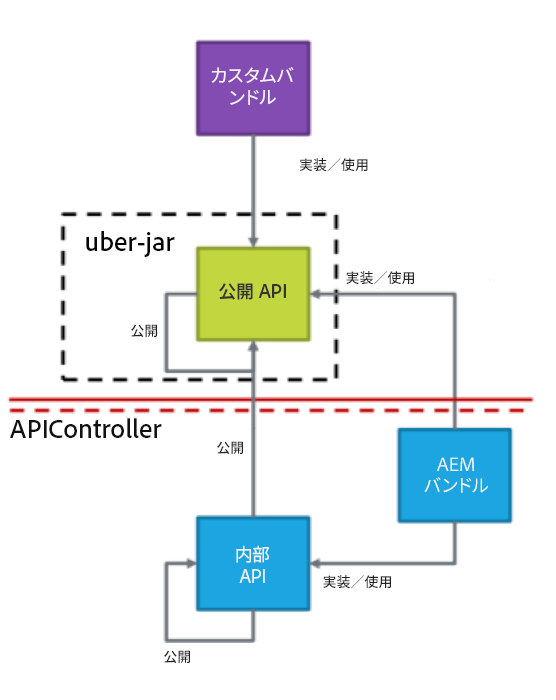
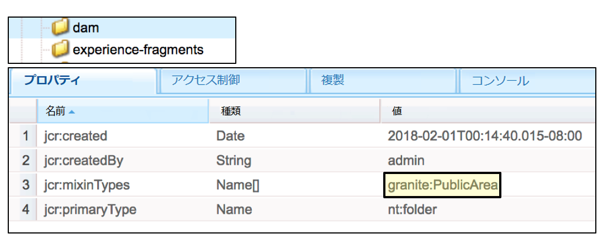
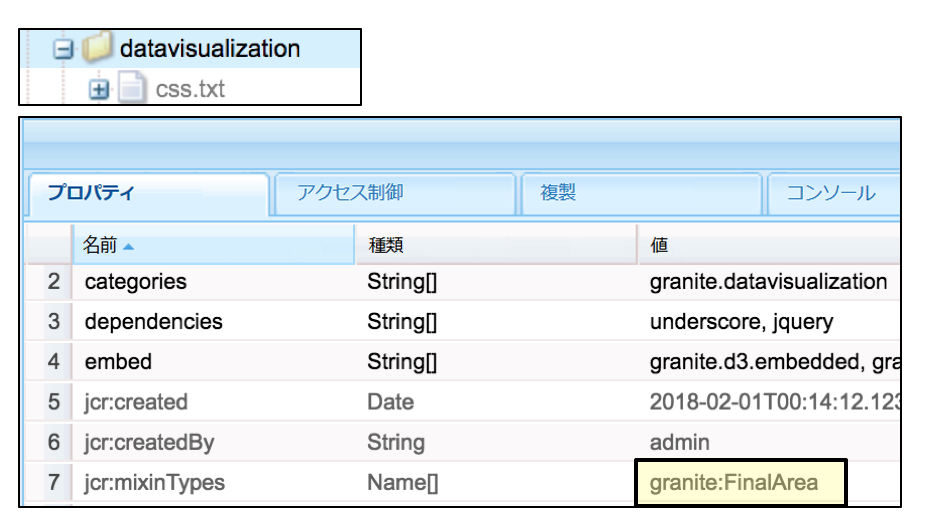
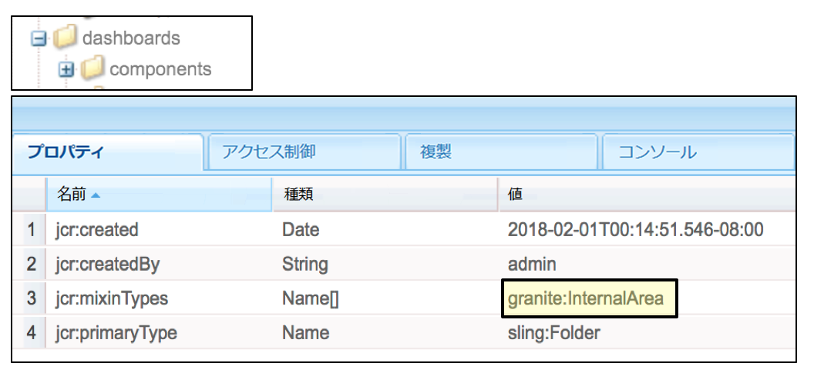
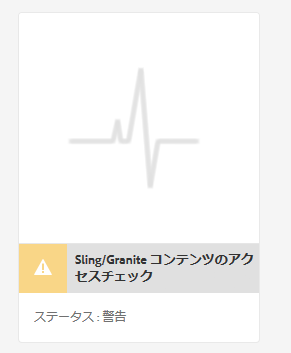
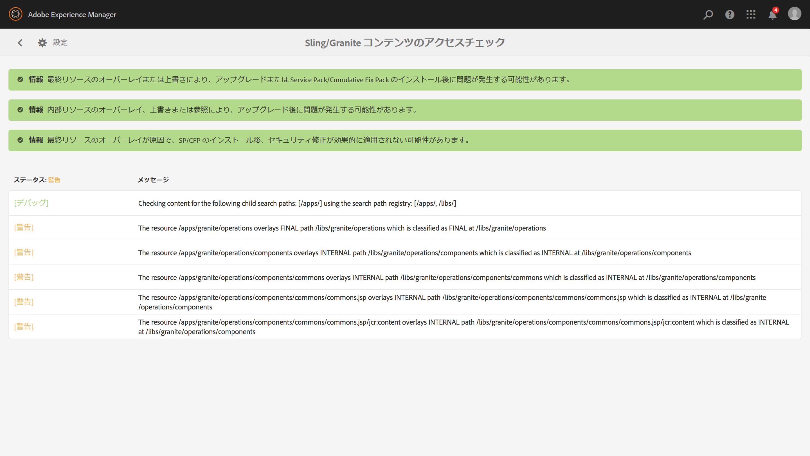
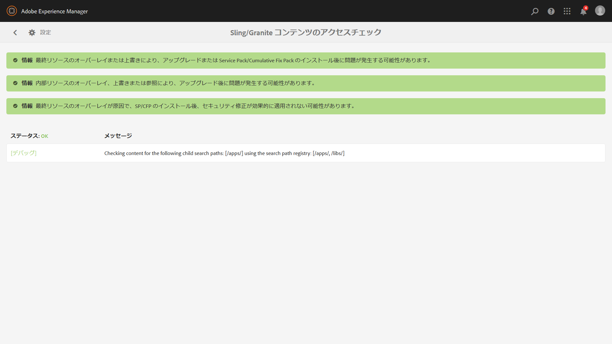

# 持続可能なアップグレード{#sustainable-upgrades}

## カスタマイズフレームワーク {#customization-framework}

### アーキテクチャ（機能/インフラストラクチャ/コンテンツ/アプリケーション）  {#architecture-functional-infrastructure-content-application}

カスタマイズフレームワーク機能は、アップグレードが困難なコード（APIS など）やコンテンツ（オーバーレイなど）の拡張不能領域での違反を減らすように設計されています。

カスタマイズフレームワークには、次の 2 つのコンポーネントがあります。の **API サーフェス** そして **コンテンツの分類**.

#### API サーフェス {#api-surface}

以前のリリースのAEMでは、多くの API が Uber Jar を介して公開されていました。 これらの API の一部は、お客様による使用を意図していなかったが、バンドルをまたいでAEM機能のサポートに公開されていた。 今後、アップグレードのコンテキストで安全に使用できる API をお客様に示すために、Java API は公開または非公開としてマークされます。 その以外の詳細を次に示します。

* `Public` としてマークされた Java API は、カスタム実装バンドルによって使用および参照できます。

* 公開 API は、互換性パッケージをインストールすることで後方互換性が保たれます。
* 互換性パッケージには、後方互換性を確保するために互換性 Uber JAR が含まれます。
* `Private` としてマークされた Java API は、AEM の内部バンドルによる使用のみが意図されており、カスタムバンドルでは使用できません。

>[!NOTE]
>
>ここでいう `Private` および `Public` の概念は、Java の public クラスや private クラスの概念と混同しないようにする必要があります。

#### コンテンツの分類 {#content-classifications}

AEMは、AEMの機能を拡張およびカスタマイズするために、長い間オーバーレイと Sling Resource Merger のプリンシパルを使用してきました。 AEMコンソールと UI を強化する事前定義済みの機能は、 **/libs**. 顧客は、以下の条件を変更することはありません。 **/libs** が **/apps** で定義された機能をオーバーレイして拡張するには、以下を実行します。 **/libs** （詳しくは、オーバーレイを使用した開発を参照してください）。 その結果、AEMをのコンテンツとしてアップグレードする際に、多くの問題が引き続き発生していました。 **/libs** が変更され、オーバーレイ機能が予期しない方法で壊れる場合があります。 ユーザーは、`sling:resourceSuperType` を介した継承によって、または sling:resourceType を使用して **/libs** 内のコンポーネントを単に直接参照することによって、AEM コンポーネントを拡張することもできます。同様のアップグレードの問題が、参照および上書きのユースケースで発生する可能性があります。

より安全で容易に顧客がのどの領域を把握できるようにするため **/libs** は、 **/libs** は、次の mixin で分類されています。

* **公開（granite:PublicArea）** - オーバーレイ、継承（`sling:resourceSuperType`）または直接使用（`sling:resourceType`）できるように、ノードを公開として定義します。公開としてマークされた /libs の下のノードは、互換パッケージを追加することで、アップグレードしても安全になります。通常、顧客は公開としてマークされたノードのみを利用する必要があります。

* **抽象（granite:AbstractArea）** - ノードを抽象として定義します。ノードは、オーバーレイおよび継承（`sling:resourceSupertype`）することはできますが、直接使用（`sling:resourceType`）することはできません。

* **最終（granite:FinalArea）** - ノードを最終として定義します。最終として分類されたノードは、オーバーレイまたは継承できません。 最終ノードは、`sling:resourceType` を介して直接使用できます。最終ノードの下のサブノードは、デフォルトで内部ノードと見なされます

* **内部 (granite:InternalArea)**  — ノードを内部として定義します。 内部として分類されたノードは、オーバーレイ、継承、直接使用できません。 これらのノードは、AEMの内部機能のみを対象としています

* **注釈なし**  — ノードは、ツリー階層に基づいて分類を継承します。 /ルートは、デフォルトでは「パブリック」です。 **親が「内部」または「最終」と分類されているノードも「内部」として扱われます。**

>[!NOTE]
>
>これらのポリシーは、Sling 検索パスベースのメカニズムに対してのみ適用されます。 クライアントサイドライブラリなど **/libs** の他の領域は、`Internal` としてマークされることがありますが、標準で clientlib を含めることで使用できます。この場合、お客様は引き続き内部分類を尊重することが重要です。

#### CRXDE Liteコンテンツタイプインジケーター {#crxde-lite-content-type-indicators}

CRXDE Lite で適用される mixin では、`INTERNAL` としてマークされたコンテンツノードとツリーがグレー表示されます。`FINAL` については、アイコンのみがグレー表示されます。これらのノードの子も灰色で表示されます。 どちらの場合も、ノードをオーバーレイ機能は無効になっています。

**公開**

**最終**

**内部**

**コンテンツヘルスチェック**

AEM 6.4 にはヘルスチェックが付属しています。オーバーレイまたは参照されたコンテンツがコンテンツ分類と一致しない方法で使用された場合は、このヘルスチェックにより警告が表示されます。

この **Sling/Granite コンテンツアクセスチェック** は、リポジトリを監視し、顧客コードがAEMの保護されたノードに不適切にアクセスしているかどうかを確認する新しいヘルスチェックです。

このヘルスチェックは **/apps** をスキャンし、通常は完了するまで数秒かかります。

この新しいヘルスチェックにアクセスするには、次の手順を実行する必要があります。

1. AEMのホーム画面で、に移動します。 **ツール/運営/ヘルスレポート**
1. 次に示すように、「**Sling／Granite コンテンツアクセスチェック**」をクリックします。

   

スキャンが完了すると、警告のリストが表示され、誤って参照されている保護されたノードをエンドユーザーに通知します。

違反を修正すると、緑の状態に戻ります。

ヘルスチェックには、バックグラウンドサービスで収集された情報が表示されます。この情報は、オーバーレイまたはリソースタイプがすべての Sling 検索パスで使用された場合に非同期で確認されます。 コンテンツの Mixin が正しく使用されなかった場合は、違反がレポートされます。
