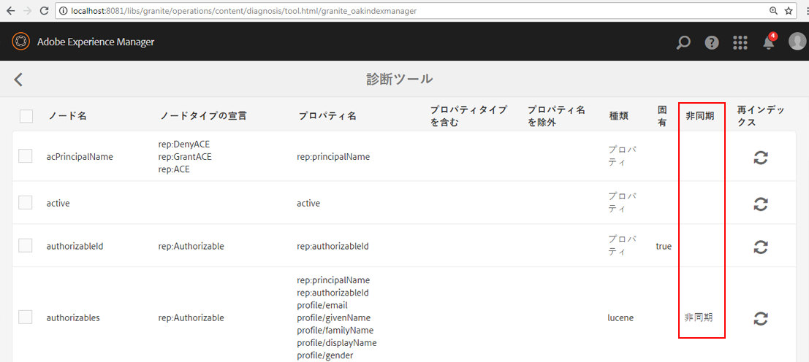

# Oak インデックスのトラブルシューティング{#troubleshooting-oak-indexes}

## インデックス再作成が遅い  {#slow-re-indexing}

AEMの内部インデックス再作成プロセスは、リポジトリデータを収集し、Oak インデックスに保存して、コンテンツに対するパフォーマンスの高いクエリをサポートします。 例外的な状況では、プロセスが遅くなったり、動かなくなったりする場合があります。 このページは、インデックス作成が遅いかどうかの識別、原因の特定、問題の解決に役立つトラブルシューティングガイドとして機能します。

不適切に長い時間を要するインデックス再作成と、大量のコンテンツのインデックス作成になるので、長い時間を要するインデックス再作成を区別することが重要です。 例えば、コンテンツのインデックス作成に要する時間はコンテンツの量に応じて増えるので、大規模な実稼動リポジトリは小規模な開発リポジトリよりもインデックス再作成に時間がかかります。

詳しくは、 [クエリとインデックスに関するベストプラクティス](/help/sites-deploying/best-practices-for-queries-and-indexing.md) コンテンツのインデックス再作成のタイミングと方法に関する追加情報を参照してください。

## 初期検出 {#initial-detection}

時間がかかっているインデックス作成を最初に検出するには、`IndexStats` JMX MBean を確認する必要があります。影響を受ける AEM インスタンスで、次の手順を実行します。

1. Web コンソールを開いて「JMX」タブをクリックするか、https://&lt;ホスト>:&lt;ポート>/system/console/jmx（例：[http://localhost:4502/system/console/jmx](http://localhost:4502/system/console/jmx)）に移動します。
1. `IndexStats` Mbean に移動します。
1. 「`async`」および「`fulltext-async`」の `IndexStats` MBean を開きます。

1. 両方の MBean で、**Done** タイムスタンプおよび **LastIndexTime** タイムスタンプが現在の時刻から 45 分以内であるかどうかを確認します。

1. いずれかの MBean で、時間値（**Done** または **LastIndexedTime**）が現在の時間から 45 分より大きい場合は、インデックスジョブが失敗しているか、時間がかかりすぎています。これにより、非同期インデックスが古い状態になります。

## 強制シャットダウン後、インデックス作成は一時停止しました {#indexing-is-paused-after-a-forced-shutdown}

強制シャットダウンにより、AEMは再起動後 30 分まで非同期インデックス作成を中断し、通常は最初のインデックス再作成パスを完了するまでに 15 分程度かかります（合計 45 分間）。 [初期検出](/help/sites-deploying/troubleshooting-oak-indexes.md#initial-detection) （45 分の期間）。 強制シャットダウン後にインデックス作成が一時停止されていると疑われる場合：

1. まず、AEMインスタンスが強制的にシャットダウンされたか (AEMプロセスが強制的に強制的に終了したか、電源障害が発生したか )、その後再起動されたかを確認します。

   * そのために、[AEM のログ](/help/sites-deploying/configure-logging.md)を参照してください。

1. 強制シャットダウンが発生した場合、再起動時に、AEMは自動的に最大 30 分間インデックス再作成を中断します。
1. AEMが通常の非同期インデックス作成操作を再開するまで、約 45 分待ちます。

## スレッドプールが過負荷 {#thread-pool-overloaded}

>[!NOTE]
>
>AEM 6.1 では、[AEM 6.1 CFP 11](https://experienceleague.adobe.com/docs/experience-manager-release-information/aem-release-updates/previous-updates/aem-previous-versions.html?lang=ja) がインストールされていることを確認してください。

例外的な状況では、非同期インデックス作成の管理に使用するスレッドプールが過負荷になる場合があります。 インデックス作成プロセスを分離するために、スレッドプールを設定して、他のAEM作業が Oak のコンテンツをタイムリーにインデックス作成する機能に干渉するのを防ぐことができます。 これをおこなうには、次の操作を行う必要があります。

1. 非同期インデックス作成に使用する Apache Sling Scheduler 用の新しい分離スレッドプールを定義します。

   * 影響を受ける AEM インスタンスで、AEM OSGi web コンソール／OSGi／設定／Apache Sling Scheduler に移動するか、https://&lt;ホスト>:&lt;ポート>/system/console/configMgr（例：[http://localhost:4502/system/console/configMgr](http://localhost:4502/system/console/configMgr)）に移動します。
   * 「許可されたスレッドプール」フィールドに、値が「oak」のエントリを追加します。
   * 右下の「保存」をクリックして、変更を保存します。

   

1. Apache Sling Scheduler の新しいスレッドプールが登録され、Apache Sling Scheduler のステータス web コンソールに表示されていることを確認します。

   * AEM OSGi web コンソール／ステータス／Sling Scheduler に移動するか、https://&lt;ホスト>:&lt;ポート>/system/console/status-slingscheduler（例：[http://localhost:4502/system/console/status-slingscheduler](http://localhost:4502/system/console/status-slingscheduler)）に移動します。
   * 次のプールエントリが存在することを確認します。

      * ApacheSlingoak
      * ApacheSlingdefault

   

## 監視キューがいっぱいです {#observation-queue-is-full}

リポジトリに対する変更やコミットが短時間で多すぎると、監視キューがいっぱいになるので、インデックス作成が遅延する可能性があります。 まず、監視キューがいっぱいかどうかを確認します。

1. web コンソールに移動して「JMX」タブをクリックするか、https://&lt;ホスト>:&lt;ポート>/system/console/jmx（例：[http://localhost:4502/system/console/jmx](http://localhost:4502/system/console/jmx)）に移動します。
1. Oak リポジトリ統計 MBean を開き、いずれかの `ObservationQueueMaxLength` 値が 10,000 より大きいかどうかを確認します。

   * 通常の操作では、この最大値は（特に `per second` セクションでは）最終的に 0 になる必要があるので、`ObservationQueueMaxLength` の秒の指標が 0 であることを確認します。
   * 値が 10,000 以上で、徐々に増加する場合は、少なくとも 1 つ（場合によっては増加）のキューを新しい変更（コミット）が発生するほど速く処理できないことを示します。
   * 各監視キューには制限（デフォルトでは 10,000 個）があり、その制限に達すると処理が低下します。
   * MongoMK を使用している場合は、キューの長さが長くなるにつれて内部 Oak キャッシュのパフォーマンスが低下します。この相関関係は、`Consolidated Cache` 統計 MBean の `DocChildren` キャッシュの `missRate` が増加していることで確認できます。

1. 許容可能な監視キューの制限を超えないようにするには、次の操作をお勧めします。

   * コミットの一定率を下げます。 コミットの短いスパイクは許容できますが、一定の速度を下げる必要があります。
   * [Performance tuning tips／Mongo Storage Tuning／Document cache size](https://helpx.adobe.com/experience-manager/kb/performance-tuning-tips.html#main-pars_text_3) の説明に従って、`DiffCache` のサイズを大きくします。

## スタックしたインデックス再作成プロセスの識別と修正 {#identifying-and-remediating-a-stuck-re-indexing-process}

インデックスの再作成は、次の 2 つの条件の下で「完全に停止した」と見なすことができます。

* インデックスの再作成は非常に遅く、走査されたノード数に関する大きな進行がログファイルに報告されない時点までです。

   * 例えば、1 時間の間にメッセージがなかった場合や、進行が遅すぎて完了するまでに 1 週間以上かかる場合です。

* インデックス作成スレッドでログファイルに例外（`OutOfMemoryException` など）が繰り返し出力されている場合に、インデックス再作成が無限ループで動かなくなっている。ログで同じ例外が繰り返し発生した場合、Oak は同じインデックスを繰り返し作成しようとしますが、同じ問題では失敗します。

スタックしたインデックス再作成プロセスを識別して修正するには、次の手順を実行します。

1. インデックス作成が停止した原因を特定するには、次の情報を収集する必要があります。

   * 5 分間のスレッドダンプを収集し、2 秒ごとに 1 つのスレッドダンプを収集します。
   * [アペンダーの DEBUG レベルとログの設定](/help/sites-deploying/configure-logging.md).

      * *org.apache.jackrabbit.oak.plugins.index.AsyncIndexUpdate*
      * *org.apache.jackrabbit.oak.plugins.index.IndexUpdate*
   * 非同期 `IndexStats` MBean からデータを収集します。

      * AEM OSGi web コンソール／メイン／JMX／IndexStat／async に移動します。

         または、[http://localhost:4502/system/console/jmx/org.apache.jackrabbit.oak%3Aname%3Dasync%2Ctype%3DIndexStats](http://localhost:4502/system/console/jmx/org.apache.jackrabbit.oak%3Aname%3Dasync%2Ctype%3DIndexStats) に移動します。
   * [oak-run.jar のコンソールモード](https://github.com/apache/jackrabbit-oak/tree/trunk/oak-run)を使用して、`/:async` ノードに存在する内容の詳細を収集します。
   * `CheckpointManager` MBean を使用して、リポジトリチェックポイントのリストを収集します。

      * AEM OSGi web コンソール／メイン／JMX／CheckpointManager／listCheckpoints()

         または、[http://localhost:4502/system/console/jmx/org.apache.jackrabbit.oak%3Aname%3DSegment+node+store+checkpoint+management%2Ctype%3DCheckpointManager](http://localhost:4502/system/console/jmx/org.apache.jackrabbit.oak%3Aname%3DSegment+node+store+checkpoint+management%2Ctype%3DCheckpointManager) に移動します。

1. 手順 1 に示されているすべての情報を収集した後、AEM を再起動します。

   * 同時負荷が高い場合（監視キューのオーバーフローなど）は、AEM を再起動すると問題が解決することがあります。
   * 再起動しても問題が解決しない場合は、[アドビサポート](https://helpx.adobe.com/jp/marketing-cloud/contact-support.html)に問題を提出し、手順 1 で収集したすべての情報を提供してください。

## 非同期のインデックス再作成の安全な中止 {#safely-aborting-asynchronous-re-indexing}

インデックス再作成は、`async, async-reindex` および f `ulltext-async` インデックス作成レーン（`IndexStats` Mbean）を使用して安全に中止（完了する前に停止）できます。詳しくは、Apache Oak ドキュメントの [How to Abort Reindexing](https://jackrabbit.apache.org/oak/docs/query/indexing.html#abort-reindex) も参照してください。また、以下の点にご留意ください。

* Lucene および Lucene プロパティインデックスのインデックス再作成は、そもそも非同期なので、中止できます。
* Oak プロパティインデックスのインデックス再作成は、インデックス再作成が `PropertyIndexAsyncReindexMBean` で開始された場合にのみ、中止できます。

インデックスの再作成を安全に中止するには、次の手順に従います。

1. 停止する必要があるインデックス再作成レーンを制御する IndexStats MBean を識別します。

   * AEM OSGi web コンソール／メイン／JMX、または https://&lt;ホスト>:&lt;ポート>/system/console/jmx（例：[http://localhost:4502/system/console/jmx](http://localhost:4502/system/console/jmx)）に移動して、JMX コンソールから該当する IndexStats MBean に移動します。
   * 停止するインデックス再作成レーン（`async`、`async-reindex`、 `fulltext-async`）にもとづいて IndexStats MBean を開きます。

      * 該当するレーンを識別し、IndexStats MBean インスタンスを特定するには、Oak インデックスの「async」プロパティを確認します。「async」プロパティにはレーン名が示されています（`async`、`async-reindex`、`fulltext-async` のいずれか）。
      * レーンは、「Async」列のAEM Index Manager にアクセスしても使用できます。 インデックスマネージャにアクセスするには、操作/診断/インデックスマネージャに移動します。

   

1. 適切な `IndexStats` MBean で `abortAndPause()` コマンドを呼び出します。
1. インデックス作成レーンの再開時にインデックス再作成が再開されないように、Oak インデックス定義を適切にマークします。

   * **既存の**&#x200B;インデックスを再作成する場合は、reindex プロパティを false に設定します。

      * `/oak:index/someExistingIndex@reindex=false`
   * または、 **新規** インデックス：

      * type プロパティを disabled に設定します。

         * `/oak:index/someNewIndex@type=disabled`
      * または、インデックス定義を完全に削除します。

   完了したら、変更をリポジトリにコミットします。

1. 最後に、中止されたインデックス作成レーンで非同期インデックス作成を再開します。

   * 手順 2 で `abortAndPause()` コマンドを発行した `IndexStats` MBean で、`resume()` コマンドを呼び出します。

## 時間のかかるインデックス再作成の回避 {#preventing-slow-re-indexing}

インデックス再作成は、処理の少ない時間（例えば、大量のコンテンツの取り込みを行っていない時間帯）、理想的には AEM の負荷を把握および制御できるメンテナンスウィンドウで行うことをお勧めします。また、インデックス再作成が他のメンテナンスアクティビティ中に実行されないようにしてください。
