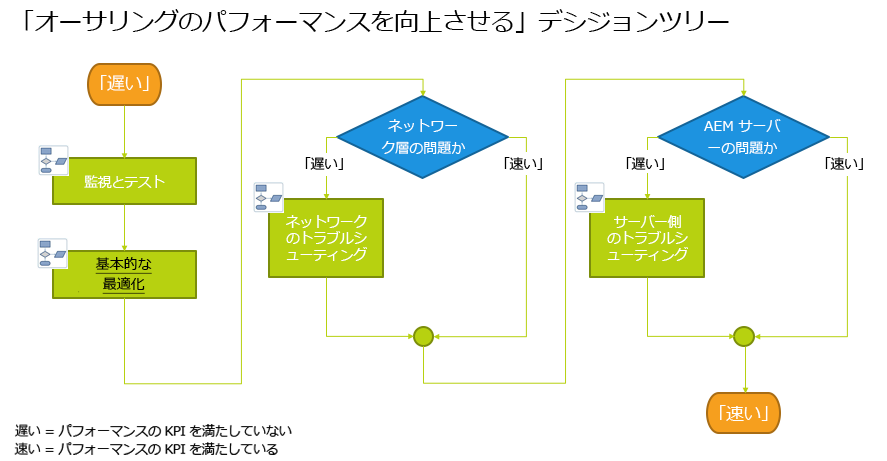
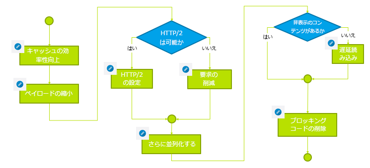

# トラブルシューティング{#troubleshooting}

この節では、トラブルシューティングに役立つログに関する詳細情報と、AEMで発生する可能性のある問題の一部に関する情報を示します。

## オーサーパフォーマンスのトラブルシューティング {#troubleshoot-author-performance}

オーサリングインスタンスでの低速なパフォーマンスの分析は、非常に複雑になる場合があります。 最初のステップとして、パフォーマンスが低下しているテクノロジースタックのレベルを把握する必要があります。

以下のフローチャートはボトルネックを絞り込む手引きになります。

## 基本的な最適化 {#basic-optimization}

## ログファイルと監査ログの設定 {#configuring-log-files-and-audit-logs}

AEM では詳細ログが記録されます。これらのログは、インストールに関する問題のトラブルシューティングをおこなうために設定できます。詳しくは、[監査記録とログファイルの使用](/help/sites-deploying/monitoring-and-maintaining.md#working-with-audit-records-and-log-files)を参照してください。

## Verbose オプションの使用 {#using-the-verbose-option}

AEM WCM の起動時に、コマンドラインに次のように –v（verbose）オプションを追加できます。java -jar cq-wcm-quickstart-&lt;version>.jar -v

verbose オプションを指定すると、クイックスタートログの出力の一部がコンソールに表示されるので、トラブルシューティングに使用できます。

## 一般的なインストールの問題 {#common-installation-issues}

次の節では、インストールに関するいくつかの問題とその解決策について説明します。

### クイックスタート JAR をダブルクリックしても何の影響もなく、jar ファイルを別のプログラム（アーカイブマネージャーなど）で開く {#double-clicking-the-quickstart-jar-does-not-have-any-effect-or-opens-the-jar-file-with-another-program-for-example-archive-manager}

通常、オペレーティングシステムのデスクトップ環境で拡張子 .jar のファイルを開く際の設定方法に問題があります。また、Java をインストールしていないか、サポートされていない Java のバージョンを使用している可能性もあります。

jar ファイルがユビキタス ZIP 形式を使用するので、一部のアーカイブプログラムは、jar ファイルをアーカイブファイルとして開くようにデスクトップを自動的に設定する場合があります。

トラブルシューティングをおこなうには、次の手順を実行します。

* 少なくとも Java バージョン 1.6 がインストールされていることを再確認します。
* AEM WCM Quickstart でコンテキストメニュー（通常はマウスの右クリック）を試し、「次で開く…」を選択します。.&quot;
* Java または Sun Java がリストされているかどうかを確認し、それを使用してAEM WCM を実行してみます。 複数の Java バージョンがインストールされている場合、サポートされているバージョンを選択します。

   この手順で成功し、オペレーティングシステムで.jar ファイルを実行する際に、常に選択したプログラムを使用するオプションが提供されている場合は、そのプログラムを選択します。 これからダブルクリックが機能します。

* サポートされている Java バージョンを再インストールすると、正しい関連付けが復元される場合があります。
* このドキュメントで前述したように、常にコマンドラインまたは開始/停止スクリプトを使用して CRX を実行できます。

### CRX で実行中のアプリケーションでメモリ不足エラーが発生する {#my-application-running-on-crx-throws-out-of-memory-errors}

>[!NOTE]
>
>[メモリの問題の分析](https://helpx.adobe.com/experience-manager/kb/AnalyzeMemoryProblems.html)も参照してください。

CRX 自体は、非常に少ないメモリフットプリントで動作します。CRX 内部で実行しているアプリケーションで多くのメモリが必要とされる場合や、大量のメモリを使用する操作（長いトランザクションなど）が要求される場合、CRX が稼動する JVM インスタンスの起動時に適切なメモリ設定をおこなう必要があります。

Java コマンドオプションを使用して、JVM のメモリ設定を定義します（例えば、java -Xmx512m -jar crx*.jar の場合、ヒープサイズが 512 MB に設定されます）。

コマンドラインからAEM WCM を起動する際に、メモリ設定オプションを指定します。 AEM WCM の起動/停止スクリプトまたはAEM WCM の起動を管理するカスタムスクリプトを変更して、必要なメモリ設定を定義することもできます。

既にヒープサイズを 512 MB として定義している場合、次の方法でヒープダンプを作成してメモリの問題を詳細に分析することができます。

メモリ不足の際にヒープダンプを自動的に作成するには、次のコマンドを使用します。

java -Xmx256m -XX:+HeapDumpOnOutOfMemoryError -jar *.jar

これにより、ヒープダンプファイル (**java_...hprof**) を返します。 ヒープダンプが生成された後も、プロセスが引き続き実行される場合があります。 通常、1 つのヒープダンプファイルで問題を分析できます。

### AEM Quickstart をダブルクリックした後、ブラウザーにAEMのようこそ画面が表示されない {#the-aem-welcome-screen-does-not-display-in-the-browser-after-double-clicking-aem-quickstart}

特定の状況で、リポジトリ自体が正常に実行されているにもかかわらず、AEM WCM のようこそ画面が自動的に表示されない場合があります。 これは、オペレーティングシステムの設定、ブラウザーの設定、その他の要因によって異なります。

通常の症状は、AEM WCM Quickstart ウィンドウに「AEM WCM startup, waiting for server startup...」と表示されることです。.&quot; そのメッセージが比較的長い時間表示される場合は、デフォルトの 4502 ポートまたはインスタンスが実行されているポートを使用して、ブラウザーウィンドウにAEM WCM URL を手動で入力します。http://localhost:4502/.

また、ログには、ブラウザーが起動しない理由が示される場合があります。

AEM WCM Quickstart ウィンドウに「http://localhost:port/でAEM WCM が実行中」というメッセージが表示され、ブラウザーが自動的に起動しない場合があります。 この場合、AEM WCM Quickstart ウィンドウ（ハイパーリンク）で URL をクリックするか、ブラウザーに URL を手動で入力します。

それ以外のすべてが失敗した場合は、ログを調べて、何が起きたかを確認します。

## アプリケーションサーバーを使用したインストールのトラブルシューティング {#troubleshooting-installations-with-an-application-server}

### geometrixx-outdoor ページのリクエスト時に「Page Not Found」が返される {#page-not-found-returned-when-requesting-a-geometrixx-outdoor-page}

**WebLogic 10.3.5 および JBoss 5.1 に適用**

geometrixx-outdoors/en ページを要求すると 404（Page Not Found）が返される場合は、これらの特定のアプリケーションサーバーに必要になる、sling.properties ファイルの追加の sling プロパティを設定しているかを再確認してください。

詳しくは、「*AEM Web アプリケーションのデプロイ*」の手順を参照してください。

### 応答ヘッダーのサイズは 4 Kb を超える可能性があります {#response-header-size-can-be-greater-than-kb}

502 エラーは、Web サーバーがAEM HTTP 応答ヘッダーのサイズを処理できないことを示す場合があります。 AEMでは、4Kb を超えるサイズの Cookie を含む HTTP 応答ヘッダーを生成できます。 応答ヘッダーの最大サイズが 4 KB を超えるようにサーブレットコンテナが設定されていることを確認します。

例えば、Tomcat 7.0 の場合、 [HTTP コネクタ](https://tomcat.apache.org/tomcat-7.0-doc/config/http.html) ヘッダーサイズの制限を制御します。

## Adobe Experience Managerのアンインストール {#uninstalling-adobe-experience-manager}

AEMは単一のディレクトリにインストールされるので、アンインストールユーティリティは必要ありません。 AEMのアンインストール方法は、実行する内容と使用する永続的なストレージによって異なりますが、インストールディレクトリ全体を削除するのと同じくらい簡単にアンインストールできます。

例えば、デフォルトの TarPM インストールで永続的なストレージがインストールディレクトリに埋め込まれている場合、フォルダを削除すると、データも削除されます。

>[!NOTE]
>
>Adobeでは、AEMを削除する前にリポジトリをバックアップすることを強くお勧めします。 を削除すると、 &lt;cq-installation-directory>を削除する場合は、リポジトリを削除します。 削除する前にリポジトリデータを保持するには、 &lt;cq-installation-directory>/crx-quickstart/repository フォルダーを別の場所に移動してから、他のフォルダーを削除します。

AEMのインストールで外部ストレージ（データベースサーバーなど）を使用している場合、フォルダーを削除してもデータは自動的には削除されませんが、ストレージ設定は削除されるので、JCR コンテンツの復元が困難です。

### JSP ファイルが JBoss 上でコンパイルされない {#jsp-files-are-not-compiled-on-jboss}

JBoss 上で JSP ファイルをExperience Managerにインストールまたは更新し、対応するサーブレットがコンパイルされていない場合は、JBoss JSP コンパイラーが正しく設定されていることを確認します。詳しくは、\
[JBoss での JSP コンパイルの問題](https://helpx.adobe.com/jp/experience-manager/kb/jsps-dont-compile-jboss.html) 記事。
