# アップグレード手順{#upgrade-procedure}

>[!NOTE]
>
>ほとんどの AEM のアップグレードはインプレースで実行されるので、アップグレードにはオーサー層のダウンタイムが必要になります。これらのベストプラクティスに従うことによって、パブリッシュ層のダウンタイムを最小限に抑えたり、排除したりすることができます。

AEM 環境をアップグレードする場合は、作成者とエンドユーザーのダウンタイムを最小化するために、オーサー環境とパブリッシュ環境のアップグレードのアプローチの違いを考慮する必要があります。このページでは、AEM 6.x のバージョンで現在実行されている AEM トポロジをアップグレードする手順の概要を説明します。オーサー層とパブリッシュ層および Mongo ベースと TarMK ベースのデプロイメントではプロセスが異なるので、各層およびマイクロカーネルは個別の節に記載されています。デプロイメントを実行するときは、最初にオーサー環境をアップグレードし、成功を確認してから、パブリッシュ環境をアップグレードすることをお勧めします。

## TarMK のオーサー層 {#tarmk-author-tier}

### トポロジの開始 {#starting-topology}

この節で想定されるトポロジは、TarMK で実行されているオーサーサーバーとコールドスタンバイで構成されています。オーサーサーバーから TarMK パブリッシュファームにレプリケーションがおこなわれます。ここには示されていませんが、このアプローチは、オフロードを使用するデプロイメントでも活用できます。オーサーインスタンスでレプリケーションエージェントを無効にして再度有効にする前に、新しいバージョンでオフロードインスタンスをアップグレードまたは再構築してください。

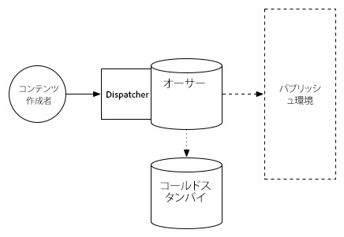

### アップグレードの準備 {#upgrade-preparation}

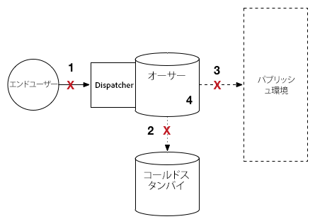

1. コンテンツのオーサリングを停止します。
1. スタンバイインスタンスを停止します。
1. オーサーのレプリケーションエージェントを無効にします。
1. [アップグレード前のメンテナンスタスク](/help/sites-deploying/pre-upgrade-maintenance-tasks.md)を実行します。

### アップグレードの実行 {#upgrade-execution-1}

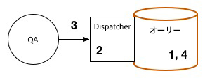

1. [インプレースアップグレード](/help/sites-deploying/in-place-upgrade.md)を実行します。
1. *必要に応じて*、Dispatcher モジュールを更新します。
1. QA がアップグレードを検証します。
1. オーサーインスタンスをシャットダウンします。

### 成功した場合 {#if-successful}

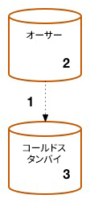

1. 新しいコールドスタンバイを作成するために、アップグレードされたインスタンスをコピーします。
1. オーサーインスタンスを起動します。
1. スタンバイインスタンスを起動します。

### 失敗した場合（ロールバック） {#if-unsuccessful-rollback}

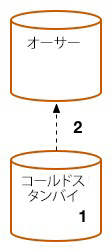

1. コールドスタンバイインスタンスを新しいプライマリとして起動します。
1. コールドスタンバイからオーサー環境を再構築します。

## MongoMK オーサークラスター {#mongomk-author-cluster}

### トポロジの開始 {#starting}

この節で想定されるトポロジは、2 つ以上の MongoMK データベースを使用する 2 つ以上の AEM オーサーインスタンスを含む MongoMK オーサークラスターで構成されています。すべてのオーサーインスタンスは 1 つのデータストアを共有します。以下の手順は、S3 データストアとファイルデータストアの両方に適用できます。オーサーサーバーから TarMK パブリッシュファームへのレプリケーションが発生します。

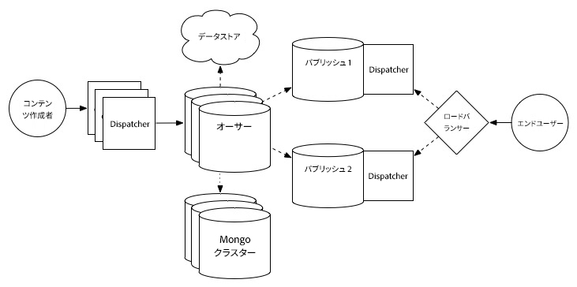

### アップグレードの準備 {#preparation}

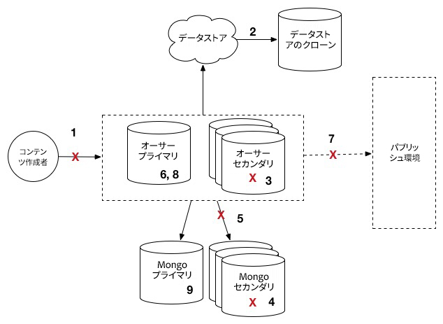

1. コンテンツのオーサリングを停止します。
1. バックアップ用のデータストアのクローンを作成します。
1. 1 つの AEM オーサーインスタンス（プライマリオーサー）以外をすべて停止します。
1. レプリカセットから 1 つの MongoDB ノード（プライマリ Mongo インスタンス）以外をすべて削除します。
1. 単一メンバーのセカンダリセットが反映されるように、プライマリ作成者上の `DocumentNodeStoreService.cfg` ファイルをアップデートします。
1. プライマリオーサーを再起動して、正常に再起動することを確認します。
1. プライマリオーサーのレプリケーションエージェントを無効にします。
1. プライマリオーサーインスタンスで[アップグレード前のメンテナンスタスク](/help/sites-deploying/pre-upgrade-maintenance-tasks.md)を実行します。
1. 必要に応じて、プライマリ Mongo インスタンスの MongoDB を WiredTiger が搭載されたバージョン 3.2 にアップグレードします。

### アップグレードの実行 {#execution}

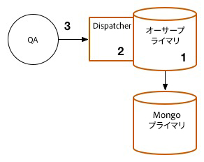

1. プライマリオーサーで[インプレースアップグレード](/help/sites-deploying/in-place-upgrade.md)を実行します。
1. *必要に応じて*、Dispatcher モジュールまたは Web モジュールを更新します。
1. QA がアップグレードを検証します。

### 成功した場合 {#successful-1}

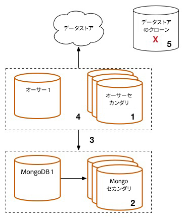

1. アップグレードされた Mongo インスタンスに接続する新しい 6.3 オーサーインスタンスを作成します。
1. クラスターから削除された MongoDB ノードを再構築します。
1. レプリカのフルセットが反映されるように、`DocumentNodeStoreService.cfg` ファイルを更新します。
1. オーサーインスタンスを 1 つずつ再起動します。
1. クローン作成されたデータストアを削除します。

### 失敗した場合（ロールバック）  {#if-unsuccessful}

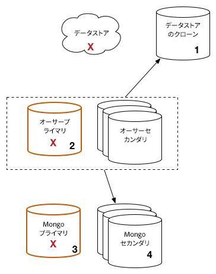

1. クローン作成されたデータストアに接続するために、セカンダリオーサーインスタンスを再設定します。
1. アップグレードされたオーサープライマリインスタンスをシャットダウンします。
1. アップグレードされた Mongo プライマリインスタンスをシャットダウンします。
1. セカンダリ Mongo インスタンスを起動し、そのうちの 1 つを新しいプライマリとして設定します。
1. アップグレードされていない Mongo インスタンスのレプリカセットを指すように、セカンダリオーサーインスタンスで `DocumentNodeStoreService.cfg` ファイルを設定します。
1. セカンダリオーサーインスタンスを起動します。
1. アップグレードされたオーサーインスタンス、Mongo ノードおよびデータストアをクリーンアップします。

## TarMK パブリッシュファーム {#tarmk-publish-farm}

### TarMK パブリッシュファーム {#publish-farm}

この節で想定されるトポロジは、ロードバランサーと Dispatcher を介して動作する 2 つの TarMK パブリッシュインスタンスで構成されています。オーサーサーバーから TarMK パブリッシュファームにレプリケーションがおこなわれます。

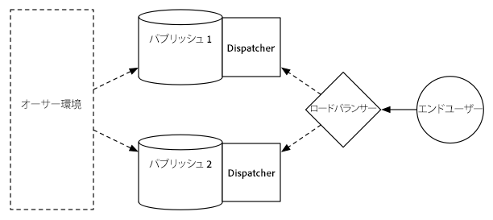

### アップグレードの実行 {#execution-upgrade}

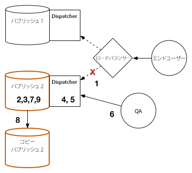

1. ロードバランサーで Publish 2 インスタンスへのトラフィックを停止します。
1. Publish 2 で[アップグレード前のメンテナンスタスク](/help/sites-deploying/pre-upgrade-maintenance-tasks.md)を実行します。
1. Publish 2 で[インプレースアップグレード](/help/sites-deploying/in-place-upgrade.md)を実行します。
1. *必要に応じて*、Dispatcher モジュールまたは Web モジュールを更新します。
1. Dispatcher キャッシュをフラッシュします。
1. QA が、ファイアウォールの後ろにある Dispatcher を介して Publish 2 を検証します。
1. Publish 2 をシャットダウンします。
1. Publish 2 インスタンスをコピーします。
1. Publish 2 を起動します。

### 成功した場合 {#successful-2}

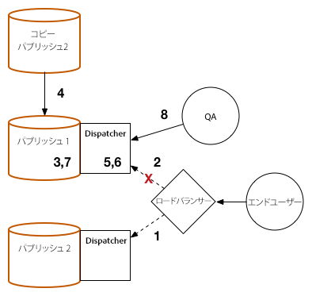

1. Publish 2 へのトラフィックを有効にします。
1. Publish 1 へのトラフィックを停止します。
1. Publish 1 インスタンスを停止します。
1. Publish 1 インスタンスを Publish 2 のコピーに置き換えます。
1. *必要に応じて*、Dispatcher モジュールまたは Web モジュールを更新します。
1. Publish 1 の Dispatcher キャッシュをフラッシュします。
1. Publish 1 を起動します。
1. QA が、ファイアウォールの後ろにある Dispatcher を介して Publish 1 を検証します。

### 失敗した場合（ロールバック） {#rollback}

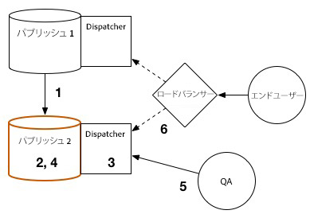

1. Publish 1 のコピーを作成します。
1. Publish 2 インスタンスを Publish 1 のコピーに置き換えます。
1. Publish 2 の Dispatcher キャッシュをフラッシュします。
1. Publish 2 を起動します。
1. QA が、ファイアウォールの後ろにある Dispatcher を介して Publish 2 を検証します。
1. Publish 2 へのトラフィックを有効にします。

## アップグレードの最終手順 {#final-upgrade-steps}

1. Publish 1 へのトラフィックを有効にします。
1. QA がパブリック URL から最終検証を実行します。
1. オーサー環境からレプリケーションエージェントを有効にします。
1. コンテンツのオーサリングを再開します。
1. [アップグレード後のチェック](/help/sites-deploying/post-upgrade-checks-and-troubleshooting.md)を実行します。

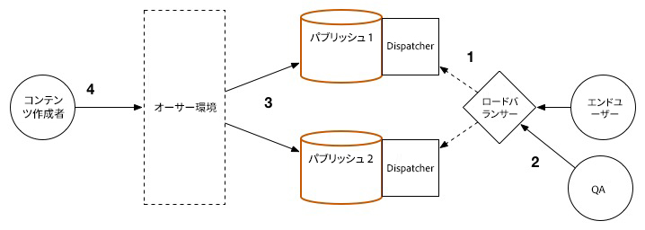
