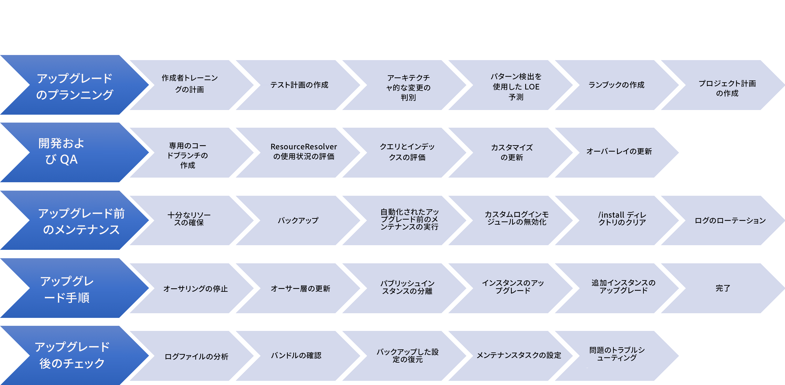
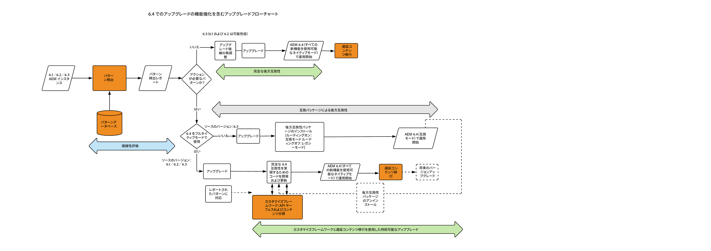

# AEM 6.4 へのアップグレード{#upgrading-to-aem}

この節では、AEMインストールをAEM 6.4 にアップグレードする方法について説明します。

* [アップグレードの計画](/help/sites-deploying/upgrade-planning.md)
* [パターン検出を使用したアップグレードの複雑性の評価](/help/sites-deploying/pattern-detector.md)
* [AEM 6.4 における後方互換性](/help/sites-deploying/backward-compatibility.md)
* [アップグレード手順](/help/sites-deploying/upgrade-procedure.md)
* [コードのアップグレードとカスタマイズ](/help/sites-deploying/upgrading-code-and-customizations.md)
* [アップグレード前のメンテナンスタスク](/help/sites-deploying/pre-upgrade-maintenance-tasks.md)
* [インプレースアップグレードの実行](/help/sites-deploying/in-place-upgrade.md)
* [アップグレード後のチェックおよびトラブルシューティング](/help/sites-deploying/post-upgrade-checks-and-troubleshooting.md)
* [持続可能なアップグレード](/help/sites-deploying/sustainable-upgrades.md)
* [遅延コンテンツ移行](/help/sites-deploying/lazy-content-migration.md)
* [AEM 6.4 におけるリポジトリの再構築](/help/sites-deploying/repository-restructuring.md)

この手順に出てくる AEM インスタンスをわかりやすく区別するために、以下のように呼ぶことにします。

* アップグレード元の AEM インスタンスを「ソース」インスタンスと呼びます&#x200B;*。*
* アップグレード先のインスタンスを「ターゲット」インスタンスと呼びます&#x200B;*。*

>[!NOTE]
>
>アップグレードの信頼性を向上させる取り組みの一環として、AEM 6.4 では包括的なリポジトリ再構築がおこなわれました。 新しい構造に合わせる方法について詳しくは、 [AEM 6.4 におけるリポジトリの再構築](/help/sites-deploying/repository-restructuring.md)

## 変更点 {#what-has-changed}

AEMの最近のいくつかのリリースでの主な変更点を次に示します。

AEM 6.0 では、新しい Jackrabbit Oak リポジトリが導入されました。 永続性マネージャーは [マイクロカーネル](/help/sites-deploying/recommended-deploys.md). バージョン 6.1 以降、CRX2 はサポートされなくなりました。 5.6.1 インスタンスから CRX2 リポジトリを移行するには、crx2oak と呼ばれる移行ツールを実行する必要があります。 詳しくは、 [CRX2OAK 移行ツールの使用](/help/sites-deploying/using-crx2oak.md).

アセットインサイトを使用し、AEM 6.2 より前のバージョンからアップグレードする場合は、アセットを移行し、JMX Bean で ID を生成する必要があります。アドビの内部テストでは TarMK 環境の 12.5 万個のアセットが 1 時間で移行されましたが、ユーザーの結果は異なる場合があります。

AEM 6.3 では、 `SegmentNodeStore`:TarMK 実装の基礎です。 AEM 6.3 よりも古いバージョンからアップグレードする場合は、アップグレードの一環としてリポジトリの移行が必要になり、システムのダウンタイムが発生します。

アドビのエンジニアリング部は、この移行には約 20 分かかると予測しています。インデックスの再作成は必要ないことに注意してください。 また、新しいリポジトリ形式で機能するように crx2oak ツールの新しいバージョンがリリースされました。

**AEM 6.3 から AEM 6.4 へのアップグレード時には、この移行は必要ありません。**

アップグレード前のメンテナンスタスクは、自動化をサポートするように最適化されました。

crx2oak ツールのコマンドラインの使用オプションが、自動化に適したオプションに変更され、より多くのアップグレードパスをサポートするようになりました。

アップグレード後のチェックも、自動化に対応するようになりました。

リビジョンとデータストアのガベージコレクションの定期的なガベージコレクションは、定期的に実行する必要がある定期的なメンテナンスタスクになりました。 AEM 6.3 の導入に伴い、Adobeはオンラインでのリビジョンクリーンアップをサポートし、推奨しています。 詳しくは、 [リビジョンのクリーンアップ](/help/sites-deploying/revision-cleanup.md) を参照してください。

**AEM 6.4** を紹介する [パターン検出](/help/sites-deploying/pattern-detector.md) アップグレードの計画を開始する際のアップグレードの複雑さの評価。 6.4 はまた、～に強く焦点を当てている [後方互換性](/help/sites-deploying/backward-compatibility.md) 機能の 最後に、 [持続的なアップグレード](/help/sites-deploying/sustainable-upgrades.md) も追加されます。

最近のAEMバージョンでのその他の変更点について詳しくは、完全なリリースノートを参照してください。

* [https://helpx.adobe.com/jp/experience-manager/6-2/release-notes.html](https://helpx.adobe.com/jp/experience-manager/6-2/release-notes.html)
* [https://helpx.adobe.com/jp/experience-manager/6-3/release-notes.html](https://helpx.adobe.com/jp/experience-manager/6-3/release-notes.html)
* [https://helpx.adobe.com/jp/experience-manager/6-4/release-notes.html](https://helpx.adobe.com/jp/experience-manager/6-4/release-notes.html)

## アップグレードの概要 {#upgrade-overview}

AEMのアップグレードは、複数の手順でおこなわれ、複数ヶ月のプロセスを伴う場合があります。 アップグレードプロジェクトに含まれる内容とこのドキュメントに含まれる内容の概要として、次の概要が提供されています。

## 6.4 アップグレードの改善に伴うアップグレードフロー {#upgrade-overview-1}

次の図は、アップグレード方法に関する推奨フローの概要を示しています。 導入された新機能の参照に注意してください。 アップグレードは、まずパターン検出から始まります（[パターン検出を使用したアップグレードの複雑性の評価](/help/sites-deploying/pattern-detector.md)を参照）。ここで生成されたレポートのパターンに基づき、AEM 6.4 との互換性を確保するためにどのパスを使用するかを決定できます。

6.4 では、すべての新機能において後方互換性を保つことが非常に重視されています。ただし、後方互換性の問題が生じる場合は、互換モードを使用することで、カスタムコードを 6.4 準拠にする開発作業を一時的に先送りできます。この方法を使用することで、アップグレード後すぐに開発をおこなう必要がなくなります（[AEM 6.4 における後方互換性](/help/sites-deploying/backward-compatibility.md)を参照）。

6.4 の開発サイクルでは、持続可能なアップグレード（[持続可能なアップグレード](/help/sites-deploying/sustainable-upgrades.md)を参照）の下で導入された機能により、今後のアップグレードをより効率的かつシームレスにするためのベストプラクティスに従いやすくなります。

