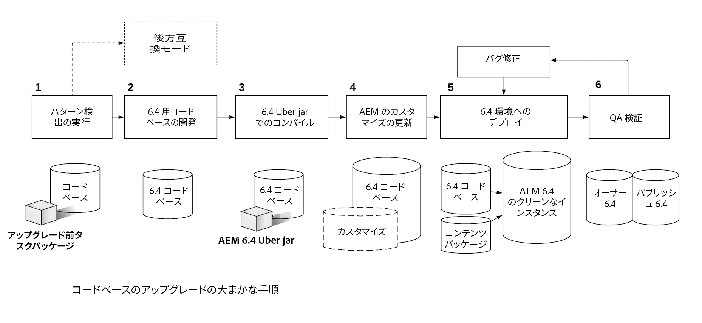

# コードのアップグレードとカスタマイズ{#upgrading-code-and-customizations}

アップグレードを計画する際は、実装の次の領域を調べ、対処する必要があります。

* [コードベースのアップグレード](#upgrade-code-base)
* [6.4 のリポジトリ構造との整合](#align-repository-structure)
* [AEM のカスタマイズ](#aem-customizations)
* [手順のテスト](#testing-procedure)

## 概要 {#overview}

1. **パターン検出**  — アップグレード計画で説明されているとおりにパターン検出を実行し、詳細は [このページ](/help/sites-deploying/pattern-detector.md) AEMの Target バージョンで使用できない API/バンドルに加えて対処する必要がある領域の詳細を含むパターン検出レポートを取得する場合。 パターン検出レポートには、コードに互換性がない場合でも、デプロイメントが既に 6.4 と互換性がある場合でも、6.4 の機能を利用するために新しい開発を行うことができますが、互換性を維持するために必要なわけではありません。 互換性のない箇所が見つかった場合は、a）互換モードで実行して新規の 6.4 機能または互換性維持のための開発を先送りにするか、b）アップグレード後に開発作業を行うことを決め、手順 2 に進みます。詳しくは、[AEM 6.4 における後方互換性](/help/sites-deploying/backward-compatibility.md)を参照してください。

1. **6.4 のコードベースの開発**  — ターゲットバージョンのコードベース用に専用のブランチまたはリポジトリを作成します。 アップグレード前の互換性の情報を使用して、更新するコードの領域を計画します。
1. **6.4 Uber jar でコンパイル** - 6.4 uber jar を指すようにコードベース POM を更新し、これに対してコードをコンパイルします。
1. **AEMのカスタマイズを更新** - AEMのカスタマイズや拡張機能は、6.4 で動作するように更新/検証し、6.4 コードベースに追加する必要があります。 UI 検索フォーム、Assets のカスタマイズ、/mnt/overlay を使用するすべてのものを含みます。

1. **6.4 環境へのデプロイ** - AEM 6.4 のクリーンなインスタンス（オーサー + パブリッシュ）を開発環境と QA 環境で立ち上げる必要があります。更新したコードベースと、現在の実稼動環境にある代表的なコンテンツのサンプルをデプロイする必要があります。
1. **QA 検証とバグ修正** - QA では、6.4 のオーサーインスタンスとパブリッシュインスタンスの両方でアプリケーションを検証する必要があります。検出されたすべてのバグを修正して、6.4 コードベースにコミットする必要があります。必要に応じて、すべてのバグが修正されるまで、Dev-Cycle を繰り返します。

アップグレードを進める前に、AEMのターゲットバージョンに対して完全にテストされた、安定したアプリケーションコードベースが必要です。 テストでの観察に基づいて、カスタムコードを最適化する方法が存在する場合があります。 これには、リポジトリの走査を避けるためのコードのリファクタリング、検索を最適化するためのカスタムインデックス作成、JCR での順序なしノードの使用などが含まれます。

新しいAEMバージョンで動作するようにコードベースをアップグレードしたりカスタマイズしたりするオプションに加えて、6.4 は、 [このページ](/help/sites-deploying/backward-compatibility.md).

上記および下の図に示すように、 [パターン検出](/help/sites-deploying/pattern-detector.md) 最初の手順では、アップグレードの全体的な複雑さを評価し、互換性モードで実行するか、カスタマイズを更新してAEM 6.4 の新機能をすべて使用するかを評価するのに役立ちます。 詳しくは、[AEM 6.4 における後方互換性](/help/sites-deploying/backward-compatibility.md)のページを参照してください。
[ ](assets/upgrade-code-base-highlevel.png)

## コードベースのアップグレード {#upgrade-code-base}

### バージョン管理での 6.4 コード専用ブランチの作成 {#create-a-dedicated-branch-for-6-4-code-in-version-control}

AEMの実装に必要なすべてのコードと設定は、何らかの形式のバージョン管理を使用して管理する必要があります。 バージョン管理の専用のブランチを作成して、AEMのターゲットバージョンのコードベースに必要な変更を管理する必要があります。 対象バージョンのAEMに対するコードベースの反復テストと、それ以降のバグ修正は、このブランチで管理されます。

### AEM Uber Jar バージョンの更新 {#update-the-aem-uber-jar-version}

AEM Uber Jar では、すべての AEM API を単一の依存関係として Maven プロジェクトの `pom.xml` に含めます。AEM API の依存関係を個々に含めるのではなく、Uber Jar を単一の依存関係として含めることが常にベストプラクティスです。 コードベースをアップグレードする際は、AEMのターゲットバージョンを指すように Uber Jar のバージョンを変更する必要があります。 Uber Jar が存在する前にAEMのバージョンでプロジェクトが開発された場合は、個々のAEM API の依存関係をすべて削除し、AEMのターゲットバージョンに対する Uber Jar を 1 つ含めることで置き換える必要があります。 次に、新しいバージョンの Uber Jar に対してコードベースを再コンパイルする必要があります。 非推奨（廃止予定）の API またはメソッドは、対象バージョンのAEMとの互換性を持つように更新する必要があります。

```
<dependency>
    <groupId>com.adobe.aem</groupId>
    <artifactId>uber-jar</artifactId>
    <version>6.4.0</version>
    <classifier>apis</classifier>
    <scope>provided</scope>
</dependency>
```

### 管理リソースリゾルバーの使用を停止します {#phase-out-use-of-administrative-resource-resolver}

`SlingRepository.loginAdministrative()` と `ResourceResolverFactory.getAdministrativeResourceResolver()` を介して管理セッションを使用することは、AEM 6.0 より前のコードベースでは一般的でした。これらのメソッドは過度に幅広いレベルのアクセスを提供するので、セキュリティ上の理由から廃止されました。[今後のバージョンの Sling では、これらのメソッドは削除されます](https://sling.apache.org/documentation/the-sling-engine/service-authentication.html#deprecation-of-administrative-authentication). 代わりに Service Users を使用するコードをリファクタリングすることを強くお勧めします。 サービスユーザーおよび [管理セッションを段階的に廃止する方法は、こちらを参照してください。](/help/sites-administering/security-service-users.md#how-to-phase-out-admin-sessions).

### クエリと Oak インデックス {#queries-and-oak-indexes}

コードベースでのクエリの使用は、コードベースのアップグレードの一環として、十分にテストする必要があります。 Jackrabbit 2(6.0 より前のバージョンのAEM) からアップグレードするお客様にとっては、これは特に重要です。Oak はコンテンツを自動的にインデックス化せず、カスタムインデックスを作成する必要が生じる場合があるからです。 AEM 6.x バージョンからアップグレードする場合、標準提供の Oak インデックス定義が変更され、既存のクエリに影響を与える可能性があります。

クエリパフォーマンスの分析と検査を行うためのツールがいくつか用意されています。

* [AEM インデックスツール](/help/sites-deploying/queries-and-indexing.md)

* [運用診断ツール - クエリパフォーマンス](/help/sites-administering/operations-dashboard.md#diagnosis-tools)

* [Oak ユーティリティ](https://oakutils.appspot.com/). これは、Adobeが管理しないオープンソースツールです。

### クラシック UI オーサリング {#classic-ui-authoring}

クラシック UI のオーサリングは、AEM 6.4 で引き続き利用できますが、非推奨（廃止予定）となっています。 詳細はこちらをご覧ください [ここ](/help/release-notes/deprecated-removed-features.md#pre-announcement-for-next-release). アプリケーションが現在クラシック UI オーサー環境で動作している場合は、AEM 6.4 にアップグレードし、引き続きクラシック UI を使用することをお勧めします。 その後、タッチ UI への移行を個別のプロジェクトとして計画し、複数の開発サイクルにわたって完了するようにします。 AEM 6.4 でクラシック UI を使用するには、いくつかの OSGi 設定をコードベースにコミットする必要があります。 この設定方法について詳しくは、[こちら](/help/sites-administering/enable-classic-ui.md)を参照してください。

>[!NOTE]
>
>クラシック UI から離れ、最新のAEMテクノロジーを活用するには、 [AEM Modernization Tools](/help/sites-developing/modernization-tools.md) 移行を容易にします。

## 6.4 のリポジトリ構造との整合 {#align-repository-structure}

アップグレードを容易にし、アップグレード中に設定が上書きされることを防ぐため、6.4 ではリポジトリの構造が見直され、コンテンツと設定が分離されました。

そのため、これまでのように `/etc` に存在しないように、いくつかの設定を移動する必要があります。AEM 6.4 に更新する際に確認および対応が必要になる、リポジトリの再構築に関する一連の注意事項については、[AEM 6.4 におけるリポジトリの再構築](/help/sites-deploying/repository-restructuring.md)を参照してください。

## AEM のカスタマイズ  {#aem-customizations}

AEMのソースバージョンでAEMオーサリング環境をカスタマイズしている場合は、すべて識別する必要があります。 特定されたら、各カスタマイズをバージョン管理または少なくともコンテンツパッケージの一部としてバックアップすることをお勧めします。 すべてのカスタマイズは、実稼動環境でアップグレードする前に、Target バージョンの AEM を実行している QA 環境またはステージング環境にデプロイして、検証する必要があります。

### 一般的なオーバーレイ {#overlays-in-general}

/libs の下のノードやファイルを/apps の下の追加のノードでオーバーレイすることで、標準の機能でAEMを拡張するのが一般的な方法です。 これらのオーバーレイは、バージョン管理で追跡し、AEMのターゲットバージョンに対してテストする必要があります。 ファイル（JS、JSP、HTL など）がオーバーレイされている場合は、AEMのターゲットバージョンでの回帰テストを容易にするために、拡張された機能に関するコメントを残すことをお勧めします。 一般的なオーバーレイについて詳しくは、 [ここ](/help/sites-developing/overlays.md). 特定のAEMオーバーレイの手順については、以下を参照してください。

### カスタム検索フォームのアップグレード  {#upgrading-custom-search-forms}

カスタム検索ファセットを正しく機能させるには、アップグレード後に手動で調整する必要があります。 詳しくは、[カスタム検索フォームのアップグレード](/help/sites-deploying/upgrading-custom-search-forms.md)を参照してください。

### Assets UI のカスタマイズ {#assets-ui-customizations}

>[!NOTE]
>
>この手順は、AEM 6.2 より前のバージョンからのアップグレードに対してのみ必要です。

Assets のデプロイメントをカスタマイズしたインスタンスをアップグレードする前に準備する必要があります。 これは、カスタマイズされたすべてのコンテンツが新しい 6.4 ノード構造と互換性を持つようにするために必要です。

Assets UI のカスタマイズを準備するには、次の手順を実行します。

1. アップグレードが必要なインスタンスで、CRXDE Liteを開くには、 `https://server:port/crx/de/index.jsp`

1. 次のノードに移動します。

   * `/apps/dam/content`

1. content ノードの名前を **content_backup** に変更します。画面の左側にあるエクスプローラーパネルを右クリックして、「**名前を変更**」を選択すると変更できます。

1. ノードの名前を変更したら、**content** という名前の新しいノードを `/apps/dam` の下に作成し、ノードタイプを **sling:Folder** に設定します。

1. **content_backup** のすべての子ノードを、新しく作成した content ノードに移動します。これをおこなうには、エクスプローラーペインで各子ノードを右クリックし、「 **移動**.

1. を削除します。 **content_backup** ノード。

1. `/apps/dam` の下にある、正しいノードタイプ `sling:Folder` で更新されたノードは、理想的にはバージョン管理に保存してコードベースでデプロイするか、少なくともコンテンツパッケージとしてバックアップする必要があります。

### 既存アセットのアセット ID の生成 {#generating-asset-ids-for-existing-assets}

既存のアセットのアセット ID を生成するには、AEMインスタンスをアップグレードしてAEM 6.4 を実行する際に、アセットをアップグレードします。これは、 [アセットインサイト機能](/help/assets/touch-ui-asset-insights.md). 詳しくは、 [埋め込みコードの追加](/help/assets/touch-ui-using-page-tracker.md#adding-embed-code).

アセットをアップグレードするには、JMX コンソールで Associate Asset IDs パッケージを設定します。リポジトリ内のアセットの数によっては、`migrateAllAssets` に長い時間がかかることがあります。TarMK に 125,000 のアセットがある場合は、内部テストに約 1 時間かかります。


アセット全体のサブセットに対してアセット ID が必要な場合は、`migrateAssetsAtPath` API を使用します。

その他すべての目的には、`migrateAllAssets()` API を使用してください。

### InDesign スクリプトのカスタマイズ {#indesign-script-customizations}

Adobe では、カスタムスクリプトを `/apps/settings/dam/indesign/scripts` に配置することを推奨しています。InDesignスクリプトのカスタマイズの詳細については、を参照してください。 [ここ](/help/assets/indesign.md#configuring-the-aem-assets-workflow).

### ContextHub 設定の復元 {#recovering-contexthub-configurations}

ContextHub 設定は、アップグレードによって影響を受けます。 既存の ContextHub 設定の復元方法については、[こちら](/help/sites-administering/contexthub-config.md#recovering-contexthub-configurations-after-upgrading)を参照してください。

### ワークフローのカスタマイズ {#workflow-customizations}

不要な機能を追加または削除するには、標準のワークフローを変更することを更新するのが一般的な方法です。 カスタマイズ対象として一般的なワークフローは、DAM アセットの更新ワークフローです。カスタム実装に必要なすべてのワークフローは、アップグレード中に上書きされる可能性があるので、バックアップしてバージョン管理に保存する必要があります。

### 編集可能なテンプレート {#editable-templates}

>[!NOTE]
>
>この手順は、AEM 6.2 の編集可能テンプレートを使用した Sites のアップグレードでのみ必要です。

編集可能テンプレートの構造は、AEM 6.2 と 6.3 の間で変更されました。6.2 以前からアップグレードし、編集可能テンプレートを使用してサイトコンテンツを構築する場合は、 [レスポンシブノードのクリーンアップツール](https://github.com/Adobe-Marketing-Cloud/aem-sites-template-migration). このツールは実行するためのものです **_後_** コンテンツをクリーンアップするためのアップグレード。 オーサー層とパブリッシュ層の両方で実行する必要があります。

### CUG 実装の変更 {#cug-implementation-changes}

閉じられたユーザーグループの実装は、以前のバージョンのAEMでのパフォーマンスと拡張性の制限に対処するために、大幅に変更されました。 CUG の以前のバージョンは 6.3 で廃止され、新しい実装はタッチ UI でのみサポートされます。 6.2 以前からアップグレードする場合の新しい CUG の実装への移行方法については、[こちら](/help/sites-administering/closed-user-groups.md#upgrade-cug)の説明を参照してください。

## 手順のテスト {#testing-procedure}

アップグレードのテストに関しては、包括的なテスト計画を準備する必要があります。 アップグレードされたコードベースとアプリケーションのテストは、まず低レベルの環境でおこなう必要があります。 見つかったバグは、コードベースが安定するまで繰り返し修正する必要があります。その後、より高いレベルの環境をアップグレードする必要があります。

### アップグレード手順のテスト {#testing-the-upgrade-procedure}

ここで説明するアップグレード手順は、カスタマイズした実行マニュアルに記載されているように、開発環境および QA 環境でテストする必要があります ( [アップグレードの計画](/help/sites-deploying/upgrade-planning.md)) をクリックします。 アップグレード手順は、すべての手順がアップグレード実行のマニュアルに記載され、アップグレードプロセスがスムーズになるまで繰り返す必要があります。

### 実装テスト領域  {#implementation-test-areas-}

環境をアップグレードし、アップグレードされたコードベースをデプロイした後に、テスト計画で対象とするAEM実装の重要な領域を次に示します。

<table> 
 <tbody> 
  <tr> 
   <td><strong>機能テスト領域</strong></td> 
   <td><strong>説明</strong></td> 
  </tr> 
  <tr> 
   <td>公開済みサイト</td> 
   <td>パブリッシュ層でのAEM実装および関連するコードのテスト<br /> dispatcher を通じて。 ページ更新の条件と<br /> キャッシュの無効化。</td> 
  </tr> 
  <tr> 
   <td>オーサリング</td> 
   <td>AEMの実装と関連するコードをオーサー層でテストする。 ページ、コンポーネントオーサリング、ダイアログを含める必要があります。</td> 
  </tr> 
  <tr> 
   <td>Marketing Cloudソリューションとの統合</td> 
   <td>Analytics、DTM、Target などの製品との統合の検証。</td> 
  </tr> 
  <tr> 
   <td>サードパーティシステムとの統合</td> 
   <td>サードパーティとの統合は、オーサー層とパブリッシュ層の両方で検証する必要があります。</td> 
  </tr> 
  <tr> 
   <td>認証、セキュリティ、権限</td> 
   <td>LDAP/SAML などの認証メカニズムを検証する必要があります。<br /> 権限とグループは、オーサーとパブリッシュの両方でテストする必要があります<br /> 層。</td> 
  </tr> 
  <tr> 
   <td>クエリ</td> 
   <td>カスタムインデックスとクエリは、クエリパフォーマンスと共にテストする必要があります。</td> 
  </tr> 
  <tr> 
   <td>UI のカスタマイズ</td> 
   <td>オーサー環境でのAEM UI の拡張またはカスタマイズ。</td> 
  </tr> 
  <tr> 
   <td>ワークフロー</td> 
   <td>カスタムおよび/または標準搭載のワークフローと機能。</td> 
  </tr> 
  <tr> 
   <td>パフォーマンステスト</td> 
   <td>ロードテストは、実際のシナリオをシミュレートするオーサー層とパブリッシュ層の両方で実行する必要があります。</td> 
  </tr> 
 </tbody> 
</table>

### テスト計画と結果の文書化 {#document-test-plan-and-results}

上記の実装テスト領域をカバーするテスト計画を作成する必要があります。 多くの場合、テスト計画を作成者タスクリストと発行タスクリストで分割すると効果的です。 このテスト計画は、実稼動環境をアップグレードする前に、開発環境、QA 環境およびステージ環境で実行する必要があります。 ステージ環境と実稼動環境をアップグレードする際に比較をおこなうために、低レベルの環境でテスト結果とパフォーマンス指標を取り込む必要があります。
