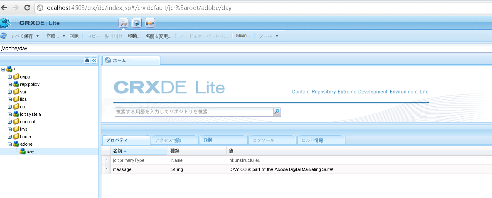

# AEM JCR へのプログラムからのアクセス方法{#how-to-programmatically-access-the-aem-jcr}

Adobe Marketing Cloud に搭載されている Adobe CQ リポジトリ内にあるノードとプロパティを、プログラムから変更できます。CQ リポジトリにアクセスするには、Java Content Repository（JCR）API を使用します。Java JCR API を使用すれば、Adobe CQ リポジトリ内にあるコンテンツに対して、作成、置換、更新および削除（CRUD）の操作を実行できます。Java JCR API について詳しくは、 [https://jackrabbit.apache.org/jcr/jcr-api.html](https://jackrabbit.apache.org/jcr/jcr-api.html).

>[!NOTE]
>
>この開発向けの記事では、外部 Java アプリケーションから Adobe CQ JCR を変更します。これに対して、OSGi バンドル内から JCR API を使用して JCR を変更することもできます。詳しくは、 [Java コンテンツリポジトリへの CQ データの保持](https://helpx.adobe.com/experience-manager/using/persisting-cq-data-java-content1.html).

>[!NOTE]
>
>JCR API を使用するには、 `jackrabbit-standalone-2.4.0.jar` ファイルを Java アプリケーションのクラスパスに追加します。 この JAR ファイルは、Java JCR API Web ページ ( [https://jackrabbit.apache.org/jcr/jcr-api.html](https://jackrabbit.apache.org/jcr/jcr-api.html).

>[!NOTE]
>
>JCR Query API を使用して Adobe CQ JCR へのクエリーを実行する方法については、[JCR API を使用した Adobe Experience Manager データのクエリー](https://helpx.adobe.com/experience-manager/using/querying-experience-manager-data-using1.html)を参照してください。

## Repository インスタンスの作成 {#create-a-repository-instance}

リポジトリに接続して接続を確立するには様々な方法がありますが、この開発向け記事では、`org.apache.jackrabbit.commons.JcrUtils` クラスに属する静的メソッドを使用します。このメソッドの名前は `getRepository` です。このメソッドは、Adobe CQ サーバーの URL を表す文字列パラメーターを受け取ります。例えば、`http://localhost:4503/crx/server` のように指定します。

`getRepository`   メソッドは、`Repository`   インスタンスを返します。次に、このコード例に示します。

```java
//Create a connection to the AEM JCR repository running on local host
Repository repository = JcrUtils.getRepository("http://localhost:4503/crx/server");
```

## Session インスタンスの作成 {#create-a-session-instance}

この `Repository`インスタンスは CRX リポジトリを表します。 次を使用する `Repository`インスタンスを使用して、リポジトリとのセッションを確立します。 セッションを作成するには、 `Repository`インスタンスの `login`メソッドと `javax.jcr.SimpleCredentials` オブジェクト。 この `login`メソッドは、 `javax.jcr.Session` インスタンス。

次の項目を作成します。 `SimpleCredentials`オブジェクトを作成するには、コンストラクターを使用し、次の文字列値を渡します。

* ユーザー名
* 対応するパスワード

2 番目のパラメーターを渡す場合は、String オブジェクトの `toCharArray`メソッド。 次のコードは、 `login`を返すメソッド `javax.jcr.Sessioninstance`.

```java
//Create a Session instance
javax.jcr.Session session = repository.login( new SimpleCredentials("admin", "admin".toCharArray()));
```

## Node インスタンスの作成 {#create-a-node-instance}

の使用 `Session`インスタンスを作成して `javax.jcr.Node` インスタンス。 A `Node`インスタンスを使用すると、ノード操作を実行できます。 例えば、新しいノードを作成できます。 ルートノードを表すノードを作成するには、 `Session`インスタンスの `getRootNode` メソッドを使用します。

```java
//Create a Node
Node root = session.getRootNode();
```

次に、 `Node`インスタンスを使用すると、別のノードを作成し、そのノードに値を追加するなどのタスクを実行できます。 例えば、次のコードでは、2 つのノードを作成し、2 番目のノードに値を追加します。

```java
// Store content 
Node day = adobe.addNode("day");
day.setProperty("message", "Adobe CQ is part of the Adobe Digital Marketing Suite!");
```

## ノードの値の取得 {#retrieve-node-values}

ノードとその値を取得するには、 `Node`インスタンスの `getNode`メソッドを使用して、ノードの完全修飾パスを表す string 値を渡します。 前のコードの例で作成したノード構造について考えてみましょう。 次のコードに示すように、「day」ノードを取得するには、「adobe/day」を指定します。

```java
// Retrieve content
Node node = root.getNode("adobe/day");
System.out.println(node.getPath());
System.out.println(node.getProperty("message").getString());
```

## Adobe CQ リポジトリ内でのノードの作成 {#create-nodes-in-the-adobe-cq-repository}

次の Java コードの例は、Adobe CQに接続し、を作成する Java クラスを表しています。 `Session`インスタンスを作成し、新しいノードを追加します。 ノードにデータ値が割り当てられ、ノードの値とそのパスがコンソールに書き出されます。 セッションが完了したら、必ずログアウトしてください。

```java
/*
 * This Java Quick Start uses the jackrabbit-standalone-2.4.0.jar
 * file. See the previous section for the location of this JAR file
 */
 
import javax.jcr.Repository; 
import javax.jcr.Session; 
import javax.jcr.SimpleCredentials; 
import javax.jcr.Node; 
 
import org.apache.jackrabbit.commons.JcrUtils;
import org.apache.jackrabbit.core.TransientRepository;

public class GetRepository {

public static void main(String[] args) throws Exception { 
 
try { 
 
    //Create a connection to the CQ repository running on local host 
    Repository repository = JcrUtils.getRepository("http://localhost:4503/crx/server");
   
   //Create a Session
   javax.jcr.Session session = repository.login( new SimpleCredentials("admin", "admin".toCharArray())); 
 
  //Create a node that represents the root node
  Node root = session.getRootNode(); 
 
  // Store content 
  Node adobe = root.addNode("adobe"); 
  Node day = adobe.addNode("day"); 
  day.setProperty("message", "Adobe CQ is part of the Adobe Digital Marketing Suite!");

  // Retrieve content 
  Node node = root.getNode("adobe/day"); 
  System.out.println(node.getPath()); 
  System.out.println(node.getProperty("message").getString()); 
 
  // Save the session changes and log out
  session.save(); 
  session.logout();
  }
 catch(Exception e){
  e.printStackTrace();
  }
 } 
}
```

完全なコード例を実行してノードを作成したら、新しいノードを **[!UICONTROL CRXDE Lite]**（次の図に示すように）


