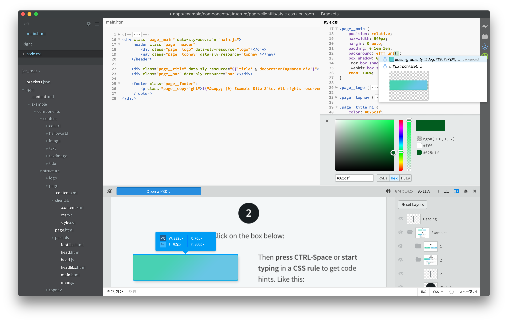
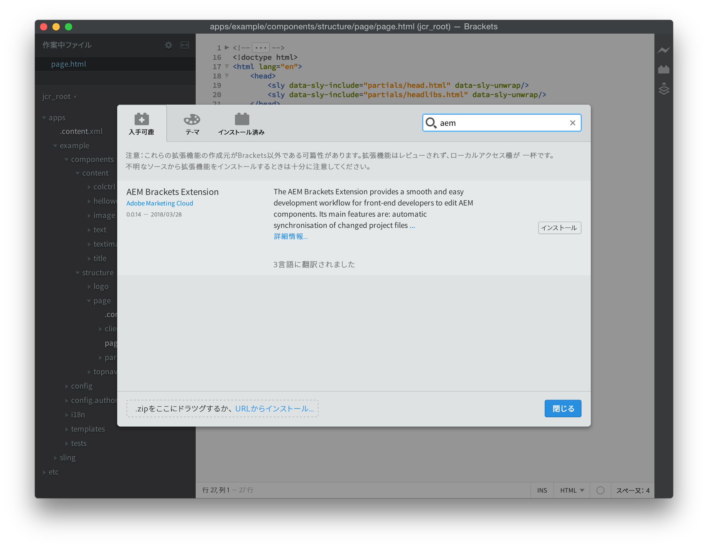
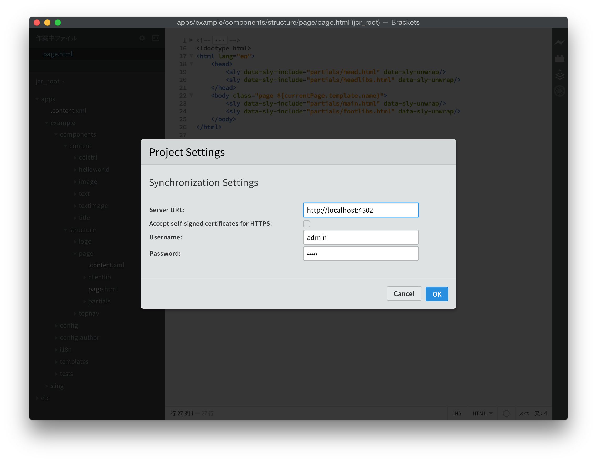
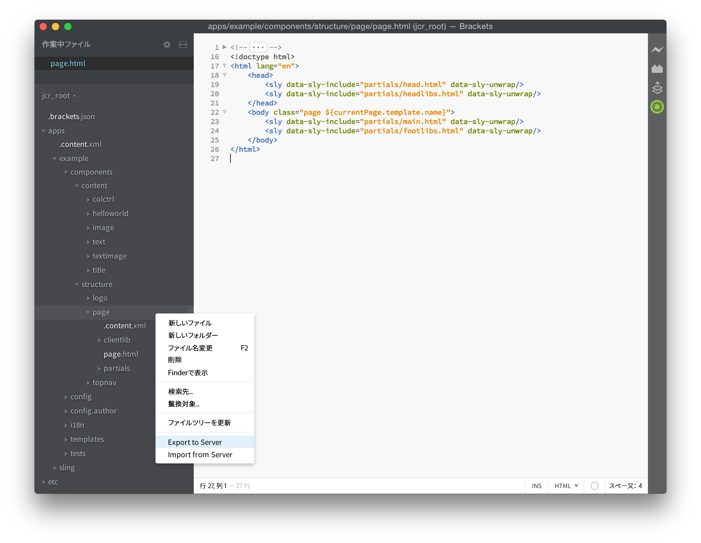
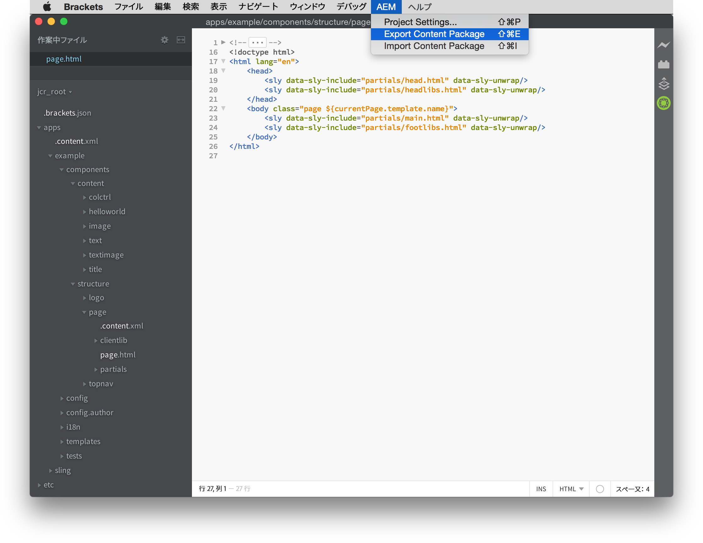
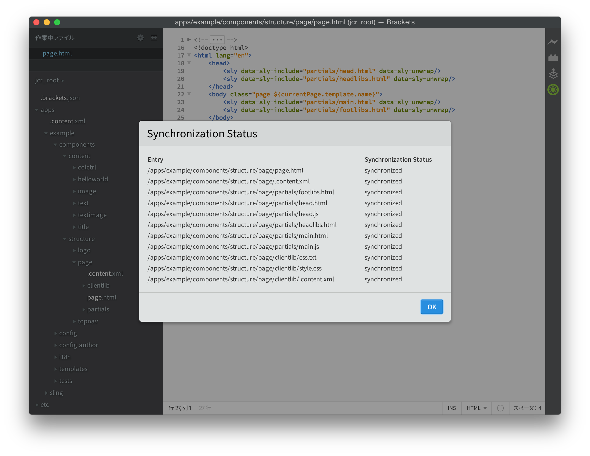

# AEM Brackets Extension{#aem-brackets-extension}

## 概要 {#overview}

AEM Brackets Extension は、AEM コンポーネントとクライアントライブラリを編集するためのスムーズなワークフローを提供し、[Brackets](https://brackets.io/) コードエディターのパワーを活用して、コードエディター内から Photoshop ファイルおよびレイヤーにアクセスできるようにします。この拡張機能によって（Maven や File Vault は不要です）同期が容易になるので、開発者の効率性が向上すると共に、AEM に関する知識が限られているフロントエンド開発者もプロジェクトに参加できます。この拡張機能は、 [HTMLテンプレート言語 (HTL)](https://helpx.adobe.com/jp/experience-manager/htl/user-guide.html):JSP の複雑さを排除して、コンポーネントの開発をより簡単かつ安全にします。

### 機能 {#features}

AEM Brackets Extension の主な機能には次のものがあります。

* 変更されたファイルのAEM開発インスタンスへの自動同期。
* ファイルとフォルダーの手動双方向同期。
* プロジェクトのコンテンツパッケージ全体の同期。
* 式と `data-sly-*` ブロックステートメント。

さらに、Brackets には AEM フロントエンド開発者の役に立つ機能が数多く付属しています。

* レイヤー、測定値、色、フォント、テキストなどの情報を PSD ファイルから抽出するための Photoshop ファイルサポート。
* 抽出されたこれらの情報をコード内で再利用しやすくするための PSD からのコードヒント。
* LESS や SCSS など、CSS プリプロセッサーのサポート。
* より具体的なニーズに対応する何百もの追加の拡張。

## インストール {#installation}

### Brackets {#brackets}

AEM Brackets Extension は、Brackets バージョン 1.0 以上をサポートしています。

最新バージョンの Brackets を次の場所からダウンロードします。 [brackets.io](https://brackets.io/).

### AEM Brackets Extension {#the-extension}

この拡張をインストールするには、次の手順を実行します。

1. Brackets を開きます。**File** メニューで、「**Extension Manager**」を選択します。
1. **検索**&#x200B;バーに「**AEM**」と入力し、AEM Brackets Extension を探します。

   

1. 「**インストール**」をクリックします。
1. インストールが完了したら、ダイアログと Extension Manager を閉じます。

## はじめに {#getting-started}

### コンテンツパッケージプロジェクト {#the-content-package-project}

拡張をインストールしたら、Brackets を使用してファイルシステムのコンテンツパッケージフォルダーを開き、AEM コンポーネントの開発を始めることができます。

プロジェクトには、少なくとも次のものが必要です。

1. a `jcr_root` フォルダー ( 例： `myproject/jcr_root`)

1. a `filter.xml` ファイル ( 例： `myproject/META-INF/vault/filter.xml`);を参照してください。 `filter.xml` ファイルを参照してください [Workspace フィルターの定義](https://jackrabbit.apache.org/filevault/filter.html).

Brackets の **File** メニューで「**Open Folder**」を選択し、`jcr_root` フォルダーまたは親プロジェクトフォルダーを選択します。

>[!NOTE]
>
>コンテンツパッケージを含む独自のプロジェクトがない場合は、 [HTL TodoMVC の例](https://github.com/Adobe-Marketing-Cloud/aem-sightly-sample-todomvc). GitHub で、 **ZIP をダウンロード**&#x200B;をクリックし、ローカルでファイルを抽出し、上の指示に従って、 `jcr_root` フォルダーを Brackets 内に作成します。 次に、以下の手順に従って **プロジェクト設定**&#x200B;最後に、 **コンテンツパッケージを書き出し** 詳しくは、「完全なコンテンツパッケージ同期」の節の下の説明を参照してください。
>
>これらの手順の後、 `/content/todo.html` AEM開発インスタンスの URL。Brackets でのコードの変更を開始し、Web ブラウザーで更新を実行した後、変更がAEMサーバーに直ちに同期された方法を確認できます。

### プロジェクト設定 {#project-settings}

コンテンツを AEM 開発インスタンスに、または AEM 開発インスタンスから同期するには、プロジェクト設定を定義する必要があります。これは、 **AEM** メニューと選択 **プロジェクト設定…**

プロジェクト設定を使用して、次のものを定義できます。

1. サーバー URL ( 例： `http://localhost:4502`)
1. 有効な HTTPS 証明書を持たないサーバーを許容するかどうか（必要な場合を除き、オフにしておきます）
1. コンテンツの同期に使用するユーザー名（例：`admin`）
1. ユーザーのパスワード ( 例： `admin`)

## コンテンツの同期 {#synchronizing-content}

AEM Brackets Extension は、 `filter.xml`:

### 変更されたファイルの自動同期 {#automated-synchronization-of-changed-files}

これは、変更内容を Brackets から AEM インスタンスへという方向にのみ同期するもので、逆方向には同期しません。

### 手動双方向同期 {#manual-bidirectional-synchronization}

Project Explorer で、任意のファイルまたはフォルダを右クリックしてコンテキストメニューを開き、 **サーバーに書き出し** または **サーバーからインポート** オプションにアクセスできます。

>[!NOTE]
>
>選択したエントリが `jcr_root` フォルダー、 **サーバーに書き出し** および **サーバーからインポート** コンテキストメニューのエントリは無効です。

### コンテンツパッケージ全体の同期 {#full-content-package-synchronization}

内 **AEM** メニュー、 **コンテンツパッケージを書き出し** または **コンテンツパッケージを読み込む** オプションを使用すると、プロジェクト全体をサーバーと同期できます。

### 同期ステータス {#synchronization-status}

AEM Brackets Extension によって、Brackets ウィンドウの右側のツールバーに、最新の同期ステータスを示す通知アイコンが追加されます。

* 緑 - すべてのファイルが正常に同期されました
* 青 - 同期操作中です
* 黄 - 一部のファイルが同期されませんでした
* 赤 - ファイルがすべて同期されませんでした

通知アイコンをクリックすると、同期された各ファイルのステータスすべてを一覧表示する同期ステータスレポートダイアログが開きます。

>[!NOTE]
>
>使用する同期方法にかかわらず、`filter.xml` のフィルタリングルールによって「含める」とマークされているコンテンツのみが同期されます。
>
>また、 `.vltignore` ファイルは、リポジトリとの同期およびリポジトリからの同期からのコンテンツの除外をサポートしています。

## HTL コードの編集 {#editing-htl-code}

AEM Brackets Extension によって、HTL 属性および式の作成を容易にするオートコンプリートも導入されます。

### 属性のオートコンプリート {#attribute-auto-completion}

1. HTML 属性に「`sly`」と入力します。この属性は、「`data-sly-`」-」にオートコンプリートされます。
1. ドロップダウンリストでこの HTL 属性を選択します。

### 式のオートコンプリート {#expression-auto-completion}

式内 `${}`に設定すると、共通の変数名が自動入力されます。

## 詳細情報 {#more-information}

AEM Brackets Extension はオープンソースのプロジェクトで、Apache License バージョン 2.0 に従って、[Adobe Marketing Cloud](https://github.com/Adobe-Marketing-Cloud) チームにより GitHub にホストされています。

* コードリポジトリ：[https://github.com/Adobe-Marketing-Cloud/aem-sightly-brackets-extension](https://github.com/Adobe-Marketing-Cloud/aem-sightly-brackets-extension)
* Apache ライセンス、バージョン 2.0: [https://www.apache.org/licenses/LICENSE-2.0.html](https://www.apache.org/licenses/LICENSE-2.0.html)

また、Brackets コードエディターはオープンソースプロジェクトでもあり、GitHub 上で [Adobe Systems Incorporated](https://github.com/adobe) 組織：

* コードリポジトリ： [https://github.com/adobe/brackets](https://github.com/adobe/brackets)

ご自由に投稿してください。
