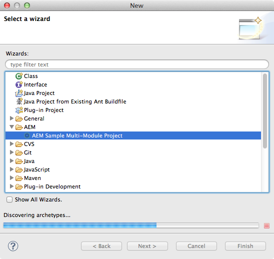

# AEM Developer Tools for Eclipse {#aem-developer-tools-for-eclipse}

>[!CAUTION]
>
>AEM 6.4 の拡張サポートは終了し、このドキュメントは更新されなくなりました。 詳細は、 [技術サポート期間](https://helpx.adobe.com/jp/support/programs/eol-matrix.html). サポートされているバージョンを見つける [ここ](https://experienceleague.adobe.com/docs/?lang=ja).


## 概要 {#overview}

AEM Developer Tools for Eclipse は、Apache License 2 に従ってリリースされた [Apache Sling 向け Eclipse プラグイン](https://sling.apache.org/documentation/development/ide-tooling.html) をベースとする Eclipse プラグインです。

このツールは、AEM 開発を容易にする次のような機能を提供します。

* Eclipse Server Connector による AEM インスタンスとのシームレスな統合。
* コンテンツと OSGI バンドルの同期。
* コードのホットスワップ機能によるデバッグのサポート。
* 固有のプロジェクト作成ウィザードからの AEM プロジェクトの簡単なブートストラップ。
* JCR プロパティの容易な編集。

## 要件 {#requirements}

AEM Developer Tools を使用する前に、次の作業が必要です。

* [Eclipse IDE for Java EE Developers](https://eclipse.org/downloads/packages/eclipse-ide-java-ee-developers/lunar) をダウンロードしてインストールします。AEM Developer Tools は現在、Eclipse Kepler 以降をサポートします。

* AEM バージョン 5.6.1 以降で使用できます。
* [Eclipse に関する FAQ](https://wiki.eclipse.org/FAQ_How_do_I_increase_the_heap_size_available_to_Eclipse%3F) の説明に従って、`eclipse.ini` 設定ファイルを編集し、ヒープメモリが 1 GB 以上になるように Eclipse を設定します。

>[!NOTE]
>
>macOS では、**Eclipse.app** を右クリックし、「**パッケージの内容を表示**」を選択して、`eclipse.ini`**を探します。**

## AEM Developer Tools for Eclipse のインストール方法 {#how-to-install-the-aem-developer-tools-for-eclipse}

前述の[要件](#requirements)を満たしたら、次の手順でプラグインをインストールできます。

1. [**AEM** Developer Tools web サイト](https://eclipse.adobe.com/aem/dev-tools/)にアクセスします。

1. を **インストールリンク**.

   または、インストールリンクを使用する代わりに、アーカイブをダウンロードできます。 これにより、オフラインでのインストールが可能になりますが、この方法では自動更新通知が送信されなくなります。

1. Eclipse で、 **ヘルプ** メニュー
1. クリック **新しいソフトウェアのインストール**.
1. クリック **追加…**.
1. In **名前** 「 AEM Developer Tools 」と入力します。
1. 「**Location**」にインストール用 URL をコピーします。
1. 「**OK**」をクリックします。
1. 両方を選択 **AEM** および **Sling** プラグイン
1. 「**Next**」をクリックします。
1. 「**次へ**」をクリックします。
1. リンク契約に同意し、 **完了**.
1. 「**Yes**」をクリックして、Eclipse を再起動します。

## 既存プロジェクトの読み込み方法 {#how-to-import-existing-projects}

>[!NOTE]
>
>[AEM からダウンロードした際に Eclipse でバンドルを操作する方法](https://stackoverflow.com/questions/29699726/how-to-work-with-a-bundle-in-eclipse-when-it-was-downloaded-from-aem/29705407#29705407)を参照してください。

## AEM パースペクティブ {#the-aem-perspective}

Eclipse 用の AEM 開発ツールには、AEM プロジェクトおよびインスタンスを完全にコントロールできるパースペクティブが同梱されています。


## サンプルのマルチモジュールプロジェクト {#sample-multi-module-project}

AEM Developer Tools for Eclipse には、サンプルのマルチモジュールプロジェクトが同梱されています。このプロジェクトは、Eclipse でのプロジェクト設定を手早く行うために役立つだけでなく、いくつかの AEM 機能に対するベストプラクティスガイドの役割も果たします。プロジェクトのアーキタイプについて詳しくは、[こちら](https://github.com/Adobe-Marketing-Cloud/aem-project-archetype)を参照してください。

サンプルプロジェクトを作成するには、次の手順に従います。

1. 内 **ファイル** > **新規** > **プロジェクト** メニュー、参照 **AEM** 「 」セクションで「 」を選択します。 **AEM Sample Multi-Module Project**.

   

1. 「**次へ**」をクリックします。

   >[!NOTE]
   >
   >m2eclipse がアーキタイプカタログをスキャンする必要があるので、この手順にはしばらく時間がかかることがあります。

   

1. メニューから「**com.adobe.granite.archetypes：sample-project-archetype：（最も大きい数字）**」を選択して、「**次へ**」をクリックします。

   

1. サンプルプロジェクトの&#x200B;**名前**、**グループ ID** および&#x200B;**アーティファクト ID** を入力します。いくつかの高度なプロパティを設定することもできます。

   

1. 次に、Eclipse が接続する AEM サーバーを設定します。

   デバッガー機能を使用するには、AEM をデバッグモードで起動する必要があります。コマンドラインに以下を追加するなどして、デバッグモードで起動できます。

   ```
       -nofork -agentlib:jdwp=transport=dt_socket,server=y,suspend=n,address=10123
   ```

   

1. 「**終了**」をクリックします。プロジェクト構造が作成されます。

   >[!NOTE]
   >
   >新規インストール時（具体的には次の手順に従います）maven の依存関係をダウンロードしたことがない場合は、エラーが発生してプロジェクトが作成される可能性があります。 その場合は、[無効なプロジェクト定義の解決](#resolving-invalid-project-definition)で説明されている手順に従ってください。

## トラブルシューティング {#troubleshooting}

### 無効なプロジェクト定義の解決 {#resolving-invalid-project-definition}

無効な依存関係およびプロジェクト定義を解決するには、次の手順を実行します。

1. 作成したプロジェクトをすべて選択します。
1. 右クリックします。メニュー内 **Maven** 選択 **プロジェクトを更新**.
1. 「**スナップショット／リリースの強制更新**」をオンにします。
1. 「**OK**」をクリックします。Eclipse は必要な依存関係のダウンロードを試みます。

### JSP ファイルでのタグライブラリのオートコンプリートの有効化 {#enabling-tag-library-autocompletion-in-jsp-files}

適切な依存関係がプロジェクトに追加されると、タグライブラリのオートコンプリートは初期設定の状態で動作します。 AEM Uber Jar を使用する際に発生する既知の問題の 1 つで、必要な tld ファイルと TagExtraInfo ファイルが含まれていません。

この問題を回避するには、org.apache.sling.scripting.jsp.taglib アーティファクトがAEM Uber Jar の前のクラスパスに配置されていることを確認します。 Maven プロジェクトの場合は、pom.xml 内で、Uber Jar より前に次の依存関係を配置します。

```xml
<dependency>
  <groupId>org.apache.sling</groupId>
  <artifactId>org.apache.sling.scripting.jsp.taglib</artifactId>
  <scope>provided</scope>
</dependency>
```

AEM のデプロイメントに適したバージョンを追加してください。

## 詳細情報 {#more-information}

Apache Sling IDE tooling for Eclipse の公式 web サイトでは、次の有益な情報を参照できます。

* [**Apache Sling IDE tooling for Eclipse** ユーザーガイド](https://sling.apache.org/documentation/development/ide-tooling.html)。このドキュメントでは、全体のコンセプト、AEM 開発ツールがサポートするサーバー統合およびデプロイメント機能について説明します。
* [トラブルシューティング情報](https://sling.apache.org/documentation/development/ide-tooling.html#troubleshooting)
* [既知の問題リスト](https://sling.apache.org/documentation/development/ide-tooling.html#known-issues)

次の公式の [Eclipse](https://eclipse.org/) ドキュメントは、環境の設定に役立ちます。

* [Eclipse 使用の手引き](https://eclipse.org/users/)
* [Eclipse Luna ヘルプシステム](https://help.eclipse.org/luna/index.jsp)
* [Maven 統合（m2eclipse）](https://www.eclipse.org/m2e/)
