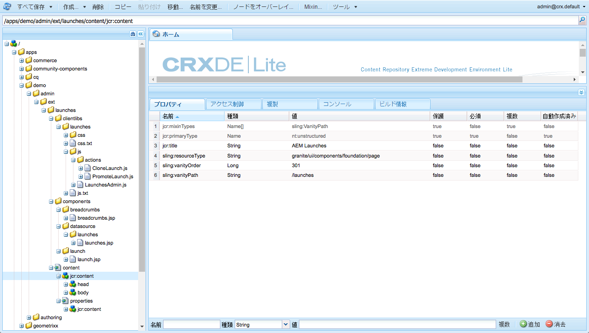
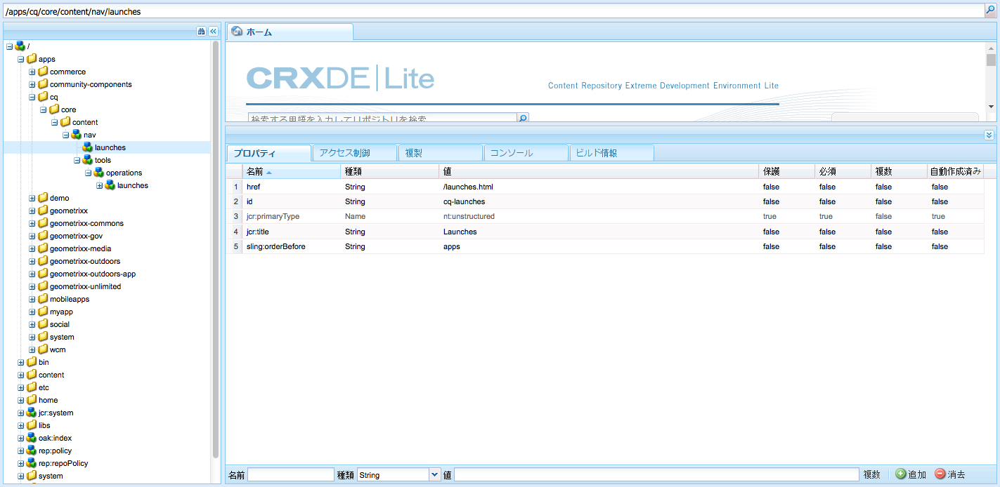

# コンソールのカスタマイズ{#customizing-the-consoles}

>[!CAUTION]
>
>AEM 6.4 の拡張サポートは終了し、このドキュメントは更新されなくなりました。 詳細は、 [技術サポート期間](https://helpx.adobe.com/jp/support/programs/eol-matrix.html). サポートされているバージョンを見つける [ここ](https://experienceleague.adobe.com/docs/?lang=ja).

>[!CAUTION]
>
>このドキュメントでは、最新のタッチ操作対応 UI でコンソールをカスタマイズする方法について説明します。クラシック UI には適用されません。

AEMは、コンソール ( および [ページオーサリング機能](/help/sites-developing/customizing-page-authoring-touch.md)) を作成します。

* Clientlibs

   クライアントライブラリを使用すると、デフォルトの実装を拡張して新しい機能を実現しながら、標準の関数、オブジェクト、メソッドを再利用できます。カスタマイズするときに、独自の clientlib を `/apps.` に作成して、カスタムコンポーネントに必要なコードを保持するといった操作が可能です。

* オーバーレイ

   オーバーレイオーバーレイはノード定義に基づいており、（`/libs`にある）標準の機能に、（`/apps`にある）カスタマイズした独自機能を重ねることができます。Sling Resource Merger は継承を許可しているので、オーバーレイを作成するときに、オリジナルの 1 対 1 のコピーは必要ありません。

これらは、AEMコンソールを拡張するための様々な方法で使用できます。 一部については、以降で（大まかに）説明します。

>[!NOTE]
>
>詳しくは、次のセクションを参照してください。
>
>* の使用と作成 [clientlibs](/help/sites-developing/clientlibs.md).
>* の使用と作成 [overlays](/help/sites-developing/overlays.md).
>* [Granite](https://helpx.adobe.com/experience-manager/6-4/sites/developing/using/reference-materials/granite-ui/api/index.html)
>
>このトピックについては、[AEM Gems セッション - User interface customization for AEM 6.0](https://experienceleague.adobe.com/docs/experience-manager-gems-events/gems/gems2014/aem-user-interface-customization-for-aem6.html) でも説明しています。

>[!CAUTION]
>
>`/libs` パス内の設定は&#x200B;***一切***&#x200B;変更しないでください。
>
>`/libs` コンテンツは、インスタンスを次回アップグレードするとき（場合によってはホットフィックスまたは機能パックを適用したとき）に上書きされるからです。
>
>設定およびその他の変更に推奨される方法は次のとおりです。
>
>1. 必要な項目（`/libs`内に存在）を、`/apps`の下で再作成します。
>
>1. `/apps` 内で変更作業をおこないます。

>

例えば、次の場所は、 `/libs` 構造はオーバーレイできます。

* コンソール（Granite UI ページに基づくすべてのコンソール）。次に例を示します。

   * `/libs/wcm/core/content`

<!-- Needs a review by Engineering -->
<!--
* secondary (inner) rails; for example:

    * `/libs/wcm/core/content/search`

* toolbar(s) (dependent on console; for example sites):

    * default 

      `/libs/wcm/core/content/sites/jcr:content/body/content/header/items/default`

    * selection mode

      `/libs/wcm/core/content/sites/jcr:content/body/content/header/items/selection`

* help menu options (dependent on console; for example sites):

    * `/libs/wcm/core/content/sites/jcr:content/body/help`

* information shown on the card view (dependent on console; for example sites):

    * `/libs/wcm/core/content/sites/jcr:content/body/content/content/items/childpages`

-->
>[!NOTE]
>
>ヒントおよびツールについて詳しくは、ナレッジベースの記事「[Troubleshooting AEM TouchUI issues](https://helpx.adobe.com/jp/experience-manager/kb/troubleshooting-aem-touchui-issues.html)」を参照してください。

<!-- Needs a review by Engineering -->
<!--
## Code Samples {#code-samples}

Various packages have been made available on Github. These provide code samples related to the tasks covered on this page.

### aem-admin-extension-new-console {#aem-admin-extension-new-console}

`aem-admin-extension-new-console` is a sample package showing how to [create a new AEM 6 console](#create-a-custom-console). This package provides a UI for managing [Launches](/help/sites-authoring/launches.md) and adds a link in the navigation:

CODE ON GITHUB

You can find the code of this page on GitHub

* [Open aem-admin-extension-new-console project on GitHub](https://github.com/Adobe-Marketing-Cloud/aem-admin-extension-new-console)
* Download the project as [a ZIP file](https://github.com/Adobe-Marketing-Cloud/aem-admin-extension-new-console/archive/master.zip)

### aem-admin-extension-customize-sites {#aem-admin-extension-customize-sites}

`aem-admin-extension-customize-sites` is a sample package showing how to customize an existing AEM 6 admin console. This package provides updates to Sites administration:

CODE ON GITHUB

You can find the code of this page on GitHub

* [Open aem-admin-extension-customize-sites project on GitHub](https://github.com/Adobe-Marketing-Cloud/aem-admin-extension-customize-sites)
* Download the project as [a ZIP file](https://github.com/Adobe-Marketing-Cloud/aem-admin-extension-customize-sites/archive/master.zip)
-->

<!-- Needs a review by Engineering -->
<!--
## Create a Custom Console {#create-a-custom-console}

1. You can create a custom console with related actions; for example, Launches at the top level (below Sites):

   This involves:

    * creating the root space definition of your new console ``; for example:

        * `/apps/<yourProject>/admin/ext/launches`

    * this can contain (according to requirements):

        * the corresponding [clientlibs](/help/sites-developing/clientlibs.md) for custom actions and `less`/ `css` definitions

            * `/apps/<yourProject>/admin/ext/launches/clientlibs`

        * components that need to be redefined/adjusted; for example, the breadcrumbs, datasource and the launch

            * `/apps/<yourProject>/admin/ext/launches/components`

        * the Granite UI page resource:

            * `/apps/<yourProject>/admin/ext/launches/content/jcr:content`

              property: `sling:resourceType`

        * the page definition of the console

            * `/apps/<yourProject>/admin/ext/launches/content/jcr:content/head`
            * `/apps/<yourProject>/admin/ext/launches/content/jcr:content/body`

   

   To use the new console (for example in the [rail for navigation](#add-new-navigation-option-to-rail)) an ID is used, so that it can be explicitly referenced. The ID is used to connect the console and its navigation definition. The ID is defined in the `rail` node of the page; for example, for the Sites console:

    * the rail node is: 

      `/libs/wcm/core/content/sites/jcr:content/body/rail`

        * here the `currentId` property is defined: 

          `currentId` = `cq-sites`

   For the Launches console example:

    * the node is:

        * `/apps/<yourProject>/admin/ext/launches/content/jcr:content/body/rail`

    * with the following properties:

        * `currentId` = `cq-launches`
        * `sling:resourceType` = `granite/ui/components/endor/navcolumns`
        * `srcPath` = `cq/core/content/nav`
-->

## コンソールのデフォルト表示のカスタマイズ {#customizing-the-default-view-for-a-console}

コンソールのデフォルトの表示（列、カード、リスト）をカスタマイズできます。

1. ビューの順序を変更するには、次の場所から必要なエントリをオーバーレイします。

   `/libs/wcm/core/content/sites/jcr:content/views`

   先頭のエントリがデフォルトになります。

   使用可能なノードは、使用可能な表示オプションに関連付けられます。

   * `column`
   * `card`
   * `list`

1. 例えば、リスト用のオーバーレイで、

   `/apps/wcm/core/content/sites/jcr:content/views/list`

   次のプロパティを定義します。

   * **名前**：`sling:orderBefore`
   * **型**：`String`
   * **値**: `column`

<!-- Needs a review by Engineering -->
<!--
`aem-admin-extension-customize-sites` is a sample package showing how to customize an existing AEM 6 admin console. This package provides updates to Sites administration:

CODE ON GITHUB

You can find the code of this page on GitHub

* [Open aem-admin-extension-customize-sites project on GitHub](https://github.com/Adobe-Marketing-Cloud/aem-admin-extension-customize-sites)
* Download the project as [a ZIP file](https://github.com/Adobe-Marketing-Cloud/aem-admin-extension-customize-sites/archive/master.zip)
-->

<!-- Needs a review by Engineering -->
<!--
### Add New Navigation Option to Rail {#add-new-navigation-option-to-rail}

1. You can add a navigation entry in the rail (for example, a [custom console](#create-a-custom-console) such as Launches).

   To do this, you create an overlay of:

   `/libs/cq/core/content/nav`

   In the `/apps` overlay:

   `/apps/cq/core/content/nav`

   Create the new nodes and properties:

   

    * Extend navigation:

        * `/apps/cq/core/content/nav/launches`

    * Specify location in the tree:

        * property: `sling:orderBefore`

    * To create the connection, the `id` property references (i.e. must be the same as) the `currentID` property [for the appropriate console](#create-a-custom-console):

        * property: `id`
        * value: same as for your console (e.g. `cq-launches`) 

          for example: the same value as the `currentId` property on:

          `/apps/<yourProject>/admin/ext/launches/content/jcr:content/body/rail`
-->

## ツールバーに新しいアクションを追加する {#add-new-action-to-the-toolbar}

1. 独自のコンポーネントを構築し、対応するカスタムアクション用のクライアントライブラリを含めることができます。 例： **twitterに昇格** アクション：

   `/apps/wcm/core/clientlibs/sites/js/twitter.js`

   このアクションを独自コンソールのツールバー項目に関連付けることができます。

   `/apps/<yourProject>/admin/ext/launches`

   選択モードの例：

   `content/jcr:content/body/content/header/items/selection/items/twitter`

## 特定のグループにツールバーアクションを制限する {#restrict-a-toolbar-action-to-a-specific-group}

1. カスタムのレンダリング条件を使用して、標準のアクションをオーバーレイし、レンダリング前に満たす必要のある特定の条件を課すことができます。

   例えば、グループに従ってレンダリング条件を制御するコンポーネントを作成します。

   `/apps/myapp/components/renderconditions/group`

1. これをサイトコンソールの「サイトを作成」アクションに適用するには、

   `/libs/wcm/core/content/sites`

   オーバーレイを作成します。

   `/apps/wcm/core/content/sites`

1. このアクションのレンダリング条件を追加します。

   `jcr:content/body/content/header/items/default/items/create/items/createsite/rendercondition`

   このノードのプロパティを使用して、特定のアクションを実行できる `groups`（`administrators` など）を定義できます。

<!-- Needs a review by Engineering -->
<!--
## Remove Access to Navigation Option on Rail {#remove-access-to-navigation-option-on-rail}

1. You can rename a navigation entry in the rail by overlaying the required entry from under:

   `/libs/cq/core/content/nav`

   The nodes available correlate to the navigation options in the rail:

    * `projects`
    * `sites`
    * `assets`
    * `apps`
    * `forms`
    * `screens`
    * `personalization`
    * `commerce`
    * `tools`
    * `communities`

1. For example, on a overlay at:

   `/apps/cq/core/content/nav/sites`

   Define the following property:

    * **Name**: `sling:hideResource`
    * **Type**: `String` 
    * **Value**: `true`

`aem-admin-extension-customize-sites` is a sample package showing how to customize an existing AEM 6 admin console. This package provides updates to Sites administration:

CODE ON GITHUB

You can find the code of this page on GitHub

* [Open aem-admin-extension-new-console project on GitHub](https://github.com/Adobe-Marketing-Cloud/aem-admin-extension-new-console)
* Download the project as [a ZIP file](https://github.com/Adobe-Marketing-Cloud/aem-admin-extension-new-console/archive/master.zip)
-->

<!-- Needs a review by Engineering -->
<!--
## Restrict Access to Navigation Option on Rail {#restrict-access-to-navigation-option-on-rail}

You can restrict access to a navigation option using ACLs:

1. Open the [user and/or group management](/help/sites-administering/security.md) and select the user/group you want to restrict access for.

   >[!NOTE]
   >
   >Avoid assigning/restricting permissions on a user-by-user basis. It is [recommended to use groups](/help/sites-administering/security.md#best-practices).

1. Remove access [permissions](/help/sites-administering/security.md#permissions) to the appropriate node(s) under `/libs/cq/core/content/nav/sites`. These correlate to the navigation options in the rail:

    * `projects`
    * `sites`
    * `assets`
    * `apps`
    * `forms`
    * `screens`
    * `personalization`
    * `commerce`
    * `tools`
    * `communities`
-->

## リスト表示で列のカスタマイズ {#customizing-columns-in-the-list-view}

>[!NOTE]
>
>この機能は、テキストフィールドの列に対して最適化されています。その他のデータタイプに対しては、`/apps` の `cq/gui/components/siteadmin/admin/listview/columns/analyticscolumnrenderer` をオーバーレイできます。

<!-- Needs a review by Engineering -->
<!--
CODE ON GITHUB

You can find the code of this page on GitHub

* [Open aem-sites-extension-listview-columns project on GitHub](https://github.com/Adobe-Marketing-Cloud/aem-sites-extension-listview-columns)
* Download the project as [a ZIP file](https://github.com/Adobe-Marketing-Cloud/aem-sites-extension-listview-columns/archive/master.zip)
-->

リスト表示の列をカスタマイズするには：

1. 使用可能な列のリストをオーバーレイします。

   * ノードの場合：

      `/apps/wcm/core/content/common/availablecolumns`

   * 新しい列を追加、または既存の列を削除します。
   詳しくは、[オーバーレイ（および Sling Resource Merger）の使用](/help/sites-developing/overlays.md)を参照してください。

1. 省略可能：

   * 追加データを挿入する場合は、以下を持つ ` [PageInforProvider](https://helpx.adobe.com/experience-manager/6-4/sites/developing/using/reference-materials/javadoc/com/day/cq/wcm/api/PageInfoProvider.html)` を記述する必要があります。

      `pageInfoProviderType` property.
   例えば、以下の GitHub から添付されたクラス/バンドルを参照してください。

1. これで、リスト表示の列コンフィギュレーターで列を選択できます。

## リソースのフィルタリング {#filtering-resources}

コンソールを使用する場合、一般的な使用例は、ユーザーがリソース（ページ、コンポーネント、アセットなど）から選択する必要がある場合です。 これは、例えば、作成者が項目を選択する必要があるリストの形式をとることができます。

リストを適切なサイズに保ち、使用事例にも関連するように、カスタム述語の形式でフィルターを実装できます。 詳しくは、 [この記事](/help/sites-developing/customizing-page-authoring-touch.md#filtering-resources) 」を参照してください。
