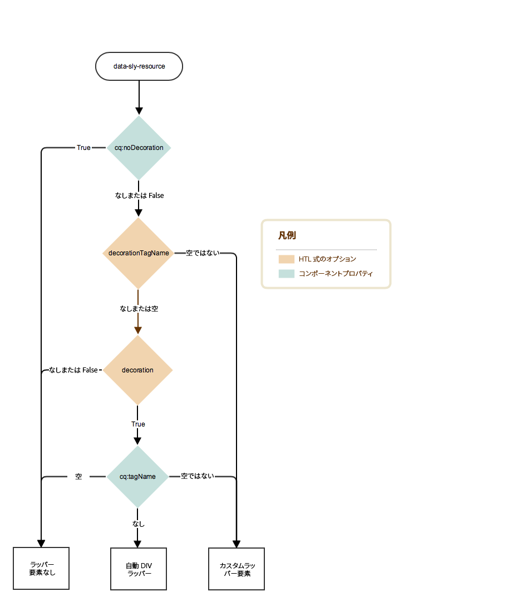
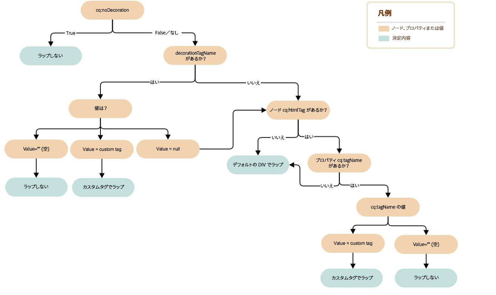

# 装飾タグ {#decoration-tag}

>[!CAUTION]
>
>AEM 6.4 の拡張サポートは終了し、このドキュメントは更新されなくなりました。 詳細は、 [技術サポート期間](https://helpx.adobe.com/jp/support/programs/eol-matrix.html). サポートされているバージョンを見つける [ここ](https://experienceleague.adobe.com/docs/?lang=ja).

Web ページのコンポーネントがレンダリングされる際に、レンダリングしたコンポーネントをラッピングする HTML 要素を生成できます。これは主に 2 つの目的を果たします。

* コンポーネントは、コンポーネント要素でラップされている場合にのみHTMLできます。
* ラッピング要素は、次を提供するHTMLクラスを適用するために使用されます。

   * レイアウト情報
   * スタイル設定情報

AEM では、含まれているコンポーネントをラップする装飾タグを制御する明確でシンプルなロジックを開発者向けに提供しています。装飾タグがレンダリングされるかどうかと方法は、このページで説明する 2 つの要因の組み合わせによって定義されます。

* コンポーネント自体は、一連のプロパティを使用して装飾タグを設定できます。
* コンポーネント（HTL、JSP、Dispatcher など）を含むスクリプトは、パラメーターを含めることで装飾タグの側面を定義できます。

## 推奨事項 {#recommendations}

予期しない問題の発生を防ぐために役立つ、ラッパー要素を含めるタイミングに関する一般的な推奨事項を以下に示します。

* ラッパー要素の存在は、WCMModes（編集またはプレビューモード）、インスタンス（オーサーまたはパブリッシュ）、環境（ステージングまたは実稼動）の間で異なるべきではなく、ページの CSS と JavaScripts がどの場合でも同じように機能します。
* ページエディターが正しく初期化および更新できるように、ラッパー要素は、編集可能なすべてのコンポーネントに追加する必要があります。
* 編集不可能なコンポーネントの場合、特定の関数を提供しない場合は、ラッパー要素を避けることができるので、生成されるマークアップが不必要に膨張することはありません。

## コンポーネントの制御 {#component-controls}

次のプロパティおよびノードをコンポーネントに適用して、装飾タグの動作を制御できます。

* **`cq:noDecoration {boolean}`：**&#x200B;このプロパティは、コンポーネントに追加できます。true の値は、コンポーネントに対してラッパー要素を生成しないよう AEM を強制します。
* **`cq:htmlTag`ノード：**&#x200B;このノードは、コンポーネントに追加でき、次のプロパティを持つことができます。
   * **`cq:tagName {String}`：**&#x200B;これは、デフォルトの DIV 要素の代わりにコンポーネントをラッピングするために使用されるカスタム HTML タグを指定するために使用できます。
   * **`class {String}`：**&#x200B;これは、ラッパーに追加する css クラス名を指定するために使用できます。
   * 他のプロパティ名は、指定された値と同じ String 値を持つHTML属性として追加されます。

## スクリプトコントロール {#script-controls}

ただし、ラッパーの動作は、[HTL](/help/sites-developing/decoration-tag.md#htl) または [JSP](/help/sites-developing/decoration-tag.md#jsp) のどちらを使用して要素を含めるかによって異なります。

### HTL {#htl}

通常、HTL のラッパー動作は、次のように要約できます。

* デフォルトでは、ラッパー DIV はレンダリングされない（`data-sly-resource="foo"` のみ行う場合）。
* すべての wcm モード（無効、プレビュー、編集、オーサーとパブリッシュの両方）は同じようにレンダリングされます。

ラッパーの動作も完全に制御できます。

* HTL スクリプトは、ラッパータグで生成される動作を完全に制御できます。
* コンポーネントプロパティ（`cq:noDecoration`、`cq:tagName` など）もラッパータグを定義します。

HTL スクリプトおよびその関連ロジックからラッパータグの動作を完全に制御できます。

HTL での開発について詳しくは、[HTL ドキュメント](https://helpx.adobe.com/jp/experience-manager/htl/user-guide.html)を参照してください。

#### デシジョンツリー {#decision-tree}

このデシジョンツリーは、ラッパータグの動作を決定するロジックの概要を示します。



#### ユースケース {#use-cases}

次の 3 つの使用例は、ラッパータグの処理方法の例を示し、ラッパータグの目的の動作を制御するのがどの程度簡単かを示しています。

以降の例では、次のコンテンツ構造とコンポーネントを想定しています。

```
/content/test/
  @resourceType = "test/components/one"
  child/
    @resourceType = "test/components/two"
```

```
/apps/test/components/
  one/
    one.html
  two/
    two.html
    cq:htmlTag/
      @cq:tagName = "article"
      @class = "component-two"
```

#### 使用例 1：コードの再利用のためのコンポーネントを含める {#use-case-include-a-component-for-code-reuse}

最も一般的な使用例は、コードの再利用のためにコンポーネントが他のコンポーネントを含む場合です。この場合、含まれるコンポーネントは、独自のツールバーおよびダイアログで編集できる必要はないので、ラッパーは不要で、コンポーネントの `cq:htmlTag` は無視されます。これはデフォルトの動作と見なすことができます。

`one.html: <sly data-sly-resource="child"></sly>`

`two.html: Hello World!`

`/content/test.html` に出力される結果：

**`Hello World!`**

この例は、画像を表示するためのコア画像コンポーネントを含むコンポーネントになります。その場合、通常、コンポーネントが持つすべてのプロパティを表す Map オブジェクトを data-sly-resource に渡すことで、仮想子コンポーネントを含んで構成される合成リソースを使用します。

#### 使用例 2：編集可能なコンポーネントを含める {#use-case-include-an-editable-component}

もうひとつの一般的な使用例は、コンテナコンポーネントがレイアウトコンテナのような編集可能な子コンポーネントを含む場合です。この場合、含まれた各子は、必ずエディターが機能するためのラッパーを必要とします（`cq:noDecoration` プロパティで明示的に無効になっている場合を除く）。

含まれるコンポーネントは、この場合、独立したコンポーネントなので、エディターが機能するためにはラッパー要素が必要で、適用するレイアウトおよびスタイルを定義する必要があります。この動作をトリガーするために、`decoration=true` オプションがあります。

`one.html: <sly data-sly-resource="${'child' @ decoration=true}"></sly>`

`two.html: Hello World!`

`/content/test.html` に出力される結果：

**`<article class="component-two">Hello World!</article>`**

#### 使用例 3：カスタム動作 {#use-case-custom-behavior}

複雑な使用例はいくつもありますが、明示的に次を提供する HTL を利用することで簡単に実現できます。

* **`decorationTagName='ELEMENT_NAME'`**：ラッパーの要素名を定義します。
* **`cssClassName='CLASS_NAME'`**：設定する CSS クラス名を定義します。

`one.html: <sly data-sly-resource="${'child' @ decorationTagName='aside', cssClassName='child'}"></sly>`

`two.html: Hello World!`

`/content/test.html` に出力される結果：

**`<aside class="child">Hello World!</aside>`**

## JSP {#jsp}

`cq:includ` または `sling:include` を使用してコンポーネントを含める場合、AEM のデフォルトの動作は、DIV を使用して要素をラッピングできます。ただし、このラッピングは 2 つの方法でカスタマイズできます。

* `cq:noDecoration` を使用してコンポーネントをラッピングしないように明示的に AEM に指定します。
* カスタム HTML タグを使用して `cq:htmlTag`／`cq:tagName` または `decorationTagName` を使用するコンポーネントをラッピングします。

### デシジョンツリー {#decision-tree-1}

次のデシジョンツリーで、`cq:noDecoration`、`cq:htmlTag`、`cq:tagName` および `decorationTagName` がどのようにラッパー動作に影響するかを説明します。


