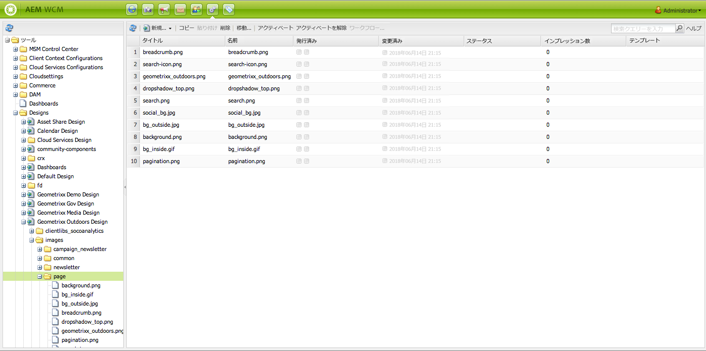
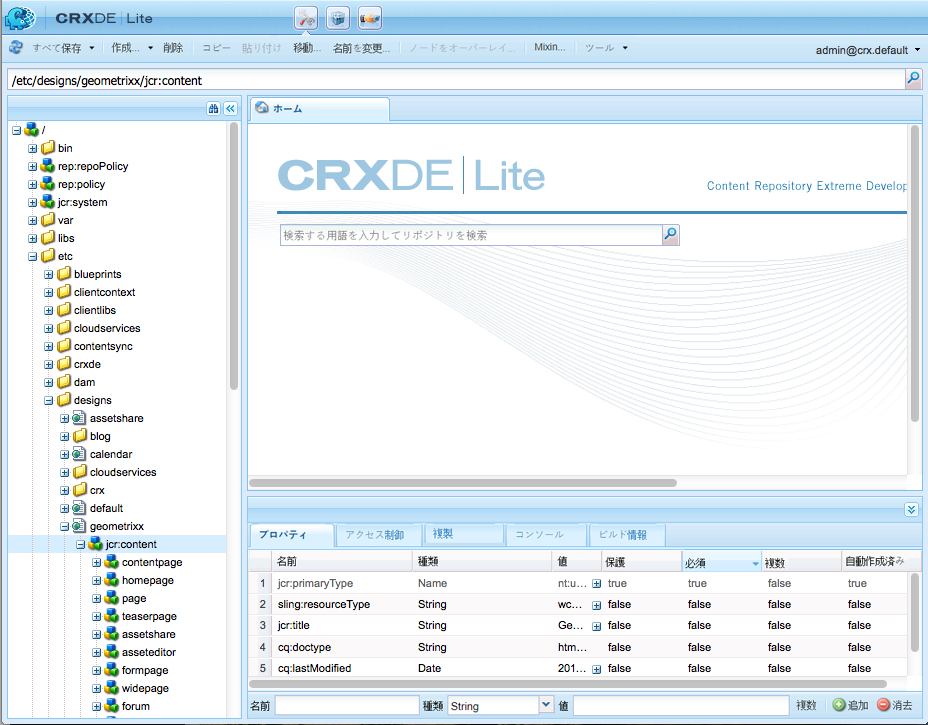

# デザインとデザイナー{#designs-and-the-designer}

>[!CAUTION]
>
>この記事では、クラシック UI を使用して web サイトを作成する方法について説明します。アドビでは、[AEM Sites の開発の手引き](/help/sites-developing/getting-started.md)で詳しく説明しているように、web サイトに最新の AEM テクノロジーを利用することをお勧めします。

Designer は、AEM の[クラシック UI](/help/release-notes/touch-ui-features-status.md) を使用した web サイトのデザインを作成するために使用します。

>[!NOTE]
>
>Web アクセシビリティについて詳しくは、 [AEMと Web アクセシビリティのガイドライン](/help/managing/web-accessibility.md).

## デザイナーの使用 {#using-the-designer}

デザインは、「**ツール**」タブの **designs** セクションで定義できます。



ここで、デザインの格納に必要な構造を作成し、必要なカスケーディングスタイルシート（CSS）および画像をアップロードできます。

デザインは、`/apps/<your-project>`の下に格納されます。Web サイトに使用するデザインへのパスは、ノードの `cq:designPath`プロパティ`jcr:content`で指定します。



>[!NOTE]
>
>デザインモードでページに対して行われた変更はすべて、サイトのデザインノードの下に保持され、同じデザインを持つすべてのページに自動的に適用されます。

## 必要なもの {#what-you-will-need}

デザインを実現するには、次が必要です。

**CSS** - カスケーディングスタイルシート（CSS）は、ページの特定の領域の書式を定義します。


**画像** - 背景、ボタンなどの機能に使用するすべての画像。

### Web サイトをデザインする際の考慮事項 {#considerations-when-designing-your-website}

Web サイトを開発するときは、画像や CSS ファイルを `/apps/<your-project>` の下に格納し、以下のスニペットで記述されているように、現在のデザインに基づいてリソースを参照できるようにすることを強くお勧めします。

```xml
<%= currentDesign.getPath() + "/static/img/icon.gif %>
```

前述の例には、次のようなメリットがあります。

* 別々のデザインパスを使用しているサイトごとに、コンポーネントのルックアンドフィールを変化させることができます。
* `design/v1`から`design/v2.`のように、デザインパスをサイトのルートにある別のノードに変更することにより、web サイトのデザインを簡単に変更できます。

* ブラウザーから見える外部 URL は `/etc/designs` および `/content` のみなので、`/apps` ツリーの下に何があるかに興味を抱く外部ユーザーから保護することができます。前述の URL のメリットは、システム管理者がより高いセキュリティを設定する際にも役立ちます。アセットを公開する範囲を、少数の場所に制限しているからです。
