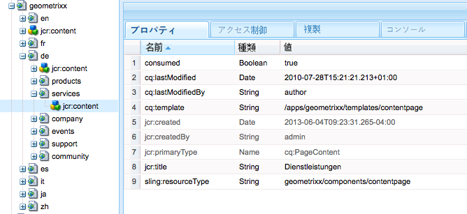

# オフロードのためのジョブの作成と使用{#creating-and-consuming-jobs-for-offloading}

Apache Sling Discovery 機能が提供する Java API によって、JobManager ジョブとそれを使用する JobConsumer サービスを作成できます。

オフロードトポロジの作成およびトピック使用の設定について詳しくは、[ジョブのオフロード](/help/sites-deploying/offloading.md)を参照してください。

## ジョブペイロードの処理 {#handling-job-payloads}

オフロードフレームワークによって、ジョブペイロードを識別するために使用する 2 つのジョブプロパティが定義されています。これらのプロパティは、オフロードレプリケーションエージェントによって使用され、トポロジ内のインスタンスにレプリケートするリソースが識別されます。

* `offloading.job.input.payload`:コンテンツパスのコンマ区切りリスト。 コンテンツは、ジョブを実行するインスタンスにレプリケートされます。
* `offloading.job.output.payload`:コンテンツパスのコンマ区切りリスト。 ジョブの実行が完了すると、ジョブペイロードはジョブを作成したインスタンス上のこれらのパスにレプリケートされます。

`OffloadingJobProperties` 列挙を使用して、プロパティ名を参照します。

* `OffloadingJobProperties.INPUT_PAYLOAD.propertyName()`
* `OffloadingJobProperties.OUTPUT_PAYLOAD.propetyName()`

ジョブはペイロードを必要としません。ただし、ジョブでリソースの操作が必要であり、ジョブを作成しなかったコンピューターにジョブがオフロードされる場合は、ペイロードが必要です。

## オフロードのためのジョブの作成 {#creating-jobs-for-offloading}

自動的に選択された JobConsumer によって実行されるジョブを作成するために、JobManager.addJob メソッドを呼び出すクライアントを作成します。以下の情報を入力してジョブを作成します。

* トピック：ジョブトピック。
* 名前：（オプション）
* プロパティマップ：A `Map<String, Object>` 任意の数のプロパティ（入力ペイロードパス、出力ペイロードパスなど）を含むオブジェクト。 この Map オブジェクトは、ジョブを実行する JobConsumer オブジェクトで使用可能です。

以下の例のサービスでは、特定のトピックおよび入力ペイロードパスのジョブが作成されます。

```java
package com.adobe.example.offloading;

import org.apache.felix.scr.annotations.Component;
import org.apache.felix.scr.annotations.Service;
import org.apache.felix.scr.annotations.Reference;

import java.util.HashMap;

import org.apache.sling.event.jobs.Job;
import org.apache.sling.event.jobs.JobManager;

import org.apache.sling.api.resource.ResourceResolverFactory;
import org.apache.sling.api.resource.ResourceResolver;

import com.adobe.granite.offloading.api.OffloadingJobProperties;

@Component
@Service
public class JobGeneratorImpl implements JobGenerator  {

 @Reference
 private JobManager jobManager;
 @Reference ResourceResolverFactory resolverFactory;

 public String createJob(String topic, String payload) throws Exception {
  Job offloadingJob;

  ResourceResolver resolver = resolverFactory.getResourceResolver(null);
  if(resolver.getResource(payload)!=null){

   HashMap<String, Object> jobprops = new HashMap<String, Object>();
   jobprops.put(OffloadingJobProperties.INPUT_PAYLOAD.propertyName(), payload);

   offloadingJob = jobManager.addJob(topic, null, jobprops);
  } else {
   throw new Exception("Payload for job cannot be found");
  }
  if (offloadingJob == null){
   throw new Exception ("Offloading job could not be created");
  }
  return offloadingJob.getId();
 }
}
```

ログには次のメッセージが含まれます。JobGeneratorImpl.createJob が `com/adobe/example/offloading` トピックと `/content/geometrixx/de/services` ペイロード：

```shell
10.06.2013 15:43:33.868 *INFO* [JobHandler: /etc/workflow/instances/2013-06-10/model_1554418768647484:/content/geometrixx/en/company] com.adobe.example.offloading.JobGeneratorImpl Received request to make job for topic com/adobe/example/offloading and payload /content/geometrixx/de/services
```

## JobConsumer の開発 {#developing-a-job-consumer}

ジョブを使用するには、`org.apache.sling.event.jobs.consumer.JobConsumer` インターフェイスを実装する OSGi サービスを開発します。`JobConsumer.PROPERTY_TOPICS` プロパティを使用して、使用するトピックを特定します。

次の例の JobConsumer 実装は、を `com/adobe/example/offloading` トピック。 JobConsumer では、単にペイロードコンテンツノードの consumed プロパティが true に設定されます。

```java
package com.adobe.example.offloading;

import org.apache.felix.scr.annotations.Component;
import org.apache.felix.scr.annotations.Property;
import org.apache.felix.scr.annotations.Reference;
import org.apache.felix.scr.annotations.Service;
import org.apache.sling.api.resource.ResourceResolver;
import org.apache.sling.api.resource.ResourceResolverFactory;
import org.apache.sling.event.jobs.Job;
import org.apache.sling.event.jobs.JobManager;
import org.apache.sling.event.jobs.consumer.JobConsumer;
import org.slf4j.Logger;
import org.slf4j.LoggerFactory;

import javax.jcr.Session;
import javax.jcr.Node;

import com.adobe.granite.offloading.api.OffloadingJobProperties;

@Component
@Service
public class MyJobConsumer implements JobConsumer {

 public static final String TOPIC = "com/adobe/example/offloading";

 @Property(value = TOPIC)
 static final String myTopic = JobConsumer.PROPERTY_TOPICS; 

 @Reference
 private ResourceResolverFactory resolverFactory;

 @Reference
 private JobManager jobManager;

 private final Logger log = LoggerFactory.getLogger(getClass());

 public JobResult process(Job job) {
  JobResult result = JobResult.FAILED;
  String topic = job.getTopic();
  log.info("Consuming job of topic: {}", topic);
  String payloadIn =  (String) job.getProperty(OffloadingJobProperties.INPUT_PAYLOAD.propertyName());
  String payloadOut =  (String) job.getProperty(OffloadingJobProperties.OUTPUT_PAYLOAD.propertyName());

  log.info("Job has Input Payload {} and Output Payload {}",payloadIn, payloadOut);

  ResourceResolver resolver = null;
  try {
   resolver = resolverFactory.getAdministrativeResourceResolver(null);
   Session session = resolver.adaptTo(Session.class);
   Node inNode = session.getNode(payloadIn);
   inNode.getNode(Node.JCR_CONTENT).setProperty("consumed",true);
   result = JobResult.OK;
  }catch (Exception e){
   log.info("ERROR -- JOB RESULT IS FAILURE " + e.getMessage());
   result = JobResult.FAILED;
  }
  log.info("Job OK for payload {}",payloadIn);
  return result;
 }
}
```

MyJobConsumer クラスによって、入力ペイロード /content/geometrixx/de/services に対して以下のログメッセージが生成されます。

```shell
10.06.2013 16:02:40.803 *INFO* [pool-7-thread-17-<main queue>(com/adobe/example/offloading)] com.adobe.example.offloading.MyJobConsumer Consuming job of topic: com/adobe/example/offloading
10.06.2013 16:02:40.803 *INFO* [pool-7-thread-17-<main queue>(com/adobe/example/offloading)] com.adobe.example.offloading.MyJobConsumer Job has Input Payload /content/geometrixx/de/services and Output Payload /content/geometrixx/de/services
10.06.2013 16:02:40.884 *INFO* [pool-7-thread-17-<main queue>(com/adobe/example/offloading)] com.adobe.example.offloading.MyJobConsumer Job OK for payload /content/geometrixx/de/services
```

consumed プロパティは、CRXDE Lite を使用して確認できます。



## Maven の依存関係 {#maven-dependencies}

Maven でオフロード関連クラスを解決できるように、以下の依存関係定義を pom.xml ファイルに追加します。

```xml
<dependency>
   <groupId>org.apache.sling</groupId>
   <artifactId>org.apache.sling.event</artifactId>
   <version>3.1.5-R1485539</version>
   <scope>provided</scope> 
</dependency>
<dependency>
   <groupId>com.adobe.granite</groupId>
   <artifactId>com.adobe.granite.offloading.core</artifactId>
   <version>1.0.4</version>
   <scope>provided</scope>
</dependency>
```

前述の例でも、以下の依存関係定義が必要でした。

```xml
<dependency>
   <groupId>org.apache.sling</groupId>
   <artifactId>org.apache.sling.api</artifactId>
   <version>2.4.3-R1488084</version>
   <scope>provided</scope>
</dependency>

<dependency>
   <groupId>org.apache.sling</groupId>
   <artifactId>org.apache.sling.jcr.jcr-wrapper</artifactId>
   <version>2.0.0</version>
   <scope>provided</scope>
</dependency>
```
