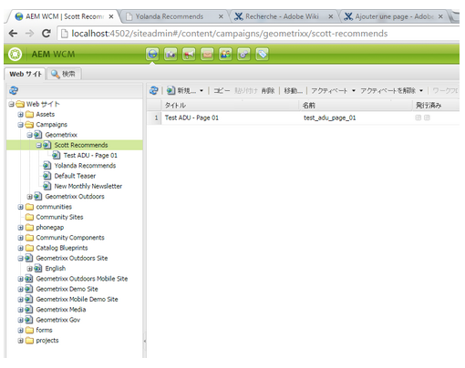

# カスタム拡張の作成{#creating-custom-extensions}

通常、プロジェクトを実装する場合、AEMとAdobe Campaignの両方にカスタムコードがあります。 既存の API を使用して、Adobe CampaignでカスタムコードをAEMから、またはAEMからAdobe Campaignに呼び出すことができます。 このドキュメントでは、その方法について説明します。

## 前提条件 {#prerequisites}

以下をインストールする必要があります。

* Adobe Experience Manager
* Adobe Campaign 6.1

詳しくは、[AEM と Adobe Campaign 6.1 の統合](/help/sites-administering/campaignonpremise.md)を参照してください。

## 例 1:AEM to Adobe Campaign {#example-aem-to-adobe-campaign}

AEMと Campaign の標準的な統合は、JSON と JSSP(JavaScript Server Page) に基づいています。 JSSP ファイルは Campaign コンソールにあり、すべてが次で始まります **amc** (Adobe Marketing Cloud)。


>[!NOTE]
>
>[この例については、Package Share から入手できる Geometrixx](/help/sites-developing/we-retail.md) を参照してください。

この例では、新しいカスタム JSSP ファイルを作成し、AEM側から呼び出して結果を取得します。 これを使用して、例えば、Adobe Campaignからデータを取得したり、Adobe Campaignにデータを保存したりできます。

1. Adobe Campaign で新しい JSSP ファイルを作成するには、**新規**&#x200B;アイコンをクリックします。

   

1. この JSSP ファイルの名前を入力します。この例では、「**cus:custom.jssp**」を使用します（**cus** 名前空間に配置することを意味します）。

   

1. 次のコードを jssp ファイル内に配置します。

   ```
   <%
   var origin = request.getParameter("origin");
   document.write("Hello from Adobe Campaign, origin : " + origin);
   %>
   ```

1. 作業内容を保存します。 残りの作業はAEMです。
1. この JSSP を呼び出すには、AEM側で単純なサーブレットを作成します。 この例では、次のような場合を想定しています。

   * AEMと Campaign の間の接続が機能している
   * Campaign クラウドサービスがに設定されている **/content/geometrixx-outdoors**

   この例で最も重要なオブジェクトは、**GenericCampaignConnector** です。このオブジェクトを使用すると、Adobe Campaign 側にある JSSP ファイルを呼び出す（GET および POST）ことができます。

   次に、小さなコードスニペットを示します。

   ```
   @Reference
   private GenericCampaignConnector campaignConnector;
   ...
   Map<String, String> params = new HashMap<String, String>();
   params.put("origin", "AEM"); 
   CallResults results = campaignConnector.callGeneric("/jssp/cus/custom.jssp", params, credentials);
   return results.bodyAsString();
   ```

1. この例で示すように、認証情報を呼び出しに渡す必要があります。 これは、Campaign クラウドサービスが設定されているページを渡す getCredentials() メソッドで取得できます。

   ```xml
   // page containing the cloudservice for Adobe Campaign
   Configuration config = campaignConnector.getWebserviceConfig(page.getContentResource().getParent());
   CampaignCredentials credentials = campaignConnector.retrieveCredentials(config);
   ```

完全なコードは次のようになります。

```java
import java.io.IOException;
import java.io.PrintWriter;
import java.util.HashMap;
import java.util.Map;

import javax.servlet.ServletException;

import org.apache.felix.scr.annotations.Reference;
import org.apache.felix.scr.annotations.sling.SlingServlet;
import org.apache.sling.api.SlingHttpServletRequest;
import org.apache.sling.api.SlingHttpServletResponse;
import org.apache.sling.api.servlets.SlingSafeMethodsServlet;
import org.slf4j.Logger;
import org.slf4j.LoggerFactory;

import com.day.cq.mcm.campaign.CallResults;
import com.day.cq.mcm.campaign.CampaignCredentials;
import com.day.cq.mcm.campaign.GenericCampaignConnector;
import com.day.cq.wcm.api.Page;
import com.day.cq.wcm.api.PageManager;
import com.day.cq.wcm.api.PageManagerFactory;
import com.day.cq.wcm.webservicesupport.Configuration;

@SlingServlet(paths="/bin/campaign", methods="GET")
public class CustomServlet extends SlingSafeMethodsServlet {

 private final Logger log = LoggerFactory.getLogger(this.getClass());
 
 @Reference
 private GenericCampaignConnector campaignConnector;
 
 @Reference
 private PageManagerFactory pageManagerFactory;

 @Override
 protected void doGet(SlingHttpServletRequest request,
   SlingHttpServletResponse response) throws ServletException,
   IOException {
  
  PageManager pm = pageManagerFactory.getPageManager(request.getResourceResolver());
  
  Page page = pm.getPage("/content/geometrixx-outdoors");
  
  String result = null;
  if ( page != null) {
   result = callCustomFunction(page);
  }
  if ( result != null ) {
   PrintWriter pw = response.getWriter();
   pw.print(result);
  }
 }
 
 private String callCustomFunction(Page page ) {
  try {
   Configuration config = campaignConnector.getWebserviceConfig(page.getContentResource().getParent());
   CampaignCredentials credentials = campaignConnector.retrieveCredentials(config);
   
   Map<String, String> params = new HashMap<String, String>();
   params.put("origin", "AEM");
   CallResults results = campaignConnector.callGeneric("/jssp/cus/custom.jssp", params, credentials);
   return results.bodyAsString();
  } catch (Exception e ) {
   log.error("Something went wrong during the connection", e);
  }
  return null;
  
 }

}
```

## 例 2:Adobe CampaignからAEMへ {#example-adobe-campaign-to-aem}

AEMは、siteadmin explorer ビューの任意の場所で使用可能なオブジェクトを取得するための API を標準で提供しています。



>[!NOTE]
>
>[この例については、Package Share から入手できる Geometrixx](/help/sites-developing/we-retail.md) を参照してください。

エクスプローラーの各ノードには、API がリンクされています。例えば、以下のノードの場合、

* [http://localhost:4502/siteadmin#/content/campaigns/geometrixx/scott-recommends](http://localhost:4502/siteadmin#/content/campaigns/geometrixx/scott-recommends)

API は次のとおりです。

* [http://localhost:4502/content/campaigns/geometrixx/scott-recommends.1.json](http://localhost:4502/content/campaigns/geometrixx/scott-recommends.2.json)

URL の末尾 **.1.json** は **.2.json**, **.3.json**（取得したいサブレベルの数に応じて）すべてのサブレベルを取得するには、キーワードを **無限** は以下の場合に使用できます。

* [http://localhost:4502/content/campaigns/geometrixx/scott-recommends.infinity.json](http://localhost:4502/content/campaigns/geometrixx/scott-recommends.2.json)

ここで、API を使用するには、AEMがデフォルトで基本認証を使用していることを把握しておく必要があります。

という名前の JS ライブラリ **amcIntegration.js** は、6.1.1（ビルド 8624 以降）で使用でき、他の複数のロジックの中でそのロジックを実装します。

### AEM API 呼び出し {#aem-api-call}

```java
loadLibrary("nms:amcIntegration.js");
 
var cmsAccountId = sqlGetInt("select iExtAccountId from NmsExtAccount where sName=$(sz)","aemInstance")
var cmsAccount = nms.extAccount.load(String(cmsAccountId));
var cmsServer = cmsAccount.server;
 
var request = new HttpClientRequest(cmsServer+"/content/campaigns/geometrixx.infinity.json")
aemAddBasicAuthentication(cmsAccount, request);
request.method = "GET"
request.header["Content-Type"] = "application/json; charset=UTF-8";
request.execute();
var response = request.response;
```
