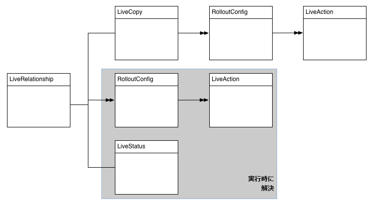
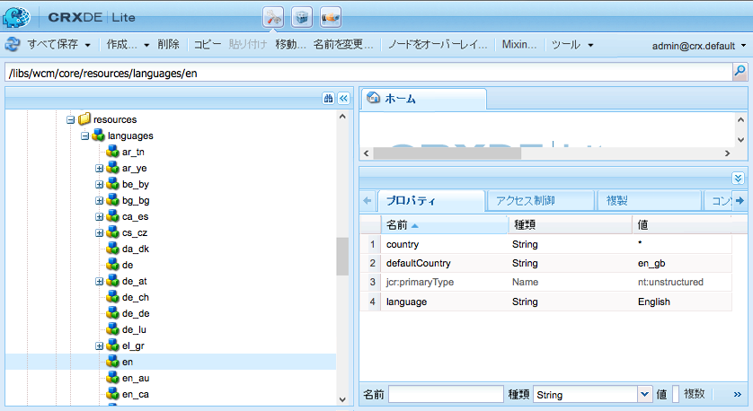

# Multi Site Manager の拡張{#extending-the-multi-site-manager}

ここでは、Multi Site Manager の機能を拡張する方法について説明します。

* MSM Java API の主な構成要素について学習します。
* ロールアウト設定で使用できる、新しい同期アクションを作成します。
* デフォルトの言語コードと国コードを変更します。

<!-- * Remove the "Chapters" step in the Create Site wizard. -->

>[!NOTE]
>
>このページは、次と共にお読みください。
>* [コンテンツの再利用：マルチサイトマネージャー](/help/sites-administering/msm.md).
>* AEM 6.4 における Sites リポジトリの再構築:
   >   * [Multi-site Manager のブループリント設定](/help/sites-deploying/sites-repository-restructuring-in-aem-6-4.md#multi-site-manager-blueprint-configurations)
   >   * [Multi-site Manager のロールアウト設定](/help/sites-deploying/sites-repository-restructuring-in-aem-6-4.md#multi-site-manager-rollout-configurations)


>[!CAUTION]
>
>Multi Site Manager とその API は Web サイトのオーサリング時に使用するものなので、オーサー環境での使用のみを目的としています。

## Java API の概要 {#overview-of-the-java-api}

Multi Site Management は、以下のパッケージで構成されています。

* [com.day.cq.wcm.msm.api](https://helpx.adobe.com/experience-manager/6-4/sites/developing/using/reference-materials/javadoc/com/day/cq/wcm/msm/api/package-frame.html)
* [com.day.cq.wcm.msm.commons](https://helpx.adobe.com/experience-manager/6-4/sites/developing/using/reference-materials/javadoc/com/day/cq/wcm/msm/commons/package-frame.html)

主要な MSM API オブジェクトは、次のような関係にあります（[使用される用語](/help/sites-administering/msm.md#terms-used)も参照してください）。



* **`Blueprint`**`Blueprint`（[ブループリント設定](/help/sites-administering/msm.md#source-blueprints-and-blueprint-configurations)）は、ライブコピーのコンテンツ継承元となるページを指定します。

   

   * ブループリント設定（`Blueprint`）の使用は任意ですが、これを使用すると、

      * 作成者がソースに対して「**ロールアウト**」オプションを使用できます（これにより、このソースから継承するライブコピーに変更を（明示的に）プッシュできます）。
      * 作成者が「**サイトを作成**」を使用できます（これにより、ユーザーが簡単に言語を選択し、ライブコピーの構造を設定できます）。
      * 作成されるすべてのライブコピーに対するデフォルトのロールアウト設定を定義できます。

* **`LiveRelationship`**`LiveRelationship` は、ライブコピーブランチのリソースと、同等のソースまたはブループリントのリソースとの関連付け（関係）を指定します。

   * この関係は、継承およびロールアウトの実現時に使用されます。
   * `LiveRelationship` オブジェクトは、ロールアウト設定（`RolloutConfig`）、`LiveCopy` 、および関係に関連付けた `LiveStatus` オブジェクトへのアクセス（参照）を可能にします。
   * 例えば、`/content/we-retail/language-masters` にあるソースまたはブループリントから、`/content/copy/us` にライブコピーが作成されるとします。リソース `/content/we.retail/language-masters/en/jcr:content` および `/content/copy/us/en/jcr:content` は関係を築きます。

* **`LiveCopy`** は、ライブコピーのリソースとそのソースまたはブループリントのリソースとの関係（`LiveRelationship`）の詳細な設定を保持します。

   * `LiveCopy` クラスを使用すると、ページのパスや、ソースまたはブループリントページのパス、ロールアウト設定にアクセスでき、さらに子ページも `LiveCopy` に含まれるかどうかを決めます。
   * `LiveCopy` ノードは、「**サイトを作成**」または「**ライブコピーを作成**」を使用するたびに作成されます。

* **`LiveStatus`** オブジェクトは、`LiveRelationship` の実行時ステータスへのアクセスを可能にします。このオブジェクトを使用して、ライブコピーの同期ステータスを問い合わせます。

* **`LiveAction`** は、ロールアウトに関係する各リソースで実行されるアクションです。

   * LiveAction は、RolloutConfig によってのみ生成されます。

* **`LiveActionFactory`** 作成 `LiveAction` 与えられたオブジェクト `LiveAction` 設定。 設定は、リポジトリ内にリソースとして保存されます。

* **`RolloutConfig`** 次のリストを保持： `LiveActions`：トリガー時に使用します。 `LiveCopy` は `RolloutConfig` を継承し、その結果が `LiveRelationship` に含まれます。

   * 初めてライブコピーを設定するときは、（LiveAction を呼び出す）RolloutConfig も使用します。

## 新しい同期アクションの作成 {#creating-a-new-synchronization-action}

カスタム同期アクションを作成して、ロールアウト設定と併用します。[インストール済みのアクション](/help/sites-administering/msm-sync.md#installed-synchronization-actions)が特定のアプリケーション要件を満たさない場合に同期アクションを作成します。同期アクションを作成するには、次の 2 つのクラスを作成します。

* アクションを実行する [`com.day.cq.wcm.msm.api.LiveAction` ](https://helpx.adobe.com/experience-manager/6-4/sites/developing/using/reference-materials/javadoc/com/day/cq/wcm/msm/api/LiveAction.html) インターフェイスの実装。
* [`com.day.cq.wcm.msm.api.LiveActionFactory`](https://helpx.adobe.com/experience-manager/6-4/sites/developing/using/reference-materials/javadoc/com/day/cq/wcm/msm/api/LiveActionFactory.html) インターフェイスを実装し、`LiveAction` クラスのインスタンスを作成する OSGi コンポーネント。

`LiveActionFactory` は、指定された設定の `LiveAction` クラスのインスタンスを作成します。

* `LiveAction` クラスには次のメソッドが含まれます。

   * `getName`：アクション名を返します。この名前は、ロールアウト設定などで、アクションを参照するために使用します。
      * `execute`：アクションのタスクを実行します。

* `LiveActionFactory` クラスには次のメンバーが含まれます。

   * `LIVE_ACTION_NAME`：関連付けた `LiveAction` の名前を格納するフィールド。この名前は、`getName` クラスの `LiveAction` メソッドが返す値と一致する必要があります。
   * `createAction`：`LiveAction` のインスタンスを作成します。オプションの `Resource` パラメーターを使用して、設定情報を提供できます。
   * `createsAction`：関連付けられた `LiveAction` の名前を返します。

### LiveAction 設定ノードへのアクセス {#accessing-the-liveaction-configuration-node}

リポジトリ内の `LiveAction` 設定ノードを使用して、`LiveAction` インスタンスの実行時動作に影響を与える情報を保存します。`LiveAction` 設定を保存するリポジトリ内のノードは、実行時に `LiveActionFactory` オブジェクトに使用できます。そのため、設定ノードにプロパティを追加し、必要に応じて `LiveActionFactory` 実装内で使用することができます。

例えば、`LiveAction` にはブループリント作成者の名前を保存する必要があります。設定ノードのプロパティには、情報を保存するブループリントページのプロパティ名が含まれます。実行時、`LiveAction` は設定からプロパティ名を取得して、そのプロパティ値を取得します。

[`LiveActionFactory`](https://helpx.adobe.com/experience-manager/6-4/sites/developing/using/reference-materials/javadoc/com/day/cq/wcm/msm/api/LiveActionFactory.html) メソッドのパラメーターは `.createAction` オブジェクトです。`Resource``Resource` オブジェクトは、ロールアウト設定内のこのライブアクションの `cq:LiveSyncAction` ノードを表します。詳しくは[ロールアウト設定の作成](/help/sites-administering/msm-sync.md#creating-a-rollout-configuration)を参照してください。通常どおり、設定ノードを使用する場合は、`ValueMap` オブジェクトに適応させる必要があります。

```java
public LiveAction createAction(Resource resource) throws WCMException {
        ValueMap config;
        if (resource == null || resource.adaptTo(ValueMap.class) == null) {
            config = new ValueMapDecorator(Collections.<String, Object>emptyMap());
        } else {
            config = resource.adaptTo(ValueMap.class);
        }
        return new MyLiveAction(config, this);
}
```

### ターゲットノード、ソースノード、LiveRelationship へのアクセス {#accessing-target-nodes-source-nodes-and-the-liverelationship}

`execute` オブジェクトの `LiveAction` メソッドのパラメーターとして、以下のオブジェクトを指定します。

* ライブコピーのソースを表す [`Resource`](https://helpx.adobe.com/experience-manager/6-4/sites/developing/using/reference-materials/javadoc/org/apache/sling/api/resource/Resource.html) オブジェクト。
* ライブコピーのターゲットを表す `Resource` オブジェクト。
* ライブコピーの [`LiveRelationship`](https://helpx.adobe.com/experience-manager/6-4/sites/developing/using/reference-materials/javadoc/com/day/cq/wcm/msm/api/LiveRelationship.html) オブジェクト。
* 値 `autoSave` は、`LiveAction` がリポジトリに対しておこなわれた変更を保存する必要があることを示します。

* リセット値は、ロールアウトのリセットモードを示します。

これらのオブジェクトから、`LiveCopy` に関するすべての情報を取得できます。`Resource` オブジェクトを使用して、`ResourceResolver`、`Session`、`Node` の各オブジェクトも取得できます。これらのオブジェクトは、リポジトリコンテンツの操作に役立ちます。

以下のコードの先頭行で、source はソースページの `Resource` オブジェクトです。

```java
ResourceResolver resolver = source.getResourceResolver();
Session session = resolver.adaptTo(javax.jcr.Session.class);
Node sourcenode = source.adaptTo(javax.jcr.Node.class);
```

>[!NOTE]
>
>`Resource` 引数には、`null` `Resources` オブジェクトなどの `Node` オブジェクトに適応しない [`NonExistingResource` または ](https://helpx.adobe.com/experience-manager/6-4/sites/developing/using/reference-materials/javadoc/org/apache/sling/api/resource/NonExistingResource.html) オブジェクトを指定できます。

## 新しいロールアウト設定の作成 {#creating-a-new-rollout-configuration}

インストールされるロールアウト設定がアプリケーションの要件を満たさない場合は、ロールアウト設定を作成します。

* [ロールアウト設定を作成](#create-the-rollout-configuration)します。
* [ロールアウト設定に同期アクションを追加](#add-synchronization-actions-to-the-rollout-configuration)します。

ブループリントまたはライブコピーページでロールアウト設定を指定すると、新しいロールアウト設定が使用可能になります。

>[!NOTE]
>
>[ロールアウトのカスタマイズのベストプラクティス](/help/sites-administering/msm-best-practices.md#customizing-rollouts)も参照してください。

### ロールアウト設定の作成 {#create-the-rollout-configuration}

新しいロールアウト設定を作成するには：

1. CRXDE Lite を開きます。例：
   [http://localhost:4502/crx/de](http://localhost:4502/crx/de)

1. 次に移動します。
   `/apps/msm/<your-project>/rolloutconfigs`

   >[!NOTE]
   >これは、次のプロジェクトのカスタマイズバージョンです。
   >`/libs/msm/wcm/rolloutconfigs`
   >これが最初の設定の場合は、作成する必要があります。

   >[!NOTE]
   >
   >/libs パス内の設定は一切変更しないでください。
   >/libs のコンテンツは、インスタンスを次回アップグレードするとき（場合によってはホットフィックスまたは機能パックを適用したとき）に上書きされるからです。
   >設定およびその他の変更に推奨される方法は次のとおりです。
   >* 必要な項目（例：/libs 内に存在する項目）を、/apps の下で再作成します。
   >* /apps 内で変更作業を行います。


1. この下に、次のプロパティを持つノードを&#x200B;**作成**&#x200B;します。

   * **名前**：ロールアウト設定のノード名です。md#installed-synchronization-actions)、例えば、 `contentCopy` または `workflow` です。
   * **タイプ**：`cq:RolloutConfig`

1. このノードに次のプロパティを追加します。
   * **名前**：`jcr:title`

      **型**：`String`
      **値**：UI に表示される識別タイトルです。
   * **名前**：`jcr:description`

      **型**：`String`
      **値**：オプションの説明です。
   * **名前**：`cq:trigger`

      **型**：`String`
      **値**：[ロールアウトトリガー](/help/sites-administering/msm-sync.md#rollout-triggers)を使用します。 次から選択します。
      * `rollout`
      * `modification`
      * `publish`
      * `deactivate`

1. 「**すべて保存**」をクリックします。

### ロールアウト設定への同期アクションの追加 {#add-synchronization-actions-to-the-rollout-configuration}

ロールアウト設定は、 `/apps/msm/<your-project>/rolloutconfigs` ノードの下に作成した[ロールアウト設定ノード](#create-the-rollout-configuration)の下に保存されています。

タイプ `cq:LiveSyncAction` の子ノードを追加して、同期アクションをロールアウト設定に追加します。同期アクションノードの順序によって、アクションが実行される順序が決まります。

1. CRXDE Lite のまま、[ロールアウト設定](#create-the-rollout-configuration)ノードを選択します。

   次に例を示します。
   `/apps/msm/myproject/rolloutconfigs/myrolloutconfig`

1. 次のノードプロパティを持つノードを&#x200B;**作成** ：

   * **名前**：同期アクションのノード名。
名前は、[同期アクション](/help/sites-administering/msm-sync.md#installed-synchronization-actions)の下の表の「**アクション名**」と同じである必要があります。例えば、`contentCopy` または `workflow` です。
   * **タイプ**：`cq:LiveSyncAction`

1. 必要に応じてさらに同期アクションノードを追加して設定します。アクションノードを実行する順序に並べ替えます。一番上のアクションノードが最初に実行されます。

1. 「**すべて保存**」をクリックします。

## シンプルな LiveActionFactory クラスの作成と使用 {#creating-and-using-a-simple-liveactionfactory-class}

この節の手順を実行して `LiveActionFactory` を作成し、ロールアウト設定で使用します。この手順では、Maven と Eclipse を使用して、`LiveActionFactory` を作成およびデプロイします。

1. [Maven プロジェクトを作成](#create-the-maven-project)し、Eclipse に読み込みます。
1. POM ファイルに[依存関係を追加](#add-dependencies-to-the-pom-file)します。
1. [`LiveActionFactory` インターフェイスを実装し、](#implement-liveactionfactory)OSGi バンドルをデプロイします。
1. [ロールアウト設定を作成](#create-the-example-rollout-configuration)します。
1. [ライブコピーを作成](#create-the-live-copy)します。

Maven プロジェクトと Java クラスのソースコードは、公開されている Git リポジトリで入手できます。

GitHub のコード

このページのコードは GitHub にあります

* [GitHub の experiencemanager-java-msmrollout プロジェクトを開く](https://github.com/Adobe-Marketing-Cloud/experiencemanager-java-msmrollout)
* プロジェクトを [ZIP ファイル](https://github.com/Adobe-Marketing-Cloud/experiencemanager-java-msmrollout/archive/master.zip)としてダウンロードします

### Maven プロジェクトの作成 {#create-the-maven-project}

以下の手順では、adobe-public プロファイルを Maven 設定ファイルに追加している必要があります。

* adobe-public プロファイルについては、[コンテンツパッケージ Maven プラグインの取得](/help/sites-developing/vlt-mavenplugin.md#obtaining-the-content-package-maven-plugin)を参照してください。
* Maven 設定ファイルについては、Maven の[設定リファレンス](https://maven.apache.org/settings.html)を参照してください。

1. 端末またはコマンドラインセッションを開き、ディレクトリがプロジェクトを作成する場所を指すように変更します。
1. 以下のコマンドを入力します。

   ```xml
   mvn archetype:generate -DarchetypeGroupId=com.day.jcr.vault -DarchetypeArtifactId=multimodule-content-package-archetype -DarchetypeVersion=1.0.0 -DarchetypeRepository=adobe-public-releases
   ```

1. インタラクティブなプロンプトで、次の値を指定します。

   * `groupId`：`com.adobe.example.msm`
   * `artifactId`：`MyLiveActionFactory`
   * `version`：`1.0-SNAPSHOT`
   * `package`：`MyPackage`
   * `appsFolderName`：`myapp`
   * `artifactName`：`MyLiveActionFactory package`
   * `packageGroup`：`myPackages`

1. Eclipse を起動して、[Maven プロジェクトを読み込みます](/help/sites-developing/howto-projects-eclipse.md#import-the-maven-project-into-eclipse)。

### POM ファイルへの依存関係の追加 {#add-dependencies-to-the-pom-file}

`LiveActionFactory` コード内で使用されるクラスを Eclipse コンパイラーが参照できるようにするために、依存関係を追加します。

1. Eclipse Project Explorer から次のファイルを開きます。

   `MyLiveActionFactory/pom.xml`

1. エディターで、「`pom.xml`」タブをクリックし、`project/dependencyManagement/dependencies` セクションを探します。
1. 次の XML を `dependencyManagement` 要素内に追加して、ファイルを保存します。

   ```xml
    <dependency>
     <groupId>com.day.cq.wcm</groupId>
     <artifactId>cq-msm-api</artifactId>
     <version>5.6.2</version>
     <scope>provided</scope>
    </dependency>
    <dependency>
     <groupId>org.apache.sling</groupId>
     <artifactId>org.apache.sling.api</artifactId>
     <version>2.4.3-R1488084</version>
     <scope>provided</scope>
    </dependency>
    <dependency>
     <groupId>com.day.cq.wcm</groupId>
     <artifactId>cq-wcm-api</artifactId>
     <version>5.6.6</version>
     <scope>provided</scope>
    </dependency>
    <dependency>
     <groupId>org.apache.sling</groupId>
     <artifactId>org.apache.sling.commons.json</artifactId>
     <version>2.0.6</version>
     <scope>provided</scope>
    </dependency>
    <dependency>
     <groupId>com.day.cq</groupId>
     <artifactId>cq-commons</artifactId>
     <version>5.6.4</version>
     <scope>provided</scope>
    </dependency>
    <dependency>
     <groupId>org.apache.sling</groupId>
     <artifactId>org.apache.sling.jcr.jcr-wrapper</artifactId>
     <version>2.0.0</version>
     <scope>provided</scope>
    </dependency>
    <dependency>
     <groupId>com.day.cq</groupId>
     <artifactId>cq-commons</artifactId>
     <version>5.6.4</version>
     <scope>provided</scope>
    </dependency>
   ```

1. **Project Explorer** から、バンドルの POM ファイルを `MyLiveActionFactory-bundle/pom.xml` で開きます。
1. エディターで、「`pom.xml`」タブをクリックし、project/dependencies セクションを探します。次の XML を dependencies 要素内に追加して、ファイルを保存します。

   ```xml
    <dependency>
     <groupId>com.day.cq.wcm</groupId>
     <artifactId>cq-msm-api</artifactId>
    </dependency>
    <dependency>
     <groupId>org.apache.sling</groupId>
     <artifactId>org.apache.sling.api</artifactId>
    </dependency>
    <dependency>
     <groupId>com.day.cq.wcm</groupId>
     <artifactId>cq-wcm-api</artifactId>
    </dependency>
    <dependency>
     <groupId>org.apache.sling</groupId>
     <artifactId>org.apache.sling.commons.json</artifactId>
    </dependency>
    <dependency>
     <groupId>com.day.cq</groupId>
     <artifactId>cq-commons</artifactId>
    </dependency>
    <dependency>
     <groupId>org.apache.sling</groupId>
     <artifactId>org.apache.sling.jcr.jcr-wrapper</artifactId>
    </dependency>
    <dependency>
     <groupId>com.day.cq</groupId>
     <artifactId>cq-commons</artifactId>
    </dependency>
   ```

### LiveActionFactory の実装 {#implement-liveactionfactory}

次の `LiveActionFactory` クラスは、ソースページおよびターゲットページに関するメッセージをログに記録し、ソースノードからターゲットノードに `cq:lastModifiedBy` プロパティをコピーする `LiveAction` を実装します。ライブアクションの名前は `exampleLiveAction` です。

1. Eclipse Project Explorer で、`MyLiveActionFactory-bundle/src/main/java/com.adobe.example.msm` パッケージを右クリックし、**新規**／**クラス**&#x200B;をクリックします。「**名前**」に「`ExampleLiveActionFactory`」と入力し、「**完了**」をクリックします。
1. `ExampleLiveActionFactory.java` ファイルを開き、内容を次のコードで置き変えて、ファイルを保存します。

   ```java
   package com.adobe.example.msm;
   
   import java.util.Collections;
   
   import org.apache.felix.scr.annotations.Component;
   import org.apache.felix.scr.annotations.Property;
   import org.apache.felix.scr.annotations.Service;
   import org.apache.sling.api.resource.Resource;
   import org.apache.sling.api.resource.ResourceResolver;
   import org.apache.sling.api.resource.ValueMap;
   import org.apache.sling.api.wrappers.ValueMapDecorator;
   import org.apache.sling.commons.json.io.JSONWriter;
   import org.apache.sling.commons.json.JSONException;
   
   import org.slf4j.Logger;
   import org.slf4j.LoggerFactory;
   
   import javax.jcr.Node;
   import javax.jcr.RepositoryException;
   import javax.jcr.Session;
   
   import com.day.cq.wcm.msm.api.ActionConfig;
   import com.day.cq.wcm.msm.api.LiveAction;
   import com.day.cq.wcm.msm.api.LiveActionFactory;
   import com.day.cq.wcm.msm.api.LiveRelationship;
   import com.day.cq.wcm.api.WCMException;
   
   @Component(metatype = false)
   @Service
   public class ExampleLiveActionFactory implements LiveActionFactory<LiveAction> {
    @Property(value="exampleLiveAction")
    static final String actionname = LiveActionFactory.LIVE_ACTION_NAME;
   
    public LiveAction createAction(Resource config) {
     ValueMap configs;
     /* Adapt the config resource to a ValueMap */
           if (config == null || config.adaptTo(ValueMap.class) == null) {
               configs = new ValueMapDecorator(Collections.<String, Object>emptyMap());
           } else {
               configs = config.adaptTo(ValueMap.class);
           }
   
     return new ExampleLiveAction(actionname, configs);
    }
    public String createsAction() {
     return actionname;
    }
    /************* LiveAction ****************/
    private static class ExampleLiveAction implements LiveAction {
     private String name;
     private ValueMap configs;
     private static final Logger log = LoggerFactory.getLogger(ExampleLiveAction.class);
   
     public ExampleLiveAction(String nm, ValueMap config){
      name = nm;
      configs = config;
     }
   
     public void execute(Resource source, Resource target,
       LiveRelationship liverel, boolean autoSave, boolean isResetRollout)
         throws WCMException {
   
      String lastMod = null;
   
      log.info(" *** Executing ExampleLiveAction *** ");
   
      /* Determine if the LiveAction is configured to copy the cq:lastModifiedBy property */
      if ((Boolean) configs.get("repLastModBy")){
   
       /* get the source's cq:lastModifiedBy property */
       if (source != null && source.adaptTo(Node.class) !=  null){
        ValueMap sourcevm = source.adaptTo(ValueMap.class);
        lastMod = sourcevm.get(com.day.cq.wcm.msm.api.MSMNameConstants.PN_PAGE_LAST_MOD_BY, String.class);
       }
   
       /* set the target node's la-lastModifiedBy property */
       Session session = null;
       if (target != null && target.adaptTo(Node.class) !=  null){
        ResourceResolver resolver = target.getResourceResolver();
        session = resolver.adaptTo(javax.jcr.Session.class);
        Node targetNode;
        try{
         targetNode=target.adaptTo(javax.jcr.Node.class);
         targetNode.setProperty("la-lastModifiedBy", lastMod);
         log.info(" *** Target node lastModifiedBy property updated: {} ***",lastMod);
        }catch(Exception e){
         log.error(e.getMessage());
        }
       }
       if(autoSave){
        try {
         session.save();
        } catch (Exception e) {
         try {
          session.refresh(true);
         } catch (RepositoryException e1) {
          e1.printStackTrace();
         }
         e.printStackTrace();
        }
       }
      }
     }
     public String getName() {
      return name;
     }
   
     /************* Deprecated *************/
     @Deprecated
     public void execute(ResourceResolver arg0, LiveRelationship arg1,
       ActionConfig arg2, boolean arg3) throws WCMException {  
     }
     @Deprecated
     public void execute(ResourceResolver arg0, LiveRelationship arg1,
       ActionConfig arg2, boolean arg3, boolean arg4)
         throws WCMException {  
     }
     @Deprecated
     public String getParameterName() {
      return null;
     }
     @Deprecated
     public String[] getPropertiesNames() {
      return null;
     }
     @Deprecated
     public int getRank() {
      return 0;
     }
     @Deprecated
     public String getTitle() {
      return null;
     }
     @Deprecated
     public void write(JSONWriter arg0) throws JSONException {
     }
    }
   }
   ```

1. ターミナルまたはコマンドセッションを使用して、ディレクトリを `MyLiveActionFactory` ディレクトリ（Maven プロジェクトディレクトリ）に変更します。次のコマンドを入力します。

   ```shell
   mvn -PautoInstallPackage clean install
   ```

   AEM の `error.log` ファイルに、バンドルが開始されたことが記録されます。

   例えば、[http://localhost:4502/system/console/status-slinglogs](http://localhost:4502/system/console/status-slinglogs) は次のようになります。

   ```xml
   13.08.2013 14:34:55.450 *INFO* [OsgiInstallerImpl] com.adobe.example.msm.MyLiveActionFactory-bundle BundleEvent RESOLVED
   13.08.2013 14:34:55.451 *INFO* [OsgiInstallerImpl] com.adobe.example.msm.MyLiveActionFactory-bundle BundleEvent STARTING
   13.08.2013 14:34:55.451 *INFO* [OsgiInstallerImpl] com.adobe.example.msm.MyLiveActionFactory-bundle BundleEvent STARTED
   13.08.2013 14:34:55.453 *INFO* [OsgiInstallerImpl] com.adobe.example.msm.MyLiveActionFactory-bundle Service [com.adobe.example.msm.ExampleLiveActionFactory,2188] ServiceEvent REGISTERED
   13.08.2013 14:34:55.454 *INFO* [OsgiInstallerImpl] org.apache.sling.audit.osgi.installer Started bundle com.adobe.example.msm.MyLiveActionFactory-bundle [316]
   ```

### ロールアウト設定例の作成 {#create-the-example-rollout-configuration}

作成した `LiveActionFactory` を使用する MSM ロールアウト設定を作成します。

1. 次のプロパティと[標準の手順を使用して、ロールアウト設定](/help/sites-administering/msm-sync.md#creating-a-rollout-configuration)を作成および設定します。

   * **タイトル**：ロールアウト設定例
   * **名前**： examplerolloutconfig
   * **cq:trigger**：`publish`

### ロールアウト設定例へのライブアクションの追加 {#add-the-live-action-to-the-example-rollout-configuration}

前の手順で作成したロールアウト設定で `ExampleLiveActionFactory` クラスを使用するように設定します。

1. CRXDE Lite を開きます。例：[http://localhost:4502/crx/de](http://localhost:4502/crx/de)
1. `/apps/msm/rolloutconfigs/examplerolloutconfig/jcr:content` 以下に、次のノードを作成します。

   * **名前**：`exampleLiveAction`
   * **型**：`cq:LiveSyncAction`

1. 「**すべて保存**」をクリックします。
1. `exampleLiveAction` ノードを選択して、次のプロパティを追加します。

   * **名前**：`repLastModBy`
   * **型**：`Boolean`
   * **値**：`true`

   このプロパティは、`cq:LastModifiedBy` プロパティをソースノードからターゲットノードにレプリケートする必要がある `ExampleLiveAction` クラスを示します。

1. 「**すべて保存**」をクリックします。

### ライブコピーの作成 {#create-the-live-copy}

ロールアウト設定を使用して、We.Retail 参照サイトの English/Products ブランチの[ライブコピーを作成](/help/sites-administering/msm-livecopy.md#creating-a-live-copy-of-a-page)します。

* **ソース**：`/content/we-retail/language-masters/en/products`

* **ロールアウト設定**：ロールアウト設定例

ソースブランチの **Products**（英語）ページをアクティベートし、`LiveAction` クラスが生成するログメッセージを監視します。

```xml
16.08.2013 10:53:33.055 *INFO* [Thread-444535] com.adobe.example.msm.ExampleLiveActionFactory$ExampleLiveAction  *** ExampleLiveAction has been executed.***
16.08.2013 10:53:33.055 *INFO* [Thread-444535] com.adobe.example.msm.ExampleLiveActionFactory$ExampleLiveAction  *** Target node lastModifiedBy property updated: admin ***
```

<!--
## Removing the Chapters Step in the Create Site Wizard {#removing-the-chapters-step-in-the-create-site-wizard}

In some cases, the **Chapters** selection is not required in the create site wizard (only the **Languages** selection is required). To remove this step in the default We.Retail English blueprint:

1. In CRX Explorer, remove the node:

   `/etc/blueprints/weretail-english/jcr:content/dialog/items/tabs/items/tab_chap`.

1. Navigate to `/libs/wcm/msm/templates/blueprint/defaults/livecopy_tab/items` and create a new node:

    1. **Name** = `chapters`; **Type** = `cq:Widget`.

1. Add following properties to the new node:

    1. **Name** = `name`; **Type** = `String`; **Value** = `msm:chapterPages`
    1. **Name** = `value`; **Type** = `String`; **Value** = `all`
    1. **Name** = `xtype`; **Type** = `String`; **Value** = `hidden`
-->

## 言語名とデフォルトの国の変更 {#changing-language-names-and-default-countries}

AEM では、言語コードと国コードのデフォルトセットを使用します。

* デフォルトの言語コードは、ISO-639-1 で定義されている小文字 2 文字のコードです。
* デフォルトの国コードは、ISO 3166 で定義されている小文字または大文字 2 文字のコードです。

MSM は、保存されている言語コードと国コードのリストを使用して、ページの言語バージョン名に関連付けられている国名を判断します。必要に応じて、リストの次の要素を変更できます。

* 言語タイトル
* 国名
* （`en`、`de` などのコードの）言語に対するデフォルトの国

言語のリストは、`/libs/wcm/core/resources/languages` ノードの下に格納されます。各子ノードは、言語または言語-国を表します。

* ノード名は、言語コード（`en` または `de` など）や言語_国コード（`en_us` または `de_ch` など）です。

* ノードの `language` プロパティには、そのコードが表す言語の正式名称が格納されます。
* ノードの `country` プロパティには、そのコードが表す国の正式名称が格納されます。
* ノード名が言語コードのみ（`en` など）で構成されている場合、country プロパティは `*` で、追加の `defaultCountry` プロパティには、使用する国を示す言語-国のコードが格納されます。



言語の変更手順

1. Web ブラウザーで CRXDE Lite を開きます。例：[http://localhost:4502/crx/de](http://localhost:4502/crx/de)
1. `/apps` フォルダーを選択し、「**作成**」をクリックして、「**フォルダーを作成**」をクリックします。

   新しいフォルダーに「`wcm`」という名前を付けます。

1. 前のステップを繰り返して、`/apps/wcm/core` フォルダーツリーを作成します。タイプのノードの作成 `sling:Folder` ～と呼ばれるコアで `resources`. <!--  -->

1. `/libs/wcm/core/resources/languages` ノードを右クリックして、「**コピー**」をクリックします。
1. `/apps/wcm/core/resources` フォルダーを右クリックして、「**貼り付け**」をクリックします。必要に応じて子ノードを変更します。
1. 「**すべて保存**」をクリックします。
1. **ツール**／**操作**／**Web コンソール**&#x200B;の順にクリックします。このコンソールから「**OSGi**」をクリックし、次に「**設定**」をクリックします。
1. **Day CQ WCM Language Manager** を探してクリックし、「**言語リスト**」の値を `/apps/wcm/core/resources/languages` に変更して、「**保存**」をクリックします。

   

## ページプロパティに対する MSM ロックの設定（タッチ操作対応 UI） {#configuring-msm-locks-on-page-properties-touch-enabled-ui}

カスタムページプロパティの作成時に、新しいプロパティをすべてのライブコピーへのロールアウトの対象にするかどうかを検討しなければならない場合があります。

例えば、次の 2 つのページプロパティを追加する場合は、

* 連絡先電子メール：

   * このプロパティは国（またはブランドなど）によって異なるので、ロールアウトする必要はありません。

* キービジュアルのスタイル：

   * プロジェクトの要件としては、このプロパティは（通常は）すべての国（またはブランドなど）に共通なので、ロールアウトする必要があります。

次のことを保証する必要があります。

* 連絡先電子メール：

   * このプロパティを、ロールアウトするプロパティから除外します。詳しくは、[プロパティとノードタイプの同期からの除外](/help/sites-administering/msm-sync.md#excluding-properties-and-node-types-from-synchronization)を参照してください。

* キービジュアルのスタイル：

   * 継承がキャンセルされている場合以外はタッチ操作対応 UI でこのプロパティを編集できないようにし、さらに継承を回復できるようにします。継承を制御するには、関連付けの状態をトグル切り替えするチェーンリンクまたはチェーン解除リンクをクリックします。

ページプロパティをロールアウトの対象にするかどうか（したがって編集時に継承をキャンセルまたは復元するかどうか）は、次のダイアログプロパティで制御されます。

* `cq-msm-lockable`

   * タッチ操作対応 UI ダイアログの項目に適用されます。
   * ダイアログ内にチェーンリンクシンボルを作成します。
   * 継承がキャンセルされている（チェーンリンクが解除されている）場合は、編集のみ可能です。
   * リソースの最初の子レベルにのみ適用されます。
   * **タイプ**：`String`
   * **値**：対象のプロパティ名を保持します（また、`name` プロパティの値と比較できます）。例として、次を参照してください。

      `/libs/foundation/components/page/cq:dialog/content/items/tabs/items/basic/items/column/items/title/items/title`

`cq-msm-lockable` が定義されている場合は、次の方法でチェーンの解除またはクローズを MSM と連携できます。

* `cq-msm-lockable` の値が次のような場合：

   * **相対指定**&#x200B;の場合（例：`myProperty` または `./myProperty`）

      * プロパティを `cq:propertyInheritanceCancelled` から追加および削除します。
   * **絶対指定**&#x200B;の場合（例：`/image`/）

      * チェーンを解除すると、`cq:LiveSyncCancelled` mixin を `./image` に追加し、`cq:isCancelledForChildren` を `true` に設定することで、継承がキャンセルされます。
      * チェーンを閉じると、継承が元に戻ります。


>[!NOTE]
>
>cq-msm-lockable は、編集するリソースの最初の子レベルに適用され、値が絶対値または相対値として定義されているかどうかに関係なく、より深いレベルの親レベルでは機能しません。

>[!NOTE]
>
>継承を再度有効にしても、ライブコピーページのプロパティはソースのプロパティとは自動的には同期されません。必要な場合は、手動で同期をリクエストできます。
