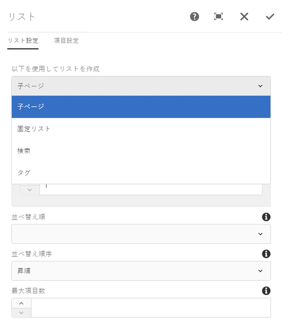
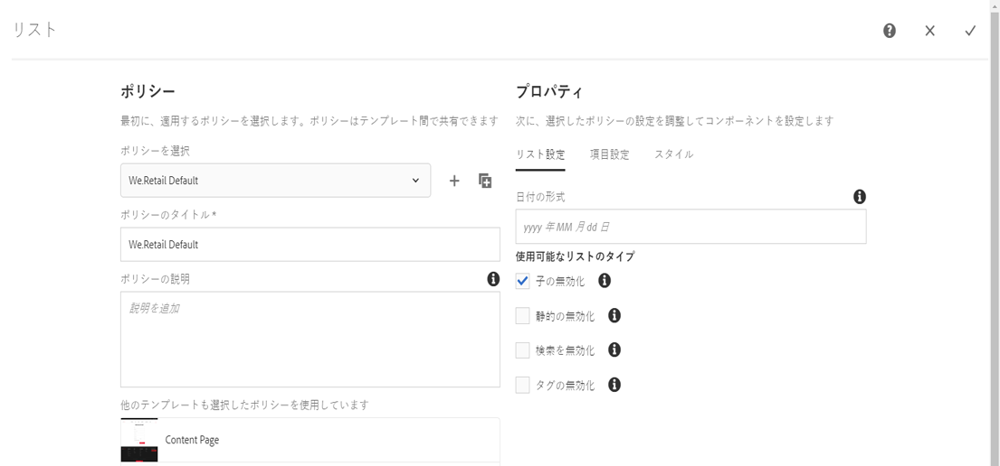
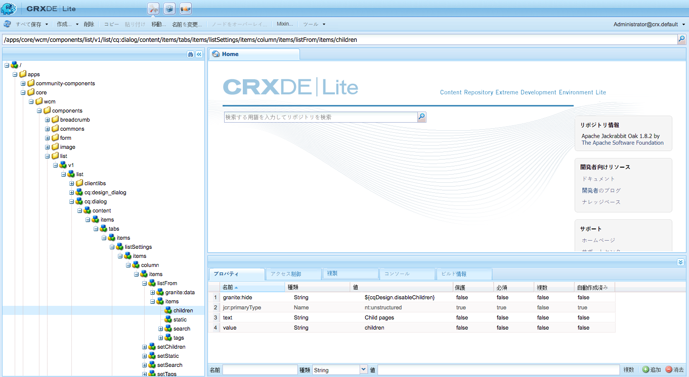
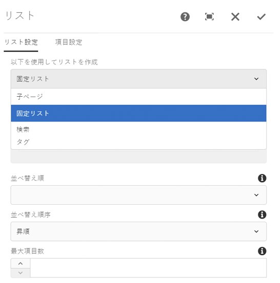

# 非表示条件の使用{#using-hide-conditions}

>[!CAUTION]
>
>AEM 6.4 の拡張サポートは終了し、このドキュメントは更新されなくなりました。 詳細は、 [技術サポート期間](https://helpx.adobe.com/jp/support/programs/eol-matrix.html). サポートされているバージョンを見つける [ここ](https://experienceleague.adobe.com/docs/?lang=ja).

非表示条件を使用して、コンポーネントリソースがレンダリングされるかどうかを判断できます。 例えば、テンプレート作成者がコアコンポーネントを設定する際に、このような状況が発生します [リストコンポーネント](https://helpx.adobe.com/jp/experience-manager/core-components/using/list.html) 内 [テンプレートエディター](/help/sites-authoring/templates.md) とは、子ページに基づいてリストを作成するためのオプションを無効にすることを決定します。 デザインダイアログでこのオプションを無効にすると、リストコンポーネントのレンダリング時に非表示の条件が評価され、子ページを表示するオプションが表示されないようにプロパティが設定されます。

## 概要 {#overview}

多数のオプションを使用するユーザーは、自分が自由に使用できるオプションのごく一部しか使用しないので、ダイアログは非常に複雑になる場合があります。 これにより、ユーザーのユーザーインターフェイスエクスペリエンスが圧倒的に高まる可能性があります。

非表示条件を使用すると、管理者、開発者およびスーパーユーザーは、一連のルールに基づいてリソースを非表示にできます。 この機能を使用すると、作成者がコンテンツを編集したときに表示するリソースを決定できます。

>[!NOTE]
>
>式に基づいてリソースを非表示にしても、ACL 権限は置き換えられません。 コンテンツは編集可能なままですが、表示されません。

## 実装と使用の詳細 {#implementation-and-usage-details}

`com.adobe.granite.ui.components.FilteringResourceWrapper` は、フィルタリング対象のフィールドの `granite:hide` プロパティの有無と値に基づいてリソースをフィルタリングします。`/libs/cq/gui/components/authoring/dialog/dialog.jsp` の実装には、`FilteringResourceWrapper.` のインスタンスが含まれます。

この実装では、Granite [ELResolver API](https://helpx.adobe.com/jp/experience-manager/6-4/sites/developing/using/reference-materials/granite-ui/api/jcr_root/libs/granite/ui/docs/server/el.html) を利用し、ExpressionCustomizer を介して `cqDesign` カスタム変数を追加します。

以下に、`etc/design` 内かコンテンツポリシーとして配置されているデザインノードの非表示の条件の例をいくつか示します。

```
${cqDesign.myProperty}
${!cqDesign.myProperty}
${cqDesign.myProperty == 'someText'}
${cqDesign.myProperty != 'someText'}
${cqDesign.myProperty == true}
${cqDesign.myProperty == true}
${cqDesign.property1 == 'someText' && cqDesign.property2 || cqDesign.property3 != 1 || header.myHeader}
```

非表示式を定義する際は、以下の点に留意してください。

* 式を有効にするには、プロパティの検索範囲を表します（例：`cqDesign.myProperty`）。
* 値は読み取り専用です。
* 関数（必要に応じて）は、サービスが提供する特定のセットに限定する必要があります。

## 例 {#example}

非表示の条件の例は、AEM 全体（特に、[コアコンポーネント](https://experienceleague.adobe.com/docs/experience-manager-core-components/using/introduction.html?lang=ja)）で確認できます。例えば、 [リストコアコンポーネント](https://helpx.adobe.com/jp/experience-manager/core-components/using/list.html).

[テンプレートエディターを使用](/help/sites-authoring/templates.md)した場合、テンプレート作成者は、ページ作成者が利用できるリストコンポーネントのオプションをデザインダイアログで定義できます。リストを静的リスト、子ページのリスト、タグ付きページのリストなどにするかどうかを指定するオプション。 は、有効または無効にすることができます。

テンプレート作成者が子ページオプションを無効にする場合、デザインプロパティが設定され、非表示の条件がそれに対して評価されるので、ページ作成者に対してオプションがレンダリングされません。

1. デフォルトでは、ページ作成者は、リストコアコンポーネントを使用し、「 」オプションを選択することで、子ページを使用したリストを作成できます **子ページ**.

   

1. テンプレート作成者は、リストコアコンポーネントのデザインダイアログでオプション「**子の無効化**」を選択して、子ページに基づいたリストを生成するオプションがページ作成者に対して表示されないようにできます。

   

1. `/conf/we-retail/settings/wcm/policies/weretail/components/content/list` の下にポリシーノードが作成され、`disableChildren` プロパティが `true` に設定されます。
1. 非表示条件は、ダイアログのプロパティノード `/conf/we-retail/settings/wcm/policies/weretail/components/content/list` の `granite:hide` プロパティの値として定義されます。

   

1. `disableChildren` の値がデザイン設定から取得され、式 `${cqDesign.disableChildren}` が `false` と評価されます。つまり、そのオプションはコンポーネントの一部としてレンダリングされません。

   `granite:hide` プロパティの値として非表示式を使用している例は、[GitHub のこちらのページ](https://github.com/Adobe-Marketing-Cloud/aem-core-wcm-components/blob/master/content/src/content/jcr_root/apps/core/wcm/components/list/v1/list/_cq_dialog/.content.xml#L40)で確認できます。

1. ページ作成者がリストコンポーネントを使用するときに、オプション「**子ページ**」が表示されなくなりました。

   
