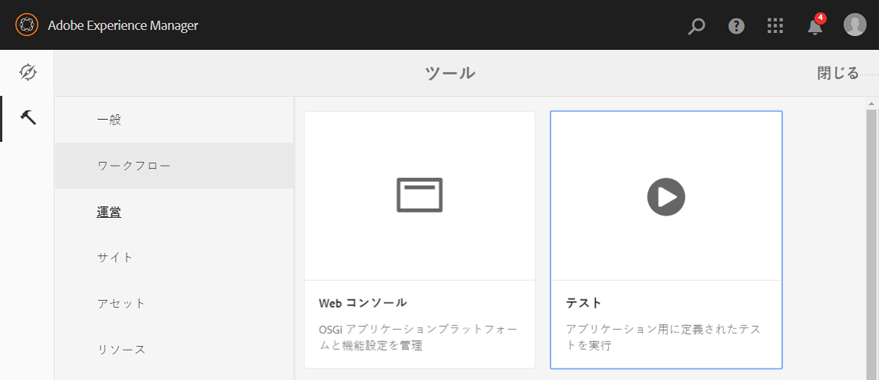
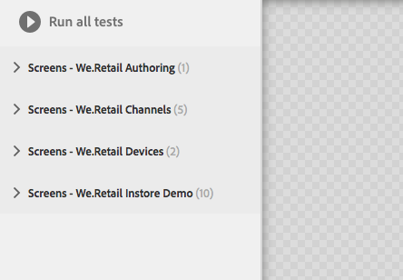
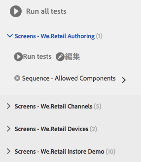
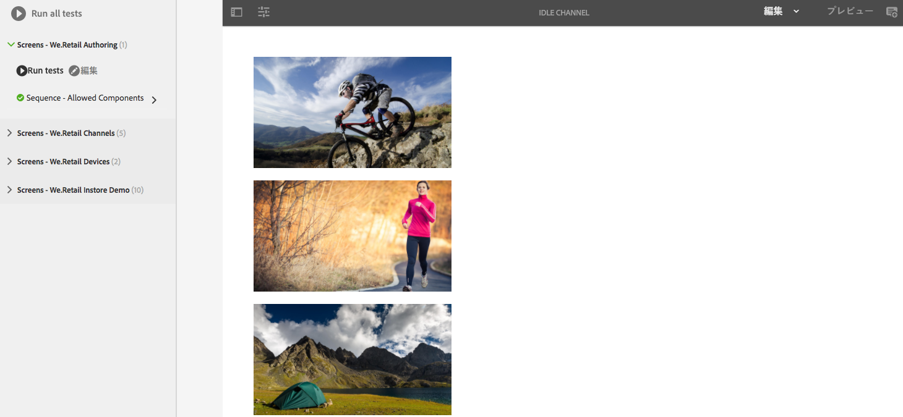
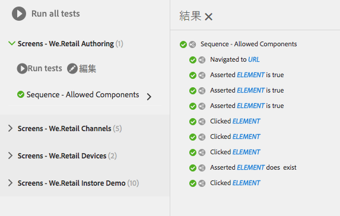
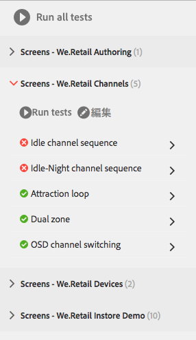
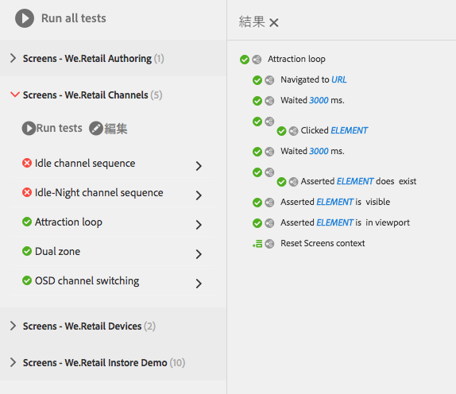

# UI のテスト{#testing-your-ui}

>[!CAUTION]
>
>AEM 6.4 の拡張サポートは終了し、このドキュメントは更新されなくなりました。 詳細は、 [技術サポート期間](https://helpx.adobe.com/jp/support/programs/eol-matrix.html). サポートされているバージョンを見つける [ここ](https://experienceleague.adobe.com/docs/?lang=ja).

AEMは、AEM UI のテストを自動化するためのフレームワークを提供します。 このフレームワークを使用して、Web ブラウザーで直接 UI テストを記述して実行します。このフレームワークには、テストを作成するための JavaScript API が用意されています。

AEM テストフレームワークでは、Javascript で記述されたテスト用ライブラリ Hobbes.js を使用します。Hobbes.js フレームワークは、開発プロセスの一環として AEM のテスト用に開発されたものです。このフレームワークは現在、独自の AEM アプリケーションのテスト用に一般に利用できます。

>[!NOTE]
>
>この API について詳しくは、Hobbes.js の[ドキュメント](https://helpx.adobe.com/experience-manager/6-4/sites/developing/using/reference-materials/test-api/index.html)を参照してください。

## テストの構造 {#structure-of-tests}

AEM内で自動テストを使用する場合、次の用語を理解することが重要です。

|  |  |
|---|---|
| 動作 | **アクション**&#x200B;は、リンクやボタンのクリックなど、web ページ上の特定のアクティビティです。 |
| テストケース | **テストケース**&#x200B;は、1 つ以上の&#x200B;**アクション**&#x200B;で構成できる特定の状況です。 |
| テストスイート | **テストスイート**&#x200B;は、関連する&#x200B;**テストケース**&#x200B;を組み合わせて、特定のユースケースをテストします。 |

## テストの実行 {#executing-tests}

### テストスイートの表示 {#viewing-test-suites}

テストコンソールを開いて、登録されているテストスイートを確認します。 テストパネルには、テストスイートとそのテストケースのリストが表示されます。

からツールコンソールに移動します。 **グローバルナビゲーション/ツール/操作/テスト**.



コンソールを開くと、テストスイートが左側に表示され、すべてを順番に実行するオプションも表示されます。 右側のスペースには、背景がチェックマーク付きで表示され、テストの実行時にページのコンテンツを表示するためのプレースホルダーです。



### 単一のテストスイートの実行 {#running-a-single-test-suite}

テストスイートは個別に実行できます。 テストスイートを実行すると、テストケースとそのアクションが実行され、テストの完了後に結果が表示されるにつれ、ページは変化します。 アイコンは結果を示します。

チェックマークアイコンは、合格したテストを示します。


「X」アイコンは、失敗したテストを示します。


テストスイートを実行するには：

1. テストパネルで、実行するテストケースの名前をクリックまたはタップして、アクションの詳細を展開します。

   

1. クリックまたはタップ **テストを実行** 」ボタンをクリックします。

   

1. テストが実行されると、プレースホルダーはページコンテンツに置き換えられます。

   

1. 説明をタップまたはクリックしてテストケースの結果を確認し、 **結果** パネル。 「 **結果** パネルには、すべての詳細が表示されます。

   

### 複数のテストの実行 {#running-multiple-tests}

テストスイートは、コンソールに表示される順序で順番に実行されます。 テストの詳細を調べて、結果を確認できます。



1. テストパネルで、実行するテストスイートのタイトルの下にある「**Run all tests**」ボタンまたは「**Run tests**」ボタンをタップまたはクリックします。

   

1. 各テストケースの結果を表示するには、そのテストケースのタイトルをタップまたはクリックします。**結果**&#x200B;パネルでテストの名前をタップまたはクリックすると、すべての詳細が表示されます。

   

## シンプルなテストスイートの作成と使用 {#creating-and-using-a-simple-test-suite}

次の手順は、[We.Retail のコンテンツ](/help/sites-developing/we-retail.md)を使用したテストスイートの作成と実行の方法を説明するものですが、別の web ページを使用するよう簡単にテストを変更できます。

独自のテストスイートの作成について詳しくは、[Hobbes.js API のドキュメント](https://helpx.adobe.com/experience-manager/6-4/sites/developing/using/reference-materials/test-api/index.html)を参照してください。

1. CRXDE Lite を開きます。([http://localhost:4502/crx/de](http://localhost:4502/crx/de))
1. `/etc/clientlibs` フォルダーを右クリックして、**作成／フォルダーを作成**&#x200B;をクリックしてください。名前に`myTests`と入力して、「**OK**」をクリックします。
1. `/etc/clientlibs/myTests` フォルダーを右クリックし、**作成／ノードを作成**&#x200B;をクリックしてください。以下のプロパティ値を使用して「**OK**」をクリックします。

   * 名前：`myFirstTest`
   * 型：`cq:ClientLibraryFolder`

1. myFirstTest ノードに次のプロパティを追加します。

   | 名前 | タイプ | 値 |
   |---|---|---|
   | `categories` | `String[]` | `granite.testing.hobbes.tests` |
   | `dependencies` | `String[]` | `granite.testing.hobbes.testrunner` |

   >[!NOTE]
   >
   >**AEM Formsのみ**
   >
   >アダプティブフォームをテストするには、カテゴリと依存関係に次の値を追加します。 次に例を示します。
   >
   >**categories**：`granite.testing.hobbes.tests, granite.testing.hobbes.af.commons`
   >
   >**dependencies**：`granite.testing.hobbes.testrunner, granite.testing.hobbes.af`

1. 「**すべて保存**」をクリックします。
1. `myFirstTest` ノードを右クリックして、**作成／ファイルを作成**&#x200B;をクリックします。ファイル名に`js.txt`と入力して、「**OK**」をクリックします。
1. `js.txt` ファイルに次のテキストを入力します。

   ```
   #base=.
   myTestSuite.js
   ```

1. 「**すべて保存**」をクリックして、`js.txt` ファイルを閉じます。
1. `myFirstTest` ノードを右クリックして、**作成／ファイルを作成**&#x200B;をクリックします。ファイル名に`myTestSuite.js`と入力して、「**OK**」をクリックします。
1. `myTestSuite.js` ファイルに次のコードをコピーして、ファイルを保存します。

   ```
   new hobs.TestSuite("Experience Content Test Suite", {path:"/etc/clientlibs/myTests/myFirstTest/myTestSuite.js"})
      .addTestCase(new hobs.TestCase("Navigate to Experience Content")
         .navigateTo("/content/we-retail/us/en/experience/arctic-surfing-in-lofoten.html")
      )
      .addTestCase(new hobs.TestCase("Hover Over Topnav")
         .mouseover("li.visible-xs")
      )
      .addTestCase(new hobs.TestCase("Click Topnav Link")
         .click("li.active a")
   );
   ```

1. **テスト**&#x200B;コンソールに移動して、テストスイートを実行します。
