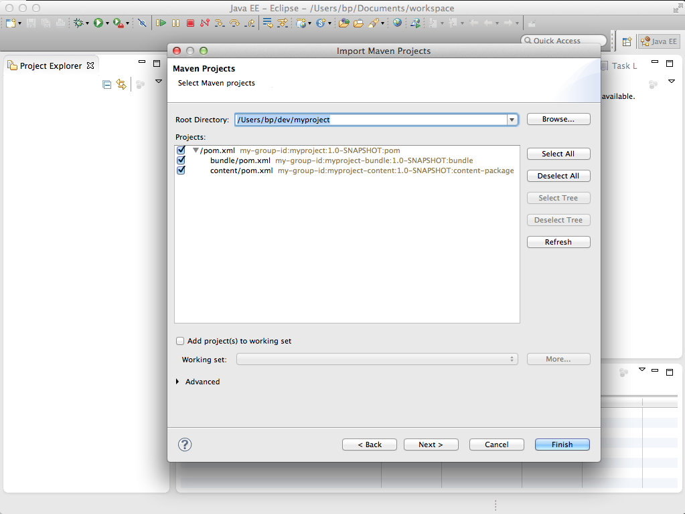

# Eclipse を使用して AEM プロジェクトを開発する方法{#how-to-develop-aem-projects-using-eclipse}

>[!CAUTION]
>
>AEM 6.4 の拡張サポートは終了し、このドキュメントは更新されなくなりました。 詳細は、 [技術サポート期間](https://helpx.adobe.com/jp/support/programs/eol-matrix.html). サポートされているバージョンを見つける [ここ](https://experienceleague.adobe.com/docs/?lang=ja).

このガイドでは、AEMベースのプロジェクトを開発するために Eclipse を使用する方法について説明します。

>[!NOTE]
>
>アドビでは、Eclipse による AEM ソリューションの開発を支援する [AEM Developer Tools for Eclipse](/help/sites-developing/aem-eclipse.md) を提供しています。

## 概要 {#overview}

Eclipse でのAEM開発を開始するには、次の手順が必要です。

それぞれについては、このハウツーの残りの部分で詳しく説明します。

* Eclipse 4.3(Kepler) のインストール
* Maven に基づいてAEMプロジェクトをセットアップする
* Maven POM での Eclipse 用の JSP サポートの準備
* Maven プロジェクトを Eclipse に読み込む

>[!NOTE]
>
>このガイドは、Eclipse 4.3(Kepler) とAEM 5.6.1 をベースとしています。

## Eclipse のインストール {#install-eclipse}

[Eclipse のダウンロードページ](https://www.eclipse.org/downloads/) から「Eclipse IDE for Java EE Developers」をダウンロードします。

次の手順に従って Eclipse をインストールします。 [インストール手順](https://wiki.eclipse.org/Eclipse/Installation).

## Maven に基づいてAEMプロジェクトをセットアップする {#set-up-your-aem-project-based-on-maven}

次に、[AEM プロジェクトをビルドする方法](/help/sites-developing/ht-projects-maven.md)に記載されている手順に従って、Maven を使用してプロジェクトを設定します。

## Eclipse 用の JSP サポートの準備 {#prepare-jsp-support-for-eclipse}

Eclipse は、JSP での作業でもサポートを提供できます。例えば、

* タグライブラリの自動補完
* Eclipse によって定義されたオブジェクトの認識 &lt;cq:defineobjects /> および &lt;sling:defineobjects />

これが機能するための条件：

1. [Apache Maven を使用して AEM プロジェクトを作成する方法](/help/sites-developing/ht-projects-maven.md)の [JSP を使用する方法](/help/sites-developing/ht-projects-maven.md#how-to-work-with-jsps)に記載されている説明に従います。
1. 以下を &lt;build /> 」セクションを使用して、コンテンツモジュールの POM にアクセスできます。

   Eclipse の Maven サポートプラグインである m2e は maven-jspc-plugin をサポートしていません。この設定は、m2e に対し、プラグインと、一時的なコンパイル結果をクリーンアップする関連タスクを無視するように指示します。

   このことは問題ではありません。[JSP を使用する方法](/help/sites-developing/ht-projects-maven.md#how-to-work-with-jsps)で説明されているように、この設定における maven-jspc-plugin は、作成プロセスの一環として JSP コンパイルの検証にのみ使用されます。Eclipse は JSP における問題を既にレポート済みであり、レポート用にこの Maven プラグインを使用することはありません。

   **myproject/content/pom.xml**

   ```xml
   <build>
     <!-- ... -->
     <pluginManagement>
       <plugins>
         <!--This plugin's configuration is used to store Eclipse m2e settings only. It has no influence on the Maven build itself.-->
         <plugin>
           <groupId>org.eclipse.m2e</groupId>
           <artifactId>lifecycle-mapping</artifactId>
           <version>1.0.0</version>
           <configuration>
             <lifecycleMappingMetadata>
               <pluginExecutions>
                 <pluginExecution>
                   <pluginExecutionFilter>
                     <groupId>org.apache.sling</groupId>
                     <artifactId>maven-jspc-plugin</artifactId>
                     <versionRange>[2.0.6,)</versionRange>
                     <goals>
                       <goal>jspc</goal>
                     </goals>
                   </pluginExecutionFilter>
                   <action>
                     <ignore/>
                   </action>
                 </pluginExecution>
                 <pluginExecution>
                   <pluginExecutionFilter>
                     <groupId>org.apache.maven.plugins</groupId>
                     <artifactId>maven-clean-plugin</artifactId>
                     <versionRange>[2.4.1,)</versionRange>
                     <goals>
                       <goal>clean</goal>
                     </goals>
                   </pluginExecutionFilter>
                   <action>
                     <ignore/>
                   </action>
                 </pluginExecution>
               </pluginExecutions>
             </lifecycleMappingMetadata>
           </configuration>
         </plugin>
       </plugins>
     </pluginManagement>
   </build>
   ```

### Maven プロジェクトを Eclipse に読み込む {#import-the-maven-project-into-eclipse}

1. Eclipse で、ファイル/読み込みを選択します。
1. 読み込みダイアログで、 Maven /既存の Maven プロジェクトを選択し、「次へ」をクリックします。

   

1. プロジェクトの最上位のフォルダーのパスを入力し、「すべてを選択」、「終了」の順にクリックします。

   

1. これで、Eclipse を使用して AEM プロジェクトを開発するための設定（JSP のオートコンプリートを含む）がすべて完了しました。

   

   >[!NOTE]
   >
   >`/libs/foundation/global.jsp` または内の他の JSP`/libs` を含める場合は、これらをプロジェクトにコピーして、Eclipse が包含を解決できるようにする必要があります。同時に、Maven によってコンテンツパッケージにバンドルされていないことを確認する必要があります。これをおこなう方法については、[Apache Maven を使用して AEM プロジェクトを作成する方法](/help/sites-developing/ht-projects-maven.md)で説明されています。
