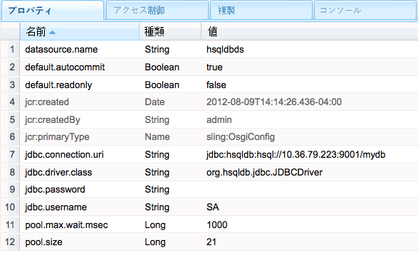

# SQL データベースへの接続{#connecting-to-sql-databases}

次の手順で外部 SQL データベースにアクセスして、CQ アプリケーションがデータを操作できるようにします。

1. [JDBC ドライバーパッケージを書き出す OSGi バンドルを作成または取得します](#bundling-the-jdbc-database-driver)。
1. [JDBC データソースプールプロバイダーを設定します](#configuring-the-jdbc-connection-pool-service)。
1. [データソースオブジェクトを取得し、コード内で接続を作成します](#connecting-to-the-database)。

## JDBC データベースドライバーのバンドル {#bundling-the-jdbc-database-driver}

一部のデータベースベンダーは、OSGi バンドルで JDBC ドライバーを提供しています（例： ）。 [MySQL](https://www.mysql.com/downloads/connector/j/).データベースの JDBC ドライバーが OSGi バンドルとして使用できない場合は、ドライバー JAR を取得し、OSGi バンドルに含めます。バンドルは、データベースサーバーとの対話に必要なパッケージを書き出す必要があります。また、バンドルは、参照するパッケージもインポートする必要があります。

次の例では、[Bundle plugin for Maven](https://felix.apache.org/site/apache-felix-maven-bundle-plugin-bnd.html) を使用して、HSQLDB ドライバーを OSGi バンドル内にラップします。POM では、このプラグインに対して、hsqldb.jar ファイルを埋め込み、そのファイルを依存関係として識別するように指示します。すべての org.hsqldb パッケージがエクスポートされます。

このプラグインは、インポートすべきパッケージを自動的に決定し、それらをバンドルの MANIFEST.MF ファイルに記載します。CQ サーバー上に存在しないパッケージがある場合、バンドルのインストールは開始されません。この問題に対して、次の 2 つの解決策が考えられます。

* POM で、パッケージがオプションであることを示します。この解決策は、JDBC 接続で実際にはそのパッケージのメンバーが不要である場合に使用します。オプションのパッケージを示すには、次の例のように Import-Package 要素を使用します。

   `<Import-Package>org.jboss.*;resolution:=optional,*</Import-Package>`
* パッケージを含む JAR ファイルを、そのパッケージをエクスポートしている OSGi バンドル内にラップして、そのバンドルをデプロイします。この解決策は、コード実行中にパッケージのメンバーが必要になる場合に使用します。

ソースコードを知ることで、どちらの解決策を使用すべきかを判断できます。また、いずれかの解決策を試してテストを実行し、解決策の妥当性を検証することもできます。

### hsqldb.jar をバンドルする POM {#pom-that-bundles-hsqldb-jar}

```xml
<project xmlns="https://maven.apache.org/POM/4.0.0" 
  xmlns:xsi="https://www.w3.org/2001/XMLSchema-instance" 
  xsi:schemaLocation="https://maven.apache.org/POM/4.0.0 https://maven.apache.org/xsd/maven-4.0.0.xsd">
  <modelVersion>4.0.0</modelVersion>
  
  <groupId>com.adobe.example.myapp</groupId>
  <artifactId>hsqldb-jdbc-driver-bundle</artifactId>
  <version>0.0.1-SNAPSHOT</version>
  <name>wrapper-bundle-hsqldb-driver</name>
  <url>www.adobe.com</url>
  <description>Exports the HSQL JDBC driver</description>
  <packaging>bundle</packaging>
  <properties>
    <project.build.sourceEncoding>UTF-8</project.build.sourceEncoding>
  </properties>
  <build>
    <plugins>
      <plugin>
        <groupId>org.apache.felix</groupId> 
        <artifactId>maven-bundle-plugin</artifactId>
        <version>1.4.3</version> 
        <extensions>true</extensions> 
        <configuration> 
         <instructions> 
            <Embed-Dependency>*</Embed-Dependency>
            <_exportcontents>org.hsqldb.*</_exportcontents>
          </instructions>
        </configuration> 
      </plugin>
    </plugins>
  </build>
  <dependencies>
    <dependency>
      <groupId>hsqldb</groupId>
      <artifactId>hsqldb</artifactId>
      <version>2.2.9</version>
    </dependency>
  </dependencies>
</project>
```

次のリンクより、一般的なデータベース製品のダウンロードページを開くことができます。

* [Microsoft SQL Server](https://www.microsoft.com/en-us/download/details.aspx?displaylang=en&amp;id=11774)
* [Oracle](https://www.oracle.com/technetwork/database/features/jdbc/index-091264.html)
* [IBM DB2](https://www-01.ibm.com/support/docview.wss?uid=swg27007053)

### JDBC Connection Pool サービスの設定 {#configuring-the-jdbc-connection-pool-service}

JDBC ドライバを使用してデータソースオブジェクトを作成する JDBC Connections Pool サービスの設定を追加します。アプリケーションコードは、このサービスを使用してオブジェクトを取得し、データベースに接続します。

JDBC Connections Pool（`com.day.commons.datasource.jdbcpool.JdbcPoolService`）はファクトリサービスです。異なるプロパティ（読み取り専用アクセスと読み取り／書き込みアクセスなど）を使用する接続が必要な場合は、複数の設定を作成します。

CQ と連携する場合は、いくつかの方法でサービスの設定を管理できます。[OSGi の設定](/help/sites-deploying/configuring-osgi.md)を参照してください。

プール化された接続サービスを設定するには、次のプロパティを使用できます。プロパティ名は、Web コンソールに表示されるとおりに示しています。`sling:OsgiConfig` ノードに対応する名前を括弧内に示しています。値の例は、エイリアスが `mydb` である HSQLDB サーバーおよびデータベースのものを示しています。

* JDBC ドライバークラス ( `jdbc.driver.class`):java.sql.Driver インターフェイスを実装するために使用する Java クラス。例： `org.hsqldb.jdbc.JDBCDriver`. データタイプは `String`.

* JDBC 接続 URI ( `jdbc.connection.uri`):接続の作成に使用するデータベースの URL。例： `jdbc:hsqldb:hsql//10.36.79.223:9001/mydb`. URL の形式は、java.sql.DriverManager クラスの getConnection メソッドで使用する場合に有効である必要があります。 データタイプは `String`.

* ユーザー名 ( `jdbc.username`):データベースサーバーでの認証に使用するユーザー名。 データタイプは `String`.

* パスワード ( `jdbc.password`):ユーザーの認証に使用するパスワード。 データタイプは `String`.

* 検証クエリ ( `jdbc.validation.query`):接続が成功したことを検証するために使用する SQL 文。例： `select 1 from INFORMATION_SCHEMA.SYSTEM_USERS`. データタイプは `String`.

* Readonly By Default（default.readonly）： この接続を読み取り専用アクセスにする場合に、このオプションを選択します。データタイプは `Boolean` です。
* デフォルトで自動コミット ( `default.autocommit`):データベースに送信される SQL コマンドごとに個別のトランザクションを作成し、各トランザクションを自動的にコミットする場合は、このオプションを選択します。 コード内でトランザクションを明示的にコミットする場合は、このオプションを選択しないでください。 データタイプは `Boolean`.

* プールサイズ ( `pool.size`):データベースに対して使用可能にする同時接続の数。 データタイプは `Long`.

* プールの待機 ( `pool.max.wait.msec`):接続リクエストがタイムアウトするまでの時間。 データタイプは `Long`.

* データソース名 ( `datasource.name`):このデータソースの名前。 データタイプは `String`.

* 追加のサービスプロパティ ( `datasource.svc.properties`):接続 URL に追加する名前と値のペアのセット。 データタイプは `String[]`.

JDBC Connections Pool サービスはファクトリです。 したがって、 `sling:OsgiConfig` 接続サービスを設定するノードの場合、ノードの名前にはファクトリサービス PID を含め、その後に *`-alias`*. 使用するエイリアスは、その PID のすべての設定ノードで一意である必要があります。 ノード名の例は次のとおりです。 `com.day.commons.datasource.jdbcpool.JdbcPoolService-myhsqldbpool`.



### データベースへの接続 {#connecting-to-the-database}

Java コードでは、DataSourcePool サービスを使用して、作成した設定に対応する `javax.sql.DataSource` オブジェクトを取得する必要があります。DataSourcePool サービスには `getDataSource` メソッドがあり、このメソッドは指定したデータソース名の `DataSource` オブジェクトを返します。メソッド引数として、JDBC Connections Pool 設定で指定した Datasource Name（または `datasource.name`）プロパティの値を使用します。

次の JSP コード例では、hsqldbds データソースのインスタンスを取得し、単純な SQL クエリを実行し、返された結果の個数を表示します。

#### データベースのルックアップを実行する JSP {#jsp-that-performs-a-database-lookup}

```java
<%@include file="/libs/foundation/global.jsp"%><%
%><%@page session="false"%><%
%><%@ page import="com.day.commons.datasource.poolservice.DataSourcePool" %><%
%><%@ page import="javax.sql.DataSource" %><%
%><%@ page import="java.sql.Connection" %><%
%><%@ page import="java.sql.SQLException" %><%
%><%@ page import="java.sql.Statement" %><%
%><%@ page import="java.sql.ResultSet"%><%
%><html>
<cq:include script="head.jsp"/>
<body>
<%DataSourcePool dspService = sling.getService(DataSourcePool.class);
  try {
     DataSource ds = (DataSource) dspService.getDataSource("hsqldbds"); 
     if(ds != null) {
         %><p>Obtained the datasource!</p><%
         %><%final Connection connection = ds.getConnection();
          final Statement statement = connection.createStatement();
          final ResultSet resultSet = statement.executeQuery("SELECT * from INFORMATION_SCHEMA.SYSTEM_USERS"); 
          int r=0;
          while(resultSet.next()){
             r=r+1;
          } 
          resultSet.close();
          %><p>Number of results: <%=r%></p><%
      } 
   }catch (Exception e) {
        %><p>error! <%=e.getMessage()%></p><%
    } 
%></body>
</html>
```

>[!NOTE]
>
>getDataSource メソッドが、データソースが見つからないことによる例外をスローした場合は、Connections Pool サービスが正しく設定されているかを確認してください。プロパティ名、値およびデータタイプを確認してください。

>[!NOTE]
>
>DataSourcePool を OSGi バンドルにインジェクションする方法については、[Adobe Experience Manager OSGi バンドルへの DataSourcePool サービスのインジェクション](https://helpx.adobe.com/experience-manager/using/datasourcepool.html)を参照してください。
