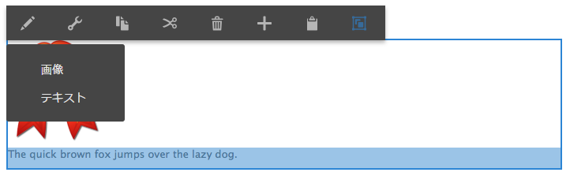

# 複数のインプレースエディターの設定 {#configure-multiple-in-place-editors}

Adobe Experience Managerでリッチテキストエディターを設定し、複数のインプレースエディターを使用できます。 このような設定にすると、適切なコンテンツを選択して、適切なエディターを開くことができます。



## 複数のエディターの設定 {#configure-multiple-editors}

複数のインプレースエディターを有効にするには、`cq:InplaceEditingConfig` ノードタイプの構造を `cq:ChildEditorConfig` ノードタイプの定義で強化します。

次に例を示します。

```js
   /**
       * Configures in-place editing of a component.
       *
       * @prop active true to activate in-place editing for the component.
       * @prop editorType ID of in-place editor to use.
       * @prop cq:childEditors collection of {@link cq:ChildEditorConfig} nodes.
       * @prop configPath path to editor's config (optional).
       * @node config editor's config (used if no configPath is specified; optional).
     */
    [cq:InplaceEditingConfig] > nt:unstructured
      - active (boolean)
      - editorType (string)
      + cq:childEditors (nt:base) = nt:unstructured
      - configPath (string)
      + config (nt:unstructured) = nt:unstructured

    /**
      * Configures one child editor for a sub-component. The name of the this node is
      * used as DD ID.
      *
      * @prop type type of the inline editor. For example, ["image"].
      * @prop title Title of the inline editor.
      * @prop icon Icon to represent the inline editor.
    */
    [cq:ChildEditorConfig] > nt:unstructured
      orderable
      - type (string)
      - title (string)
```

複数のエディターを設定するには、次の手順に従います。

1. ノード上 `cq:inplaceEditing` ( タイプの `cq:InplaceEditingConfig`) で次のプロパティを定義します。

   * 名前:`editorType`
   * 型：`String`
   * 値：`hybrid`

1. このノードの下に、次のノードを作成します。

   * 名前：`cq:ChildEditors`
   * 型：`nt:unstructured`

1. の下 `cq:childEditors` ノードに設定し、各インプレースエディター用のノードを作成します。

   * 名前：各ノードの名前は、ドロップターゲットの場合と同様に、そのノードが表すプロパティの名前です。 例えば、`image` と `text` です。
   * 型：`cq:ChildEditorConfig`

   >[!NOTE]
   >
   >定義されたドロップターゲットと子エディターの間には相関関係があります。の名前 `cq:ChildEditorConfig` ノードはドロップターゲット ID と見なされ、選択した子エディターのパラメーターとして使用されます。 編集可能サブ領域にドロップターゲットがない場合（例えば、テキストコンポーネント内など）、子エディターの名前は、対応する編集可能領域を識別する ID と見なされます。

1. これらの各ノード (`cq:ChildEditorConfig`) プロパティを定義します。

   * 名前: `type`.
   * 値：登録済みのインプレースエディターの名前。例： `image` および `text`.

   * 名前: `title`.
   * 値：使用可能なエディターのコンポーネント選択リストに表示されるタイトル。 例えば、`Image` と `Text` です。

### リッチテキストエディターの追加設定 {#additional-configuration-for-rich-text-editors}

複数のリッチテキストエディター（RTE）の設定は、個々の RTE インスタンスをそれぞれ別個に設定できるので、やや異なります。詳しくは、 [リッチテキストエディターの設定](/help/sites-administering/rich-text-editor.md). 複数の RTE を設定するには、各インプレース RTE に対して設定を作成します。 Adobeは、以下に新しい設定ノードを作成することをお勧めします。 `cq:InplaceEditingConfig` は、個々の RTE ごとに異なる設定を持つことができるからです。 新しいノードの下に、個々の RTE 設定を作成します。

```xml
    texttext
        cq:dialog
        cq:editConfig
            cq:inplaceEditing
                cq:childEditors
                    someconfig
                        text1
                            rtePlugins
                        text2
                            rtePlugins
```

>[!NOTE]
>
>ただし、RTE の場合、`configPath` プロパティがサポートされるのは、コンポーネント内のテキストエディター（編集可能なサブエリア）のインスタンスが 1 つだけのときです。この `configPath` は、コンポーネントの古いユーザーインターフェイスダイアログとの下位互換性をサポートするために提供されています。

>[!CAUTION]
>
>RTE 設定ノードの名前を `config` にしないでください。この名前にすると、RTE 設定が管理者に対してのみ使用可能になり、グループのユーザーに対しては使用できなくなります `content-author`.

## コードサンプル {#code-samples}

このページのコードは、 [GitHub の aem-authoring-hybrideditors プロジェクト](https://github.com/Adobe-Marketing-Cloud/aem-authoring-hybrideditors). 完全なプロジェクトは、 [ZIP アーカイブ](https://github.com/Adobe-Marketing-Cloud/aem-authoring-hybrideditors/archive/master.zip).

## インプレースエディターの追加 {#add-an-in-place-editor}

インプレースエディターの追加に関する一般的な情報については、ドキュメントを参照してください [ページオーサリングのカスタマイズ](/help/sites-developing/customizing-page-authoring-touch.md#add-new-in-place-editor).

>[!MORELIKETHIS]
>
>* [Experience Managerでのリッチテキストエディターの設定](/help/sites-administering/rich-text-editor.md).

