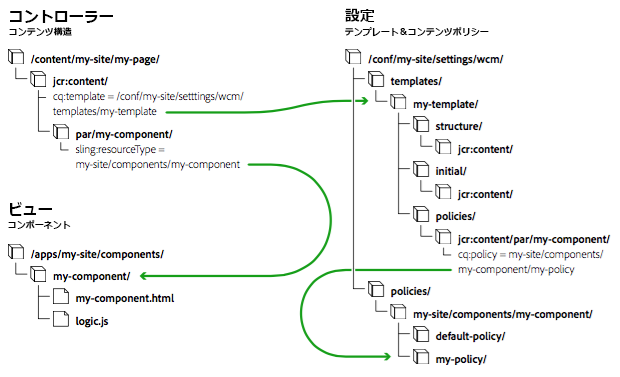

# ページテンプレート - 編集可能 {#page-templates-editable}

>[!CAUTION]
>
>AEM 6.4 の拡張サポートは終了し、このドキュメントは更新されなくなりました。 詳細は、 [技術サポート期間](https://helpx.adobe.com/jp/support/programs/eol-matrix.html). サポートされているバージョンを見つける [ここ](https://experienceleague.adobe.com/docs/?lang=ja).

編集可能テンプレートは、次の用途に導入されました。

* 専門的な作成者が [テンプレートの作成と編集](/help/sites-authoring/templates.md).

   * このような専門的な作成者は、**テンプレート作成者**&#x200B;と呼ばれます。
   * テンプレート作成者は、`template-authors` グループのメンバーである必要があります。

* テンプレートから作成されたすべてのページとの動的な接続を保持するテンプレートを提供します。 これにより、テンプレートに対するあらゆる変更がページに反映されます。
* ページコンポーネントの汎用性を高め、コアページコンポーネントをカスタマイズなしで使用できるようにします。

編集可能なテンプレートを使用すると、ページを構成する要素がコンポーネント内で分離されます。 UI で必要なコンポーネントの組み合わせを設定できるので、ページのバリエーションごとに新しいページコンポーネントを開発する必要はなくなります。

>[!NOTE]
>
>編集可能テンプレートをと共に使用するには、AEM 6.4.5.0 以降が必要です [SPA Editor](/help/sites-developing/spa-overview.md).

>[!NOTE]
>
>[静的テンプレート](/help/sites-developing/page-templates-static.md) は、も使用できます。

このドキュメントでは、

* 編集可能なテンプレートの作成の概要を説明します。

   * 詳しくは、[ページテンプレートの作成](/help/sites-authoring/templates.md)を参照してください。

* 編集可能なテンプレートの作成に必要な管理者/開発者のタスクについて説明します
* 編集可能なテンプレートの技術的基礎について説明します

このドキュメントでは、テンプレートの作成と編集について既に理解していることを前提としています。オーサリングに関するドキュメント[ページテンプレートの作成](/help/sites-authoring/templates.md)を参照してください。ここでは、テンプレート作成者に公開されている編集可能テンプレートの機能について詳しく説明されています。

>[!NOTE]
>
>次のチュートリアルは、新しいプロジェクトで編集可能なページテンプレートを設定する場合にも役立つ場合があります。\
>[AEM Sites の概要（パート 2）- ベースページとテンプレートの作成](https://experienceleague.adobe.com/docs/experience-manager-learn/getting-started-wknd-tutorial-develop/project-archetype/pages-templates.html?lang=ja)

## 新しいテンプレートの作成 {#creating-a-new-template}

編集可能なテンプレートの作成は、主に [テンプレートコンソールとテンプレートエディター](/help/sites-authoring/templates.md) テンプレート作成者が作成したもの。 ここでは、そのプロセスの概要を示し、技術的なレベルでどのような処理が行われるかを説明します。

AEMプロジェクトで編集可能なテンプレートを使用する方法について詳しくは、 [Lazybones を使用したAEMプロジェクトの作成](https://helpx.adobe.com/experience-manager/using/aem_lazybones.html).

新しい編集可能テンプレートを作成する場合は、次の手順を実行します。

1. の作成 [テンプレート用のフォルダー](#template-folders). これは必須ではありませんが、推奨されるベストプラクティスです。
1. [テンプレートタイプ](#template-type)を選択します。[テンプレート定義](#template-definitions)を作成するために、このタイプがコピーされます。

   >[!NOTE]
   >
   >選択したテンプレートタイプが標準で提供されます。 また、 [独自のサイト固有のテンプレートタイプを作成する](/help/sites-developing/page-templates-editable.md#creating-template-types) （必要に応じて）

1. 新しいテンプレートの構造、コンテンツポリシー、初期コンテンツ、レイアウトを設定します。

   **構造**

   * 構造を使用して、テンプレートのコンポーネントとコンテンツを定義できます。
   * テンプレート構造で定義されたコンポーネントは、結果ページに移動することも、結果ページから削除することもできません。

      * We.Retail サンプルコンテンツ以外のカスタムフォルダーにテンプレートを作成する場合は、基盤コンポーネントを選択するか、 [コアコンポーネント](https://experienceleague.adobe.com/docs/experience-manager-core-components/using/developing/overview.html?lang=ja).
   * ページ作成者がコンポーネントを追加および削除できるようにするには、テンプレートに段落システムを追加します。
   * コンポーネントのロックを解除（再度ロックできます）して、初期コンテンツを定義できます。
   テンプレート作成者が構造を定義する方法について詳しくは、[ページテンプレートの作成](/help/sites-authoring/templates.md#editing-a-template-structure-template-author)を参照してください。

   構造の技術的な詳細については、このドキュメントの[構造](/help/sites-developing/page-templates-editable.md#structure)を参照してください。

   **ポリシー**

   * コンテンツポリシーでは、コンポーネントのデザインプロパティを定義します。

      * 例えば、使用できるコンポーネントや最小／最大サイズを定義できます。
   * これらは、テンプレート（およびテンプレートを使用して作成されたページ）に適用できます。
   テンプレート作成者がポリシーを定義する方法について詳しくは、 [ページテンプレートの作成](/help/sites-authoring/templates.md#editing-a-template-structure-template-author).

   ポリシーの技術的な詳細については、このドキュメントの[コンテンツポリシー](/help/sites-developing/page-templates-editable.md#content-policies)を参照してください。

   **初期コンテンツ**

   * 初期コンテンツは、テンプレートに基づいてページが最初に作成されたときに表示されるコンテンツを定義します。
   * その後、ページ作成者が初期コンテンツを編集できます。
   テンプレート作成者が構造を定義する方法について詳しくは、[ページテンプレートの作成](/help/sites-authoring/templates.md#editing-a-template-initial-content-author)を参照してください。

   初期コンテンツの技術的な詳細については、 [初期コンテンツ](/help/sites-developing/page-templates-editable.md#initial-content) 」を参照してください。

   **レイアウト**

   * デバイスの形式に合わせてテンプレートのレイアウトを定義できます。
   * テンプレートがページオーサリングと同じように動作するには、レスポンシブレイアウトを使用します。
   テンプレート作成者がテンプレートレイアウトを定義する方法について詳しくは、 [ページテンプレートの作成](/help/sites-authoring/templates.md#editing-a-template-layout-template-author).

   テンプレートのレイアウトの技術的な詳細については、 [レイアウト](/help/sites-developing/page-templates-editable.md#layout) 」を参照してください。

1. テンプレートを有効にして、特定のコンテンツツリーに対して許可します。

   * テンプレートを有効または無効にして、ページ作成者が使用できるようにしたり、使用できなくしたりできます。
   * テンプレートは、特定のページブランチに対して使用可能または使用不可にすることができます。
   テンプレート作成者によるテンプレートの有効化方法について詳しくは、 [ページテンプレートの作成](/help/sites-authoring/templates.md#enabling-and-allowing-a-template-template-author).

   テンプレートの有効化の技術的な詳細については、このドキュメントの[使用するテンプレートの有効化と許可](/help/sites-developing/page-templates-editable.md#enabling-and-allowing-a-template-for-use)を参照してください。

1. テンプレートを使用してコンテンツページを作成します。

   * テンプレートを新しいページを作成するために使用するときは、静的テンプレートと編集可能なテンプレートの間に視覚的な違いはありません。
   * ページの作成者にとって、この処理は透過的です。
   ページ作成者がテンプレートを使用してページを作成する方法について詳しくは、[ページの作成と整理](/help/sites-authoring/managing-pages.md#templates)を参照してください。

   編集可能テンプレートを使用したページ作成の技術的な詳細については、このドキュメントの[作成されるコンテンツページ](/help/sites-developing/page-templates-editable.md#resultant-content-pages)を参照してください。

>[!TIP]
>
>国際化する必要がある情報は、テンプレートに含めないでください。国際化のためには、[コアコンポーネントのローカライゼーション機能](https://experienceleague.adobe.com/docs/experience-manager-core-components/using/get-started/localization.html?lang=ja)の利用をお勧めします。

>[!NOTE]
>
>テンプレートは、ページ作成ワークフローを効率化する強力なツールです。ただし、テンプレートが多すぎると作成者が圧倒され、ページ作成がを混乱するおそれがあります。経験上、テンプレートの数を 100 未満に抑えるのがよいでしょう。
>
>パフォーマンスに影響が及ぶ可能性があるので、1000 個を超えるテンプレートを用意することはお勧めしません。

>[!NOTE]
>
>エディタークライアントライブラリは、コンテンツページに `cq.shared` 名前空間が存在することを前提としています。名前空間が存在しない場合は、JavaScript エラー「`Uncaught TypeError: Cannot read property 'shared' of undefined`」が発生します。
>
>すべてのサンプルコンテンツページには `cq.shared` が含まれているので、それらをベースとするコンテンツには自動的に `cq.shared` が含められます。ただし、サンプルコンテンツをベースとせず、ゼロから独自のコンテンツページを作成する場合は、`cq.shared` 名前空間を含める必要があります。
>
>詳しくは、[クライアントサイドライブラリの使用](/help/sites-developing/clientlibs.md)を参照してください。

## テンプレートフォルダー {#template-folders}

以下のフォルダーを使用してテンプレートを整理できます。

* **global**
* サイト固有

   テンプレートを整理するために作成するサイト固有のフォルダーは、管理者権限を持つアカウントで作成されます。

>[!NOTE]
>
>フォルダーはネストできますが、**テンプレート**&#x200B;コンソールで表示すると、フラット構造として表されます。

標準の AEM インスタンスでは、テンプレートコンソールに既に&#x200B;**グローバル**&#x200B;フォルダーが存在します。この中にデフォルトのテンプレートが格納されており、現在のフォルダーにポリシーやテンプレートタイプがない場合にはフォールバックとして機能します。このフォルダーにデフォルトのテンプレートを追加するか、新しいフォルダーを作成できます（推奨）。

>[!NOTE]
>
>カスタマイズしたテンプレートを格納する新しいフォルダーを作成し、グローバルフォルダーは使用しないことをお勧めします。

>[!CAUTION]
>
>フォルダーは、`admin` 権限を持つユーザーが作成する必要があります。

テンプレートのタイプやポリシーは、次の優先順位に従ってすべてのフォルダーに継承されます。

1. 現在のフォルダー。
1. 現在のフォルダーの親
1. `/conf/global`
1. `/apps`
1. `/libs`

許可されたすべてのエントリのリストが表示されます。オーバーラップする設定がある場合（`path`／`label`）、現在のフォルダーに最も近いインスタンスがユーザーに表示されます。

新しいフォルダーを作成するには、次のいずれかを実行します。

* プログラムによる、またはCRXDE Lite
* 設定ブラウザーの使用

### CRXDE Lite の使用 {#using-crxde-lite}

1. インスタンスの新しいフォルダー（/conf の下）は、プログラムで自動的にまたは CRXDE Lite を使用して作成できます。

   次の構造を使用する必要があります。

   ```xml
   /conf
       <your-folder-name> [sling:Folder]
           settings [sling:Folder]
               wcm [cq:Page]
                   templates [cq:Page]
                   policies [cq:Page]
   ```

1. 次のプロパティをフォルダールートノードに定義できます。

   `<your-folder-name> [sling:Folder]`

   名前：`jcr:title`

   * 型：`String`
   * 値：**テンプレート**&#x200B;コンソールに表示される（フォルダーの）タイトルです。

1. 作成者が新しいフォルダーにテンプレートを作成できるようにするには、標準のオーサリング権限（`content-authors` など）に&#x200B;*加え*、グループを割り当てて作成者に必要なアクセス権限（ACL）を定義する必要があります。

   割り当てる必要があるデフォルトのグループは、`template-authors` グループです。詳しくは、次の節[ACL とグループ](/help/sites-developing/page-templates-editable.md#acls-and-groups)を参照してください。

   アクセス権限の管理および割り当てについて詳しくは、[アクセス権限の管理](/help/sites-administering/user-group-ac-admin.md#access-right-management)を参照してください。

### 設定ブラウザーの使用 {#using-the-configuration-browser}

1. **グローバルナビゲーション**／**ツール**／**設定ブラウザー**&#x200B;に移動します。

   **グローバル**&#x200B;フォルダーを含めた既存のフォルダーは左側に一覧表示されます。

1. 「**作成**」をクリックします。
1. **設定を作成**&#x200B;ダイアログで、以下のフィールドを設定する必要があります。

   * **タイトル**:設定フォルダーのタイトルを指定します
   * **編集可能なテンプレート**:このフォルダ内で編集可能なテンプレートを許可する場合はチェックマークを付けます

1. クリック **作成**

>[!NOTE]
>
>グローバルフォルダーにテンプレートを作成する場合は、設定ブラウザーでグローバルフォルダーを編集し、「**編集可能なテンプレート**」オプションをオンにします。ただし、これは推奨されるベストプラクティスではありません。
>
>詳しくは、[設定ブラウザーのドキュメント](/help/sites-administering/configurations.md)を参照してください。

### ACL とグループ {#acls-and-groups}

（CRXDE または設定ブラウザーを使用して）テンプレートフォルダーが作成されたら、セキュリティを確保するために、テンプレートフォルダーの適切なグループに ACL を定義する必要があります。

のテンプレートフォルダー [We.Retail 参照実装](/help/sites-developing/we-retail.md) は、例として使用できます。

#### template-authors グループ {#the-template-authors-group}

`template-authors` グループは、テンプレートへのアクセスを管理するために使用されるグループで、AEM に標準で付属していますが空です。ユーザーは、プロジェクト／サイトのグループに追加する必要があります。

>[!CAUTION]
>
>`template-authors` グループは、新しいテンプレートを作成する必要があるユーザー&#x200B;*専用*&#x200B;です。
>
>テンプレートの編集は非常に強力なので、正しく行わないと既存のテンプレートが壊れる場合があります。そのため、このロールには注意深く、ふさわしいユーザーだけを含めてください。

次の表に、テンプレートの編集に必要な権限を示します。

<table> 
 <tbody> 
  <tr> 
   <th>パス</th> 
   <th>ロール／グループ</th> 
   <th>権限<br /> </th> 
   <th>説明</th> 
  </tr> 
  <tr> 
   <td rowspan="3"><code>/conf/&lt;<i>your-folder</i>&gt;/settings/wcm/templates</code></td> 
   <td>テンプレート作成者<br /> </td> 
   <td>読み取り、書き込み、複製</td> 
   <td>サイト固有の <code>/conf</code> スペースでテンプレートを作成、読み取り、更新、削除、複製するテンプレート作成者</td> 
  </tr> 
  <tr> 
   <td>匿名 Web ユーザー</td> 
   <td>読み取り</td> 
   <td>匿名 Web ユーザーは、ページのレンダリング中にテンプレートを読む必要があります</td> 
  </tr> 
  <tr> 
   <td>コンテンツ作成者</td> 
   <td>複製</td> 
   <td>replicateContent 作成者は、ページをアクティブ化する際に、ページのテンプレートをアクティブ化する必要があります</td> 
  </tr> 
  <tr> 
   <td rowspan="3"><code>/conf/&lt;<i>your-folder</i>&gt;/settings/wcm/policies</code></td> 
   <td><code>Template Author</code></td> 
   <td>読み取り、書き込み、複製</td> 
   <td>サイト固有の <code>/conf</code> スペースでテンプレートを作成、読み取り、更新、削除、複製するテンプレート作成者</td> 
  </tr> 
  <tr> 
   <td>匿名 Web ユーザー</td> 
   <td>読み取り</td> 
   <td>匿名 Web ユーザーは、ページのレンダリング中にポリシーを読む必要があります</td> 
  </tr> 
  <tr> 
   <td>コンテンツ作成者</td> 
   <td>複製</td> 
   <td>コンテンツ作成者は、ページをアクティブ化する際に、ページのテンプレートのポリシーをアクティブ化する必要があります</td> 
  </tr> 
  <tr> 
   <td rowspan="2"><code>/conf/&lt;site&gt;/settings/template-types</code></td> 
   <td>テンプレート作成者</td> 
   <td>読み取り</td> 
   <td>テンプレート作成者は、定義済みのテンプレートタイプの 1 つに基づいて新しいテンプレートを作成します。</td> 
  </tr> 
  <tr> 
   <td>匿名 Web ユーザー</td> 
   <td>なし</td> 
   <td>匿名 Web ユーザーはテンプレートの種類にアクセスできません</td> 
  </tr> 
 </tbody> 
</table>

デフォルトの `template-authors` グループは、プロジェクト設定のみに対応しています。この場合、`template-authors` のすべてのメンバーは、すべてのテンプレートへのアクセスとそれらの作成が許可されています。より複雑な設定では、テンプレートへのアクセスを分離するために複数のテンプレート作成者グループが必要な場合、より多くのカスタムテンプレート作成者グループを作成する必要があります。 ただし、テンプレート作成者グループの権限は同じです。

#### /conf/global の下の従来のテンプレート {#legacy-templates-under-conf-global}

テンプレートは `/conf/global` に格納されなくなりましたが、従来のインストールでは、まだこの場所にテンプレートが存在する場合があります。このような従来の場合のみ、次の `/conf/global` パスを明示的に設定する必要があります。

<table> 
 <tbody> 
  <tr> 
   <th>パス</th> 
   <th>ロール／グループ</th> 
   <th>権限<br /> </th> 
   <th>説明</th> 
  </tr> 
  <tr> 
   <td rowspan="3"><code>/conf/global/settings/wcm/templates</code></td> 
   <td>テンプレート作成者</td> 
   <td>読み込み、書き込み、レプリケート</td> 
   <td>テンプレート作成者は、以下の場所でテンプレートを作成、読み取り、更新、削除、および複製します <code>/conf/global</code></td> 
  </tr> 
  <tr> 
   <td>匿名 Web ユーザー</td> 
   <td>読み取り</td> 
   <td>匿名 Web ユーザーは、ページのレンダリング中にテンプレートを読む必要があります</td> 
  </tr> 
  <tr> 
   <td>コンテンツ作成者</td> 
   <td>複製</td> 
   <td>コンテンツ作成者は、ページをアクティブ化する際に、ページのテンプレートをアクティブ化する必要があります</td> 
  </tr> 
  <tr> 
   <td rowspan="3"><code>/conf/global/settings/wcm/policies</code></td> 
   <td><code>Template Author</code></td> 
   <td>読み込み、書き込み、レプリケート</td> 
   <td>テンプレート作成者は、以下の場所でテンプレートを作成、読み取り、更新、削除、および複製します <code>/conf/global</code></td> 
  </tr> 
  <tr> 
   <td>匿名 Web ユーザー</td> 
   <td>読み取り</td> 
   <td>匿名 Web ユーザーは、ページのレンダリング中にポリシーを読む必要があります</td> 
  </tr> 
  <tr> 
   <td>コンテンツ作成者</td> 
   <td>複製</td> 
   <td>コンテンツ作成者は、ページをアクティブ化する際に、ページのテンプレートのポリシーをアクティブ化する必要があります</td> 
  </tr> 
  <tr> 
   <td rowspan="2"><code>/conf/global/settings/wcm/template-types</code></td> 
   <td>テンプレート作成者</td> 
   <td>読み取り</td> 
   <td>テンプレート作成者は、定義済みのテンプレートタイプの 1 つに基づいて新しいテンプレートを作成します</td> 
  </tr> 
  <tr> 
   <td>匿名 Web ユーザー</td> 
   <td>なし</td> 
   <td>匿名 Web ユーザーはテンプレートの種類にアクセスできません</td> 
  </tr> 
 </tbody> 
</table>

## テンプレートタイプ {#template-type}

新しいテンプレートの作成時には、テンプレートタイプを指定する必要があります。

* テンプレートタイプは、テンプレートのテンプレートを効果的に提供します。 新しいテンプレートを作成する際、選択したテンプレートタイプの構造と初期コンテンツを使用して、新しいテンプレートが作成されます。

   * テンプレートタイプがコピーされて、テンプレートが作成されます。
   * コピーが実行されると、テンプレートとテンプレートタイプの間の接続は、情報を提供するための静的参照のみになります。

* テンプレートタイプを使用して、次の項目を定義できます。

   * ページコンポーネントのリソースタイプ。
   * ルートノードのポリシー。テンプレートエディターで許可されるコンポーネントを定義します。
   * そのテンプレートタイプで、モバイルエミュレーターのレスポンシブグリッドと設定のブレークポイントを定義することをお勧めします。設定は個々のテンプレートで定義することもできるので ( [テンプレートタイプとモバイルデバイスグループ](/help/sites-developing/page-templates-editable.md#template-type-and-mobile-device-groups)) をクリックします。

* AEM には、既製のテンプレートタイプがいくつか用意されています（HTML 5 ページ、アダプティブフォームページなど）。

   * その他の例は、 [We.Retail](/help/sites-developing/we-retail.md) サンプルコンテンツ。

* テンプレートタイプは、通常、開発者が定義します。

既製のテンプレートタイプは次のフォルダーに保存されています。

* `/libs/settings/wcm/template-types`

>[!CAUTION]
>
>`/libs` パス内のものは一切変更しないでください。`/libs` のコンテンツが、インスタンスを次回アップグレードする際に（場合によってはホットフィックスまたは機能パックを適用したとき）上書きされるからです。

サイト固有のテンプレートタイプは、以下に相当する場所に保存してください。

* `/apps/settings/wcm/template-types`

カスタマイズしたテンプレートタイプの定義は、ユーザー定義フォルダー（推奨）または `global` フォルダーに保存してください。次に例を示します。

* `/conf/<my-folder-01>/<my-folder-02>/settings/wcm/template-types`
* `/conf/<my-folder>/settings/wcm/template-types`
* `/conf/global/settings/wcm/template-types`

>[!CAUTION]
>
>テンプレートタイプの保存は、正しいフォルダー構造（`/settings/wcm/...`）に従う必要があります。そうしないと、テンプレートタイプが見つからなくなります。

### テンプレートタイプとモバイルデバイスグループ {#template-type-and-mobile-device-groups}

編集可能テンプレートで使用される[デバイスグループ](/help/sites-developing/mobile.md#device-groups)（プロパティ `cq:deviceGroups` の相対パスとして設定）によって、ページオーサリングの[レイアウトモード](/help/sites-authoring/responsive-layout.md)のエミュレーターとして利用できるモバイルデバイスが決まります。この値は次の 2 つの場所で設定できます。

* 編集可能テンプレートのタイプ
* 編集可能テンプレート上

新しい編集可能テンプレートを作成する場合、値はテンプレートタイプから個々のテンプレートにコピーされます。 値がタイプに設定されていない場合、テンプレートに設定できます。 テンプレートの作成後に、タイプからテンプレートに継承されることはありません。

>[!CAUTION]
>
>`cq:deviceGroups` の値は、`/etc/mobile/groups/responsive` などの絶対パスとしてではなく、`mobile/groups/responsive` などの相対パスとして設定する必要があります。

>[!NOTE]
>
>[静的テンプレート](/help/sites-developing/page-templates-static.md)では、`cq:deviceGroups` の値はサイトのルートに設定できます。
>
>編集可能テンプレートでは、この値はテンプレートレベルで保管されるようになっており、ページのルートレベルではサポートされません。

### テンプレートタイプの作成 {#creating-template-types}

他のテンプレートの基盤となるテンプレートを作成した場合、このテンプレートをテンプレートタイプとしてコピーできます。

1. [こちらのドキュメントで説明されているように](/help/sites-authoring/templates.md#creating-a-new-template-template-author)編集可能テンプレートと同じようにテンプレートを作成します。これは、テンプレートタイプの基盤となります。
1. CRXDE Lite を使用している場合は、新しく作成したテンプレートを `templates` ノードから`template-types`テンプレートフォルダー[の下の ](/help/sites-developing/page-templates-editable.md#template-folders) ノードにコピーします。
1. このテンプレートを[テンプレートフォルダー](/help/sites-developing/page-templates-editable.md#template-folders)の下の `templates` ノードから削除します。
1. `template-types` ノードの下にあるテンプレートのコピーで、`cq:template` および `cq:templateType` `jcr:content` プロパティをすべて削除します。

また、GitHub で入手できる、編集可能テンプレートのサンプルを基盤として使用し、独自のテンプレートタイプを作成することもできます。

GitHub のコード

このページのコードは GitHub にあります

* [GitHub の aem-sites-example-custom-template-type プロジェクトを開きます](https://github.com/Adobe-Marketing-Cloud/aem-sites-example-custom-template-type)
* プロジェクトを [ZIP ファイル](https://github.com/Adobe-Marketing-Cloud/aem-sites-example-custom-template-type/archive/master.zip)としてダウンロードします

## テンプレート定義 {#template-definitions}

編集可能テンプレートの定義は、[ユーザー定義フォルダー](/help/sites-developing/page-templates-editable.md#template-folders)（推奨）または `global` フォルダーに格納されます。次に例を示します。

* `/conf/<my-folder>/settings/wcm/templates`
* `/conf/<my-folder-01>/<my-folder-02>/settings/wcm/templates`
* `/conf/global/settings/wcm/templates`

テンプレートのルートノードは、以下のスケルトン構造を持つ `cq:Template` タイプです。

```xml
<template-name>
  initial
    jcr:content
      root
        <component>
        ...
        <component>
  jcr:content
    @property status
  policies
    jcr:content
      root
        @property cq:policy
        <component>
          @property cq:policy
        ...
        <component>
          @property cq:policy
  structure
    jcr:content
      root
        <component>
        ...
        <component>
      cq:responsive
        breakpoints
  thumbnail.png
```

主な要素は以下のとおりです。

* `<template-name>`

   * [&#39;initial&#39;](#initial-content)
   * `jcr:content`
   * [&#39;構造&#39;](#structure)
   * [&#39;policies&#39;](#policies)
   * `thumbnail.png`

### jcr:content {#jcr-content}

このノードは、テンプレートのプロパティを保持します。

* **名前**：`jcr:title`

* **名前**：`status`

   * **型**：`String`
   * **値**：`draft`、`enabled` または `disabled`

### 構造 {#structure}

作成されるページの構造を定義します。

* 新しいページの作成時に初期コンテンツ（`/initial`）と統合されます。
* 構造に加えた変更は、そのテンプレートを使用して作成されたすべてのページに反映されます。
* `structure/jcr:content/root`（`root`）ノードは、作成されたページで使用できるコンポーネントのリストを定義します。

   * テンプレート構造で定義されたコンポーネントは、作成されたページで移動することも、作成されたページから削除することもできません。
   * コンポーネントをロック解除すると、`editable` プロパティが `true` に設定されます。
   * 既にコンテンツを含むコンポーネントをロック解除すると、このコンテンツは `initial` ブランチに移動されます.

* `cq:responsive` ノードは、レスポンシブレイアウトの定義を保持します。

### 初期コンテンツ {#initial-content}

作成時に新しいページに表示される初期コンテンツを定義します。

* すべての新しいページにコピーされる `jcr:content` ノードが含まれます。
* 新しいページの作成時に構造（`/structure`）と統合されます。
* 作成後に初期コンテンツが変更されても、既存のページはすべて更新されません。
* `root` ノードは、作成されたページで使用できるコンポーネントを定義する、コンポーネントのリストを保持します。
* コンテンツが構造モードでコンポーネントに追加され、その後、そのコンポーネントがロック解除された場合（またはコンポーネントのロック解除後にコンテンツが追加された場合）、このコンテンツは初期コンテンツとして使用されます。

### レイアウト {#layout}

[テンプレートの編集時にレイアウトを定義できます](/help/sites-authoring/templates.md)。レイアウトは[標準のレスポンシブレイアウト](/help/sites-authoring/responsive-layout.md)を使用し、必要に応じて[設定](/help/sites-administering/configuring-responsive-layout.md)することもできます。

### コンテンツポリシー {#content-policies}

コンテンツ（またはデザイン）ポリシーは、コンポーネントのデザインプロパティを定義します。 例えば、使用できるコンポーネントや最小／最大サイズを定義できます。これらは、テンプレート（およびテンプレートを使用して作成されたページ）に適用できます。 コンテンツポリシーは、テンプレートエディターで作成および選択できます。

* `root` ノード上の `cq:policy` プロパティ

   `/conf/<your-folder>/settings/wcm/templates/<your-template>/policies/jcr:content/root`

   
ページの段落システムのコンテンツポリシーに対する相対参照を提供します。

* `root` の下のコンポーネントを明示的に示すノードの `cq:policy` プロパティは、個々のコンポーネントのポリシーへのリンクを提供します。

* 実際のポリシー定義は、次の場所に保存されます。

   `/conf/<your-folder>/settings/wcm/policies/wcm/foundation/components`

>[!NOTE]
>
>ポリシー定義のパスは、コンポーネントのパスによって異なります。`cq:policy` は、設定自体への相対参照を保持します。

>[!NOTE]
>
>編集可能テンプレートから作成されたページの場合は、ページエディターでデザインモードが提供されません。
>
>編集可能テンプレートの `policies` ツリーは、次の場所にある静的テンプレートのデザインモード設定と同じ階層を持ちます。
>
>`/etc/designs/<my-site>/jcr:content/<component-name>`
>
>静的テンプレートのデザインモード設定は、ページコンポーネントごとに定義されました。

### ページポリシー {#page-policies}

ページポリシーを使用すると、 [コンテンツポリシー](#content-policies) （メイン parsys）ページの場合は、テンプレートまたは結果ページのいずれか。

### テンプレートの使用の有効化と許可 {#enabling-and-allowing-a-template-for-use}

1. **テンプレートの有効化**

   テンプレートを使用する前に、次のいずれかの方法で有効にする必要があります。

   * [テンプレートの有効化](/help/sites-authoring/templates.md#enabling-and-allowing-a-template-template-author) から **テンプレート** コンソール。
   * `jcr:content` ノードの status プロパティを設定する。

      * 例：
         `/conf/<your-folder>/settings/wcm/templates/<your-template>/jcr:content`
      * プロパティを定義します。

         * 名前：ステータス
         * タイプ：String
         * 値：`enabled`

1. **許可されたテンプレート**

   * [適切なページまたはサブブランチのルートページの&#x200B;**ページプロパティ**](/help/sites-authoring/templates.md#allowing-a-template-author)&#x200B;に対して許可されたテンプレートのパスを定義します。
   * プロパティを設定します。

      `cq:allowedTemplates`

      の `jcr:content` 必要なブランチのノードに設定します。
   例えば、次の値を使用します。

   `/conf/<your-folder>/settings/wcm/templates/.*;`

## 作成されるコンテンツページ {#resultant-content-pages}

編集可能テンプレートから作成されるページには、次の特徴があります。

* テンプレートの `structure` と `initial` を統合したサブツリーを使用して作成されます。

* テンプレートおよびテンプレートタイプに保持されている情報への参照を保持します。これは、次のプロパティを持つ `jcr:content` ノードを使用して行います。

   * `cq:template`

      
実際のテンプレートへの動的参照を提供します。テンプレートへの変更を実際のページに反映させることができます。

   * `cq:templateType`

      
テンプレートタイプへの参照を提供します。



上の図は、テンプレート、コンテンツおよびコンポーネントの相関関係を示したものです。

* コントローラ — `/content/<my-site>/<my-page>`

   テンプレートを参照して作成されるページです。 コンテンツがプロセス全体を制御します。定義に従って、適切なテンプレートとコンポーネントにアクセスします。

* 設定 - `/conf/<my-folder>/settings/wcm/templates/<my-template>`

   この [テンプレートおよび関連するコンテンツポリシー](#template-definitions) ページ設定を定義します。

* モデル — OSGi バンドル

   この [OSGi バンドル](/help/sites-deploying/osgi-configuration-settings.md) 機能を実装します。

* 表示 - `/apps/<my-site>/components`

   オーサー環境とパブリッシュ環境の両方で、コンテンツがレンダリングされるのは次のようになります。 [コンポーネント](/help/sites-developing/components.md).

ページをレンダリングする際の動作：

* **テンプレート**:

   * `cq:template` ノードの `jcr:content` プロパティが、そのページに対応するテンプレートにアクセスするために参照されます。

* **コンポーネント**:

   * ページコンポーネントは、テンプレートの `structure/jcr:content` ツリーとページの `jcr:content` ツリーを統合します。
   * 作成者は、ページコンポーネントを使用して、「編集可能」のフラグが設定されているテンプレート構造のノード（およびいずれかの子）を編集できるだけです。
   * ページ上にコンポーネントをレンダリングする際、そのコンポーネントの相対パスが `jcr:content` ノードから取得されます。その後、テンプレートの `policies/jcr:content` ノードの下の同じパスが検索されます。

      * このノードの `cq:policy` プロパティは、実際のコンテンツポリシーを指します（すなわち、このプロパティは、そのコンポーネントのデザイン設定を保持しています）。
      * このため、同じコンテンツポリシー設定を再利用する複数のテンプレートを持つことができます。
