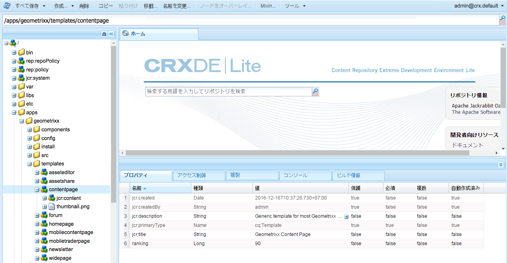
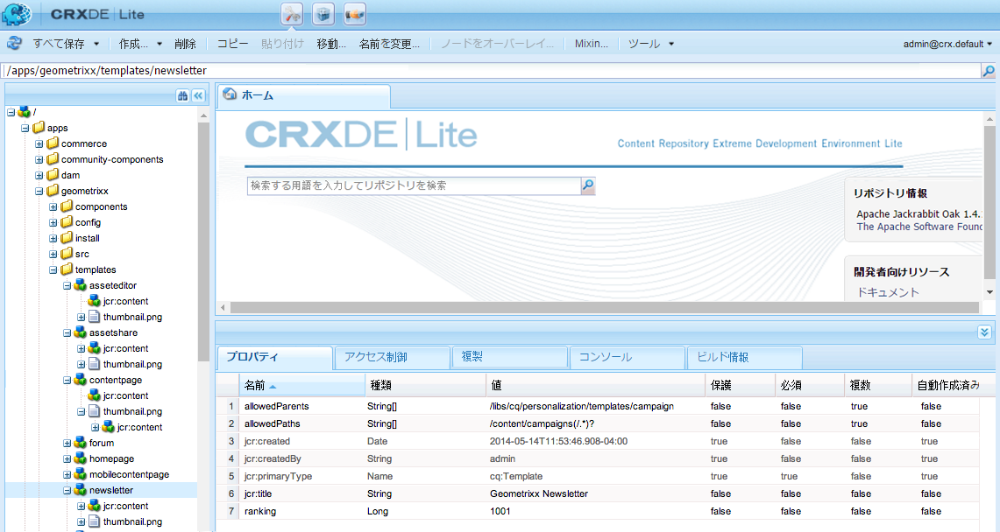

# ページテンプレート - 静的{#page-templates-static}

>[!CAUTION]
>
>AEM 6.4 の拡張サポートは終了し、このドキュメントは更新されなくなりました。 詳細は、 [技術サポート期間](https://helpx.adobe.com/jp/support/programs/eol-matrix.html). サポートされているバージョンを見つける [ここ](https://experienceleague.adobe.com/docs/?lang=ja).

テンプレートは、ページの作成に使用され、選択した範囲内で使用できるコンポーネントを定義します。 テンプレートは、作成するページと同じ構造を持ち、実際のコンテンツを持たないノードの階層です。

各テンプレートには、使用可能なコンポーネントが選択されて表示されます。

* テンプレートは [コンポーネント](/help/sites-developing/components.md);
* コンポーネントはウィジェットを使用し、ウィジェットにアクセスできます。ウィジェットはコンテンツのレンダリングに使用されます。

>[!NOTE]
>
>[編集可能なテンプレート](/help/sites-developing/page-templates-editable.md) も使用できますが、これは最も柔軟性が高く、最新の機能を実現するために推奨されるタイプのテンプレートです。

## テンプレートのプロパティと子ノード {#properties-and-child-nodes-of-a-template}

テンプレートは、タイプが cq:Template のノードで、次のプロパティと子ノードを持ちます。

<table> 
 <tbody> 
  <tr> 
   <td><strong>名前   </strong></td> 
   <td><strong>種類   </strong></td> 
   <td><strong>説明   </strong></td> 
  </tr> 
  <tr> 
   <td>.   </td> 
   <td> cq:Template</td> 
   <td>現在のテンプレートです。 テンプレートのノードタイプは cq:Template です。  </td> 
  </tr> 
  <tr> 
   <td> allowedChildren </td> 
   <td> String[]</td> 
   <td>このテンプレートの子となることが許可されているテンプレートのパス。  </td> 
  </tr> 
  <tr> 
   <td> allowedParents</td> 
   <td> String[]</td> 
   <td>このテンプレートの親となることが許可されているテンプレートのパス。  </td> 
  </tr> 
  <tr> 
   <td> allowedPaths</td> 
   <td> String[]</td> 
   <td>このテンプレートをベースとすることが許可されているページのパス。  </td> 
  </tr> 
  <tr> 
   <td> jcr:created</td> 
   <td> 日付</td> 
   <td>テンプレートの作成日。  </td> 
  </tr> 
  <tr> 
   <td> jcr:description</td> 
   <td> 文字列</td> 
   <td>テンプレートの説明。  </td> 
  </tr> 
  <tr> 
   <td> jcr:title</td> 
   <td> 文字列</td> 
   <td>テンプレートのタイトル。  </td> 
  </tr> 
  <tr> 
   <td> ranking</td> 
   <td> Long</td> 
   <td>テンプレートのランクです。ユーザーインターフェイスにテンプレートを表示する際に使用します。  </td> 
  </tr> 
  <tr> 
   <td> jcr:content</td> 
   <td> cq:PageContent</td> 
   <td>テンプレートのコンテンツを含むノード。  </td> 
  </tr> 
  <tr> 
   <td> thumbnail.png</td> 
   <td> nt:file</td> 
   <td>テンプレートのサムネール。  </td> 
  </tr> 
  <tr> 
   <td> icon.png</td> 
   <td> nt:file</td> 
   <td>テンプレートのアイコン。  </td> 
  </tr> 
 </tbody> 
</table>

テンプレートは、ページの基盤です。

ページを作成するには、テンプレート（ノードツリー `/apps/<myapp>/template/<mytemplate>`）をサイトツリーの対応する位置にコピーする必要があります。「**Web サイト**」タブを使用してページを作成する場合も、この処理がおこなわれています。

また、このコピーアクションは、ページの初期コンテンツ（通常はトップレベルコンテンツのみ）と、ページのレンダリングに使用されるページコンポーネントのパス（子ノード jcr:content 内のすべて）を示す sling:resourceType プロパティも提供します。

## テンプレートの構造 {#how-templates-are-structured}

考慮すべき 2 つの側面があります。

* テンプレート自体の構造
* テンプレートを使用する際に作成されるコンテンツの構造

### テンプレートの構造 {#the-structure-of-a-template}

テンプレートは、タイプのノードの下に作成されます **cq:Template**.

特に、様々なプロパティを設定できます。

* **jcr:title**  — テンプレートのタイトル。は、ページの作成時にダイアログに表示されます。
* **jcr:description**  — テンプレートの説明。は、ページの作成時にダイアログに表示されます。

このノードには、結果ページのコンテンツノードの基礎として使用される jcr:content (cq:PageContent) ノードが含まれます。これは、sling:resourceType を使用して、新しいページの実際のコンテンツのレンダリングに使用されるコンポーネントを参照します。

このコンポーネントは、新しいページを作成する際に、コンテンツの構造およびデザインを定義するために使用します。

### テンプレートによって作成されるコンテンツ {#the-content-produced-by-a-template}

テンプレートは、`cq:Page` タイプのページを作成するのに使用します（前述のように、ページは特別なタイプのコンポーネントです）。各 AEM ページには構造化ノード `jcr:content` があります。この特徴は次のとおりです。

* タイプが cq:PageContent の場合
* は、定義された content-definition を保持する構造化ノードタイプです
* コンテンツのレンダリングに使用する Sling スクリプトを保持するコンポーネントを参照するための `sling:resourceType` プロパティを持つ。

### デフォルトのテンプレート {#default-templates}

AEMには、すぐに使用できるデフォルトのテンプレートがいくつか付属しています。 場合によっては、テンプレートをそのまま使用することもできます。 その場合は、Web サイトでテンプレートが使用できることを確認する必要があります。

例えば、AEMには、コンテンツページやホームページを含む複数のテンプレートが付属しています。

| **タイトル** | **コンポーネント** | **場所** | **目的** |
|---|---|---|---|
| ホームページ | homepage | geometrixx | Geometrixxのホームページテンプレート。 |
| コンテンツのページ | contentpage | geometrixx | Geometrixxコンテンツページテンプレート。 |

#### デフォルトのテンプレートの表示 {#displaying-default-templates}

リポジトリ内のすべてのテンプレートのリストを表示するには、次の手順を実行します。

1. CRXDE Liteで、 **ツール** メニューとクリック **クエリ**.

1. 「クエリ」タブで、
1. 形式 **タイプ**&#x200B;を選択します。 **XPath**.
1. 「**クエリ**」入力フィールドに次の文字列を入力します。

   //element(&amp;ast;, cq:Template)

1. クリック **実行**. 結果ボックスにリストが表示されます。

多くの場合、既存のテンプレートを使用して、各自の用途に合わせて新しいテンプレートを開発します。詳しくは、[ページテンプレートの開発](#developing-page-templates)を参照してください。

既存のテンプレートを各自の web サイト用に有効にし、**web サイト**&#x200B;コンソールから「**Web サイト**」のすぐ下にページを作成するときに&#x200B;**ページを作成**&#x200B;ダイアログにそのテンプレートを表示する場合は、テンプレートノードの allowedPaths プロパティを次のように設定します。**/content(/.&amp;ast;)?**

## テンプレートデザインの適用方法 {#how-template-designs-are-applied}

UI でスタイルが[デザインモード](/help/sites-authoring/default-components-designmode.md)を使用して定義されている場合、デザインは、スタイルが定義されているコンテンツノードの正確なパスに保持されます。

>[!CAUTION]
>
>Adobeでは、[デザインモード](/help/sites-authoring/default-components-designmode.md) を介してのみデザインを適用することをお勧めします。
>
>例えば、CRX DE でデザインを変更することはベストプラクティスではなく、そのようなデザインの適用は、意図したビヘイビアーとは異なることがあります。

デザインがデザインモードを使用してのみ適用される場合、次のセクションは、 [デザインパスの解像度](/help/sites-developing/page-templates-static.md#design-path-resolution)、[デシジョンツリー](/help/sites-developing/page-templates-static.md#decision-tree)、および[例](/help/sites-developing/page-templates-static.md#example)は適用されません。

>[!NOTE]
>
>この節では、AEM 6.4.2.0 以降のデザインパス解決の動作について説明します。

### デザインパスの解像度 {#design-path-resolution}

静的テンプレートに基づいてコンテンツをレンダリングする場合、AEM は コンテンツ階層のトラバーサルに基づいて、最も関連性の高いデザインとスタイルをコンテンツに適用しようとします。

AEM は次の順序で、コンテンツノードに最も関連性の高いスタイルを決定します。

* （デザインモードでデザインが定義されている場合と同様に）コンテンツノードのフルパスと正確なパスのデザインがある場合には、そのデザインを使用します。
* 親のコンテンツノードにデザインがある場合は、そのデザインを使用します。
* コンテンツノードのパス上に任意のノードのデザインがある場合は、そのデザインを使用します。

最後の 2 つのケースで、適用可能なデザインが複数ある場合は、コンテンツノードに最も近いものを使用します。

### デシジョンツリー {#decision-tree}

これは[デザインパスの解像度](/help/sites-developing/page-templates-static.md#design-path-resolution)を図で表現したものです。

### 例 {#example}

デザインを任意のノードに適用できる場合、シンプルなコンテンツ構造を次のように考えてみます。

`/root/branch/leaf`

次の表に、AEM がデザインを選択する方法を示します。

<table> 
 <tbody> 
  <tr> 
   <td><strong>デザインの検索  </strong></td> 
   <td><strong>存在するデザイン  </strong></td> 
   <td><strong>選択したデザイン  </strong></td> 
   <td><strong>コメント</strong></td> 
  </tr> 
  <tr> 
   <td><code class="code">leaf
      </code></td> 
   <td>
<code>root</code>
 
<code>branch</code>
 
<code>leaf</code>
 </td> 
   <td><code>leaf</code></td> 
   <td>最も正確に一致するものが常に取得されます。  </td> 
  </tr> 
  <tr> 
   <td><code>leaf</code></td> 
   <td>
<code>root</code>
 
<code>branch</code>
 </td> 
   <td><code>branch</code></td> 
   <td>ツリー下部の最も近いマッチにフォールバックします。</td> 
  </tr> 
  <tr> 
   <td><code>leaf</code></td> 
   <td><code>root</code></td> 
   <td><code>root</code></td> 
   <td>他のすべてが失敗した場合は、残りのものを取得します。  </td> 
  </tr> 
  <tr> 
   <td><code>branch</code></td> 
   <td><code>branch</code></td> 
   <td><code>branch</code></td> 
   <td> </td> 
  </tr> 
  <tr> 
   <td><code>branch</code></td> 
   <td>
<code>branch</code>
 
<code class="code">leaf
       </code>
 </td> 
   <td><code>branch</code></td> 
   <td> </td> 
  </tr> 
  <tr> 
   <td><code>branch</code></td> 
   <td>
<code>root</code>
 
<code class="code">branch
       </code>
 </td> 
   <td><code>branch</code></td> 
   <td> </td> 
  </tr> 
  <tr> 
   <td><code>branch</code></td> 
   <td>
<code>root</code>
 
<code class="code">leaf
       </code>
 </td> 
   <td><code>root</code></td> 
   <td>
完全に一致しない場合は、ツリーの 1 つ下のものを選択します。
 
これは常に適用できるが、ツリーの上の方は具体的すぎる可能性があると仮定します。  
 </td> 
  </tr> 
 </tbody> 
</table>

## ページテンプレートの開発 {#developing-page-templates}

AEMのページテンプレートは、新しいページの作成に使用される単純なモデルです。 コンテンツには、正しい初期ノード構造を作成する役割を持つ初期コンテンツを必要に応じて最小限に、または必要に応じて最大限含めることができます。必要なプロパティ（主に sling:resourceType）は、編集とレンダリングを許可するように設定されます。

### 新しいテンプレートの作成（既存のテンプレートに基づく） {#creating-a-new-template-based-on-an-existing-template}

言うまでもなく、新しいテンプレートはゼロから完全に作成できますが、多くの場合、既存のテンプレートがコピーされ、更新されて時間と労力を節約できます。 例えば、テンプレートをGeometrixx内で使用して作業を開始できます。

既存のテンプレートに基づいて新しいテンプレートを作成するには：

1. 既存のテンプレート（できれば目的の定義にできるだけ近い定義を持つ）を新しいノードにコピーします。

   テンプレートは通常、 **/apps/&lt;website-name>/templates/&lt;template-name>**.

   >[!NOTE]
   >
   >使用可能なテンプレートのリストは、新しいページの場所と、各テンプレートで指定されている配置制限によって異なります。 詳しくは、 [Template Availability](/help/sites-developing/templates.md#template-availability).

1. を **jcr:title** 新しい役割を反映する新しいテンプレートノードを作成します。 また、 **jcr:description** 必要に応じて。 ページの使用可能なテンプレートを必要に応じて変更してください。

   >[!NOTE]
   >
   >**Web サイト** コンソールから **Web サイト** のすぐ下にページを作成するときに **ページを作成** ダイアログにテンプレートを表示する場合は、 `allowedPaths`テンプレートノードのプロパティを、`/content(/.*)?`に設定します。

   

1. テンプレートの基になるコンポーネントをコピーします ( これは **sling:resourceType** プロパティ **jcr:content** ノードを使用 ) 新しいインスタンスを作成します。

   コンポーネントは通常、 **/apps/&lt;website-name>/components/&lt;component-name>**.

1. を更新します。 **jcr:title** および **jcr:description** 新しいコンポーネントの
1. 新しいサムネール画像をテンプレート選択リストに表示する場合は、thumbnail.png を置き換えます（サイズ 128 x 98 px）。
1. を更新します。 **sling:resourceType** テンプレートの **jcr:content** 新しいコンポーネントを参照するノード。
1. テンプレートやその基になるコンポーネントの機能やデザインに、さらに変更を加えます。

   >[!NOTE]
   >
   >変更： **/apps/&lt;website>/templates/&lt;template-name>** ノードは、（選択リストのように）テンプレートインスタンスに影響を与えます。
   変更： **/apps/&lt;website>/components/&lt;component-name>** ノードは、テンプレートが使用される際に作成されるコンテンツページに影響を与えます。

   これで、新しいテンプレートを使用して、Web サイト内にページを作成できます。

>[!NOTE]
エディタークライアントライブラリは、コンテンツページに `cq.shared` 名前空間が存在することを前提としています。名前空間が存在しない場合は、JavaScript エラー「`Uncaught TypeError: Cannot read property 'shared' of undefined`」が発生します。
すべてのサンプルコンテンツページには `cq.shared` が含まれているので、それらをベースとするコンテンツには自動的に `cq.shared` が含められます。ただし、サンプルコンテンツをベースとせず、ゼロから独自のコンテンツページを作成する場合は、`cq.shared` 名前空間を含める必要があります。
詳しくは、[クライアントサイドライブラリの使用](/help/sites-developing/clientlibs.md)を参照してください。

## 既存のテンプレートを使用可能にする {#making-an-existing-template-available}

この例では、特定のコンテンツパスに対してテンプレートを使用する方法を示します。 ページ作成者が新しいページの作成時に使用できるテンプレートは、[使用可能なテンプレート](/help/sites-developing/templates.md#template-availability)で定義されたロジックによって決まります。

1. CRXDE Lite で、ページに使用するテンプレート（ニュースレターテンプレートなど）に移動します。
1. `allowedPaths` プロパティおよび[テンプレートの可用性](/help/sites-developing/templates.md#template-availability)に使用する他のプロパティを変更します。例えば `allowedPaths`: `/content/geometrixx-outdoors/[^/]+(/.*)?` は、このテンプレートが `/content/geometrixx-outdoors` 以下の任意のパスで許可されることを意味します。

   
