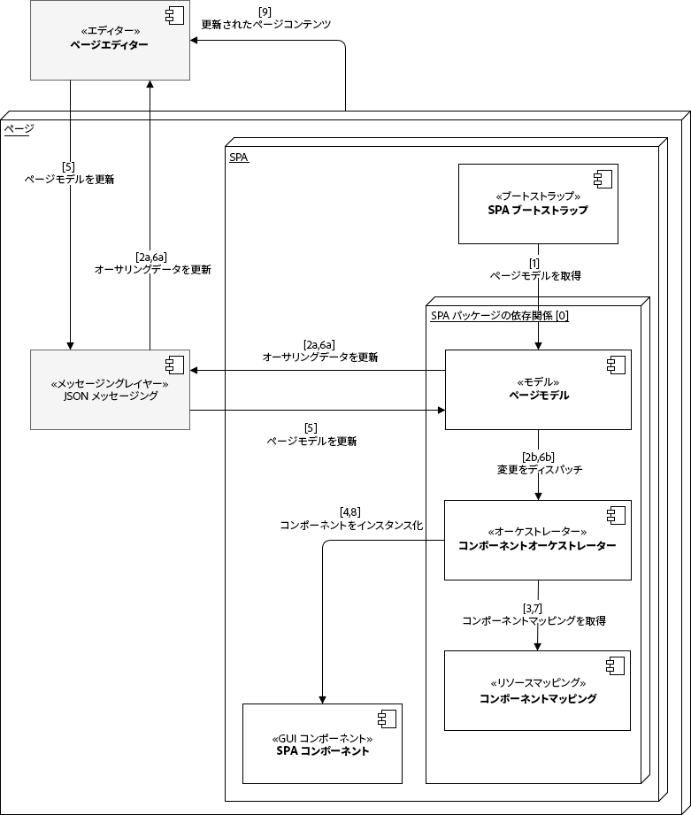

# SPA エディターの概要{#spa-editor-overview}

単一ページアプリケーション（SPA）により、Web サイトのユーザーに魅力的なエクスペリエンスを提供することができます。開発者は SPA フレームワークを使用してサイトを構築したいと考え、作成者はそうして構築されたサイトのコンテンツを AEM 内でシームレスに編集したいと考えています。

SPA エディターには、AEM 内で SPA をサポートするための包括的なソリューションが用意されています。このページでは、AEM での SPA サポートの構成と、SPA エディターの仕組み、SPA フレームワークと AEM を同期させる方法について説明します。

>[!NOTE]
>
>シングルページアプリケーション(SPA)エディター機能を使用するには、 [AEM 6.4サービスパック2](/help/release-notes/sp-release-notes.md) 以降が必要です。
>
>SPAフレームワークベースのクライアント側レンダリング（ReactやAngularなど）を必要とするプロジェクトには、SPA Editorが推奨されるソリューションです。

## 概要 {#introduction}

React や Angular などの一般的な SPA フレームワークを使用して構築したサイトは、Dynamic JSON を使用してコンテンツを読み込みます。サイトには、AEM ページエディターが編集コントロールを配置するために必要な HTML 構造がありません。

AEM 内で SPA の編集を有効にするには、SPA の JSON 出力と AEM リポジトリのコンテンツモデルとの間でマッピングをおこない、変更をコンテンツに保存できるようにする必要があります。

AEM の SPA サポートにより、シン JS レイヤーが導入されました。このレイヤーは、ページエディターに読み込まれると、SPA の JS コードとやり取りします。これにより、イベントを送信したり、編集コントロールの場所をアクティブにしてコンテキスト内で編集したりできます。この機能は、コンテンツサービス API エンドポイントの概念に基づいて構築されています。SPA のコンテンツは、コンテンツサービスを使用して読み込む必要があるからです。

AEM の SPA について詳しくは、次のドキュメントを参照してください。

* SPA の技術要件に関する [SPA ブループリント](/help/sites-developing/spa-blueprint.md)
* シンプルな SPA のクイックツアーについては、[AEM での SPA の利用](/help/sites-developing/spa-getting-started-react.md)を参照してください。

## デザイン {#design}

SPA のページコンポーネントは、JSP ファイルまたは HTL ファイルを介して子コンポーネントの HTML 要素を提供しません。この処理は SPA フレームワークに委任されます。子コンポーネントまたはモデルの表現がJSONデータ構造としてJCRから取得されます。 次に、その構造に従って、SPA コンポーネントがページに追加されます。この動作により、ページコンポーネントのボディの初期構成が、SPA 以外のコンポーネントの場合とは違う構成になります。

### ページモデルの管理 {#page-model-management}

ページモデルの解決と管理は、指定の `PageModel` ライブラリに委任されます。SPAエディタで初期化して作成するには、SPAでページモデルライブラリを使用する必要があります。 このページモデルライブラリは、`cq-react-editable-components` npm によって AEM のページコンポーネントに間接的に提供されます。ページモデルは、AEM と SPA 間のインタープリターであるので、常に存在している必要があります。ページを作成したら、ページエディターとの通信を可能にするために、`cq.authoring.pagemodel.messaging` ライブラリを追加する必要があります。

SPA ページのコンポーネントがページのコアコンポーネントから継承される場合、`cq.authoring.pagemodel.messaging` クライアントライブラリのカテゴリを使用可能にするオプションが 2 つあります。

* テンプレートが編集可能な場合、テンプレートをページポリシーに追加する。
* `customfooterlibs.html` を使用して、カテゴリを追加する。

SPAは、エクスポートされたモデルの各リソースに対して、\
レンダリング。 JSONとして表されたモデルは、コンテナ内のコンポーネントマッピングを使用してレンダリングされます。\

>[!CAUTION]
>
>The inclusion of the `cq.authoring.pagemodel.messaging` category should be limited to the context of the SPA Editor.

### 通信データタイプ {#communication-data-type}

When the `cq.authoring.pagemodel.messaging` category is added to the page, it will send a message to the Page Editor to establish the JSON communication data type. 通信データタイプが JSON に設定されると、GET リクエストにより、コンポーネントの Sling Model エンドポイントとの通信がおこなわれます。ページエディターで更新が実行されると、更新されたコンポーネントの JSON 表記がページモデルのライブラリに送信されます。次に、ページモデルのライブラリから、SPA に更新が通知されます。

## ワークフロー {#workflow}

SPAエディターは、SPAとAEMの間のメディエーターと考えることで、SPAとAEMの間のインタラクションのフローを理解できます。

* ページエディターと SPA 間の通信は、HTML ではなく JSON を使用しておこなわれます。
* ページエディターは、iframe とメッセージング API を使用して、SPA にページモデルの最新バージョンを提供します。
* ページモデルマネージャーは、編集の準備ができたことをエディターに通知し、ページモデルを JSON 構造として渡します。
* エディターは、作成しているページの DOM 構造を変更したり、アクセスしたりすることなく、最新のページモデルを提供します。

### 基本SPAエディタのワークフロー {#basic-spa-editor-workflow}

SPAエディターの主要要素を念頭に置いて、AEM内でSPAを編集する高度なワークフローは、次のように作成者に表示されます。

1. SPAエディタが読み込まれます。

1. SPAは別のフレームにロードされます。
1. SPAはJSONコンテンツを要求し、コンポーネントをクライアント側でレンダリングします。
1. SPAエディタは、レンダリングされたコンポーネントを検出し、オーバーレイを生成します。
1. 作成者がオーバーレイをクリックし、コンポーネントの編集ツールバーを表示します。
1. SPAエディターは、POST要求を使用して編集をサーバーに対して保持します。
1. SPA Editorは、SPAエディターに更新されたJSONを要求し、DOMイベントと共にSPAに送信します。
1. SPAは、関連するコンポーネントを再レンダリングし、DOMを更新します。

>[!NOTE]
>
>注意：
>
>* SPAは常にその表示を担当します。
>* SPAエディタはSPA自体から切り離されます。
>* 実稼働（パブリッシュ）では、SPAエディタは読み込まれません。
>

### クライアントサーバー型のページ編集ワークフロー {#client-server-page-editing-workflow}

これは、SPAの編集時のクライアント/サーバー間のやり取りの詳細な概要です。

1. SPA がそれ自体を初期化し、Sling Model Exporter にあるページモデルをリクエストします。

1. Sling Model Exporter がリポジトリに、ページを構成するリソースをリクエストします。

1. リポジトリがリソースを返します。

1. Sling Model Exporter がページのモデルを返します。

1. SPA がページモデルに基づいてコンポーネントをインスタンス化します。

1. **6a** コンテンツがエディターに、オーサリングの準備ができたことを通知します。

   **6b** ページエディターがコンポーネントのオーサリング設定をリクエストします。

   **6c** ページエディターがコンポーネントの設定を受け取ります。

1. 作成者がコンポーネントを編集すると、ページエディターがデフォルトの POST サーブレットに変更リクエストをポストします。

1. リソースがリポジトリで更新されます。

1. 更新されたリソースが POST サーブレットに提供されます。

1. デフォルトの POST サーブレットがページエディターに、リソースが更新されたことを通知します。

1. ページエディターが新しいページモデルをリクエストします。

1. （リポジトリにある）ページを構成するリソースが、リクエストされます。

1. ページを構成するリソースが、リポジトリから Sling Model Exporter に提供されます。

1. 更新されたページモデルがエディターに返されます。

1. ページエディターが SPA のページモデル参照を更新します。

1. SPA が新しいページモデル参照に基づいてコンポーネントを更新します。

1. ページエディターのコンポーネント設定が更新されます。

   **17a** SPA がページエディターに、コンテンツの準備ができたことを通知します。

   **17b** ページエディターが SPA にコンポーネント設定を提供します。

   **17c** SPA が、更新されたコンポーネント設定を提供します。

### オーサリングワークフロー {#authoring-workflow}

これは、オーサリングエクスペリエンスに焦点を当てた詳細な概要です。

1. SPA がページモデルを取得します。

1. **2A** ページモデルがエディターに、オーサリングに必要なデータを提供します。

   **2b** 通知を受けると、コンポーネントオーケストレーターがページのコンテンツ構造を更新します。

1. コンポーネントオーケストレーターが、AEM リソースタイプと SPA コンポーネントの間のマッピングについて問い合わせます。

1. コンポーネントオーケストレーターが、ページモデルとコンポーネントマッピングに基づいて、SPA コンポーネントを動的にインスタンス化します。

1. ページエディターがページモデルを更新します。

1. **6a** ページモデルがページエディターに、更新されたオーサリングデータを提供します。

   **6b** ページモデルがコンポーネントオーケストレーターに変更を発行します。

1. コンポーネントオーケストレーターがコンポーネントマッピングを取得します。

1. コンポーネントオーケストレーターがページのコンテンツを更新します。

1. SPA がページコンテンツの更新を完了すると、ページエディターがオーサリング環境を読み込みます。

## 要件と制限 {#requirements-limitations}

作成者がページエディターを使用してSPAのコンテンツを編集できるようにするには、AEM SPA Editor SDKとやり取りするSPAアプリケーションを実装する必要があります。 AEM [(AEM](/help/sites-developing/spa-getting-started-react.md) )の「SPA使用の手引き」ドキュメントを参照して、必要最小限の作業を行ってください。

### サポートされるフレームワーク {#supported-frameworks}

SPAエディターSDKは、以下の最小バージョンをサポートしています。

* 反応16.3
* Angular 6.x

これらのフレームワークの以前のバージョンはAEM SPA Editor SDKで動作する可能性がありますが、サポートされていません。

### その他のフレームワーク {#additional-frameworks}

AEM SPA Editor SDKで動作する追加のSPAフレームワークを実装できます。 AEM SPA Editorで動作するモジュール、コンポーネント、サービスで構成されるフレームワーク固有のレイヤーを作成するためにフレームワークが満たす必要がある要件については、  SPA Blueprintドキュメントを参照してください。

### 制限事項 {#limitations}

AEM SPA Editor SDKは、AEM 6.4サービスパック2で導入されました。 アドビによって完全にサポートされ、新機能として引き続き拡張および拡張されます。 AEMの次の機能は、SPAエディターではまだ扱われていません。

* ターゲットモード
* ContextHub
* インライン画像編集
* 設定の編集( listeners)
* スタイルシステム
* 取り消し／やり直し
* ページの相違とタイムワープ
* リンクチェッカー、CDNリライターサービス、URL短縮化など、サーバー側でHTMLの書き換えを実行する機能。
* 開発者モード
* AEM起動回数
